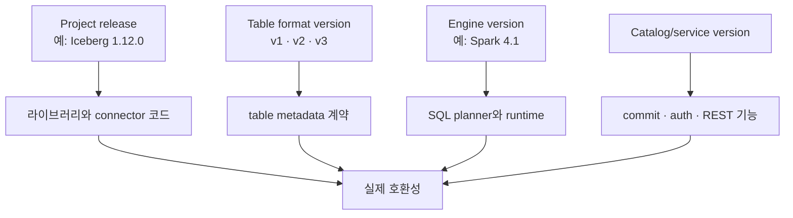
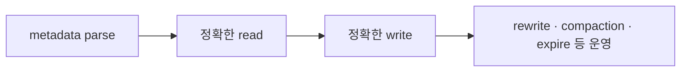
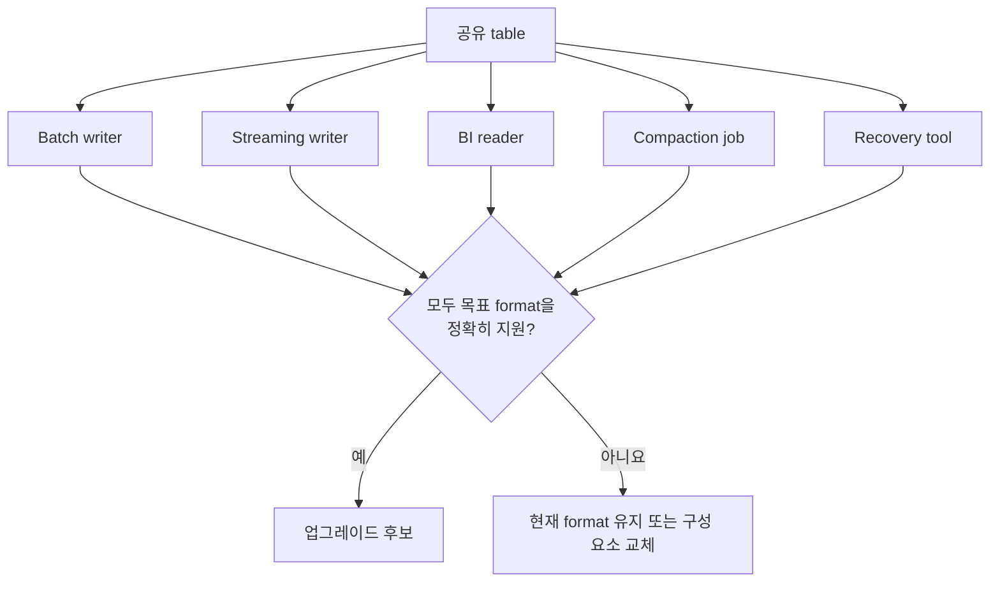

# 07. 최신 버전과 호환성: 1.12.0, 포맷 v3, 개발 중인 v4를 구분하기

[← 이 책 목차](README.md)

작성·문헌 확인일: **2026-10-08**

이 장에서 말하는 “최신”은 위 날짜에 공식 Apache Iceberg 사이트에서 확인한 상태다. 현재 Apache Iceberg 최신 release는 **1.12.0**이며 [release 목록](https://iceberg.apache.org/releases/)에는 2026-09-29 release로 기록되어 있다. 공식 [1.12.0 발표 글](https://iceberg.apache.org/blog/apache-iceberg-1.12.0-release/)은 2026-10-05 게시되었다. Release 날짜와 발표 글 날짜가 다른 것은 모순이 아니다.

가장 중요한 결론부터 말하면 다음 세 문장은 서로 다른 뜻이다.

```text
1. Apache Iceberg Java library 1.12.0을 사용한다.
2. 이 table의 format-version은 3이다.
3. 우리 Spark/Flink/Trino 조합이 v3 기능을 구현했다.
```

셋 중 하나가 참이라고 나머지가 자동으로 참이 되지 않는다.

## 1. 네 가지 버전을 한 숫자로 부르지 않는다



| 버전 축 | 예 | 결정하는 것 | 결정하지 않는 것 |
| --- | --- | --- | --- |
| Iceberg project release | 1.12.0 | 배포 artifact와 구현 코드의 release | table이 자동으로 v3가 되는지 |
| Table format version | 1, 2, 3 | metadata/file 의미와 필수 규칙 | 특정 SQL 엔진이 모든 기능을 제공하는지 |
| Engine version | Spark 4.1 등 | parser, optimizer, reader/writer integration | 다른 엔진의 호환성 |
| Catalog/API version | REST catalog 구현 버전 등 | table lookup, commit, credential 흐름 | data file type 전체 지원 |

`pip`, Maven, container image에서 Iceberg 1.12.0을 쓴다고 기존 v1 table metadata가 자동으로 v3로 변하지 않는다. 반대로 table property를 v3로 올렸다고 모든 job이 새 DV와 type을 이해하는 것도 아니다.

## 2. 2026-10-08 기준 포맷 상태

[format versioning spec](https://iceberg.apache.org/spec/#format-versioning)은 format의 상태를 구분한다. 이 날짜 기준으로 v1, v2, v3은 complete이며 community에서 adopted된 포맷이다. v4는 active development 상태이고 formally adopted되지 않았다.

| Format | 공식 상태 | 대표 기능 | 운영 해석 |
| --- | --- | --- | --- |
| v1 | complete, adopted | immutable data files, snapshots, schema/partition evolution | 행 변경은 주로 file rewrite |
| v2 | complete, adopted | position/equality delete files | row-level delete와 MOR 가능 |
| v3 | complete, adopted | DV, lineage, defaults, 확장 타입, encryption 관련 확장 | 엔진별 구현 확인 필요 |
| v4 | active development | 설계와 기반 작업 진행 | 안정 포맷으로 채택되었다고 보면 안 됨 |

“v4가 spec 페이지에 보인다”와 “v4가 stable하고 production adopted되었다”는 같은 말이 아니다. 스펙은 개발 중인 다음 포맷을 공개적으로 설계할 수 있고, release는 그 일부 기반 구조를 먼저 포함할 수 있다.


## 3. Iceberg 1.12.0의 v4 foundations를 과대해석하지 않는다

[1.12.0 release 발표](https://iceberg.apache.org/blog/apache-iceberg-1.12.0-release/#format-v4-foundations)는 v4의 manifest-level groundwork를 포함한다고 설명한다. 그러나 **Iceberg 1.12.0은 v4 table을 read/write할 수 없다.** 기반 코드가 있다는 사실은 v4 table 지원 선언이 아니다.

```text
잘못된 추론

1.12.0 release note에 "Format v4 Foundations"가 있다.
따라서 format-version=4 table을 만들어 production에서 읽고 쓸 수 있다.  ← 틀림

올바른 해석

1.12.0에는 향후 v4를 위한 manifest 수준의 기반 작업이 일부 들어갔다.
1.12.0 자체는 v4 table read/write를 지원하지 않는다.
```

문서에서 “v4 지원”이라고만 쓰지 말고 다음 중 무엇인지 밝힌다.

| 표현 | 의미 |
| --- | --- |
| v4 proposal/spec discussion | 규칙이 설계 중임 |
| v4 foundations in code | 미래 구현을 위한 내부 기반이 있음 |
| v4 metadata read | v4 table metadata를 해석할 수 있음 |
| v4 data read | v4 기능이 들어간 실제 table을 정확히 읽음 |
| v4 write | 유효한 v4 metadata와 파일을 생성·commit함 |
| v4 adopted/stable | community의 공식 채택 상태 |

## 4. 최근 릴리스가 바꾼 것을 기능별로 읽는다

최신 버전의 번호만 아는 것보다 “누가 어떤 일을 할 수 있게 되었는가”를 읽는 편이 유용하다. 아래는 기준일 현재 공식 발표의 주요 변화다. 모든 수정·버그 번호는 [공식 release 목록](https://iceberg.apache.org/releases/)에서 해당 release의 전체 notes를 확인한다.

### 4.1 Iceberg 1.12.0의 주요 변화

| 영역 | 발표된 변화 | 지원 경계 |
| --- | --- | --- |
| Variant | Spark 4.0/4.1의 unshredded Variant Parquet vectorized 읽기 | 모든 Variant layout·모든 엔진에 일반화하지 않음 |
| Variant 쓰기 | Flink·Kafka Connect sink·generic writer의 shredded Variant 쓰기 | 타입 집합과 widening 조건을 확인 |
| 공간 타입 | geometry/geography의 Avro·Parquet read/write | Spark end-to-end DML·MOR+DV는 4.1 경로, row reader, 공간 predicate 미지원 |
| 스트리밍 삭제 | Flink `ConvertEqualityDeletes`로 equality 삭제를 DV로 변환 | v3 이상, 해당 Flink integration의 maintenance 기능 |
| 데이터 배치 | Spark 4.1 `rewrite_data_files`의 Hilbert 다차원 정렬 | partition transform 일반 SQL과 다른 rewrite 전략 |
| REST | Variant schema 표현, function list/load, unregister, remote signing·labels 확장 | 서버 capability와 클라이언트 구현 확인 |
| 표현식·읽기 제한 | expressions spec와 LoadTable ReadRestrictions 계약 | 1.12 reader는 ReadRestrictions를 적용하지 않음 |
| v4 | manifest reader/writer 등 기반 코드 | v4 테이블 read/write 불가 |
| 지원 제거 | Spark 3.4·Flink 2.0 integration 제거 | artifact 교체 전 기존 실행 환경 조사 |
| 복구 API | `RepairTable` action interface 정의 | interface 존재와 완성된 자동 복구 도구를 구별 |

**Vectorized reader**는 여러 값을 묶어서 읽고 처리하는 경로다. **Shredding**은 Variant 안의 값을 타입이 있는 컬럼 표현으로 분리하는 저장 최적화다. 이때 서로 다른 값 타입을 아무 규칙 없이 강제로 하나의 타입으로 바꾸는 것은 아니다. 1.12 발표는 numeric widening 뒤 단일 type family로 취급 가능한 조건을 설명한다.

**Hilbert 정렬**은 여러 컬럼의 가까운 값들을 1차원 순서에 가깝게 배치하는 다차원 정렬 방법이다. Z-order와 비슷한 문제를 다루지만 같은 알고리즘은 아니다. 데이터 파일 통계의 범위를 좁혀 여러 조건의 pruning을 개선하려는 용도이며 모든 쿼리의 성능을 보장하지 않는다.

**Remote signing**은 저장소 요청의 서명을 원격 서비스가 수행하도록 하는 경로다. Credential vending과 목적이 연결되지만 같은 구현 방식은 아니다. **Label**은 서비스에서 자원을 구분·관리하는 메타데이터이며 파일의 물리 배치를 자동 바꾸는 기능으로 해석하지 않는다.

특히 ReadRestrictions처럼 계약이 생겨도 reader가 아직 적용하지 않는 기능은 권한 강제 수단으로 믿으면 안 된다. 포맷·프로토콜의 정의와 사용 중인 reader의 실제 동작을 구분하는 이유다.

근거: [1.12.0 공식 발표](https://iceberg.apache.org/blog/apache-iceberg-1.12.0-release/).

### 4.2 Iceberg 1.11.0에서 이어진 흐름

| 영역 | 주요 변화 | 이해할 점 |
| --- | --- | --- |
| REST scan planning | 서버의 스캔 계획, streaming 증분·history/snapshots 계획 확장 | 서버가 지원하면 driver가 모든 manifests를 직접 처리하는 부담 감소 |
| REST freshness·재시도 | ETag·idempotency key 등 프로토콜 확장 | 서버 구현과 재시도 식별 정책까지 맞춰야 효과 |
| SQL UDF | 버전·여러 SQL dialect를 다루는 UDF spec | 명세 채택이 모든 엔진의 함수 실행 지원은 아님 |
| 유지보수·위치 | snapshot cleanup API·고유 table location 구성 | rename·공유 경로의 정리 위험을 줄이는 목적 |
| 파일 credential | S3/GCS FileIO의 예정된 credential 갱신 | 긴 작업에서 파일 접근 토큰의 수명 관리 |
| 암호화 | manifest-list 암호화·키 교체·cloud KMS 등 | [06장](06-format-v3.md)의 metadata 계약과 구현 연결 |
| Spark 4.1 | MERGE schema evolution 초기 지원, Variant 쓰기 등 | 엔진과 integration 버전에 따른 기능 |
| v4 foundations | typed content·tracking·format model 기반 구조 | v4 테이블 정식 지원과 별개 |

**ETag**는 HTTP 응답 자원의 버전을 식별해 새로 바뀌었는지 확인하는 값이다. **Idempotency key**는 동일 요청의 재시도를 식별하는 값이다. 이 기능이 있어도 별개의 새 작업으로 같은 데이터를 다시 append하면 자동으로 동일 요청이 되지는 않는다.

**UDF(User-Defined Function)**는 사용자가 정의한 함수다. **Dialect**는 엔진별 SQL 문법·의미의 변형이다. 같은 함수 이름을 등록해도 모든 엔진에서 동일한 표현을 실행한다고 가정하지 않는다.

근거: [1.11.0 공식 발표](https://iceberg.apache.org/blog/apache-iceberg-1.11.0-release/).

### 4.3 v4 초안이 바라보는 방향

현재 spec의 v4는 상대 경로와 typed content statistics 등 metadata 표현을 바꾸는 방향을 다룬다. 상대 경로는 기준 위치에 상대적인 파일 주소, typed statistics는 값의 타입을 명확하게 표현하는 통계 구조를 뜻한다. 실제 필드·이전 규칙은 개발 중이라 달라질 수 있다.

v4 초안은 새 equality delete 추가를 금지하고 이전 v2/v3에서 이어진 equality deletes는 reader가 계속 적용하도록 한다. 업그레이드만으로 모든 기존 파일을 즉시 재작성하라는 뜻은 아니다. 이 내용은 [현재 명세](https://iceberg.apache.org/spec/)의 향후 포맷 규칙이며, 1.12.0에서 v4 테이블을 만들어 실행하는 지침이 아니다.

## 5. 1.12.0에서 확인할 engine 조합

1.12.0 발표와 [multi-engine support 문서](https://iceberg.apache.org/multi-engine-support/)에 따르면 이 release 계열은 Spark 3.5, 4.0, 4.1 integration을 제공하고 Spark 3.4 지원은 제거되었다. “Iceberg 최신 버전으로 올린다”는 결정이 Spark runtime 호환성 변경을 포함할 수 있다는 뜻이다.

1.12.0 발표 기준 geometry/geography의 Spark end-to-end DML과 MOR+DV 경로는 Spark 4.1에서 지원된다. 타입 이름을 읽는 수준과 실제 행 변경 경로 지원을 구분해야 한다.

| 확인 항목 | 질문 |
| --- | --- |
| artifact 좌표 | engine major/minor에 맞는 runtime artifact인가? |
| format read | table의 v1/v2/v3를 reader가 이해하는가? |
| delete read | equality, legacy position, DV를 모두 정확히 읽는가? |
| write path | append, overwrite, row delta, rewrite가 필요한 규칙을 지키는가? |
| SQL surface | UPDATE/DELETE/MERGE 문법과 isolation이 기대와 같은가? |
| type path | variant/ns/geospatial을 connector와 engine type이 보존하는가? |
| maintenance | snapshot expiration, orphan cleanup, rewrite가 새 metadata를 보존하는가? |

Spark 지원표 하나로 Flink, Trino, Presto, Hive, Dremio 등의 상태를 추론하지 않는다. 각 프로젝트의 공식 compatibility 문서와 release note를 별도로 확인한다.

## 6. Reader와 writer의 요구 수준은 다르다

새 포맷을 “지원한다”는 말에는 최소 네 단계가 있다.



| 수준 | 통과 조건 | 놓치기 쉬운 실패 |
| --- | --- | --- |
| Parse | metadata를 거부하지 않음 | 모르는 필드를 조용히 버림 |
| Read | delete/default/type를 반영해 정확한 결과 | DV를 무시해 삭제 행이 보임 |
| Write | sequence, lineage, default 규칙에 맞게 commit | 잘못된 row ID 또는 delete 적용 |
| Operate | rewrite와 cleanup 후에도 의미 보존 | compaction 후 삭제 행 부활 |

읽기 전용 query engine은 write를 지원하지 않아도 유용하다. 하지만 “read 가능”을 “maintenance job으로 안전”이라고 확대하면 안 된다. 특히 v3에서는 다음 실패를 시험한다.

```text
호환성 시험 데이터셋

- 기존 v2 position delete가 남아 있는 table
- 같은 data file에 새 DV가 추가되는 commit
- compaction 전후 row lineage 비교
- field 추가 전/후 record의 default 비교
- timestamp_ns의 끝 3자리 보존
- geometry/geography 및 variant round-trip
```

## 7. 호환성은 최소 공통분모로 결정된다

한 table을 여러 시스템이 공유하면 가장 최신 writer만 보고 format을 올릴 수 없다.



다음 가상 환경을 보자.

| 구성 요소 | v2 | v3 metadata | DV | row lineage | v3 write |
| --- | --- | --- | --- | --- | --- |
| Batch writer | 예 | 예 | 예 | 예 | 예 |
| Streaming writer | 예 | 일부 | 아니요 | 아니요 | 아니요 |
| BI reader | 예 | 예 | 예 | 읽기만 | 해당 없음 |
| Compaction job | 예 | 예 | 아니요 | 아니요 | 아니요 |

이 환경에서 batch writer가 v3를 쓸 수 있어도 공유 table의 안전한 v3 전환 조건은 충족되지 않는다. Streaming reader가 DV를 무시하거나 compaction이 lineage를 깨면 결과가 틀릴 수 있다.

## 8. 업그레이드 절차를 기능 시험으로 만든다

format upgrade는 metadata 계약 변경이다. 운영 table에 바로 적용하기 전에 production과 같은 file mix를 가진 복제 table에서 검증한다.

1. 모든 reader, writer, maintenance, recovery 구성 요소를 목록화한다.
2. 현재 project release, engine version, catalog version, table format을 따로 기록한다.
3. 목표 기능을 고른다. “최신이라서”가 아니라 DV, lineage, ns timestamp처럼 필요한 이유를 쓴다.
4. legacy files와 delete가 섞인 작은 복제 table을 만든다.
5. old reader가 어떻게 실패하는지 확인한다. 조용히 잘못 읽는 것이 명시적 거부보다 위험하다.
6. concurrent write, retry, compaction, snapshot expiration을 실행한다.
7. snapshot별 row count, key set, lineage, timestamp 정밀도를 비교한다.
8. format 변경 전후 rollback 경계를 문서화한다.

### 7.1 실행 SQL로 오해하지 않을 의사 코드

```text
의사 코드 — 실제 property 이름과 명령은 엔진 공식 문서 확인

clone production-shaped table to staging
record current format version and snapshot ID
upgrade staging table to target format
run append / update / delete / merge scenarios
run compaction and snapshot maintenance
compare every engine's result with expected rows
block production upgrade if any component is unsupported
```

format version을 올린 뒤 새 기능으로 commit하면 이전 reader가 더는 안전하게 읽지 못할 수 있다. “metadata property를 다시 낮추면 원복”이라고 가정하지 않는다. 실제 rollback은 새 format 기능이 들어간 snapshot을 어떻게 다룰지까지 포함해야 한다.

## 9. 최신 정보를 다시 확인하는 방법

날짜가 지난 뒤 이 교재를 읽는다면 다음 순서로 확인한다.

| 순서 | 공식 페이지 | 확인할 것 |
| ---: | --- | --- |
| 1 | [Releases](https://iceberg.apache.org/releases/) | 최신 project release와 release 날짜 |
| 2 | [Table Spec: format versioning](https://iceberg.apache.org/spec/#format-versioning) | 각 format의 공식 상태 |
| 3 | [Release blog](https://iceberg.apache.org/blog/) | 주요 기능과 제거된 integration |
| 4 | [Multi-engine support](https://iceberg.apache.org/multi-engine-support/) | engine별 유지 상태와 artifact |
| 5 | 사용 engine의 공식 문서 | SQL·read/write·maintenance 실제 지원 |

검색 결과 요약이나 vendor 표만으로 table format을 올리지 않는다. Apache Iceberg 공식 spec이 포맷 계약의 기준이고, engine 공식 문서가 구현 상태의 기준이다. 실제 배포 artifact로 integration test를 통과해야 운영 결론을 내릴 수 있다.

## 10. 자주 나오는 오해

| 오해 | 바로잡기 |
| --- | --- |
| Iceberg 1.12.0 = format v12 | 서로 다른 version 축이다 |
| v3 spec complete = 모든 엔진 구현 완료 | spec 상태와 구현 상태는 다르다 |
| v4 foundations = v4 table read/write | 1.12.0은 v4 table을 read/write하지 못한다 |
| 최신 writer가 되면 upgrade 가능 | 모든 reader와 maintenance job을 확인해야 한다 |
| query가 성공하면 호환됨 | delete 누락처럼 조용한 correctness 실패를 시험해야 한다 |
| format property를 낮추면 항상 rollback | 새 format 기능으로 쓴 snapshot은 단순 하향으로 해결되지 않을 수 있다 |

## 11. 확인 문제

### 문제 1

Iceberg library 1.12.0을 배포하면 기존 v1 table이 자동으로 v3가 되는가?

<details>
<summary>해설</summary>

아니다. project release와 table format version은 별도다. table metadata의 format을 명시적으로 관리하며, 모든 구성 요소의 지원을 먼저 확인한다.

</details>

### 문제 2

2026-10-08 기준 v4는 어떤 상태인가?

<details>
<summary>해설</summary>

Active development이며 formally adopted되지 않았다. 1.12.0에 manifest-level foundations가 있지만 v4 table read/write 지원은 아니다.

</details>

### 문제 3

BI reader가 v3 DV를 읽을 수 있지만 compaction job이 lineage를 보존하지 못한다. 공유 table을 v3로 올려도 되는가?

<details>
<summary>해설</summary>

아직 안전하다고 볼 수 없다. 운영 경로의 최소 공통분모가 목표 format을 만족해야 한다. Compaction을 교체·업그레이드하거나 해당 작업을 막고 검증해야 한다.

</details>

### 문제 4

Release 날짜가 9월 29일이고 발표 글이 10월 5일인 것은 오류인가?

<details>
<summary>해설</summary>

아니다. 공식 release 목록의 release 날짜와 블로그 발표 게시일은 다를 수 있다. 어떤 날짜인지 이름을 붙여 기록한다.

</details>

## 12. 이 장의 공식 근거

- [Apache Iceberg Releases](https://iceberg.apache.org/releases/)
- [Apache Iceberg 1.12.0 release announcement](https://iceberg.apache.org/blog/apache-iceberg-1.12.0-release/)
- [1.12.0: Format v4 Foundations](https://iceberg.apache.org/blog/apache-iceberg-1.12.0-release/#format-v4-foundations)
- [Iceberg Table Spec: format versioning](https://iceberg.apache.org/spec/#format-versioning)
- [Apache Iceberg Multi-engine Support](https://iceberg.apache.org/multi-engine-support/)

[← 이전: 포맷 v3](06-format-v3.md) · [다음: 카탈로그와 엔진 →](08-catalogs-and-engines.md)
