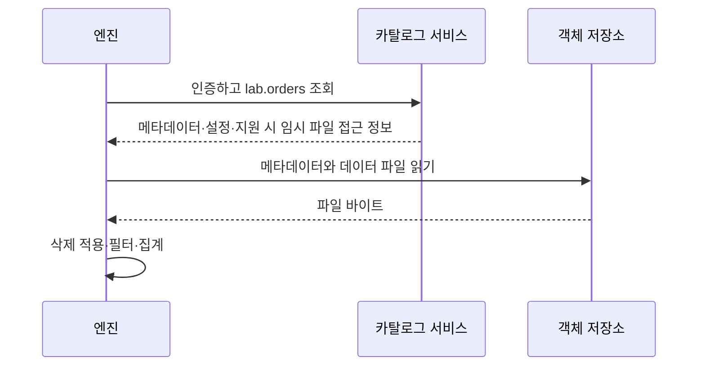

# 08. 카탈로그와 여러 엔진

[이 책의 목차](README.md) · [이전 장](07-latest-and-compatibility.md)

카탈로그를 설치한다고 데이터 처리 엔진이나 객체 저장소가 함께 생기는 것은 아니다. 이 장에서는 이름 조회, 커밋, 파일 읽기, 권한을 실제 연결 관계로 나눈다.

## 1. 같은 테이블을 찾는 데 필요한 정보

엔진에 `prod.lab.orders`를 질의하면 먼저 `prod`라는 등록된 카탈로그를 사용한다. 그 카탈로그가 `lab.orders`를 찾는다. 다른 엔진의 카탈로그 이름이 `iceberg`여도 같은 서비스의 같은 테이블을 가리킬 수 있다.

```text
Spark 안의 이름: prod.lab.orders
Trino 안의 이름: iceberg.lab.orders

두 이름이 같은 REST catalog의 같은 table UUID를 찾는지 확인해야 한다.
문자열이 같다는 사실이나 warehouse prefix가 같다는 사실만으로 판정하지 않는다.
```

**Namespace**는 테이블 이름을 묶는 이름 공간이다. DB의 schema와 비슷한 역할로 쓰이지만 카탈로그마다 계층 구조·지원 제한이 다르다. 엔진의 database라는 말과 동일하게 동작한다고 가정하지 않는다.

## 2. 카탈로그와 파일 I/O는 다른 연결이다

**File I/O**는 엔진이 저장소의 파일을 읽고 쓰는 구성요소다. 예를 들어 REST 카탈로그 조회가 성공해도 S3 파일을 읽는 자격증명이 없으면 쿼리는 실패한다.



일반적인 클라이언트 계획 경로다. 리모트 계획 기능이 있으면 서비스가 파일 작업 목록을 제공하는 등 호출 흐름이 달라진다. 데이터 파일을 엔진이 직접 읽는 구성과 카탈로그가 데이터를 전부 중계하는 구성을 혼동하지 않는다.

| 관찰 | 성공한 계층 | 아직 실패할 수 있는 계층 |
| --- | --- | --- |
| 카탈로그에 테이블 이름이 보임 | 이름 조회 | 파일 인증·네트워크·타입 reader |
| JSON을 읽을 수 있음 | 메타데이터 파일 접근 | manifest·Parquet·삭제 파일 접근 |
| SELECT가 성공 | 현재 읽기 경로 | 새 파일 쓰기·커밋·유지보수 권한 |
| INSERT 성공 | 이번 쓰기 경로 | 다른 엔진의 읽기 호환성·복구 경로 |

## 3. 카탈로그 종류를 저장 방식과 사용 조건으로 비교한다

아래는 제품 추천 순위가 아니다. 역할과 전제조건을 비교하는 지도다. 지원 버전과 구현의 세부 설정은 공식 문서로 확인한다.

| 종류 | 이름·상태를 관리하는 방식 | 사용할 때 확인할 점 |
| --- | --- | --- |
| HadoopCatalog | 파일시스템의 warehouse 구조와 원자적 파일 연산 | 원자적 rename을 제공하는 파일시스템 필요 |
| HiveCatalog | Hive Metastore를 이용한 이름·메타데이터 관리 | HMS 연결·잠금·인증·카탈로그 호환 |
| RESTCatalog | 표준 REST API를 제공하는 서비스와 통신 | 서비스 구현·인증·commit·credential 기능 |
| GlueCatalog | AWS Glue Data Catalog를 이용 | AWS 권한·버전 기반 동시성·파일 I/O 설정 |
| JdbcCatalog | JDBC로 접근하는 관계형 DB에 카탈로그 상태 저장 | DB 트랜잭션·서비스 가용성·연결 관리 |
| Nessie 연동 | 버전 관리 카탈로그 서비스 사용 | 카탈로그 branch와 table snapshot branch의 차이 |

**REST(Representational State Transfer)**는 HTTP API 설계 방식의 이름이다. RESTCatalog는 클라이언트 구현이고, 실제 요청을 받는 카탈로그 서버는 별도로 선택·운영한다. `type=rest` 한 줄이 서버를 자동 시작하지 않는다.

**JDBC(Java Database Connectivity)**는 Java 프로그램이 관계형 DB에 연결하는 API다. JdbcCatalog에 PostgreSQL을 쓸 수 있어도 주문 행을 PostgreSQL에 전부 넣는 뜻은 아니다. 테이블 카탈로그 상태와 파일 데이터를 구별한다.

## 4. 로컬 HadoopCatalog 예제를 S3에 그대로 옮기지 않는다

09장은 로컬 파일시스템에서 **한 프로세스로 실행하는** 작은 HadoopCatalog 실습이다. HadoopCatalog는 원자적 rename 같은 파일시스템 성질에 의존한다. 공식 문서는 로컬 파일시스템과 S3에서 이 카탈로그의 동시 쓰기가 안전하지 않다고 경고한다. 따라서 로컬 실습 성공을 여러 writer의 커밋 안전성 증거로 사용하지 않는다. 객체 저장소에서는 일반 디렉터리 rename과 동일한 의미를 가정할 수 없다.

```text
로컬 실습에서 성공한 설정
  type=hadoop
  warehouse=file:///.../warehouse

그대로 바꾸면 충분하다고 가정하면 안 되는 설정
  type=hadoop
  warehouse=s3://.../warehouse

객체 저장소에 맞는 catalog commit 경로와 FileIO를 따로 선택·검증한다.
```

MinIO나 Ceph RGW를 쓰는 경우에는 endpoint, TLS, path-style access, region, 자격증명, 멀티파트 업로드, 클라이언트 호환성을 확인한다. 네트워크 접근과 파일 읽기만 시험해서 동시 커밋의 안전성이 증명되지는 않는다.

## 5. REST catalog의 credential vending

**Credential, 자격증명**은 인증·접근에 사용하는 토큰이나 키다. **Credential vending**은 카탈로그가 권한 검사를 거쳐 클라이언트에게 제한된 파일 접근 자격증명을 제공하는 방식이다.

이 기능을 지원하는 서비스에서는 모든 엔진에 광범위한 장기 S3 키를 배포하는 대신 테이블 범위·수명 등을 제한하는 구성을 만들 수 있다. 다만 표준에 기능이 있다고 사용하는 서버가 모두 구현하거나 자동 활성화하는 것은 아니다.


쿼리가 오래 걸리면 토큰 갱신이 필요할 수 있다. catalog token과 storage token의 수명·갱신 경로도 다르다. 토큰을 notebook 출력·SQL history·로그에 기록하지 않도록 설정한다.

## 6. 한 테이블을 여러 엔진에서 사용할 때

같은 snapshot을 읽는 두 엔진의 결과를 비교한다. 최소한 행 수, key별 중복 수, 금액 합계, null, 시간 precision, 삭제 반영을 확인한다. 문자열 collation·timezone·decimal 계산·타입 매핑이 다르면 단순 행 수만 같고 실제 값은 달라질 수 있다.

| 기능 | 시험 데이터 | 통과 기준 |
| --- | --- | --- |
| 컬럼 evolution | rename 뒤 같은 이름의 새 컬럼 | 원래 field ID의 값이 유지 |
| 파티션 evolution | 월·일 spec 혼합 | 정확한 필터 결과 |
| v2 deletes | equality와 position 혼합 | 삭제 행이 결과에 안 보임 |
| v3 DV | 기존 v2 position과 DV 전환 | 삭제 행 부활 없음 |
| Defaults | 필드 추가 전후 파일 | 초기·쓰기 default 의미 보존 |
| ns timestamp | 마이크로초 아래 자리 포함 | 지원 여부 명확·허용 시 값 보존 |
| Maintenance | rewrite 전후 같은 snapshot 의미 | 행 값·lineage·삭제 의미 보존 |

**엔진 캐시** 때문에 카탈로그의 최신 상태를 즉시 새로 읽지 않는 경우가 있다. “한 엔진에서는 보이고 다른 엔진에서는 안 보임”이 곧 저장소 손상이라는 뜻은 아니다. 같은 catalog·table UUID·snapshot·branch를 보는지와 메타데이터 cache 정책부터 확인한다.

## 7. 카탈로그 이전은 데이터 폴더 복사와 다르다

같은 이름으로 다른 카탈로그에 새 테이블을 만들면 원래 테이블과 별개의 UUID가 될 수 있다. 메타데이터 파일에는 절대 파일 경로가 들어갈 수 있어 버킷 복사만으로 주소가 바뀌지 않는다.

이전 계획에는 다음이 필요하다.

1. 모든 reader·writer와 유지보수 작업을 목록화한다.
2. 테이블 UUID·현재 metadata·snapshot·branch/tag·파일 경로를 기록한다.
3. 지원되는 register/migrate/import 경로와 그 제한을 확인한다.
4. 쓰기를 하나의 권위 있는 커밋 경로로 모을 전환 시점을 정한다.
5. 이전 전후 행 값과 과거 스냅샷 접근을 검증한다.
6. 구 카탈로그의 정리 작업이 공유 파일을 삭제하지 않도록 한다.

두 카탈로그가 독립적으로 같은 파일을 관리하고 서로를 모르면서 쓰고 정리하는 상태는 위험하다. “하나의 파일을 여러 엔진이 읽음”과 “독립된 두 테이블 수명주기가 같은 파일을 관리함”을 구별한다.

## 8. 확인 질문과 해설

**질문.** RESTCatalog 설정을 넣었는데 연결 거절이 난다. 무엇이 빠졌을 수 있는가?

**해설.** 실제 REST 서비스, 주소·포트, 인증, TLS, 네트워크 경로다. 클라이언트 클래스를 선택하는 것과 서버를 운영하는 것은 다르다.

**질문.** 테이블 목록은 보이지만 S3 403이 난다. 왜 가능한가?

**해설.** 카탈로그 권한과 파일 접근 권한은 별개의 경로다. credential 범위·만료·FileIO 설정을 확인한다.

**질문.** Nessie의 branch와 Iceberg의 snapshot branch는 같은 것인가?

**해설.** 서로 다른 계층의 버전 참조다. 서비스 수준의 카탈로그 참조와 테이블 안의 snapshot reference를 구별한다.

## 근거와 더 읽기

공식 [Spark configuration](https://iceberg.apache.org/docs/latest/spark-configuration/), [REST catalog specification](https://iceberg.apache.org/rest-catalog-spec/), [AWS integration](https://iceberg.apache.org/docs/latest/aws/), [JDBC catalog](https://iceberg.apache.org/docs/latest/jdbc/), [Nessie integration](https://iceberg.apache.org/docs/latest/nessie/)를 참고한다. HadoopCatalog의 저장소 전제는 [Java API의 catalog 설명](https://iceberg.apache.org/docs/latest/java-api-quickstart/)과 구현 문서를 확인한다.

[다음: 09. 로컬 실습](09-local-lab.md)
