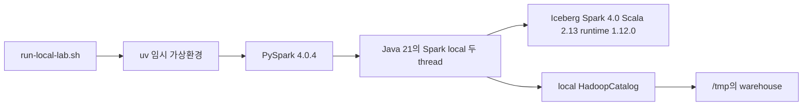
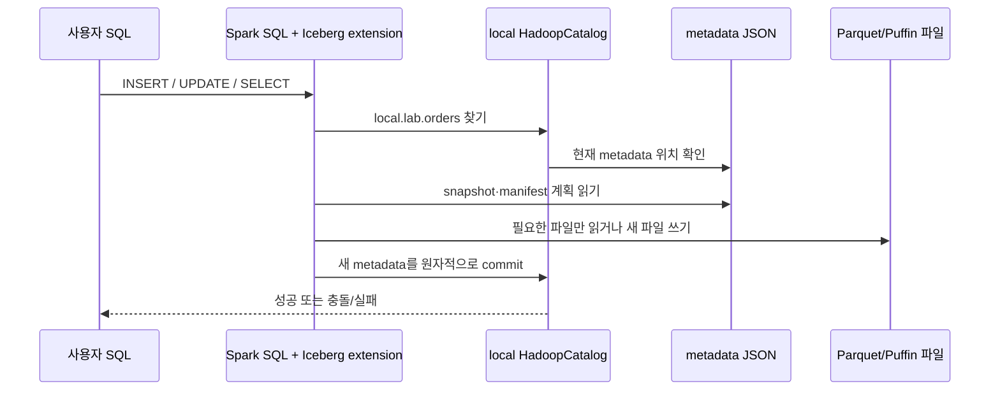
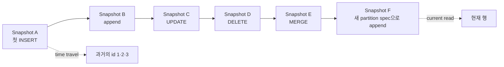
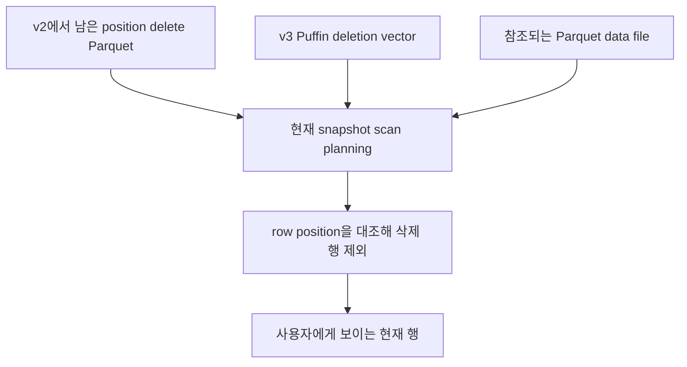
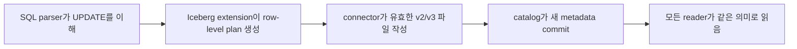

# 09. CPU 한 대로 끝까지 실행하는 Iceberg 로컬 실습

[← 이 책 목차](README.md)

작성·실행 확인일: **2026-10-08**

이 장에서는 노트북이나 개발 서버 한 대에서 Apache Iceberg 테이블의 생애를 직접 본다. Docker, S3, Hive Metastore, REST catalog, Kubernetes는 필요 없다. Spark는 `local[2]`로 CPU thread 두 개를 사용하고, Iceberg `HadoopCatalog`는 로컬 디렉터리를 warehouse로 사용한다. 이 구성은 **한 프로세스가 순서대로 실행하는 교육용 실습**이며 local filesystem HadoopCatalog에서 여러 writer가 동시에 commit해도 안전하다는 검증이 아니다.

책의 앞 장은 흐름을 단순하게 보이기 위해 `order_id`, `region`, 정수 원화 금액을 주로 사용한다. 이 실습은 DML과 lineage를 더 분명히 보기 위한 별도의 교육 데이터셋이며 `id`, `customer`, `status`, 소수 둘째 자리의 `amount`를 사용한다. 두 예시의 컬럼을 같은 실제 schema로 오해하지 않는다.

실습이 끝나면 다음 문장을 출력과 파일로 설명할 수 있어야 한다.

- SQL의 `UPDATE`가 Parquet 파일의 바이트를 제자리에서 고치는 것은 아니다.
- INSERT·UPDATE·DELETE·MERGE처럼 데이터를 바꾸는 commit마다 새 snapshot이 생기고 이전 snapshot은 time travel로 읽을 수 있다. schema나 property만 바꾸는 metadata commit은 새 snapshot을 만들지 않을 수 있다.
- 컬럼 이름을 바꿔도 field ID는 유지된다.
- partition spec을 바꿔도 이전 spec으로 쓴 파일을 함께 읽는다.
- 포맷 v2의 row-level 변경과 포맷 v3의 deletion vector·row lineage는 서로 다른 계약이다.
- Spark SQL 문법 지원과 Iceberg table format 기능은 같은 말이 아니다.

실행 파일은 [전체 검증 프로그램](examples/iceberg_local_lab.py)과 [환경 준비·실행 스크립트](examples/run-local-lab.sh)다. 전체 실행으로 결과를 먼저 확인한 뒤 본문의 SQL과 예상 표를 단계별로 비교할 수 있다.

## 1. 이번 실습의 고정 조합

| 구성 요소 | 고정 버전·설정 | 선택 이유 |
| --- | --- | --- |
| Java | 21 | Spark 4.0은 Java 17/21에서 실행 가능 |
| Python | 3.12 | Spark 4.0의 Python 3.9+ 범위 안이며 이 교재의 검증 환경 |
| PySpark | 4.0.4 | Spark 4.0 유지보수 release를 고정해 재현 |
| Scala binary | 2.13 | Spark 4 계열의 공식 기본 binary line |
| Iceberg | 1.12.0 | 확인일 현재 최신 Apache Iceberg release |
| runtime artifact | `iceberg-spark-runtime-4.0_2.13:1.12.0` | Spark 4.0·Scala 2.13과 맞는 통합 JAR |
| catalog | HadoopCatalog | 외부 catalog service 없이 로컬 경로 사용 |
| master | `local[2]` | cluster 없이 CPU thread 두 개 사용 |

Iceberg의 [1.12.0 release 글](https://iceberg.apache.org/blog/apache-iceberg-1.12.0-release/)과 [multi-engine 지원표](https://iceberg.apache.org/multi-engine-support/)에는 Spark 3.5, 4.0, 4.1 지원이 기록되어 있다. Spark의 [4.0 release 문서](https://spark.apache.org/releases/spark-release-4-0-0.html)는 Java 17/21, Scala 2.13, Python 3.9+ 조합을 설명한다. 이 표의 숫자 하나를 바꾸면 runtime artifact의 Spark·Scala suffix도 다시 확인해야 한다.



그림의 `HadoopCatalog`는 Hadoop cluster라는 뜻이 아니다. 이 catalog 구현은 여기서 `file:` URI를 사용한다. NameNode, HDFS DataNode, S3 bucket, access key가 없다. [HadoopCatalog API](https://iceberg.apache.org/javadoc/1.12.0/org/apache/iceberg/hadoop/HadoopCatalog.html)가 요구하는 filesystem 동작과 운영 catalog의 동시성·복구 보장은 별도로 평가해야 한다.

## 2. 실행 전 자원과 안전 경계

권장 여유 공간은 PySpark와 Iceberg JAR cache를 포함해 약 1 GB 이상, 권장 RAM은 2 GB 이상이다. Spark driver memory는 예제에서 1 GB로 제한했다. 작은 교육 데이터만 다루므로 GPU는 사용하지 않는다.

프로그램이 쓰는 기본 경로는 다음 둘이다.

| 경로 | 내용 | 재실행 때 동작 |
| --- | --- | --- |
| `/tmp/netai-iceberg-lab-venv` | `pyspark==4.0.4` 가상환경 | 있으면 재사용하고 version을 확인 |
| `/tmp/netai-iceberg-lab/warehouse` | 이 실습의 catalog와 table 파일 | marker가 있는 실습 경로만 비우고 새로 시작 |

기본 warehouse를 다른 데이터 보관 경로로 바꾸지 않는다. `ICEBERG_WAREHOUSE`를 지정할 때도 이 실습만을 위한 새 디렉터리를 사용한다. 프로그램은 빈 디렉터리에 `.netai-iceberg-local-lab` marker를 만든다. 이후 기본 실행은 marker가 있는 warehouse만 비우며, marker 없는 비어 있지 않은 디렉터리·일반 파일·루트·사용자 홈·저장소 루트는 거부한다.

`--keep`은 warehouse의 다른 파일을 보존하는 선택지일 뿐이다. 실습 자체는 실행할 때마다 `local.lab.orders`를 `DROP TABLE IF EXISTS`로 제거하고 다시 만든다. 기존 주문 table을 이어서 실험하는 옵션이 아니다.

이 실습은 snapshot expiration, orphan file 삭제, 운영 table의 garbage collection을 실행하지 않는다. 파일 정리는 [성능과 유지보수 장](10-performance-and-maintenance.md)의 보존 조건을 이해한 뒤 별도 격리 환경에서 다룬다.

## 3. 1분 설치 확인

저장소 루트에서 다음을 실행한다.

```bash
java -version
python3 --version
uv --version
bash -n learning/apache-iceberg/examples/run-local-lab.sh
```

버전 문자열의 patch 번호는 환경에 따라 다를 수 있다. 중요한 최소 조건은 Java 17 또는 21, Python 3.9 이상, 실행 가능한 `uv`다. 이 교재를 검증한 환경은 Java 21, Python 3.12.3, uv 0.11.8이었다.

`JAVA_HOME` 관련 오류가 날 때는 Java 실행 파일을 먼저 확인한다.

```bash
command -v java
readlink -f "$(command -v java)"
```

JDK가 여러 개 설치되어 있다면 현재 shell의 `JAVA_HOME`이 Java 21 JDK를 가리키도록 설정한다. 배포판별 설치 경로가 다르므로 출력에서 확인한 실제 JDK 경로를 사용한다.

## 4. 전체 실습 한 번에 실행

다음 한 줄이 가상환경 생성, PySpark 설치, Iceberg JAR resolution, v2와 v3 검증을 모두 수행한다.

```bash
bash learning/apache-iceberg/examples/run-local-lab.sh
```

첫 실행은 PySpark package와 약 47 MB의 Iceberg runtime JAR를 내려받으므로 네트워크 속도에 따라 시간이 걸린다. 다음 실행은 uv와 Ivy cache를 재사용한다. 저장소 자체에는 Python dependency를 설치하지 않는다.

성공의 마지막 줄은 다음과 같다.

```text
v3 확인: format-version=3, 새 행의 lineage 존재, UPDATE 뒤 row ID 보존, DV 생성

ALL ASSERTIONS PASSED
```

snapshot ID, commit 시각, UUID가 들어간 파일명은 실행할 때마다 달라진다. 그 값을 예시와 문자 단위로 비교하지 않는다. 행 값, snapshot의 부모 관계, field ID 보존, 두 partition spec의 공존, DV의 구조적 필드는 assertion으로 비교한다.

## 5. Spark와 catalog가 연결되는 과정

프로그램은 다음 설정과 같은 Spark session을 만든다.

```text
master = local[2]
spark.sql.extensions = org.apache.iceberg.spark.extensions.IcebergSparkSessionExtensions
spark.sql.catalog.local = org.apache.iceberg.spark.SparkCatalog
spark.sql.catalog.local.type = hadoop
spark.sql.catalog.local.warehouse = file:/tmp/netai-iceberg-lab/warehouse
spark.sql.defaultCatalog = local
spark.sql.session.timeZone = UTC
```

각 설정의 역할을 섞지 않는다.

| 설정 | 담당하는 일 |
| --- | --- |
| `local[2]` | Spark driver와 local executor thread로 계산 실행 |
| Iceberg extension | `DELETE`, `UPDATE`, `MERGE` 같은 Iceberg SQL 계획 확장 |
| `SparkCatalog` | Spark catalog API와 Iceberg table operation 연결 |
| `type=hadoop` | table 이름을 warehouse 하위 경로에 연결하고 metadata pointer를 관리 |
| `warehouse=file:...` | 실제 로컬 저장 위치 지정 |
| `defaultCatalog=local` | SQL에서 기본 catalog 선택 |
| `session.timeZone=UTC` | `days(timestamp)` 경계와 출력 시각을 실행 컴퓨터의 지역 설정과 분리 |



SQL parser가 문장을 이해하는 것, Iceberg가 유효한 metadata를 만드는 것, catalog가 현재 version을 바꾸는 것은 서로 다른 단계다.

## 6. v2 테이블 생성

프로그램은 namespace를 만든 뒤 같은 이름의 이전 실습 table을 제거하고 새 table을 만든다.

```sql
CREATE NAMESPACE IF NOT EXISTS local.lab;

CREATE TABLE local.lab.orders (
  id BIGINT NOT NULL,
  customer STRING,
  status STRING,
  amount DECIMAL(10, 2),
  ordered_at TIMESTAMP
)
USING iceberg
PARTITIONED BY (days(ordered_at))
TBLPROPERTIES (
  'format-version'='2',
  'write.delete.mode'='merge-on-read',
  'write.update.mode'='merge-on-read',
  'write.merge.mode'='merge-on-read'
);
```

`USING iceberg`는 이 table이 Iceberg connector를 사용한다는 뜻이다. `format-version=2`는 table metadata 계약을 v2로 만든다는 뜻이다. Iceberg library version 1.12.0과 table format v2는 같은 번호 축이 아니다.

`days(ordered_at)`는 hidden partition transform이다. 사용자는 `ordered_at` timestamp를 넣고 Iceberg가 날짜 partition 값을 계산한다. 원본 열과 별개인 `ordered_at_day` 값을 매 INSERT마다 직접 관리하지 않는다.

`merge-on-read`는 변경 시 기존 data file 전체를 즉시 다시 쓸 필요 없이 delete artifact와 새 data file을 조합할 수 있게 한다. 실제 계획은 조건과 엔진 최적화에 따라 metadata-only delete나 rewrite가 될 수도 있다.

## 7. 첫 INSERT와 기준 snapshot

처음 세 주문을 넣는다.

```sql
INSERT INTO local.lab.orders VALUES
  (1, '서울상점', 'pending', 100.00, TIMESTAMP '2026-01-10 09:00:00'),
  (2, '부산상점', 'pending', 200.00, TIMESTAMP '2026-01-11 10:00:00'),
  (3, '서울상점', 'paid',    150.00, TIMESTAMP '2026-02-01 11:00:00');
```

예상 행은 다음과 같다.

| id | status |
| ---: | --- |
| 1 | pending |
| 2 | pending |
| 3 | paid |

프로그램은 이 commit의 snapshot ID를 `first_snapshot`으로 저장한다. snapshot ID는 전역적인 1, 2, 3 순번이 아니며 큰 정수다. 실행마다 달라져도 정상이다.

## 8. append, UPDATE, DELETE, MERGE

먼저 두 주문을 append한다.

```sql
INSERT INTO local.lab.orders VALUES
  (4, '인천상점', 'pending', 80.00,  TIMESTAMP '2026-02-02 12:00:00'),
  (5, '부산상점', 'paid',    300.00, TIMESTAMP '2026-03-03 13:00:00');
```

그다음 주문 1의 상태와 금액을 바꾸고 주문 2를 삭제한다.

```sql
UPDATE local.lab.orders
SET status='paid', amount=110.00
WHERE id=1;

DELETE FROM local.lab.orders
WHERE id=2;
```

마지막으로 들어온 변경 묶음을 `MERGE`한다. 주문 3은 기존 행이므로 갱신되고, 주문 6은 없으므로 삽입된다.

```sql
MERGE INTO local.lab.orders AS target
USING (
  SELECT * FROM VALUES
    (3L, 'shipped', CAST(175.00 AS DECIMAL(10, 2))),
    (6L, 'pending', CAST(120.00 AS DECIMAL(10, 2)))
  AS source(id, status, amount)
) AS source
ON target.id = source.id
WHEN MATCHED THEN UPDATE SET
  target.status = source.status,
  target.amount = source.amount
WHEN NOT MATCHED THEN INSERT
  (id, customer, status, amount, ordered_at)
  VALUES (source.id, '신규상점', source.status, source.amount,
          TIMESTAMP '2026-03-04 14:00:00');
```

이 시점의 assertion은 다음 표다.

| id | status | amount | 변화 |
| ---: | --- | ---: | --- |
| 1 | paid | 110.00 | UPDATE |
| 3 | shipped | 175.00 | MERGE의 matched branch |
| 4 | pending | 80.00 | append |
| 5 | paid | 300.00 | append |
| 6 | pending | 120.00 | MERGE의 not matched branch |

`id=2`는 결과에서 없어야 한다. 원래 Parquet 파일에서 해당 byte를 덮어쓴 것은 아니다. v2 MOR 경로에서는 data file과 delete file을 함께 계획해 논리 결과에서 행을 제외한다.

## 9. snapshot과 metadata table 관찰

Iceberg는 table 이름 뒤에 metadata table 이름을 붙여 내부 상태를 SQL로 보여 준다.

```sql
SELECT committed_at, snapshot_id, parent_id, operation
FROM local.lab.orders.snapshots
ORDER BY committed_at;
```

실제 검증 실행에서는 v2 단계에 다음 여섯 snapshot이 생겼다. ID와 시각은 매번 달라진다.

| 순서 | operation | 원인이 된 동작 |
| ---: | --- | --- |
| 1 | append | 첫 세 행 INSERT |
| 2 | append | 주문 4·5 INSERT |
| 3 | overwrite | UPDATE |
| 4 | delete | DELETE |
| 5 | overwrite | MERGE |
| 6 | append | partition evolution 뒤 주문 7 INSERT |

`operation` 이름만으로 물리 파일 수를 단정하지 않는다. `snapshots.summary`, `files`, `entries`, `manifests` metadata table을 함께 보아야 한다. [Spark metadata query 문서](https://iceberg.apache.org/docs/latest/spark-queries/)에서 각 table의 열을 확인할 수 있다.



부모 화살표는 table history의 계보이며 데이터 파일이 서로를 직접 가리킨다는 뜻은 아니다. 각 snapshot은 manifest list를 통해 그 시점의 유효한 파일 집합을 표현한다.

## 10. field ID로 컬럼 rename 확인

Iceberg schema는 컬럼을 이름만으로 식별하지 않는다. `amount`의 field ID를 읽은 뒤 이름을 바꾼다.

```sql
ALTER TABLE local.lab.orders
RENAME COLUMN amount TO total_amount;
```

검증 실행에서는 rename 전후가 다음과 같았다.

```text
amount(4) -> total_amount(4)
```

ID 4가 유지되므로 과거 data file에 `amount`라는 옛 이름으로 저장된 값도 현재 schema의 `total_amount`로 연결할 수 있다. 프로그램은 최신 metadata JSON의 `current-schema-id`를 찾고, 해당 schema의 field 목록을 읽어 이 사실을 assertion한다.

이것은 단순히 `DESCRIBE TABLE`에서 이름이 바뀌었다는 확인보다 강하다. 이름 재사용과 field 정체성은 다르기 때문이다. 기존 컬럼을 삭제하고 같은 이름의 새 컬럼을 만들면 새 field ID를 받아야 한다.

## 11. partition evolution 확인

기존 날짜 transform은 유지하면서 `id` bucket field를 추가한다.

```sql
ALTER TABLE local.lab.orders
ADD PARTITION FIELD bucket(4, id);
```

그 뒤 주문 7을 넣는다.

```sql
INSERT INTO local.lab.orders VALUES
  (7, '대전상점', 'paid', 70.00, TIMESTAMP '2026-04-05 15:00:00');
```

현재 data file을 partition spec별로 세면 두 spec이 함께 보인다.

```sql
SELECT spec_id, count(*) AS files, sum(record_count) AS records
FROM local.lab.orders.files
GROUP BY spec_id
ORDER BY spec_id;
```

검증 실행의 모양은 다음과 같았다. 작은 local job의 파일 개수는 task 계획에 따라 달라질 수 있으므로 프로그램은 숫자 9와 1을 고정하지 않고, 서로 다른 spec ID가 두 개 이상 존재하는지를 검사한다.

| spec_id | files | 의미 |
| ---: | ---: | --- |
| 0 | 9 | evolution 전에 쓴 현재 data files |
| 1 | 1 | 날짜와 `bucket(4,id)`를 함께 쓰는 새 spec의 file |

partition evolution은 이전 파일을 즉시 새 디렉터리로 옮기지 않는다. 각 manifest entry에 spec ID가 있으므로 reader가 spec별 partition tuple을 올바르게 해석한다.

## 12. time travel assertion

현재 table에서 주문 2는 삭제되고 주문 4~7이 추가되었다. 그러나 첫 snapshot ID를 지정하면 첫 세 행을 다시 읽는다.

```sql
SELECT id
FROM local.lab.orders VERSION AS OF 1234567890123456789
ORDER BY id;
```

위 숫자는 형식 예시다. 실제 프로그램은 실행 중 저장한 `first_snapshot` 값을 넣는다. 기대 결과는 항상 다음과 같다.

| id |
| ---: |
| 1 |
| 2 |
| 3 |

time travel은 현재 table을 rollback하지 않는다. 과거 snapshot을 읽는 query일 뿐이다. snapshot을 expire하면 그 snapshot으로의 time travel이 더 이상 가능하지 않을 수 있으므로 이 실습에서는 expiration을 실행하지 않는다.

## 13. 같은 table을 v3로 올린다

v2 실습을 통과한 table의 format property를 3으로 바꾼다.

```sql
ALTER TABLE local.lab.orders
SET TBLPROPERTIES ('format-version'='3');
```

이 명령은 기존 Parquet와 legacy v2 delete files를 전부 다시 쓰지 않는다. 기존 파일은 여전히 유효하고, 이후 v3 writer가 만드는 새 파일과 metadata에 v3 규칙을 적용한다. v3로 올린 table을 단순히 property 변경으로 v2로 되돌리는 절차로 생각하면 안 된다.

확인일 기준 v1·v2·v3는 완성·채택된 format이고 v4는 개발 중이다. Iceberg 1.12.0에 v4 기반 작업이 포함되어도 v4 table read/write가 가능하다는 뜻은 아니다. 자세한 구분은 [최신 버전과 호환성](07-latest-and-compatibility.md)을 참고한다.

## 14. v3 row lineage를 눈으로 본다

v3에서 주문 8을 삽입한다.

```sql
INSERT INTO local.lab.orders VALUES
  (8, '광주상점', 'pending', 88.00, TIMESTAMP '2026-04-06 16:00:00');
```

프로그램은 먼저 주문 8만 조회해 INSERT 직후의 Iceberg system columns를 `lineage_before`로 저장한다.

```sql
SELECT id, _row_id, _last_updated_sequence_number
FROM local.lab.orders
WHERE id=8;
```

프로그램은 주문 8의 `_row_id`와 last-updated sequence가 null이 아닌지 확인한다. 숫자의 크기나 입력 id와의 일치를 기대하지 않는다. `_row_id`는 주문 id가 아니라 Iceberg가 관리하는 논리 행 식별자다.

이어서 주문 8을 UPDATE한다.

```sql
UPDATE local.lab.orders
SET status='paid'
WHERE id=8;
```

검증 조건은 다음 두 가지다.

1. UPDATE 전후 주문 8의 `_row_id`는 같다.
2. `_last_updated_sequence_number`는 이전 값보다 크다.

동일한 논리 행이 새 물리 row representation으로 바뀌어도 row identity를 보존한다는 뜻이다. equality-delete 기반의 일부 update 경로처럼 원래 row ID를 알 수 없는 방식에는 별도 제약이 있으므로 모든 엔진의 모든 update가 같은 lineage 결과를 낸다고 일반화하지 않는다.

프로그램은 다음 절의 주문 4 DELETE까지 마친 뒤 전체 lineage를 출력한다.

```sql
SELECT id, _row_id, _last_updated_sequence_number
FROM local.lab.orders
ORDER BY id;
```

검증 실행의 최종 출력 일부는 다음과 같았다. 따라서 이미 삭제된 `id=4`는 보이지 않고, `id=8`의 last-updated sequence는 UPDATE가 반영된 값이다. 실제 숫자는 commit 순서와 파일 계획에 따라 달라질 수 있다.

| id | `_row_id` | `_last_updated_sequence_number` |
| ---: | ---: | ---: |
| 1 | 4 | 3 |
| 3 | 3 | 5 |
| 5 | 6 | 2 |
| 6 | 2 | 5 |
| 7 | 1 | 6 |
| 8 | 0 | 8 |

## 15. v3 deletion vector를 검증한다

v3 table에서 merge-on-read UPDATE를 하면 기존 주문 8 row position을 제외하고 새 상태를 추가해야 한다. Spark 4.0 + Iceberg 1.12.0의 이 실행에서는 Puffin deletion vector가 생겼다.

```sql
SELECT content, file_path, record_count, referenced_data_file,
       content_offset, content_size_in_bytes
FROM local.lab.orders.all_delete_files;
```

프로그램은 다음 조건을 모두 확인한다.

| 검사 | 이유 |
| --- | --- |
| `file_path`가 `.puffin`으로 끝남 | v3 DV blob의 container 확인 |
| `referenced_data_file`이 null 아님 | 어느 data file의 row positions인지 확인 |
| `content_offset`이 null 아님 | Puffin 안의 blob 시작 위치 확인 |
| `content_size_in_bytes`가 null 아님 | 읽을 blob byte 범위 확인 |
| `record_count`가 1 | 이번 UPDATE로 제외한 한 position 확인 |

실제 출력에는 v2 때 만들어진 `*-deletes.parquet`와 v3의 `*-deletes.puffin`이 함께 나타났다. v3로 upgrade해도 기존 v2 position delete file은 유효하다. 다만 v3 writer는 새 position delete file을 추가하지 않고 새 position 기반 삭제를 DV로 표현해야 한다.



주문 4의 DELETE도 실행하지만, 해당 조건이 data file 전체를 제거할 수 있으면 Spark는 file을 snapshot에서 제외하는 metadata-only 경로를 선택할 수 있다. 그런 삭제에는 DV가 필요하지 않다. 그래서 프로그램은 DV를 확인하기 전에 일부 row를 바꾸는 주문 8 UPDATE를 수행한다. “DELETE SQL을 실행했으니 반드시 delete file 하나가 생긴다”는 기대는 틀릴 수 있다.

## 16. v2와 v3에서 확인한 것을 비교한다

| 질문 | v2 단계에서 본 것 | v3 단계에서 더 본 것 |
| --- | --- | --- |
| 행 변경 | UPDATE/DELETE/MERGE 결과 | UPDATE가 Puffin DV 생성 |
| 삭제 표현 | position delete Parquet가 남을 수 있음 | 새 position 기반 삭제는 DV |
| 행 정체성 | 사용자 `id`만 조회 | `_row_id`, last-updated sequence |
| 기존 파일 | v2 metadata 계약으로 읽기 | upgrade 뒤에도 기존 v2 file/delete 읽기 |
| 포맷 변경 | table 생성 때 v2 지정 | 같은 table metadata를 v3로 upgrade |

v3가 모든 workload에서 무조건 작고 빠르다고 결론 내리지 않는다. DV cardinality, Puffin range read, cache, data file 크기, 변경 비율, compaction 주기, 엔진 vectorization을 실제 workload로 측정해야 한다.

## 17. SQL 지원과 format spec 지원을 분리한다

이 실습에서 `UPDATE`, `DELETE`, `MERGE`가 동작하는 데는 Iceberg Spark extension이 필요하다. 그러나 SQL 문법이 있다는 사실만으로 다음을 보장하지 않는다.

- 다른 Spark version과 Iceberg artifact 조합이 호환되는가?
- Trino나 Flink가 같은 v3 DV를 읽고 쓸 수 있는가?
- compaction job이 row lineage를 보존하는가?
- catalog service가 commit과 인증을 올바르게 처리하는가?
- 새 v3 type을 SQL type으로 round-trip할 수 있는가?



어느 한 화살표만 통과해도 전체 상호운용이 검증된 것은 아니다. 운영 upgrade는 reader, writer, streaming job, maintenance, recovery tool을 모두 목록화해 가장 낮은 공통 지원 수준에 맞춘다.

## 18. warehouse에서 직접 볼 파일

실행 뒤 다음 명령은 파일 목록만 읽는다.

```bash
find /tmp/netai-iceberg-lab/warehouse -type f -print | sort
```

대표적으로 다음 종류가 보인다.

| 경로·확장자 | 역할 |
| --- | --- |
| `metadata/*.metadata.json` | schema, partition spec, snapshot log, property와 현재 상태 |
| `metadata/snap-*.avro` | snapshot의 manifest list |
| `metadata/*.avro` | data/delete file entry를 담는 manifest |
| `data/*.parquet` | 사용자 행을 담는 data file 또는 legacy delete file |
| `data/*.puffin` | v3 deletion vector blob container |
| `version-hint.text` | HadoopCatalog가 최신 metadata 탐색에 쓰는 hint |

`data` 디렉터리에 파일이 있다는 사실만으로 현재 snapshot에 포함된다고 판단하지 않는다. `files`, `delete_files`, `entries`, `snapshots` metadata table과 manifest를 통해 참조 관계를 확인한다.

최신 metadata JSON을 보기 위한 읽기 전용 예시는 다음과 같다.

```bash
find /tmp/netai-iceberg-lab/warehouse/lab/orders/metadata -name '*.metadata.json' -print | sort
```

파일 이름의 앞 숫자가 커 보인다는 이유만으로 독자적인 catalog algorithm을 만들지 않는다. 정상 접근에는 Iceberg catalog API와 metadata pointer를 사용한다.

## 19. 실패 진단

### `java: command not found`

Java 17 또는 21 JDK를 설치하고 `java -version`을 먼저 통과시킨다. Java 8이나 11을 그대로 사용하지 않는다.

### `[JAVA_GATEWAY_EXITED]`

Python이 JVM 시작 전에 실패한 경우다. `java -version`, `JAVA_HOME`, JVM stderr를 확인한다. `JAVA_HOME`이 삭제된 JDK나 JRE 일부만 가리키지 않는지 본다.

### Maven artifact를 내려받지 못함

첫 실행에는 Maven Central 접근이 필요하다. proxy, DNS, TLS inspection, 사내 artifact mirror 정책을 확인한다. 좌표를 임의로 `iceberg-core` 하나로 바꾸지 않는다. Spark 통합에 맞는 shaded runtime artifact가 필요하다.

### `ClassNotFoundException: IcebergSparkSessionExtensions`

Iceberg runtime JAR가 classpath에 없거나 artifact suffix가 Spark/Scala와 맞지 않는다. 이 장의 고정 좌표는 다음이다.

```text
org.apache.iceberg:iceberg-spark-runtime-4.0_2.13:1.12.0
```

### `MERGE INTO TABLE is not supported temporarily`

Iceberg Spark extension 설정을 확인한다. table이 `USING iceberg`로 만들어졌는지, `local` catalog로 접근했는지도 확인한다.

### `Unsupported table format version`

runtime이 table format을 쓰거나 읽을 수 없는 조합이다. project release, engine version, runtime artifact, table `format-version`을 따로 기록해 비교한다. property를 억지로 낮추지 않는다.

### `ALL ASSERTIONS PASSED` 전에 warehouse가 이미 이상함

기본 실행은 marker가 있는 전용 `/tmp` warehouse를 새로 만든다. `--keep`을 붙이면 warehouse의 다른 파일은 보존하지만 `local.lab.orders`는 여전히 제거 후 재생성한다. `ICEBERG_WAREHOUSE`를 재사용했다면 fresh 전용 경로로 다시 비교한다.

```bash
ICEBERG_WAREHOUSE=/tmp/netai-iceberg-lab-fresh/warehouse \
  bash learning/apache-iceberg/examples/run-local-lab.sh
```

### Windows 또는 macOS에서 경로 오류

이 실행은 Linux에서 검증했다. Java와 PySpark 자체는 다른 OS에서도 가능하지만 shell, file URI, path permission, temporary directory가 다르다. WSL이나 Linux VM에서 먼저 같은 결과를 만든 뒤 차이를 좁힌다.

## 20. assertion을 읽는 순서

프로그램이 종료 코드 0을 냈다는 사실만 보지 말고 [소스](examples/iceberg_local_lab.py)의 assertion을 다음 순서로 읽는다.

1. 첫 INSERT 뒤 `(1,pending)`, `(2,pending)`, `(3,paid)`인지 확인한다.
2. append·UPDATE·DELETE·MERGE 뒤 다섯 행의 값이 정확한지 확인한다.
3. rename 전 `amount` field ID와 rename 뒤 `total_amount` field ID가 같은지 확인한다.
4. 현재 data files에 서로 다른 partition spec ID가 공존하는지 확인한다.
5. 첫 snapshot time travel 결과가 id 1, 2, 3인지 확인한다.
6. v3 property가 실제로 3인지 확인한다.
7. 새 행의 lineage system columns가 null이 아닌지 확인한다.
8. UPDATE 뒤 `_row_id`가 보존되는지 확인한다.
9. Puffin DV의 참조 data file, offset, size가 있는지 확인한다.

이 순서는 “프로그램이 실행됐다”보다 “각 Iceberg 계약을 관찰했다”에 가깝다.

## 21. 실습 후 스스로 설명할 질문

1. Parquet와 Iceberg 중 어느 쪽이 snapshot 계보를 관리하는가?
2. `DELETE FROM`이 항상 delete file을 만드는 것은 아닌 이유는 무엇인가?
3. `amount`를 `total_amount`로 바꿀 때 과거 값이 이어지는 근거는 무엇인가?
4. spec 0과 spec 1 file이 동시에 있어도 query가 가능한 이유는 무엇인가?
5. time travel query와 rollback은 table의 현재 상태를 어떻게 다르게 다루는가?
6. v3 upgrade 직후 v2 position delete file이 남아 있어도 유효한 이유는 무엇인가?
7. `_row_id`와 업무 컬럼 `id`는 각각 누가 관리하는가?
8. Spark SQL에서 MERGE가 실행되는 것만으로 다른 engine의 DV 지원을 증명할 수 없는 이유는 무엇인가?

답을 말할 때 SQL 결과, metadata table, metadata JSON, data/delete file 중 어느 증거를 사용했는지도 함께 말한다.

## 22. 검증 범위와 다음 단계

이 장의 프로그램은 2026-10-08에 Linux, Java 21, Python 3.12.3, PySpark 4.0.4, Iceberg 1.12.0 조합으로 fresh warehouse에서 실제 실행했고 마지막 `ALL ASSERTIONS PASSED`를 확인했다.

검증한 범위는 local CPU 실행, HadoopCatalog의 `file:` warehouse, 작은 Parquet 파일, v2 DML, metadata table, schema·partition evolution, snapshot time travel, v3 upgrade, row lineage와 Puffin DV다.

검증하지 않은 범위는 S3·HDFS의 장애와 일관성, REST/Hive/Glue/Nessie catalog, 여러 writer의 실제 충돌, streaming recovery, 암호화, 대규모 성능, 다른 engine 상호운용, snapshot expiration과 orphan cleanup이다. local 성공을 운영 환경 전체의 보장으로 확대하지 않는다.

다음에는 [카탈로그와 여러 엔진](08-catalogs-and-engines.md)에서 table 이름과 commit coordination이 외부 서비스로 이동할 때 무엇이 달라지는지 읽고, [성능과 유지보수](10-performance-and-maintenance.md)에서 file·manifest 수를 측정하는 방법을 배운다.

[← 포맷 v3](06-format-v3.md) · [최신 버전과 호환성](07-latest-and-compatibility.md) · [목차](README.md)
