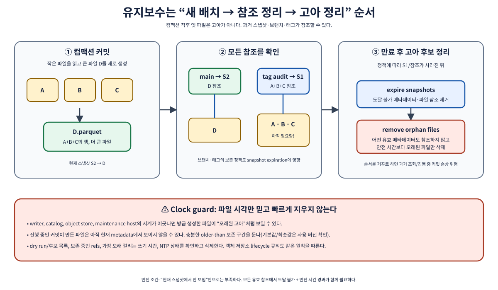
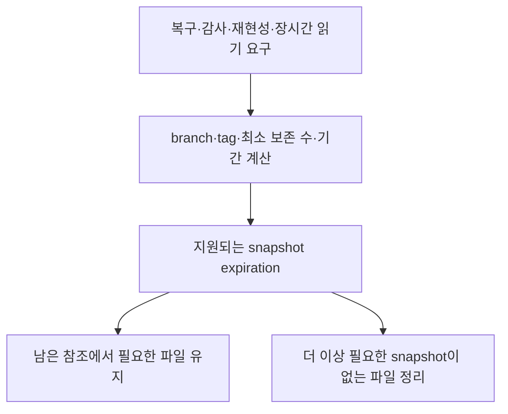
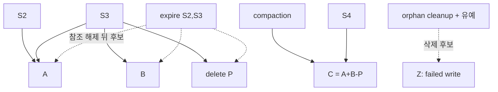
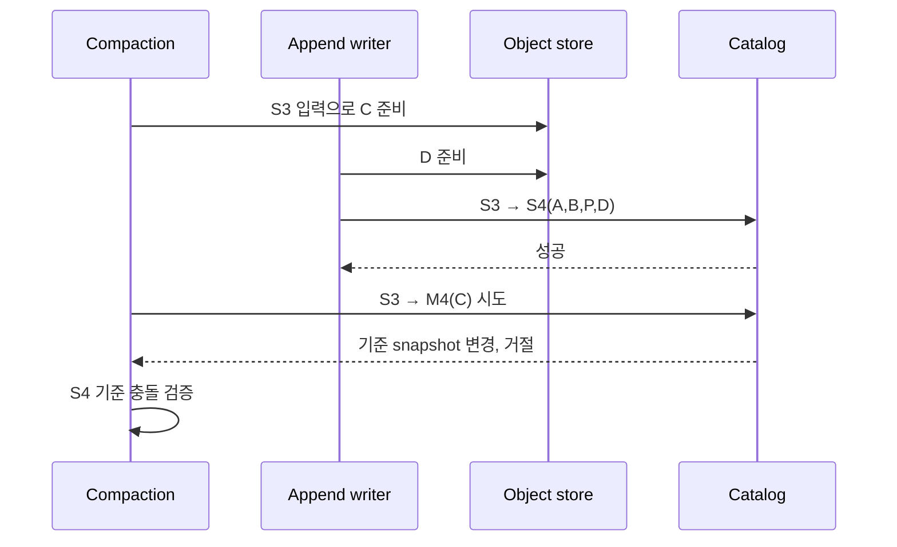

# 10. 성능과 유지보수

[이 책의 목차](README.md) · [이전 장](09-local-lab.md)

이 장의 목표는 테이블을 무조건 잘게 나누거나 파일 크기를 크게 만드는 대신, **어디에서 시간이 들고 어떤 파일이 아직 필요한지** 확인하는 것이다. 정리 절차의 명령은 의미를 배우는 예시이며 운영 테이블에서 그대로 실행하지 않는다.



## 1. 쿼리 시간을 세 구간으로 나눈다

| 구간 | 하는 일 | 측정할 항목 |
| --- | --- | --- |
| 계획 | catalog 조회·metadata 읽기·파일 선택 | planning latency, manifest 수, 파일 수 |
| 실행 | 파일 읽기·삭제 적용·필터·shuffle·집계 | 읽기 bytes, CPU, 네트워크, 작업 분포 |
| 반환 | 결과 직렬화·전송·클라이언트 처리 | 결과 크기, 응답 지연 |

**Shuffle**은 분산 작업 사이에 데이터를 다시 나누어 보내는 과정이다. 지역별 합계를 구할 때 같은 지역의 값을 모으는 데 사용될 수 있다. Iceberg 파일을 더 잘 배치해도 SQL 집계의 모든 shuffle 비용이 사라지는 것은 아니다.

읽을 파일이 열 개뿐인데 실행이 느리면 CPU·네트워크·삭제 적용·집계가 원인일 수 있다. 반대로 데이터 읽기는 빠르지만 시작까지 오래 걸리면 manifest·파일 수·카탈로그·driver 부담을 본다. **Driver**는 Spark에서 작업을 계획하고 조정하는 프로세스다.

## 2. 작은 파일 문제를 숫자로 계산한다

1 GiB 데이터가 1 MiB 파일 1024개에 있다고 하자. 파일 열기와 작업 준비에 파일당 5 ms가 든다는 가상의 직렬 모델이면 준비 비용은 `1024 × 5 ms = 5120 ms`다. 128 MiB 파일 8개라면 `8 × 5 ms = 40 ms`다.

실제 엔진은 병렬화하고 작업을 묶으므로 이 계산이 실제 시간 예측은 아니다. 데이터량이 같아도 파일 수가 계획·요청·예약 비용을 바꿀 수 있다는 점을 보여 준다.

| 데이터량 | 파일 크기 | 파일 수 | 단순 준비 비용 |
| --- | --- | --- | --- |
| 1 GiB | 1 MiB | 1024 | 5120 ms |
| 1 GiB | 128 MiB | 8 | 40 ms |

반대로 너무 큰 파일은 일부 조회의 불필요한 읽기를 늘리거나 작업 분배를 어렵게 할 수 있다. Parquet row group과 split 계획도 영향을 준다. “정답 파일 크기 512 MiB”처럼 모든 workload에 고정된 수치가 있다고 설명하지 않는다.

`write.target-file-size-bytes`는 목표 크기다. 파티션별 데이터량·압축률·Spark task 크기·distribution 때문에 실제 파일이 그 값에 정확히 맞지 않을 수 있다. 이 값을 바꾸는 것만으로 과거 작은 파일이 합쳐지지도 않는다.

## 3. Compaction은 파일을 다시 써서 배치를 바꾼다

**Compaction**은 작은 파일을 합치거나 관련 데이터를 더 좋은 배치로 다시 쓰는 작업을 말한다. Iceberg에는 데이터 파일 rewrite 작업이 있다. COW/MOR의 삭제 상태를 반영한 새 파일을 만들고 유효하게 커밋해야 한다.

```text
입력: A(1 MiB), B(2 MiB), C(1 MiB)
쓰기: D(약 4 MiB, 압축·인코딩에 따라 실제 크기는 달라짐)
커밋: 현재 상태의 A+B+C 참조를 D로 교체
보존: 과거 스냅샷이 A+B+C를 참조하면 이전 파일은 유지
```

데이터를 읽고 다시 쓰므로 저장소 I/O·CPU·shuffle 비용이 든다. 동시에 입력하거나 수정하는 작업과 충돌할 수도 있다. 일부 파일 그룹만 성공하고 나머지가 다시 시도되는 partial progress 설정 같은 동작은 버전 문서를 확인한다.

다음은 **로컬 실습 테이블에만 적용할 수 있는 Spark procedure 예시**다. 실제로 개선될 만큼 파일이 많지 않을 수 있다.

```sql
CALL local.system.rewrite_data_files(
    table => 'lab.orders'
);
```

운영에서는 rewrite 대상 조건·전략·출력 크기·동시성·정렬·snapshot 보존을 먼저 정하고 실행 전후 행 수·합계·삭제 반영을 확인한다. v3에서는 업무 행이 바뀌지 않은 물리 재작성으로 row lineage를 변경하지 않는지도 확인한다.

## 4. Manifest rewrite는 데이터 rewrite와 다르다

Manifest는 파일 목록과 통계를 담는다. 많은 작은 commit 때문에 manifest 수와 조직이 불리하면 manifest rewrite를 검토할 수 있다. 이것은 Parquet 주문 행을 전부 다시 정렬하는 작업과 다르다.

| 작업 | 주로 바꾸는 대상 | 기대 효과 |
| --- | --- | --- |
| Data rewrite | 데이터 파일 | 파일 수·크기·정렬·삭제 적용 비용 개선 |
| Manifest rewrite | 파일 목록의 조직 | 계획 시 읽을 메타데이터 감소·배치 개선 |
| Snapshot expiration | 보존할 스냅샷과 참조 파일 | 과거 상태의 저장 비용 정리 |
| Orphan cleanup | 유효 메타데이터에서 참조되지 않는 파일 | 실패한 쓰기 등의 잔여 파일 정리 |

같은 “정리”라는 말이어도 효과와 위험이 다르다. 데이터 스캔이 느린데 manifest만 다시 쓰면 기대한 실행 시간이 줄지 않을 수 있다.

## 5. 삭제 정보가 읽기 비용을 만들 수 있다

MOR 테이블에서는 데이터 파일과 삭제 정보를 함께 적용한다. 작은 equality delete가 많이 쌓이면 읽을 때 key 집합을 구성·비교하는 비용이 커질 수 있다. position delete나 DV의 위치 필터도 무료는 아니다.

v3의 DV는 단일 데이터 파일에 대해 압축된 위치 표현을 제공하지만, 데이터 파일 자체를 읽지 않는다는 뜻은 아니다. 쿼리 범위와 관련한 삭제 정보의 수·크기·형식을 관찰한다.

1.12.0에는 equality deletes를 v3 deletion vectors로 바꾸는 구현이 추가되었다. 그 기능은 release·엔진·API 경로를 확인하고 사용하는 운영 작업이다. “버전만 올리면 모든 과거 equality delete가 자동 즉시 변환”이라고 해석하지 않는다.

## 6. Snapshot expiration은 시간 여행의 수명을 정한다

**Expiration, 만료**는 더 이상 보존하지 않을 snapshot을 제거하는 과정이다. 지원되는 절차는 보존된 snapshot이 필요로 하는 파일을 고려한다. 현재 조회에서 안 보이는 파일을 직접 지우는 것과 다르다.



아래는 **문법과 파라미터를 설명하는 예시**다. 실제 ID·현재 시각·보존 요구를 검토하지 않고 실행하지 않는다. `retain_last`의 동작과 branch/tag 보존은 해당 버전을 확인한다.

```sql
CALL local.system.expire_snapshots(
    table => 'lab.orders',
    older_than => TIMESTAMP '2026-01-01 00:00:00',
    retain_last => 5
);
```

시각 cutoff는 event time이 아니라 snapshot의 커밋 시각 기준이다. 예시 날짜가 이전이라고 자동 안전한 것은 아니다. 몇 달 전 데이터를 읽는 감사나 실험이 필요할 수 있다.

실행 중인 장시간 쿼리가 이미 선택한 snapshot의 파일을 읽는 중일 수 있다. 엔진과 카탈로그의 reader 추적·보존 지원을 확인하고 그 작업보다 충분히 긴 안전 기간을 잡는다.

## 7. Orphan은 오래된 파일과 동의어가 아니다

**Orphan file, 고아 파일**은 정해진 테이블 범위에서 유효 메타데이터가 참조하지 않는 파일이다. 실패한 쓰기가 남긴 파일이 대표적이다. 그러나 아직 커밋하지 않은 정상 writer의 새 파일도 이 순간에는 참조되지 않을 수 있다.

```text
12:00 writer 시작
12:10 새 Parquet 파일 작성
12:12 cleanup이 "아직 참조 없음"을 발견
12:20 writer 커밋 예정

12:12에 지우면 정상 커밋 준비를 파괴할 수 있음
```

공식 문서는 orphan cleanup의 기본 유예 기간과 동시 작업을 고려하도록 안내한다. 기간은 실행 버전에서 확인하고 가장 긴 쓰기·재시도·업로드·시계 오차보다 충분히 크게 잡는다. “파일 생성 후 10분이면 고아” 같은 임의 규칙을 적용하지 않는다.

지원되는 dry run 예시는 다음과 같다. 이것도 파일 목록 조회 비용은 들며, 버전의 procedure 지원을 확인한다.

```sql
CALL local.system.remove_orphan_files(
    table => 'lab.orders',
    dry_run => true
);
```

실제 삭제 전에는 후보 경로·나이·테이블 경계·다른 테이블의 공유 여부를 검토한다. 서로 다른 URI scheme이나 authority로 같은 파일을 표기하면 참조 비교가 어긋날 수 있다. 경로를 임의로 문자열 정규화해서 삭제하지 않는다.

## 8. 객체 저장소 lifecycle을 테이블 정책과 맞춘다

### Compaction·expiration·orphan cleanup의 파일 변화를 한 표로 본다

현재 snapshot S3가 A·B와 delete P를 참조하고, 과거 S2가 A만 참조한다고 하자. 실패한 writer가 만든 Z는 어떤 metadata에서도 참조하지 않는다.

```text
S2 → A
S3 → A + B + P
unreferenced → Z
```

먼저 compaction을 실행해 A+B+P의 현재 논리 결과를 C에 쓴다. 새 snapshot S4는 C를 참조한다. 그러나 S2·S3를 보존하는 동안 A·B·P도 필요하므로 저장소에는 C가 추가되어 순간적으로 더 많은 bytes가 존재할 수 있다.

그다음 정책에 따라 S2·S3를 expire하면 남은 reference가 S4뿐인지 계산한다. 그때 A·B·P가 어느 branch·tag에서도 필요하지 않다면 제거 후보가 된다. Expiration은 snapshot 보존 그래프에서 도달 가능성을 바꾸는 작업이다.

마지막으로 orphan cleanup은 Z처럼 정해진 table metadata 어디에서도 참조되지 않고 안전 유예 기간을 지난 파일을 찾는다. S3가 만료되기 전 A·B·P는 현재 S4에서 안 보이더라도 orphan이 아니다.

| 작업 | 새로 만드는 것 | 참조에서 제거하는 것 | 즉시 지워도 된다고 단정할 수 없는 것 |
| --- | --- | --- | --- |
| Compaction | C, S4 metadata | S4에서 A·B·P | 과거 S2·S3가 쓰는 A·B·P |
| Snapshot expiration | 보존 정책에 따른 metadata 변화 | S2·S3 history | 남은 branch/tag/reader가 쓰는 파일 |
| Orphan cleanup | 없음 | metadata reference를 바꾸지 않음 | 진행 중 writer의 미커밋 파일 |



| 시각 | 사건 | 안전 판단 |
| --- | --- | --- |
| 12:00 | 정상 writer W가 D 업로드 시작 | 아직 미참조지만 orphan 아님 |
| 12:10 | Cleanup scan이 D 발견 | W의 최대 실행·retry보다 짧으면 보류 |
| 12:20 | W가 D를 snapshot S5에 commit | D는 유효 data file |
| 다음 날 | 오래된 Z가 계속 미참조 | table 경계·경로 확인 뒤 후보 |

**왜 순서가 중요한가.** Compaction이 만든 S4를 확인하기 전에 S3 파일을 직접 지우면 rewrite 실패 시 복구와 현재 reader를 깨뜨릴 수 있다. Snapshot expiration 없이 “현재 snapshot에 없다”만 보고 지우면 time travel을 깨뜨린다. Orphan cleanup을 유예 없이 실행하면 정상 writer의 준비 파일을 지울 수 있다.

**반례.** Snapshot을 expire했다고 반드시 큰 저장 공간이 즉시 회수되는 것은 아니다. 다른 branch/tag가 파일을 참조하거나 object-store versioning이 이전 객체 버전을 보존할 수 있다. Table-level reference와 storage-level retention을 따로 확인한다.

버킷의 자동 lifecycle이 “30일 지난 모든 객체 삭제”라면 1년 전 데이터 파일을 현재 snapshot이 참조해도 지울 수 있다. 객체 나이와 테이블 참조 필요성은 다르다.

객체 versioning·백업은 논리 삭제 뒤 실제 바이트를 남길 수 있다. 비용과 개인정보 삭제 요구를 함께 조정한다. Iceberg table snapshot 만료와 저장소의 모든 버전·복제본 삭제를 동일한 작업으로 보지 않는다.

## 9. 성능 실험은 같은 의미의 상태를 비교한다

### Maintenance가 concurrent writer를 만났을 때

Compaction M과 append writer W가 모두 snapshot S3에서 시작한다고 하자. M은 A·B·P를 읽어 C를 만들고, W는 새 주문을 D에 쓴다. W가 먼저 S4=A+B+P+D를 commit하면 M이 S3 기준으로 만든 metadata를 그대로 현재 pointer로 바꿀 수 없다.

| 시각 | Compaction M | Append W | 현재 snapshot |
| --- | --- | --- | --- |
| 13:00 | S3의 A·B·P 선택 | S3 읽기 | S3 |
| 13:05 | C 작성 중 | D 작성 | S3 |
| 13:07 | C 준비 | D를 S4에 commit | S4: A+B+P+D |
| 13:08 | S3 기준 commit 시도 | 완료 | S4 |
| 13:09 | 충돌 검증·재계획 | 완료 | 성공 전까지 S4 |

M이 D까지 C에 병합해야 하는지는 rewrite 범위와 validation에 달려 있다. Append D가 rewrite 대상과 독립이면 최신 snapshot에 C와 D가 함께 남도록 재시도할 수 있다. W가 A를 수정한 overwrite라면 M의 결과 C가 그 변경을 덮어쓰지 않도록 충돌해야 한다.



C가 object store에 생겼지만 M commit이 최종 실패하면 C는 현재 snapshot에 없다. 즉시 삭제하지 않고 commit 결과 불확실성, retry, orphan 유예 정책에 맡긴다. 정상 재시도 중인 M이 같은 C를 재사용할 수 있기 때문이다.

Maintenance 전후 검증은 파일 수만 세지 않는다.

| 검증 값 | S3 전 | 성공 snapshot 후 | 목적 |
| --- | ---: | ---: | --- |
| 논리 행 수 | 100 | 100 + W의 append 수 | 행 손실·중복 확인 |
| 취소 주문 수 | 7 | 7 | Delete 반영 유지 |
| 현재 data file 수 | 2 | 목표상 1 + D | Compaction 효과 |
| 현재 delete file 수 | 1 | 목표상 0 | Delete materialize 확인 |
| 과거 snapshot 조회 | S3 가능 | retention 기간 동안 가능 | 보존 계약 확인 |

**결과가 왜 빨라질 수 있는가.** Reader가 A·B와 P를 따로 열고 병합하던 경로가 C 한 파일 읽기로 줄어든다. 그러나 query가 D partition만 읽거나 metadata planning이 병목이면 이 rewrite가 해당 query를 거의 개선하지 않을 수 있다.

**반례.** Compaction 성공 직후 storage bytes가 늘었다고 실패로 판정하면 안 된다. C와 D가 추가되고 과거 snapshot 때문에 A·B·P도 남을 수 있다. Expiration이 보존 정책을 적용한 뒤에야 일부 옛 파일이 삭제 가능해진다.

Compaction 전후 snapshot ID는 달라질 수 있지만 행 값은 같아야 한다. 비교할 쿼리, 입력 조건, 캐시 상태, 엔진 자원, 카탈로그, 동시 작업을 기록한다.

| 측정 | 왜 필요한가 |
| --- | --- |
| 결과 행 수·집계·샘플 key | 빠르지만 틀린 결과 배제 |
| planning time·manifest 수 | 메타데이터 조직 개선 확인 |
| 파일 수·읽기 bytes·delete bytes | 물리 읽기 개선 확인 |
| elapsed time 여러 번·분포 | 첫 실행·캐시·일시적 지연 구분 |
| rewrite 시간·bytes·추가 보존 비용 | 읽기 개선을 위해 지불한 쓰기 비용 |

평균만 기록하지 말고 실제 목적에 맞는 지연 분포와 반복 수를 기록한다. 초소형 로컬 실습의 실행 시간을 테라바이트 운영 테이블 성능으로 외삽하지 않는다.

## 10. 확인 질문과 해설

**질문.** Compaction 뒤 현재 파일이 줄었는데 저장소 용량은 늘었다. 실패인가?

**해설.** 과거 스냅샷이 옛 파일을 유지하면 정상적으로 함께 존재할 수 있다. retention과 실제 참조를 확인한다.

**질문.** 현재 manifests에 없는 파일은 즉시 삭제해도 되는가?

**해설.** 과거 참조·다른 테이블·정상 writer의 미커밋 파일을 고려해야 한다. 지원 도구와 유예 기간을 사용한다.

**질문.** 작은 파일이 1000개에서 10개가 되었는데 모든 쿼리가 100배 빨라지는가?

**해설.** 파일 열기 비용이 일부 줄어도 데이터 읽기·삭제 적용·집계·shuffle 등 다른 비용이 남는다.

## 근거와 더 읽기

공식 [Maintenance](https://iceberg.apache.org/docs/latest/maintenance/), [Spark procedures](https://iceberg.apache.org/docs/latest/spark-procedures/), [Configuration](https://iceberg.apache.org/docs/latest/configuration/), [1.12.0의 streaming deletes](https://iceberg.apache.org/blog/apache-iceberg-1.12.0-release/#streaming-deletes)를 참고한다. 숫자는 가정이 표시된 교육용 계산이며 실측 성능이 아니다.

[다음: 11. 스트리밍·보안·운영 설계](11-streaming-security-and-operations.md)
