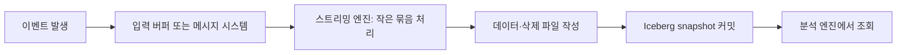
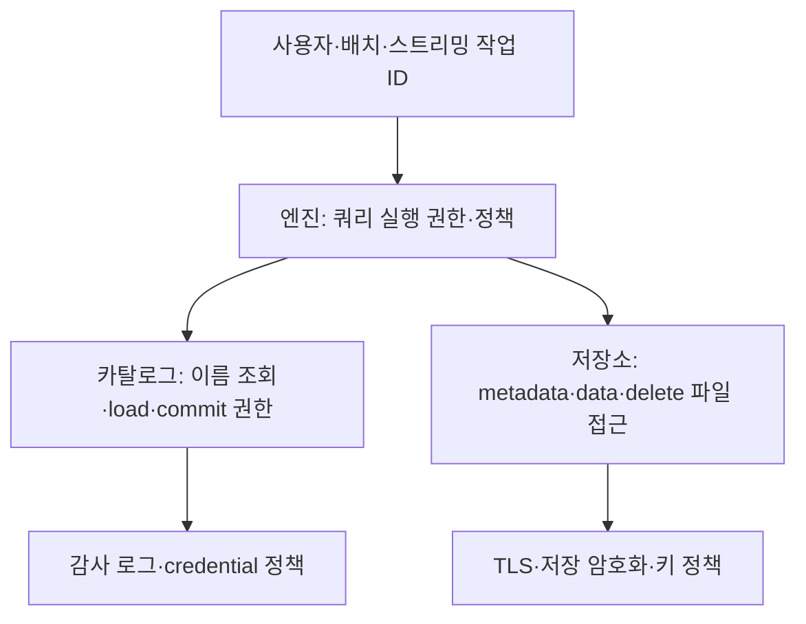

# 11. 스트리밍·보안·운영 설계

[이 책의 목차](README.md) · [이전 장](10-performance-and-maintenance.md)

작은 정적 테이블을 이해했다면 이제 데이터가 계속 들어오고 프로그램이 실패하는 상황을 다룬다. 이번 장은 Kafka·Flink·Kubernetes 경험이 없어도 용어와 각 역할부터 읽을 수 있게 구성했다.

## 1. Batch와 streaming은 입력을 다루는 방식이다

**Batch, 배치**는 일정한 범위의 입력을 묶어서 처리하는 방식이다. 매일 자정에 전날 주문 파일을 읽는 작업이 예다. **Streaming, 스트리밍**은 계속 들어오는 입력을 처리하는 방식이다. 스트리밍 엔진이 작은 묶음으로 실행하는 **micro-batch** 방식도 있다.

Iceberg 파일과 커밋은 이러한 입력의 결과를 분석 테이블로 남긴다. 이벤트 하나마다 커밋하면 snapshot·manifest·작은 파일이 빠르게 늘 수 있다. 이벤트 여러 개를 묶으면 파일과 커밋 비용을 줄이지만 공개 지연이 늘어날 수 있다.



화살표는 데이터 처리 경로다. 메시지 시스템의 입력 offset과 Iceberg snapshot ID는 서로 다른 위치와 상태를 식별한다.

## 2. 지연에는 여러 시계가 있다

| 시각 | 주문 예시 | 의미 |
| --- | --- | --- |
| Event time | 사용자가 10:00:00에 주문 | 업무 사건의 발생 시각 |
| Ingestion time | 서버가 10:00:02에 이벤트 수신 | 입력 시스템의 수신 시각 |
| Processing time | 엔진이 10:00:05에 처리 | 실행 시각 |
| Commit time | 10:00:08에 snapshot 확정 | 테이블 공개 시각 |
| Query time | 10:00:10에 조회 | 독자가 확인한 시각 |

“실시간 8초”라고 말할 때 사건에서 커밋까지인지 수신에서 조회까지인지 밝혀야 한다. NTP 같은 시계 동기화가 어긋나면 다른 서버의 시각 차를 지연으로 잘못 계산할 수 있다.

늦게 도착하는 이벤트는 과거 날짜 파티션에 기록될 수 있다. 파티션 날짜만 보고 그 데이터가 완전히 끝났다고 판정하지 않는다. **Watermark**는 스트리밍에서 늦은 사건을 처리하는 진행 기준으로 쓰이는 개념이며, 테이블 snapshot 보존 정책과 같은 것은 아니다.

## 3. Checkpoint와 exactly-once의 범위

**Checkpoint, 체크포인트**는 실패 후 이어 실행하기 위해 입력 위치·처리 상태 등을 저장한 복구 지점이다. 엔진의 체크포인트와 테이블의 커밋을 올바르게 연결해야 한다.

```text
입력 offset 100~109 읽기
새 파일 쓰기
Iceberg commit 성공
checkpoint 결과 저장 전 프로세스 실패
복구 뒤 100~109를 다시 처리할 가능성
```

이 문제를 다루는 sink 구현은 batch/epoch/checkpoint 식별자와 commit 상태를 연결한다. **Exactly-once**는 약속한 처리 경로에서 효과가 중복되지 않도록 하는 보장이다. 엔진·source·sink·checkpoint 저장소·설정·복구 방식이 함께 그 보장 범위를 결정한다.

입력에 원래 중복된 이벤트가 두 개 들어 있으면 exactly-once 처리가 두 이벤트를 각각 한 번 반영할 수 있다. “엔진이 exactly-once”와 “업무 주문이 중복 없음”은 다른 주장이다. 삭제한 checkpoint로 새 작업을 시작하거나 임의로 offset을 되돌리면 기존 보장을 유지하는지도 확인해야 한다.

## 4. CDC는 원천 변경을 이벤트로 전달한다

**CDC(Change Data Capture)**는 원천 데이터베이스의 삽입·수정·삭제를 변화 이벤트로 전달하는 방식이다. **Kafka**는 이벤트를 주제(topic)에 저장·전달하는 메시지 시스템의 예이고, **Flink**는 상태 있는 스트리밍 처리 엔진의 예다. Iceberg는 최종 테이블 상태를 관리한다.

원천 DB의 변경이 다음과 같다고 하자.

| 원천 순서 | key | 작업 | 금액 |
| --- | --- | --- | --- |
| 1 | 101 | insert | 10000 |
| 2 | 101 | update | 12000 |
| 3 | 101 | delete | 없음 |

모든 이벤트를 append하면 3개의 변경 기록을 담는 이벤트 테이블을 만들 수 있다. 최신 상태 테이블에서는 마지막 delete 때문에 101이 없어야 한다. **Upsert**는 key가 있으면 수정하고 없으면 삽입하는 동작이다. 어떤 테이블 의미를 만들지 먼저 정한다.

같은 key의 순서가 뒤바뀌어 delete 뒤 update가 적용되면 행이 잘못 부활할 수 있다. 원천 순서 번호·로그 위치·이벤트 ID·중복·재처리·초기 snapshot과 실시간 전환을 설계한다. Iceberg의 commit 순서는 원천 DB의 변경 순서를 자동 대신하지 않는다.

## 5. Equality delete가 스트리밍에 쓰이는 이유

엔진이 `order_id=101`을 삭제할 때 데이터 파일에서 그 행을 먼저 찾지 않고 key로 삭제 정보를 기록하는 방식이 유리한 입력 경로가 있다. 이것이 v2/v3 equality delete의 중요한 사용 이유다.

쓰기는 가벼워질 수 있지만 reader는 어떤 파일의 어떤 행에 key가 맞는지 적용해야 한다. 그래서 많은 equality deletes가 쌓이면 읽기 비용이 커지고 정리·변환이 필요할 수 있다. 1.12.0의 equality-to-DV 변환은 [05~07장](07-latest-and-compatibility.md)과 [10장](10-performance-and-maintenance.md)으로 연결한다.

Flink upsert는 connector 버전·포맷·primary key·partition field와 equality field의 요구를 공식 문서에서 확인한다. **Primary key 선언이 Iceberg 저장소에서 모든 동시 writer의 중복을 자동 차단하는 제약이라는 뜻은 아니다.** 여러 writer를 사용할 때 업무 key의 순서·소유권·충돌 규칙을 별도로 마련한다.

## 6. Incremental append read는 전체 변경 로그가 아니다

**Incremental read, 증분 읽기**는 이전 위치 이후의 새 데이터를 읽는 것이다. Iceberg의 일부 증분 스캔과 Spark streaming read는 append snapshot 중심으로 동작하며 overwrite·delete snapshot에는 제한이나 별도 옵션이 있다.

```text
S1: 101 금액 10000
S2: 102 append
S3: 101을 12000으로 update
S4: 102 delete

append만 읽는 방식이 S3/S4의 이전 값·새 값·삭제 이벤트를
완전한 CDC 로그로 출력한다고 기대하면 안 됨
```

Overwrite/delete snapshot을 건너뛰는 옵션은 모든 최신 변경을 반영하는 옵션과 같은 말이 아니다. 오래 멈춘 streaming reader가 필요로 하는 snapshot이 만료되면 복구 시작점이 사라질 수 있다. sink 보존·reader 지연·checkpoint 수명을 함께 설계한다.

전체 변경 기록이 필요하면 별도의 원천 CDC 로그, 변경 이벤트 테이블, 지원되는 changelog/lineage 기능의 정확한 의미를 평가한다. Row lineage가 모든 before/after 값과 원천 트랜잭션을 자동 보관하는 것은 아니다.

## 7. 권한은 세 층에서 확인한다

**Authentication, 인증**은 “누구인가”를 확인하고, **authorization, 인가**는 “어떤 작업을 허용하는가”를 결정한다. **Encryption, 암호화**는 정보를 키를 가진 주체가 해석할 수 있도록 보호한다.



카탈로그에서 권한을 차단해도 사용자가 저장소의 모든 파일을 직접 읽을 수 있으면 보호가 우회될 수 있다. 반대로 저장소의 파일 권한만 넓게 주면 table-level policy와 맞지 않을 수 있다. 필요 최소 권한과 credential vending 같은 구성을 함께 확인한다.

행·열 수준 권한은 어떤 엔진이나 카탈로그 제품이 구현하는지 확인한다. Iceberg table format만 선택했다고 모든 독립 reader에 동일한 row-level policy가 자동 적용된다고 가정하지 않는다.

## 8. 메타데이터도 민감할 수 있다

컬럼 이름·파일 경로·partition 값·컬럼 최소/최대 통계에 개인정보나 조직 정보가 드러날 수 있다. 주문 테이블의 금액·이메일·장치 ID 통계가 누구에게 공개되는지 확인한다.

필요하면 컬럼별 metrics 수집 설정을 조정한다. 통계를 줄이면 pruning 성능이 달라질 수 있어 보안과 성능을 함께 평가한다. 민감정보는 파일 이름이나 namespace에 직접 넣지 않는 것이 관리에 유리하다.

저장 암호화와 TLS는 접근 통제·감사를 대신하지 않는다. 정상 권한을 가진 엔진은 복호화한 결과를 볼 수 있다. v3 encryption 관련 metadata 확장도 포맷·라이브러리·키 관리 서비스·엔진 구현을 구별해 확인한다.

## 9. DELETE와 개인정보 물리 제거

```text
SQL DELETE 성공
  → 현재 snapshot의 조회에서 행 제외
  → 과거 snapshot에는 행이 남을 수 있음
  → MOR이면 현재 data file 바이트에도 남을 수 있음
  → 객체 버전·백업·복제·캐시에도 별도 사본이 있을 수 있음
```

물리 제거가 요구되면 파일 재작성, 과거 참조의 보존 조정, 지원되는 만료·파일 정리, 객체 버전·백업·외부 복제 정책까지 연결한다. 각 조직의 보존·감사·개인정보 요구는 실제 적용 규정을 별도로 검토한다. 이 책은 법적 준수 판정을 제공하는 문서가 아니다.

**Tombstone**은 삭제 사실을 표시하는 기록을 뜻한다. 삭제 표시를 남기는 것과 이전 값의 바이트를 모든 보관 위치에서 제거하는 것은 다르다. 검증에는 쿼리 결과뿐 아니라 관련 파일과 보존 사본의 처리 증거가 필요하다.

## 10. 장애를 계층별로 진단한다

| 증상 | 우선 확인 | 성급하게 하기 쉬운 실수 |
| --- | --- | --- |
| Table not found | catalog·namespace·table·branch·권한 | 같은 이름으로 새 table 생성 |
| 403 / access denied | 파일 credential 범위·만료·FileIO | 버킷 전체 공개 |
| File not found | 현재·과거 참조·수동 삭제·lifecycle | 남은 metadata까지 직접 삭제 |
| Commit conflict | 동시 writer·rewrite·격리·재시도 | 이전 상태 강제 덮어쓰기 |
| Commit timeout | 성공 여부 상태 확인 | 새 파일 즉시 삭제·무조건 전체 재입력 |
| 삭제 행이 다시 보임 | engine delete 지원·format·snapshot | Parquet만 직접 읽어 정상 판정 |
| 계획이 느림 | manifests·files·catalog·driver | 모든 데이터 파일 무조건 rewrite |
| Streaming 복구 실패 | checkpoint·source offset·snapshot 보존 | checkpoint 삭제 후 재시작 |

진단 로그에는 table UUID, snapshot ID, operation, engine/catalog version, 시작·종료 시각, commit 결과, 입력 범위를 남긴다. credential은 제외한다. 증거를 확보한 뒤 가장 작은 복구 조치를 선택한다.

## 11. Kubernetes는 테이블 계약을 대신하지 않는다

**Kubernetes**는 여러 서버에서 프로그램을 실행하고 원하는 운영 상태를 유지하는 시스템이다. Spark/Flink·카탈로그를 컨테이너로 실행할 수 있지만, pod 재시작 자체가 입력 중복·커밋 결과 불확실·잘못된 파일 삭제를 해결하지 않는다.

**Pod**는 컨테이너 실행 단위, **PVC(PersistentVolumeClaim)**는 지속 저장 공간을 요청하는 Kubernetes 객체다. 스트리밍 checkpoint를 pod의 임시 디스크에 두면 재생성 시 잃을 수 있다. 어떤 데이터가 어디에 지속되는지 먼저 표시한다.

## 12. NetAI·센서·연구 데이터에 적용한다면

분당 장치 측정값을 모은다고 가정한다. 다음은 실제 연구실의 현행 구성이 아니라 학습용 설계 예시다.

| 계층 | 담는 내용 | 중요한 정책 |
| --- | --- | --- |
| Bronze | 원천 이벤트·수신 정보 | 원본 보존, 이벤트 ID·source 위치 |
| Silver | 단위·시간·중복을 정리한 값 | schema 검증, late event·null 정책 |
| Gold | 실험·대시보드용 집계 | 재현 snapshot·코드·집계 구간 기록 |

**Bronze/Silver/Gold**는 원본→정제→활용을 나누는 흔한 명명 방식이지 Iceberg가 강제하는 포맷 구조는 아니다. 세 테이블을 업데이트할 때 자동으로 하나의 멀티테이블 트랜잭션이 된다고 가정하지 않는다. 작업 run ID와 입력·출력 snapshot을 기록하면 부분 실패를 추적하기 쉽다.

날짜·장치 종류 등의 partition 후보를 실제 분포와 쿼리에 맞춰 평가한다. 측정 단위 변경은 타입만 같아도 의미가 달라지므로 단위·schema 계약·변환 코드를 버전 관리한다. 학습 데이터셋은 snapshot ID와 보존 기간을 함께 고정한다.

## 13. 확인 질문과 해설

**질문.** Exactly-once sink이면 원천의 중복 주문 두 개를 하나로 합쳐 주는가?

**해설.** 아니다. 입력 처리 효과의 보장 범위와 업무 중복 제거는 다르다.

**질문.** append streaming reader가 UPDATE와 DELETE를 완전한 변경 이벤트로 읽는가?

**해설.** 일반화할 수 없다. 지원되는 snapshot 종류와 changelog 기능을 별도 확인한다.

**질문.** 개인정보 DELETE 뒤 time travel에서 이전 값을 읽을 수 있다. DELETE가 실패했는가?

**해설.** 현재 논리 삭제와 과거 보존은 별개다. 요구가 물리 제거라면 전체 수명주기 정책을 연결해야 한다.

## 근거와 더 읽기

공식 [Spark Structured Streaming](https://iceberg.apache.org/docs/latest/spark-structured-streaming/), [Flink writes](https://iceberg.apache.org/docs/latest/flink-writes/), [Flink queries](https://iceberg.apache.org/docs/latest/flink-queries/), [REST catalog spec](https://iceberg.apache.org/rest-catalog-spec/), [Configuration](https://iceberg.apache.org/docs/latest/configuration/)을 참고한다. 이 장의 시스템 조합과 복구 예시는 교육용이며 특정 운영 환경의 현재 구성을 주장하지 않는다.

[다음: 12. 문제·해설·용어사전](12-exercises-and-glossary.md)
