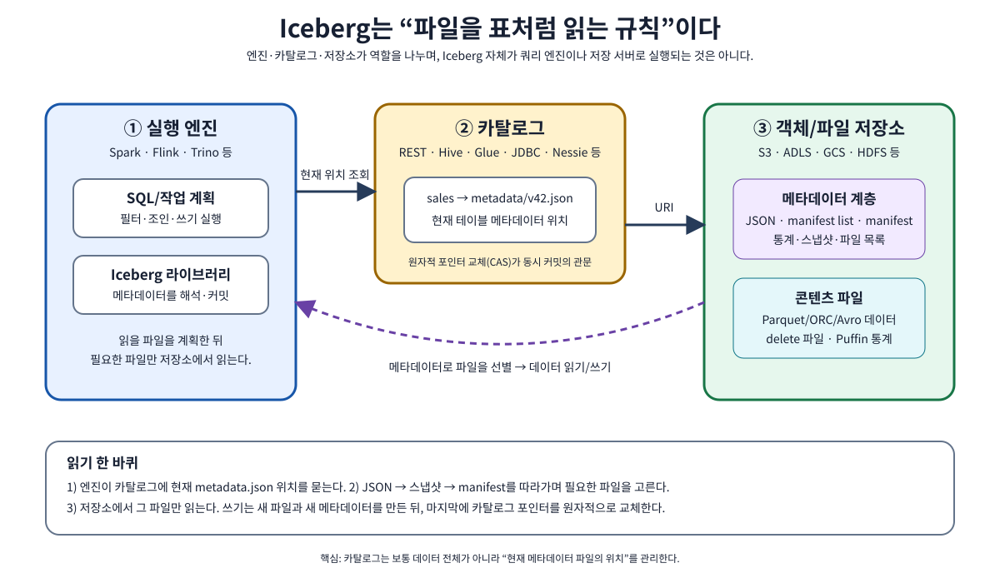
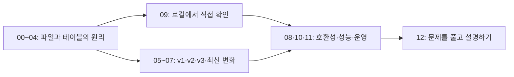

# 처음부터 배우는 Apache Iceberg

**파일 몇 개가 어떻게 신뢰할 수 있는 분석 테이블이 되는가?** 이 책은 그 질문에서 시작한다. SQL, Spark, 객체 저장소를 처음 보는 독자도 용어의 뜻을 익힌 뒤 파일 하나와 행 하나의 변화를 추적하도록 구성했다. 데이터베이스 경험이 있더라도 00~02장을 읽으면 Iceberg의 보장과 엔진의 역할을 구분하기 쉽다.

**자료 확인 기준일: 2026-10-08.** Java 구현의 최신 공식 릴리스와 테이블 포맷 버전은 서로 다른 번호다. 이 책은 v1·v2·v3를 설명하고, 최신 명세의 v4와 최신 라이브러리의 변경도 별도 장에서 다룬다. 명세에 적힌 기능이 모든 제품에서 동작한다는 뜻은 아니다. [버전과 호환성](07-latest-and-compatibility.md)에서 확인 방법까지 배운다.

이 책에서 만드는 예시는 **주문 테이블**이다. 개념 장은 주문 번호·주문 시각·지역·정수 금액을 사용하고, 09장의 실행 실습은 별도의 작은 데이터셋에서 `id`·고객·상태·소수 금액·주문 시각을 사용한다. 실습 표의 값을 해당 장의 기준으로 따라간다. 숫자는 설명을 위해 만든 것이며 연구실의 실제 고객 데이터가 아니다. 그림의 파일 이름과 스냅샷 번호도 따로 표시하지 않으면 교육용이다.

## 이 책으로 할 수 있게 되는 일

- Parquet 파일, Iceberg 테이블, 카탈로그, Spark의 역할을 구별한다.
- 쿼리 한 번이 어떤 메타데이터와 데이터 파일을 읽는지 설명한다.
- 스냅샷과 커밋을 이용해 쓰기의 성공·충돌·불확실한 결과를 구분한다.
- 컬럼 이름과 파티션을 바꿔도 기존 파일을 읽을 수 있는 이유를 설명한다.
- v2의 삭제 파일과 v3의 삭제 벡터를 작은 행 예제로 계산한다.
- 포맷 업그레이드 전에 모든 읽기·쓰기 엔진의 기능을 확인한다.
- 로컬 실습을 실행하고 결과를 검산하며, 운영에서 파일을 정리할 때의 조건을 이해한다.

## 한 권의 목차

| 장 | 출발 질문 | 읽고 나서 설명할 내용 |
| --- | --- | --- |
| [00. 파일에서 테이블까지](00-first-principles.md) | CSV와 Parquet만 있으면 왜 부족할까? | 행·열·스키마, 파일 포맷, 테이블 포맷, lakehouse |
| [01. Iceberg의 내부 지도](01-metadata-and-files.md) | 지금 테이블에 속한 파일은 누가 알려 줄까? | 카탈로그, metadata JSON, snapshot, manifest list, manifest, Puffin |
| [02. 읽기·쓰기·동시성](02-reads-writes-and-commits.md) | 새 파일이 언제부터 다른 사람에게 보일까? | pruning, 원자적 커밋, 낙관적 동시성, 재시도, 결과 불확실성 |
| [03. 스키마와 파티션의 진화](03-schema-and-partition-evolution.md) | 이름과 저장 배치를 바꾸면 과거 데이터는 어떻게 읽을까? | field ID, partition spec ID, hidden partitioning, 정렬 |
| [04. 스냅샷·시간 여행·브랜치](04-snapshots-and-history.md) | 어제의 테이블을 오늘 다시 볼 수 있을까? | snapshot ID, sequence number, time travel, rollback, branch, tag |
| [05. 포맷 v1과 v2](05-format-v1-v2.md) | 파일을 제자리에서 고치지 않고 한 행을 삭제할 수 있을까? | COW·MOR, position/equality delete, 삭제 적용 범위 |
| [06. 포맷 v3](06-format-v3.md) | 삭제 벡터와 행 계보가 무엇을 바꿀까? | Puffin DV, row lineage, defaults, variant, ns 시각, 공간 타입 |
| [07. 최신 변화와 호환성](07-latest-and-compatibility.md) | 최신 명세와 실제 지원을 어떻게 구별할까? | 최신 릴리스, v4, 엔진별 확인, 단계적 업그레이드 |
| [08. 카탈로그와 여러 엔진](08-catalogs-and-engines.md) | Spark와 Trino가 같은 테이블을 어떻게 찾을까? | Hadoop·Hive·REST·Glue·JDBC·Nessie, 인증, 파일 I/O |
| [09. 로컬 실습](09-local-lab.md) | 내 컴퓨터에서 변화 과정을 볼 수 있을까? | 생성, 입력, 수정, 삭제, MERGE, metadata tables, evolution, v3 |
| [10. 성능과 유지보수](10-performance-and-maintenance.md) | 파일이 늘어나면 무엇부터 측정할까? | 작은 파일, compaction, manifest 정리, 보존, orphan, 비용 |
| [11. 스트리밍·보안·운영 설계](11-streaming-security-and-operations.md) | 계속 들어오는 데이터와 실패를 어떻게 다룰까? | CDC, 체크포인트, 중복, 권한, 개인정보 삭제, 장애 대응 |
| [12. 문제·해설·용어사전](12-exercises-and-glossary.md) | 이해했다는 것을 어떻게 확인할까? | 계산 문제, 반례, 설계 과제, 공식 자료, 용어 찾기 |

## 처음 읽는 사람의 경로

**첫 독서:** 00 → 01 → 02 → 03 → 04. 그림의 화살표를 손으로 따라가고 각 장 끝의 질문에 답한다. 모르는 영어는 바로 옆의 설명 또는 [용어사전](12-exercises-and-glossary.md)에서 확인한다.

**직접 확인:** 09장의 로컬 실습을 실행한다. 설치가 어려운 환경에서는 입력과 예상 출력 표를 먼저 비교해도 된다. 파일이 존재하는 것과 커밋에 포함되는 것이 다르다는 사실을 특히 관찰한다.

**버전 이해:** 05 → 06 → 07. 포맷 v2/v3가 라이브러리 2.x/3.x라는 뜻이라고 해석하지 않는다. 먼저 v2 삭제 방식의 수고를 이해하면 v3의 목적이 자연스럽게 연결된다.

**운영 연결:** 08 → 10 → 11 → 12. 연구실 운영에 대입할 때는 엔진·카탈로그·저장소·보존 조건을 실제 환경의 값으로 바꾼다.

그림은 정보를 찾아가는 순서나 변화 관계를 나타낸다. 화살표가 모두 네트워크 요청은 아니며, 그림 아래 설명에서 의미를 구별한다. SVG 그림은 [원본 자산](assets/README.md)으로 크게 열 수 있다. 코드 상자의 `sql`은 SQL이며, 특정 엔진이 필요하면 실행 환경을 함께 표시한다. `text` 상자는 개념 예시 또는 출력이라서 셸에 붙여 넣지 않는다. 실제로 실행한 검사와 한계는 [검증 범위](VALIDATION.md)에 기록했다.

## 기존 교재와 이어 읽기

기본 저장 개념은 [데이터 시스템 교재](../../kubernetes/storage/data-systems-foundations/README.md), Parquet·Arrow와의 연결은 [분석 데이터 형식 장](../../kubernetes/storage/data-systems-foundations/06-parquet-arrow-iceberg.md)을 참고한다. 논문을 통해 설계 근거를 더 공부하려면 [Lakehouse 심화 경로](../../kubernetes/storage/lakehouse/README.md), 관측 데이터 적용은 [Iceberg 파이프라인](../../kubernetes/observability/data-pipelines/05-iceberg.md)로 이동한다.

[통합 learning 목차로 돌아가기](../README.md) · [첫 장 시작하기](00-first-principles.md)
