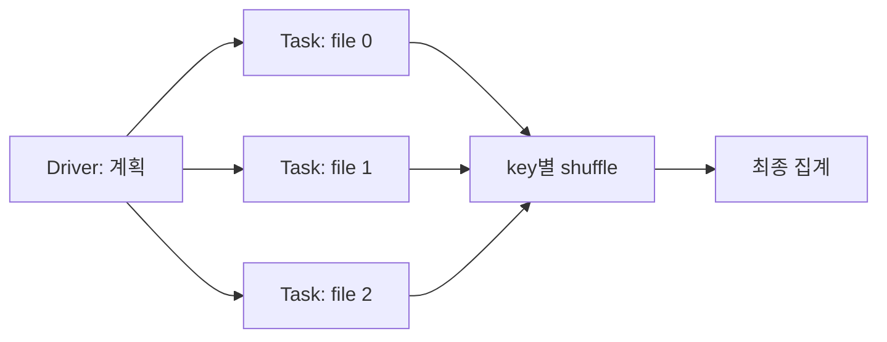
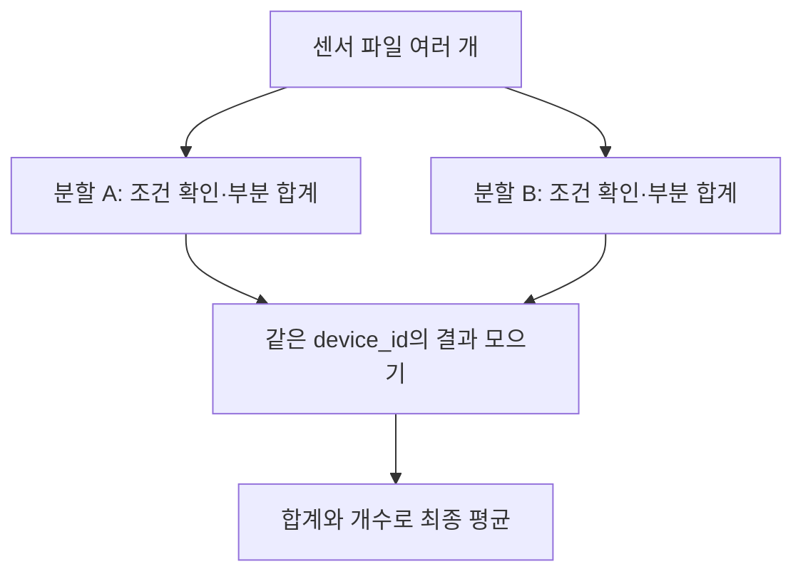

# 00. 데이터에서 Spark까지

[이 책의 목차](README.md)

이 장에서는 분산 시스템 경험을 가정하지 않는다. 작은 표 하나를 읽고 평균을 구한 뒤, 그 작업을 여러 서버에 나누면 무엇이 추가되는지 생각한다.

## 1. 먼저 표와 계산을 이해한다

온도 측정값을 기록한다고 하자. **행(row)**은 측정 사건 하나, **열(column)**은 같은 의미를 가진 값의 자리다. `device_id`는 장치 번호, `temperature`는 온도다. 온도 단위는 이 예시에서 섭씨로 정한다.

| event_id | device_id | temperature |
| --- | --- | --- |
| 1 | S1 | 20.0 |
| 2 | S1 | 22.0 |
| 3 | S2 | 19.0 |
| 4 | S2 | 99.0 |
| 5 | S3 | 23.0 |
| 6 | S3 | NULL |

**NULL**은 값이 없거나 알 수 없음을 나타낸다. 0℃와 NULL은 다르다. NULL을 0으로 바꾸면 평균이 달라질 수 있다.

이 장의 교육용 품질 규칙은 “온도는 -40℃부터 60℃ 사이여야 한다”다. 실제 장치가 측정할 수 있는 범위는 데이터 계약으로 따로 정한다. 이 규칙을 적용하면 사건 4와 6을 제외하고 네 행이 남는다.

```sql
SELECT device_id, AVG(temperature) AS average_temperature
FROM measurements
WHERE temperature BETWEEN -40 AND 60
GROUP BY device_id;
```

**SQL(Structured Query Language)**은 테이블에 원하는 계산을 표현하는 언어다. `WHERE`는 행 조건, `GROUP BY`는 같은 장치끼리 묶기, `AVG`는 평균이다. 위 요청의 답은 S1 21℃, S2 19℃, S3 23℃다.

여기까지는 어떤 실행 프로그램을 사용할지와 별개의 계산 의미다. 잘못된 품질 규칙을 Spark로 빠르게 실행해도 결과의 연구 의미가 올바르게 바뀌지는 않는다.

## 2. 한 컴퓨터에서 가능한 일

**프로그램(program)**은 실행할 명령과 데이터의 표현이다. **프로세스(process)**는 운영체제에서 실제 실행 중인 프로그램이다. Python 프로그램이 파일을 읽고 값을 더해 평균을 구할 수 있다.

입력이 작다면 한 프로세스가 순서대로 읽고 계산하는 방식으로 충분할 수 있다. 입력 크기가 커지거나 처리 시간·동시 작업·복구 요구가 늘면 여러 CPU와 서버에 작업을 나누는 방식을 검토한다.

**CPU**는 명령을 실행하는 장치이고, **RAM**은 실행 중 값을 보관하는 메모리다. 저장장치나 객체 저장소에는 입력 파일을 보관한다. 파일이 RAM보다 크다고 반드시 전체 파일을 한 번에 RAM에 올려야 하는 것은 아니다. 읽기·처리를 나누고 중간 결과를 저장할 수 있다.

## 3. 분산 처리는 계산과 데이터 이동을 함께 설계한다

### 한 행이 결과가 되기까지 소유권이 바뀐다

센서 행 9개가 파일 세 개에 세 행씩 있다고 하자. Driver는 파일 바이트를 직접 모두 읽는 주체가 아니라, 파일 목록과 통계를 바탕으로 세 입력 partition과 task를 계획한다. Executor의 task가 각 partition을 읽고 계산한다.

| 시점 | 주체 | 바꾸는 것 |
| --- | --- | --- |
| 계획 | Driver | SQL을 scan·filter·aggregate 실행 계획으로 변환 |
| 입력 읽기 | Executor task | 파일 split의 바이트를 typed row로 해석 |
| 부분 계산 | Executor task | 세 행을 key별 `(sum,count)`로 축약 |
| 데이터 이동 | Shuffle writer/reader | 같은 key의 부분 상태를 같은 downstream partition으로 이동 |
| 결과 반환 | Executor와 Driver | 최종 작은 결과를 driver/client로 전달 |

이 구분이 필요한 이유는 실패 위치마다 처방이 다르기 때문이다. 파일 읽기 권한 오류는 executor에서 날 수 있고, 큰 결과를 `collect`한 OOM은 driver에서 날 수 있다. 같은 key가 몰린 문제는 shuffle 뒤 특정 task에서 나타난다.



**반례.** 입력이 9행이라고 task도 9개인 것은 아니다. 반대로 파일이 세 개라고 task가 반드시 세 개인 것도 아니다. 파일 split, 작은 파일 묶기, source 구현, 설정에 따라 입력 partition 수가 달라진다.

**분산 처리(distributed processing)**는 여러 실행 주체가 데이터를 나누어 처리하고 결과를 결합하는 것이다. 여러 서버의 묶음을 **클러스터(cluster)**라고 한다.

S1의 두 행이 서로 다른 서버에 있으면 각각 부분 합계를 만들 수 있다.

```text
서버 A: S1의 20.0 → 합계 20.0, 개수 1
서버 B: S1의 22.0 → 합계 22.0, 개수 1
결합: (20.0 + 22.0) / (1 + 1) = 21.0
```

평균을 결합할 때는 부분 평균의 평균을 무조건 구하면 안 된다. 표본 수가 다르면 틀린다. A가 한 값 20, B가 세 값 22라면 정확한 평균은 `(20+66)/4=21.5`이고, 부분 평균의 평균 `(20+22)/2=21`과 다르다.

이 계산에는 누구에게 데이터를 나눌지, 같은 장치의 결과를 어디로 모을지, 실패한 작업을 어떻게 다시 실행할지라는 문제가 추가된다. Spark는 이러한 실행을 계획·조정하는 엔진이다.



화살표는 데이터 이동과 계산 의존 관계다. 실제 Spark에서는 partition·task·stage로 구체화하며, 일부 계산은 한 task 안에서 이어 수행할 수 있다.

## 4. Spark의 역할을 주변 기술과 나눈다

| 구성요소 | 담당하는 일 | 이 예시에서의 역할 |
| --- | --- | --- |
| Kafka 등 입력 시스템 | 사건을 저장·전달 | 새 센서 사건을 전달 |
| S3·HDFS·로컬 파일시스템 | 파일 바이트 보관 | 원본·결과 파일 저장 |
| Parquet | 파일의 컬럼 표현 | 온도·장치 번호를 컬럼으로 저장 |
| Iceberg | 테이블의 파일·스키마·스냅샷 관리 | 현재 테이블과 과거 상태 식별 |
| Spark | 계산 계획·분산 실행·읽기·쓰기 | 정제·집계·join·파일 작성 |
| Kubernetes 등 자원 관리자 | 실행 자원 배정 | driver와 executor를 실행할 자원 제공 |

Spark는 저장소의 데이터 바이트를 읽는다. Iceberg를 사용할 때는 현재 스냅샷의 파일과 삭제 정보를 이해하는 integration을 통해 읽고 쓴다. Spark를 설치했다고 Kafka·Iceberg 카탈로그·객체 저장소가 자동으로 함께 설치되는 것은 아니다.

## 5. Python·PySpark·Scala·JVM

**Python**은 프로그램을 작성하는 언어다. **PySpark**는 Python에서 Spark API를 사용하는 인터페이스다. **API(Application Programming Interface)**는 프로그램 사이에 기능을 요청하는 약속이다.

Spark의 주요 실행 엔진은 **JVM(Java Virtual Machine)**에서 동작한다. JVM은 Java·Scala 등으로 작성한 코드를 실행하는 환경이다. **Scala**는 Spark에서 사용하는 언어의 하나다.

Python에서 `filter`나 `groupBy`를 작성해도 모든 행을 Python 함수가 처리하는 것은 아니다. 내장 DataFrame 연산은 Spark의 실행 계획으로 바뀌어 엔진에서 수행된다. Python 사용자 함수가 필요한 경우에는 Python worker 등 별도의 실행 경로를 사용한다. 이 구분은 [06장](06-memory-and-performance.md)에서 성능과 메모리로 연결한다.

## 6. Batch와 streaming

**Batch, 배치**는 처리할 입력의 범위를 정해 실행하는 것이다. 어제 수집한 파일들을 정제하고 결과를 저장하는 작업이 예다.

**Streaming, 스트리밍**은 계속 들어오는 입력에 대한 계산을 표현한다. Spark의 **Structured Streaming**은 SQL·DataFrame 구조를 바탕으로 스트리밍 계산을 실행한다. 기본적인 micro-batch 방식은 새 입력을 작은 묶음으로 반복 처리한다.

```text
Batch:
어제 파일 100개 → 처리 → 결과 저장 → 종료

Micro-batch streaming:
새 입력 묶음 1 → 처리·커밋
새 입력 묶음 2 → 처리·커밋
새 입력 묶음 3 → 처리·커밋 → 계속 진행
```

“Streaming”이라고 사건마다 네트워크 지연 없이 즉시 결과를 내는 것은 아니다. 입력·트리거·계산·커밋·조회 시각이 다르며 [08장](08-structured-streaming.md)에서 구분한다.

## 7. Spark가 빠를 수 있는 이유와 느려질 수 있는 이유

여러 task가 입력을 병렬로 처리하고 엔진이 필요한 컬럼·행을 골라 읽으며 실행 계획을 최적화할 수 있다. 반복 사용하는 데이터를 cache하면 읽기·계산을 재사용할 여지도 있다.

그러나 작업 시작·스케줄링·파일 열기·직렬화·네트워크 이동·shuffle 비용도 있다. 데이터가 작거나 한 key로 몰리면 많은 서버를 써도 그 비용이 이득을 상쇄할 수 있다. 속도는 입력과 계산·배치·자원·설정의 함수다.

## 8. 확인 질문과 해설

**질문.** 두 서버의 평균을 더해서 2로 나누면 전체 평균인가?

**해설.** 두 서버의 유효 행 수가 같을 때 등의 조건이 필요하다. 일반적으로 합계와 유효 개수를 결합한다.

**질문.** PySpark 코드이므로 모든 값은 Python에서 계산되는가?

**해설.** 아니다. 내장 SQL/DataFrame 연산과 Python 사용자 함수는 실행 경로가 다르다.

**질문.** Spark를 사용하면 데이터 품질 규칙이 자동 정해지는가?

**해설.** 아니다. 온도 범위·중복·단위·시각의 의미는 데이터 계약과 프로그램으로 정한다.

## 공식 자료

[Spark 개요](https://spark.apache.org/docs/4.2.0/), [SQL·DataFrame 설명](https://spark.apache.org/docs/4.2.0/sql-programming-guide.html), [클러스터 실행 구조](https://spark.apache.org/docs/4.2.0/cluster-overview.html)를 참고한다. 작은 표와 계산 예시는 이 책에서 만든 자료다.

[다음: 01. Driver와 executor](01-driver-executor.md)
