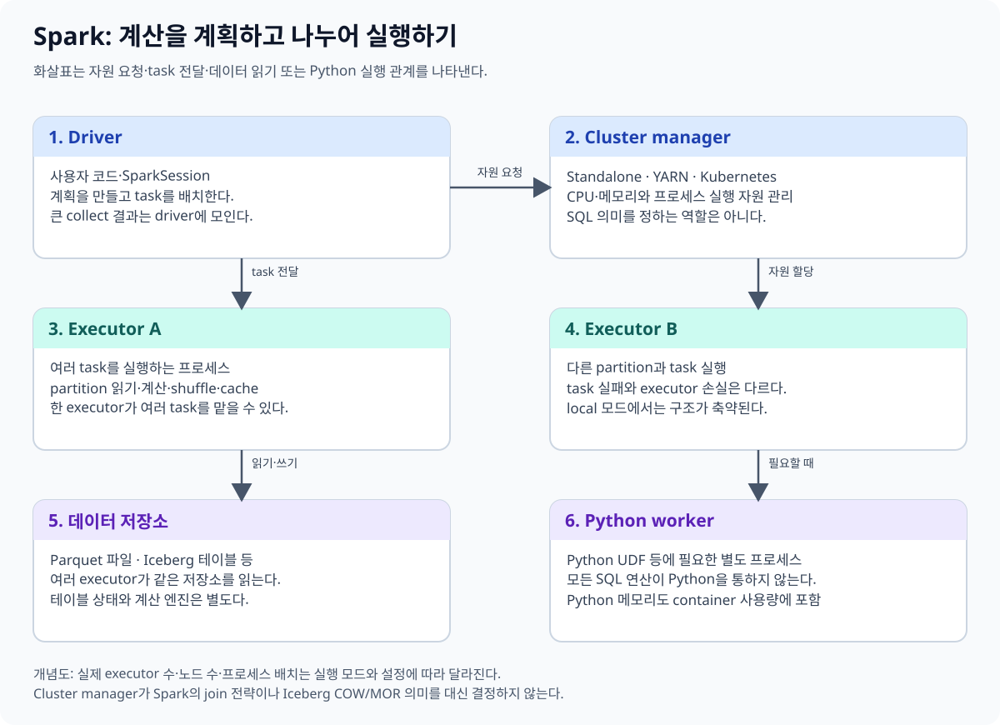
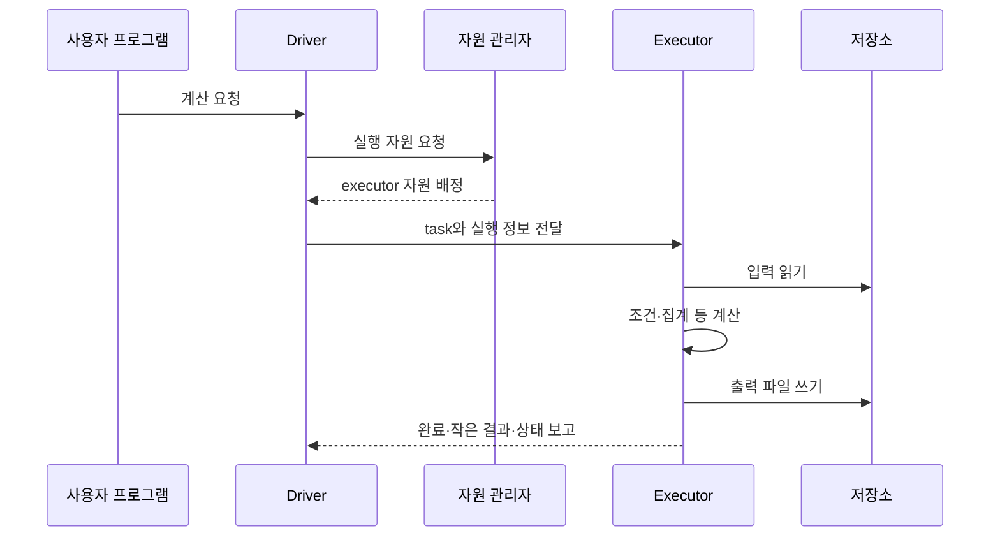
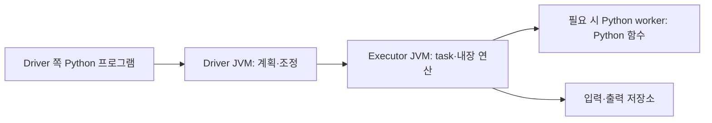

# 01. Driver와 executor

[이 책의 목차](README.md) · [이전 장](00-data-to-spark.md)

이 장의 목표는 코드가 작성된 위치, 계획이 만들어지는 위치, 행을 계산하는 위치, 파일을 저장하는 위치를 구분하는 것이다. 먼저 일반적인 classic Spark application을 배운다. Spark Connect의 분리 구조는 [10장](10-deployment-and-connect.md)에서 다룬다.

## 1. Application은 한 번의 Spark 실행 주체다

**Application, 애플리케이션**은 driver와 그 driver를 위해 실행되는 executor들로 구성되는 Spark 작업 프로그램이다. 한 클러스터에 여러 application이 있을 수 있다. 같은 application 안에서도 여러 query와 job을 실행할 수 있다.

**Driver**는 사용자 프로그램의 흐름을 실행하고 계획과 작업을 조정한다. 입력을 어떻게 읽고 어떤 계산을 수행할지 계획하고, task를 배정하고, 결과와 실패 상태를 관리한다.

**Executor**는 application에 배정된 실행 프로세스다. task를 수행하고 필요한 cache·shuffle 데이터를 관리한다. 여러 서버에 executor가 배치될 수 있고, 한 서버에 여러 executor를 둘 수도 있다.

**Worker node**는 executor 등을 실행하는 서버다. 물리 서버·가상 머신과 executor 프로세스는 같은 개념이 아니다. **Thread, 스레드**는 한 프로세스 안에서 실행되는 작업 흐름의 단위다.

## 2. Cluster manager는 자원을 배정한다

**Cluster manager, 자원 관리자**는 application에 실행 자원을 배정한다. Spark standalone, YARN, Kubernetes 등이 선택지다. SQL의 join 방식을 결정하는 optimizer와 자원 관리자는 다른 역할이다.

| 구성요소 | 주된 질문 |
| --- | --- |
| 사용자 프로그램 | 무엇을 계산할까? |
| Driver의 planner·scheduler | 계산을 어떤 계획과 task로 실행할까? |
| Cluster manager | 어느 실행 자원을 application에 배정할까? |
| Executor | 배정받은 task의 데이터를 어떻게 처리할까? |
| 저장소 | 입력·출력 바이트가 어디에 있는가? |

전체 application의 논리 흐름을 단순화한 그림이다. task마다 자원 관리자를 새로 호출하거나 모든 바이트가 driver를 통과하는 것은 아니다.

## 3. Driver가 모든 데이터를 읽는가

일반적인 분산 scan과 계산은 executor task가 수행한다. Driver가 입력을 전부 내려받아 나누어 주는 방식으로 생각하지 않는다. Executor는 네트워크나 파일시스템 경로로 저장소에 접근할 수 있어야 한다.

하지만 `collect()`는 결과 행을 driver 쪽으로 가져온다. 수억 행에 `collect()`를 실행하면 executor에서 계산이 성공했어도 driver 메모리가 부족할 수 있다. 결과를 파일이나 테이블로 저장하는 것과 전체 결과를 driver에 모으는 것은 다르다.

작은 출력 확인에는 `show()`나 적절한 `limit`을 활용하되, 제한된 출력이 원본 전체의 정확성을 증명하는 것은 아니다. 전체 품질 검사는 행 수·key별 집계·오류 건수 같은 작은 요약 결과로 표현할 수 있다.

## 4. Python 코드와 JVM의 관계

Classic PySpark에서는 Python 프로그램이 JVM의 Spark 실행 기능을 사용한다. **Py4J**는 Python과 JVM 사이의 연결에 사용되는 구성요소다. 사용자가 DataFrame 연산을 호출하면 Spark의 계획을 구성하고 action에서 실행을 요청한다.

Python 사용자 함수가 executor에서 실행되는 경우 Python worker 프로세스가 필요할 수 있다. JVM heap을 넉넉히 주었다고 Python 프로세스의 메모리 사용까지 같은 한도 안에서 자동 관리하는 것은 아니다.

한 프로세스처럼 보이는 notebook 화면 뒤에 여러 프로세스가 있을 수 있다. Spark Connect에서는 클라이언트가 server의 driver JVM을 직접 소유하거나 접근하지 않는다는 차이가 있다.

## 5. `local[2]`는 서버 두 대가 아니다

로컬 실습은 master를 `local[2]`로 설정한다. 이것은 한 컴퓨터에서 task 실행에 사용할 스레드 수를 지정하는 local 실행 모드다. 서로 다른 두 서버가 생기거나 독립 executor 서버 두 대의 장애·네트워크 환경이 재현되는 것은 아니다.

| 설정 | 이 실습에서의 뜻 |
| --- | --- |
| `local[1]` | 한 task 실행 스레드 |
| `local[2]` | 두 task 실행 스레드 |
| `local[*]` | 사용 가능한 코어 수를 바탕으로 local 스레드 사용 |

같은 머신의 CPU·RAM·디스크를 공유한다. `local[*]`가 항상 더 빠른 선택인 것은 아니며 다른 프로그램과 경쟁할 수 있다. 재현 실습에서는 두 스레드처럼 작은 고정값을 사용한다.

## 6. 실행 자원을 task 슬롯으로 계산한다

Executor 3개에 각각 4코어를 배정하고 task마다 1 CPU를 요구한다고 가정하자. 다른 제한이 없으면 동시에 실행할 수 있는 task는 최대 약 `3×4=12`개다. Task가 120개이면 여러 차례에 걸쳐 실행된다.

이 값은 CPU 사용률이나 전체 속도를 보장하지 않는다. I/O 대기·메모리·skew·task CPU 설정·동적 자원 배정·외부 서비스 제한에 따라 실제 실행이 달라진다. Executor 하나의 코어 수를 늘리는 것과 executor 수를 늘리는 것은 프로세스별 메모리·GC·장애 범위가 달라지는 선택이다.

**GC(Garbage Collection)**는 JVM이 더 이상 사용하지 않는 객체의 메모리를 회수하는 과정이다. 객체가 많거나 heap이 압박받으면 GC 시간도 성능에 영향을 줄 수 있다.

## 7. 실패하면 무엇을 다시 실행하는가

### 실패를 task 재시도와 application 재시작으로 나눈다

Stage 0에 P0·P1·P2 세 task가 있고 P1만 executor 종료로 실패했다고 하자. 필요한 shuffle output이 남아 있고 retry 한도 안이면 scheduler는 P1 task만 다른 executor에서 다시 실행할 수 있다. P0와 P2의 유효한 결과까지 업무 코드가 직접 다시 호출하는 것은 아니다.

그러나 P0의 shuffle 파일을 가진 executor가 나중에 사라져 그 output을 읽을 수 없다면 downstream task만 재시도해서는 복구되지 않는다. Scheduler는 잃어버린 shuffle output을 만드는 이전 stage task를 다시 실행할 수 있다. Lineage가 복구에 쓰인다는 말은 이런 의존 관계를 가리킨다.

| 사건 | 판단 주체 | 다시 할 수 있는 범위 |
| --- | --- | --- |
| Task 예외 | Driver의 scheduler | 해당 task attempt |
| Shuffle output 유실 | Driver의 scheduler | 필요한 이전 stage partition |
| Executor process 종료 | Cluster manager와 driver | 새 executor 배정, 잃은 task 재실행 |
| Driver 종료 | 배포 시스템 | application 자체 재시작 필요 |

Task attempt가 다시 실행될 수 있으므로 task 안에서 외부 API에 “결제 요청”을 직접 보내는 부수 효과는 위험하다. 첫 attempt가 API 호출 뒤 응답 전에 실패하면 두 번째 attempt가 같은 호출을 반복할 수 있다. Spark의 결과 계산 재시도와 외부 시스템의 멱등성은 별도 문제다.

**반례.** Executor를 하나 더 띄운다고 driver가 잃어버린 in-memory 상태가 복구되는 것은 아니다. Driver 고가용성, application 제출 재시작, streaming checkpoint는 서로 다른 계층의 복구 수단이다.

Task가 실패하면 엔진은 지원되는 재시도 규칙으로 task를 다시 실행할 수 있다. Executor가 사라지면 해당 executor에만 있던 cache나 shuffle 데이터를 다시 계산해야 할 수 있다.

재시도 가능한 계산이라는 이유만으로 외부 API 호출·메시지 전송·DB insert가 한 번만 수행되는 것은 아니다. Task 내부의 외부 부작용은 중복될 수 있다. 외부 시스템에는 멱등성·트랜잭션·커밋 경로를 마련한다.

**멱등성(idempotency)**은 동일한 작업을 반복해도 원하는 효과가 중복되지 않도록 하는 성질이다. 파일·테이블 sink의 commit 경로와 task 재시도는 함께 살펴야 한다.

## 8. 확인 질문과 해설

**질문.** Executor 네 개면 서버도 네 대인가?

**해설.** 아니다. 프로세스의 수와 서버의 수는 다르다. 배치 관계를 확인한다.

**질문.** `local[2]`에서 성공하면 네트워크가 끊기는 분산 클러스터에서도 안전한가?

**해설.** 로컬 실행은 그 장애 조건을 검증하지 않는다. 계산 의미를 확인한 뒤 실제 배포 조건에서 별도로 다룬다.

**질문.** Task 재시도가 있으니 외부 DB insert는 중복되지 않는가?

**해설.** 엔진 계산 재시도와 외부 시스템의 단 한 번 효과는 별개다.

## 공식 자료

[Cluster mode overview](https://spark.apache.org/docs/4.2.0/cluster-overview.html), [Submitting applications](https://spark.apache.org/docs/4.2.0/submitting-applications.html), [Spark Connect 개요](https://spark.apache.org/docs/4.2.0/spark-connect-overview.html)를 참고한다.

[다음: 02. DataFrame과 SQL](02-dataframes-sql.md)
