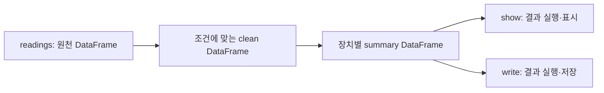

# 02. DataFrame과 SQL

[이 책의 목차](README.md) · [이전 장](01-driver-executor.md)

DataFrame은 데이터를 표처럼 표현하고 계산 계획을 구성하는 인터페이스다. Python의 작은 표가 전부 driver RAM에 들어 있는 객체와 동일한 것으로 이해하지 않는다.

## 1. Schema가 먼저다

**Schema, 스키마**는 컬럼의 이름·타입·nullable 여부를 정의한다. `event_id`는 long 정수, `device_id`는 string, `temperature`는 double, `event_time`은 timestamp처럼 정한다.

타입은 단순한 표의 장식이 아니다. 정수 20, 문자열 `"20"`, 소수 값 20.0은 변환·연산·비교 규칙이 다를 수 있다. 시간 문자열도 파싱 전에는 시간 타입이 아니다.

| 입력 | 의도한 타입 | 검토할 점 |
| --- | --- | --- |
| `"2026-10-01 00:00:00"` | timestamp | 포맷·timezone·파싱 실패 |
| `"20.0"` | double | 숫자 변환·비정상 문자열 |
| `null` | nullable double | 누락과 0의 구분 |
| `"0017"` | string 장치 번호 | 정수 변환으로 앞의 0을 잃어도 되는가? |

**Nullable**은 해당 필드가 NULL일 수 있는지 나타낸다. 외부 입력의 품질을 실제로 보장하는 모든 검사를 대신하는 것은 아니다. 범위·단위·key 중복·날짜 의미를 별도로 검사한다.

## 2. SparkSession은 계산의 진입점이다

`SparkSession`은 SQL·DataFrame·읽기·쓰기 기능을 사용하는 진입점이다. 실습 코드의 `spark`는 그 session을 가리키는 변수다. 다음은 읽기 위한 PySpark 코드 예시이며 전체 실행은 [11장](11-local-labs.md)을 따른다.

```text
from pyspark.sql import functions as F

clean = (
    readings
    .filter(F.col("temperature").between(-40, 60))
    .select("event_id", "device_id", "temperature")
)

summary = clean.groupBy("device_id").agg(
    F.avg("temperature").alias("average_temperature"),
    F.count("*").alias("valid_events")
)
summary.orderBy("device_id").show()
```

`F`는 functions 모듈에 붙인 짧은 변수명이고, Spark에 예약된 특별한 이름은 아니다. `col`은 컬럼을 표현한다. `alias`는 출력 컬럼 이름을 붙인다. `orderBy`는 결과 정렬을 요청한다.

## 3. DataFrame API와 SQL은 같은 계산을 표현할 수 있다

DataFrame을 session의 임시 view로 등록하면 SQL에서 이름으로 조회할 수 있다. **View, 뷰**는 쿼리에서 사용하는 논리적 이름과 계산 표현이다. 임시 view를 만들었다고 Parquet나 Iceberg에 영구 저장한 것은 아니다.

```text
readings.createOrReplaceTempView("measurements")
```

```sql
SELECT device_id,
       AVG(temperature) AS average_temperature,
       COUNT(*) AS valid_events
FROM measurements
WHERE temperature BETWEEN -40 AND 60
GROUP BY device_id
ORDER BY device_id;
```

앞 장의 여섯 행에 대한 답은 다음과 같다.

| device_id | average_temperature | valid_events |
| --- | --- | --- |
| S1 | 21.0 | 2 |
| S2 | 19.0 | 1 |
| S3 | 23.0 | 1 |

API와 SQL은 같은 의미를 표현해 Spark SQL 엔진의 계획으로 연결할 수 있다. 코드가 다르다는 이유만으로 둘 중 하나가 항상 더 빠르다고 단정하지 않는다. 실제 계획과 사용한 함수·타입을 확인한다.

## 4. NULL의 비교는 세 가지 결과를 가진다

SQL 조건에는 TRUE·FALSE·UNKNOWN이 있다. NULL과 일반적인 비교를 하면 UNKNOWN이 될 수 있고, `WHERE`는 TRUE인 행을 남긴다.

```sql
SELECT * FROM measurements WHERE temperature IS NULL;
SELECT * FROM measurements WHERE temperature IS NOT NULL;
```

`temperature = NULL`은 NULL을 찾는 올바른 일반 비교가 아니다. `IS NULL`을 사용한다. Spark SQL의 null-safe equality `<=>`는 두 NULL을 같다고 비교하는 등 일반 `=`와 다른 의미가 있다. Join이나 품질 검사에서 어떤 의미가 필요한지 정한다.

집계도 구별한다.

| 계산 | 세 값 `20, 22, NULL`의 결과 | 뜻 |
| --- | --- | --- |
| `COUNT(*)` | 3 | 행 수 |
| `COUNT(temperature)` | 2 | 해당 컬럼의 NULL이 아닌 값 수 |
| `SUM(temperature)` | 42 | 유효 값 합계 |
| `AVG(temperature)` | 21 | 유효 값 합계 / 유효 값 개수 |

NULL을 0으로 채운 뒤 평균을 구하면 `(20+22+0)/3=14`가 된다. 결측값 처리 정책은 연구 결과를 바꾼다.

## 5. 변환은 새 계산 표현을 만든다

### Schema가 잘못되면 값이 사라지는 시점을 추적한다

CSV 원문 세 값이 `"12"`, `"12.5"`, `"unknown"`이고 목표 컬럼이 정수라고 하자. 문자열 상태에서는 세 값이 모두 존재하지만 정수 cast를 거치면 정책에 따라 12, 오류 또는 NULL 같은 결과가 된다. 이후 `WHERE value IS NOT NULL`을 적용하면 변환 실패 행이 조용히 제외될 수 있다.

| 단계 | 담당 | 행 수 예시 | 확인할 것 |
| --- | --- | ---: | --- |
| 파일 parsing | Data source | 3 | delimiter·quote·corrupt record 정책 |
| 타입 cast | Spark expression | 3 또는 오류 | ANSI·try cast·timezone |
| NULL filter | SQL/DataFrame filter | 1~3 | 실패를 결측으로 취급해도 되는가 |
| aggregation | Executor tasks | 남은 행 수 기준 | 분모가 바뀌었는가 |

`12`만 남아 평균 12가 나왔다면 계산 자체는 맞지만 데이터 품질 계약은 틀릴 수 있다. `12.5`를 버릴 것인지 반올림할 것인지, `unknown`을 별도 오류 테이블로 보낼 것인지 ingestion 경계에서 정한다.

```text
원문 3행 → parsing 3행 → integer 변환 성공 1행 → NULL 제외 1행 → AVG=12
```

이 흐름에서 평균만 검증하면 두 행 손실을 찾지 못한다. 입력 행 수, 변환 실패 수, NULL 수, 결과 분모를 함께 기록해야 한다.

**반례.** Schema를 명시하면 모든 데이터 품질 문제가 해결되는 것은 아니다. 센서 온도 999가 정수 타입에는 맞아도 업무 범위에는 틀릴 수 있다. 타입 검증과 도메인 검증을 분리한다.

DataFrame에 `select`, `filter`, `withColumn`, `groupBy` 등을 적용하면 새로운 DataFrame 표현을 만든다. 일반적으로 원본 파일의 바이트를 그 자리에서 변경하는 것이 아니다.



`withColumn("temperature_f", ...)`로 화씨 컬럼을 추가할 수 있다. 변환식은 `섭씨 × 9/5 + 32`다. 섭씨 20℃이면 68℉다. 기존 온도 컬럼에 다른 단위를 덮어쓰면 이후 코드가 단위를 잘못 해석할 수 있으므로 이름·단위 계약을 함께 관리한다.

## 6. 문자열을 숫자로 바꾸는 정책

외부 CSV에는 `"20.0"`, `"error"`, 빈 문자열이 섞일 수 있다. 명시적인 schema와 parse 정책을 마련한다. Spark 4.x의 ANSI 모드 등 설정에 따라 유효하지 않은 cast가 실패할 수 있다.

`try_cast` 같은 지원 기능은 실패한 변환을 NULL로 표현하는 데 사용할 수 있다. 실패 행을 NULL로 만들었다면 반드시 그 개수와 원천 값을 별도로 관찰한다. “오류 없이 끝남”과 “손실 없이 정제됨”은 다르다.

```sql
SELECT raw_temperature,
       try_cast(raw_temperature AS DOUBLE) AS temperature
FROM raw_measurements;
```

**ANSI**는 SQL 동작을 다루는 표준·호환 규칙과 관련된 이름이다. 실제 Spark의 기본 설정·예외 동작은 [13장](13-versions-and-migration.md)에서 확인한다.

## 7. 시간과 숫자의 재현성

Timezone이 없는 시간 문자열은 session timezone의 영향을 받을 수 있다. 날짜 경계를 비교하는 실습에서는 UTC를 고정하고 원천의 timezone을 설명한다. 초·밀리초·마이크로초·나노초는 다른 정밀도다.

금액처럼 소수 자릿수를 정확히 다루어야 하는 값은 decimal 등의 타입을 검토한다. 부동소수점 덧셈은 결합 순서에 따라 마지막 자릿수가 달라질 수 있다. 분산 집계의 출력 비교에서 무엇을 정확히 비교하고 어떤 허용 오차를 사용할지 정한다.

## 8. RDD·Dataset·DataFrame

**RDD(Resilient Distributed Dataset)**는 분산된 데이터 집합에 변환을 표현하는 Spark의 기본 추상화다. Lineage를 통해 일부 손실된 계산을 다시 수행하는 모델을 제공한다.

**Dataset**은 JVM 언어의 타입 있는 API와 관련된 추상화이고, DataFrame은 이름 있는 컬럼 구조로 데이터를 표현한다. PySpark는 DataFrame 중심으로 사용하며 Scala의 typed Dataset API와 동일한 인터페이스를 제공하는 것으로 생각하지 않는다.

새로운 분석·테이블 처리의 시작점은 DataFrame과 SQL로 잡고 RDD는 실행 구조와 특수 작업을 이해할 때 확장한다. Spark Connect에서는 RDD·SparkContext를 그대로 사용할 수 없다는 지원 경계도 있다.

## 9. 확인 질문과 해설

**질문.** DataFrame에 컬럼을 추가하면 원본 Parquet 파일에 즉시 새 컬럼이 기록되는가?

**해설.** 계산 표현을 구성하는 것과 영구 저장은 다르다. 저장을 요청해야 결과 파일·테이블을 만든다.

**질문.** `COUNT(*)`와 `COUNT(temperature)`가 다르면 오류인가?

**해설.** NULL이 있으면 정상적으로 다를 수 있다.

**질문.** `show()`가 정상 출력되면 모든 원천 행의 품질이 확인되었는가?

**해설.** 제한된 출력만 본 것이다. 전체 오류 수·범위·중복 검사를 별도로 표현한다.

## 공식 자료

[SQL programming guide](https://spark.apache.org/docs/4.2.0/sql-programming-guide.html), [NULL semantics](https://spark.apache.org/docs/4.2.0/sql-ref-null-semantics.html), [ANSI compliance](https://spark.apache.org/docs/4.2.0/sql-ref-ansi-compliance.html), [PySpark DataFrame API](https://spark.apache.org/docs/4.0.4/api/python/reference/pyspark.sql/dataframe.html)를 참고한다.

[다음: 03. 지연 실행과 DAG](03-lazy-dag-jobs-stages.md)
