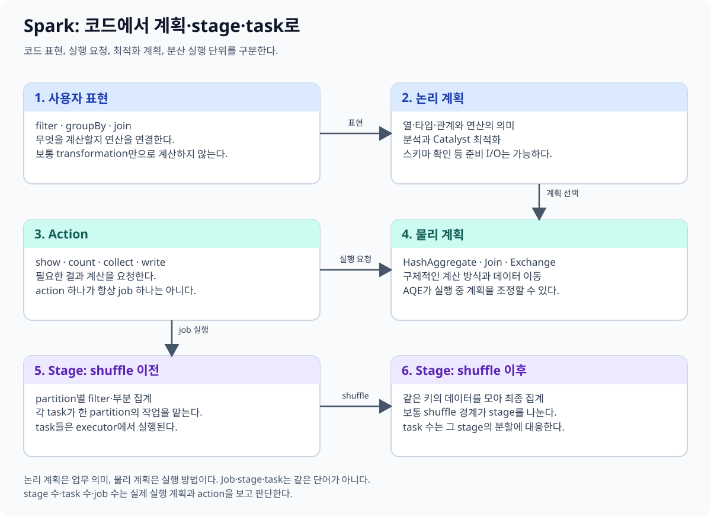
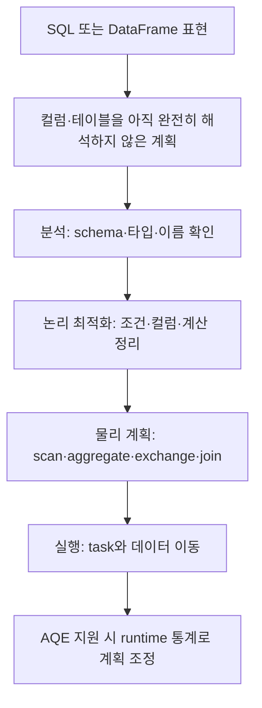
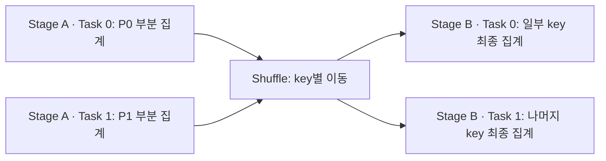
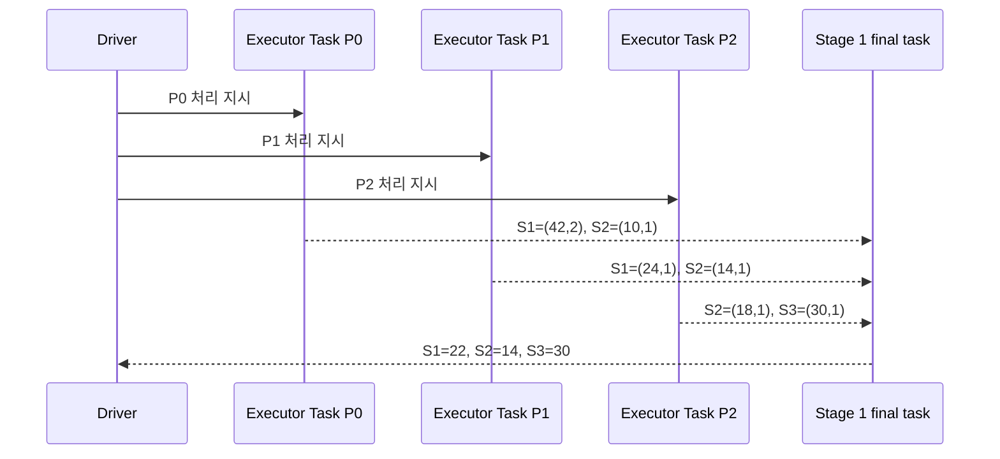
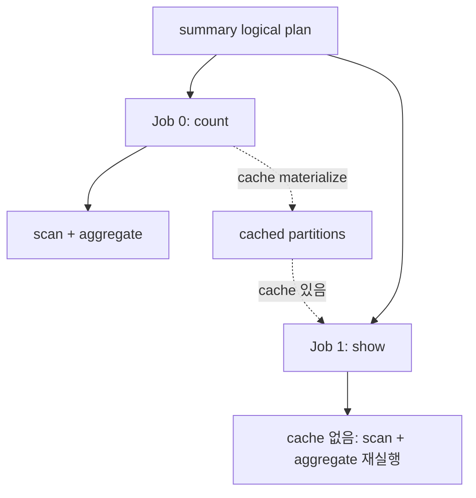

# 03. 지연 실행과 DAG

[이 책의 목차](README.md) · [이전 장](02-dataframes-sql.md)

Spark 코드를 읽을 때 “Python 줄이 몇 줄인가”와 “실제로 실행되는 task가 몇 개인가”를 구분한다. 하나의 SQL 요청은 여러 stage와 task로 실행될 수 있다.



## 1. Lazy evaluation은 실행을 미룬다는 뜻이다

**Lazy evaluation, 지연 실행**은 데이터 계산을 즉시 수행하기보다 변환의 표현을 구성하고 결과가 필요할 때 실행하는 방식이다. 엔진이 여러 연산을 함께 보고 최적화할 여지를 제공한다.

```text
clean = readings.filter(...)
summary = clean.groupBy("device_id").agg(...)
```

이 두 줄을 실행한 시점에 일반적으로 모든 온도를 읽고 평균을 계산한 것은 아니다. `show`, `collect`, `count`, `write` 같은 결과 요청이 데이터 실행을 유발한다. 이런 요청을 **action**이라고 부른다.

다만 파일 목록 조회, schema 추론, 분석·검증 등은 표현을 만드는 과정에서도 I/O나 비용을 발생시킬 수 있다. “Action 전에는 어떤 작업도 절대 하지 않는다”는 규칙으로 외우지 않는다.

## 2. Logical plan과 physical plan

**Logical plan, 논리 계획**은 무엇을 계산하는지 표현한다. 온도를 필터하고 장치별 평균을 구하는 의미가 여기 해당한다.

**Physical plan, 물리 계획**은 어떻게 수행할지 표현한다. 어떤 scan을 사용하고, 부분 집계를 어디서 만들며, 어느 경계에서 shuffle하고 어떤 join 전략을 선택하는지가 여기 해당한다.



Spark SQL의 **Catalyst**는 계획 분석·최적화와 관련된 프레임워크 이름이다. 이름만 외우기보다 실제 계획에서 읽기·필터·집계·exchange를 찾는 것이 먼저다. **Exchange**는 데이터 분포를 바꾸는 물리 연산으로 등장할 수 있다.

## 3. 필요한 컬럼과 조건을 아래로 전달한다

```sql
SELECT device_id, AVG(temperature)
FROM measurements
WHERE temperature BETWEEN -40 AND 60
GROUP BY device_id;
```

엔진은 `event_id`가 결과에 필요하지 않다면 불필요한 컬럼 읽기를 줄일 수 있다. 지원되는 scan에 조건을 전달해 후보 파일·row group을 제외할 수도 있다. 이를 projection·predicate pushdown이라고 부른다.

하지만 모든 조건이 모든 데이터 소스에서 pushdown되는 것은 아니다. Python 사용자 함수로 감싼 조건은 엔진이 그 의미를 이해하기 어려울 수 있다. `explain`에서 실제 scan과 filter를 확인한다.

```text
summary.explain(mode="formatted")
summary.explain(mode="extended")
```

`formatted`는 물리 계획을 구조적으로, `extended`는 분석·최적화 단계의 계획을 함께 살펴보는 데 사용한다. 출력의 operator 이름·번호·통계는 Spark 버전·설정·source에 따라 달라진다.

## 4. DAG는 작업의 의존 관계다

**DAG(Directed Acyclic Graph)**는 방향이 있고 순환하지 않는 그래프다. 어떤 결과를 만들기 전에 어떤 입력·계산이 필요한지 나타낸다.

원천을 필터한 결과로 평균과 최대값을 각각 만들면 같은 앞부분을 공유하는 가지를 생각할 수 있다. 공유되는 표현이 있다고 결과가 무조건 한 번 계산되어 영구 보관되는 것은 아니다. Cache와 실제 실행 요청을 확인한다.

## 5. Job·stage·task를 나누어 읽는다

| 단위 | 뜻 | 평균 계산의 예 |
| --- | --- | --- |
| Application | driver와 executor들의 실행 프로그램 | 센서 정제 프로그램 전체 |
| Job | 실행 요청으로 생성되는 병렬 계산 작업 | 집계 결과를 계산하는 작업 |
| Stage | shuffle 등의 경계로 나뉜 task 집합 | 부분 집계 stage, 최종 집계 stage |
| Task | stage의 partition 하나 등을 처리하는 실행 단위 | 입력 조각 하나의 필터·부분 합계 |

“Action 하나 = job 정확히 하나”, “SQL 한 줄 = stage 하나”라고 고정하지 않는다. Broadcast 준비, AQE의 query stage, 별도 실행 경로 때문에 하나의 action이 여러 job을 만들 수 있다. 상수 결과처럼 큰 분산 실행이 필요 없는 경우도 있다.

## 6. 집계 예제를 두 stage로 단순화한다

입력 partition 두 개에서 S1·S2 값이 섞여 있다고 하자.

```text
입력 P0: S1=20, S2=19
입력 P1: S1=22, S3=23

부분 집계:
P0 → S1(sum=20,count=1), S2(sum=19,count=1)
P1 → S1(sum=22,count=1), S3(sum=23,count=1)

shuffle: 같은 device_id의 부분 값을 같은 쪽으로 보냄
최종 집계: S1=21, S2=19, S3=23
```



이는 이해를 위한 단순화다. 실제 계획은 입력 분포·부분 집계 최적화·shuffle partition 수·AQE에 따라 다르다. 결과를 전역 정렬하면 추가 데이터 이동과 stage가 생길 수 있다.

## 7. Lineage와 checkpoint·cache

### 숫자로 끝까지 추적하는 job·stage·task

앞의 평균 예제를 입력 partition 세 개로 늘려 보자. 이 표의 수치는 실행 원리를 설명하기 위한 값이다.

| 입력 partition | 담당 task | 읽은 행 | 부분 결과 `(sum, count)` |
| --- | --- | --- | --- |
| P0 | Stage 0, Task 0 | S1=20, S1=22, S2=10 | S1=(42,2), S2=(10,1) |
| P1 | Stage 0, Task 1 | S1=24, S2=14 | S1=(24,1), S2=(14,1) |
| P2 | Stage 0, Task 2 | S2=18, S3=30 | S2=(18,1), S3=(30,1) |

Driver는 action을 보고 job을 만들고, scheduler는 P0·P1·P2에 각각 task를 배정한다. Executor가 각 task를 실행해 부분 상태를 만든다. 이 시점에는 S1의 최종 평균이 아직 없다. S1의 두 부분 상태가 서로 다른 task에 있기 때문이다.

Shuffle 뒤 Stage 1의 task는 같은 key의 상태를 받는다. S1은 `(42,2)+(24,1)=(66,3)`이므로 평균은 `66/3=22`다. S2는 `(10,1)+(14,1)+(18,1)=(42,3)`이므로 평균은 14다. S3는 `(30,1)`이므로 30이다.



여기서 `평균의 평균`을 계산하면 틀릴 수 있다. P0의 S1 평균 21과 P1의 S1 평균 24를 단순 평균하면 22.5지만, 행 수를 보존한 정답은 22다. 부분 집계가 합계와 개수를 함께 운반하는 이유다.

Action을 하나 더 호출하면 새 job이 생길 수 있다. `summary.count()` 뒤 `summary.show()`를 호출할 때 cache가 없다면 Stage 0의 scan과 부분 집계도 다시 실행될 수 있다. 반대로 cache를 채웠다면 두 번째 job의 출발점이 cache가 될 수 있다. 변수 이름이나 같은 logical plan이라는 사실만으로 재사용을 보장하지 않는다.

**반례.** `filter`와 `select`만 연결한 계산에는 위와 같은 key shuffle이 필요하지 않을 수 있다. 따라서 “DataFrame action은 항상 두 stage”라고 일반화하면 안 된다. 실제 stage 경계는 physical plan의 exchange와 실행 UI에서 확인한다.

**Lineage**는 결과를 만드는 계산의 의존 관계다. 일부 데이터 조각이 없어지면 원천과 변환으로 다시 계산할 수 있는 근거가 된다. Iceberg v3의 row lineage는 행 ID와 변경 순서에 관한 다른 기능이다.

**Cache/Persist**는 계산 결과를 재사용하도록 저장하는 요청이다. 일반적인 cache 요청 자체는 지연되어 실제 실행에서 채워질 수 있다. 저장 수준에 따라 메모리·디스크 사용이 달라진다.

**Checkpoint**는 복구나 계산 계보 단축 등을 위해 상태를 저장하는 경로다. Batch DataFrame checkpoint와 Structured Streaming의 입력 위치·state checkpoint는 용도와 구조가 다르다. 이름이 같다고 서로 대체하지 않는다.

## 8. 왜 같은 계산이 다시 실행될까

### Action 두 개의 실행 연표

`summary.count()`와 `summary.show()`를 차례로 호출한다고 하자. Cache가 없으면 둘은 같은 logical plan을 참조해도 서로 다른 실행 요청이다.

| 시각 | Driver | Executor | 관찰 결과 |
| --- | --- | --- | --- |
| 14:00:00 | `count` action으로 Job 0 제출 | P0·P1·P2 scan | Stage 0 task 3개 |
| 14:00:02 | shuffle stage 예약 | 부분 상태 전송 | Stage 1 task 실행 |
| 14:00:03 | count 결과 수신 | Job 0 종료 | 결과 행 수 3 |
| 14:00:04 | `show` action으로 Job 1 제출 | 원천을 다시 scan할 수 있음 | 같은 계산 재사용 보장 없음 |
| 14:00:07 | 표시할 행 수신 | 필요한 task 종료 | 화면 출력 |

`summary.cache()`를 14:00 전에 호출해도 그 호출만으로 모든 partition이 즉시 계산되지는 않는다. 첫 action이 partition을 계산하면서 cache block을 채운다. 일부 partition의 cache block이 메모리 압박으로 evict되면 두 번째 action은 남은 block은 읽고 빠진 partition만 lineage로 다시 만들 수 있다.



Job 수를 Python action 줄 수만 세어 예측하면 안 된다. SQL 실행이 broadcast용 query stage를 준비하거나 adaptive execution이 stage를 materialize할 수 있고, output commit을 위한 별도 동작이 보일 수 있다. 반대로 optimizer가 상수식으로 계산을 줄이면 분산 scan이 없을 수도 있다.

### 실패 때 다시 계산하는 최소 범위

Stage 1의 Q0 task가 실패하면 Q0만 재시도할 수 있다. 그러나 Q0이 읽어야 할 P1의 shuffle block이 executor 유실로 사라졌다면 P1을 처리한 이전 stage task도 다시 실행해야 한다. Driver의 scheduler가 의존 관계를 보고 필요한 output을 복구한다.

| 남아 있는 것 | 잃은 것 | 다시 필요한 계산 |
| --- | --- | --- |
| 원천 P0·P1·P2 접근 가능 | Q0 task attempt | Q0 재시도 |
| P0·P2 shuffle output | P1 shuffle output | P1 이전 task 뒤 Q0 재시도 |
| Cached P0·P1 | Cached P2 | P2 lineage 재계산 |
| Driver process 없음 | scheduler·job 상태 | application 수준 재시작 |

**결과가 같은 이유.** Pure transformation과 재생 가능한 원천이라면 task attempt가 달라도 같은 partition 결과를 다시 만들 수 있다. Task 내부에서 현재 시각, 난수, 외부 API 같은 비결정적 부수 효과를 사용하면 재시도 의미가 달라질 수 있다.

**반례.** Lineage가 있다고 삭제된 원천 파일까지 복구되는 것은 아니다. 원천 데이터가 바뀌거나 사라지면 계산 그래프만으로 같은 결과를 재현할 수 없다. Snapshot 식별자와 입력 보존이 재현성에 필요한 이유다.

```text
summary.count()
summary.show()
```

캐시되지 않은 표현에 여러 action을 실행하면 같은 입력과 계산을 다시 수행할 수 있다. 반복을 줄이고 싶으면 재사용 효과·cache 크기·메모리 압박을 고려한다. “중간 DataFrame 변수에 넣었다”는 사실만으로 cache가 되는 것은 아니다.

## 9. 확인 질문과 해설

**질문.** `filter`를 호출했으니 파일의 잘못된 행이 삭제되었는가?

**해설.** 필터한 결과의 표현을 만든 것이다. 원천 파일의 물리 삭제가 아니다.

**질문.** Python에서 `groupBy` 한 줄을 썼는데 UI에 task가 200개 나온다. 모순인가?

**해설.** 코드 표현과 병렬 실행 단위가 다르다. 물리 계획·partition·AQE·설정을 확인한다.

**질문.** Spark lineage와 Iceberg row lineage는 같은 것인가?

**해설.** 전자는 계산 의존 관계, 후자는 테이블 행의 ID와 변경 정보다.

## 공식 자료

[RDD programming guide의 지연 실행](https://spark.apache.org/docs/4.2.0/rdd-programming-guide.html), [SQL performance tuning](https://spark.apache.org/docs/4.2.0/sql-performance-tuning.html), [PySpark DataFrame explain](https://spark.apache.org/docs/4.0.4/api/python/reference/pyspark.sql/api/pyspark.sql.DataFrame.explain.html)을 참고한다.

[다음: 04. Partition과 shuffle](04-partitions-and-shuffle.md)
