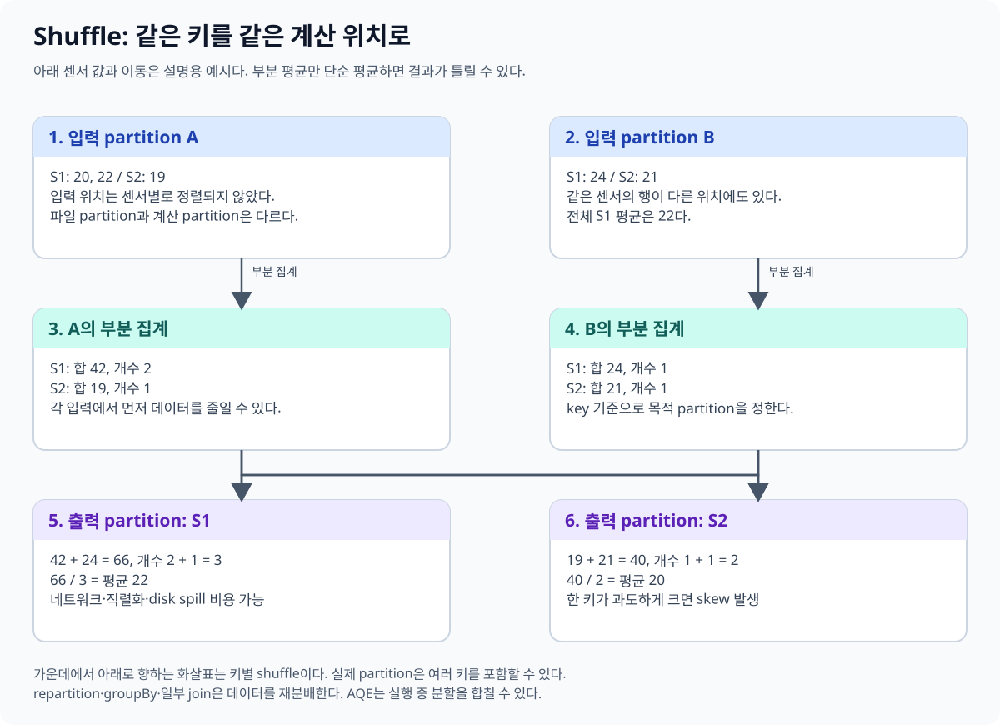
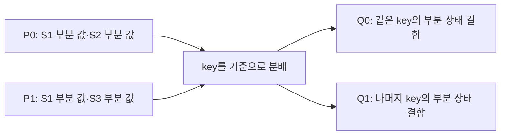
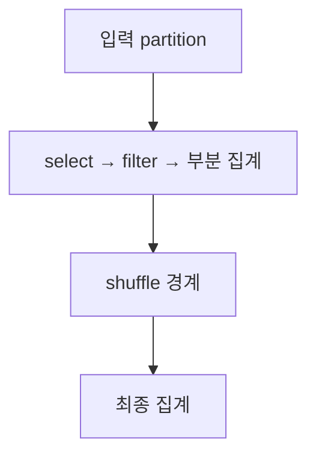

# 04. Partition과 shuffle

[이 책 목차](README.md) · [이전](03-lazy-dag-jobs-stages.md) · [다음](05-joins-and-aqe.md)

분산 처리의 핵심은 데이터를 나누는 것뿐 아니라 필요한 순간에 다시 모으는 것이다. 이 장은 같은 장치의 측정값이 서로 다른 입력에 있을 때 평균을 구하는 경로를 따라간다.



## 1. Partition은 실행할 데이터 조각이다

Spark의 partition은 병렬 계산을 나누는 논리적 데이터 조각이다. Stage 안에서 여러 partition을 여러 task로 처리한다. Partition 100개와 executor 100개는 같은 말이 아니다. Executor가 task를 여러 차례 실행할 수 있다.

| 이름 | 의미 |
| --- | --- |
| Spark input partition | Scan이나 원천 입력을 실행에 나눈 조각 |
| Spark shuffle partition | 재분배 뒤 실행에 나눈 조각 |
| Iceberg partition | 날짜 변환 등 테이블 저장 규칙으로 묶은 값 |
| Parquet row group | 파일 내부의 여러 행·컬럼 저장 묶음 |

하루 데이터를 같은 Iceberg partition에 저장해도 Spark task는 여러 개일 수 있다. Parquet 파일 하나도 split될 수 있고 작은 파일 여러 개가 한 입력 task로 묶일 수도 있다.

## 2. 같은 key를 모아야 하는 이유

```text
P0: S1=20, S2=19
P1: S1=22, S3=23

S1 평균을 구하려면 P0의 S1과 P1의 S1을 결합해야 한다.
```

같은 장치의 모든 원본 행을 한꺼번에 보내는 대신, 가능하면 각 partition에서 부분 합계와 개수를 먼저 만든다. S1의 부분 상태 `(20,1)`과 `(22,1)`을 결합하면 평균 21이다. 연산의 의미에 따라 가능한 부분 집계가 다르다.

**Shuffle**은 계산에 필요한 분포로 데이터를 다시 나누는 과정이다. 여러 서버에서는 네트워크를 사용하고 중간 데이터는 메모리·디스크·shuffle 서비스 등의 경로에 놓일 수 있다. Local 실행에서도 분포 변경과 중간 데이터 처리는 남는다.



Q0/Q1에 어느 key가 가는지는 실제 hash·partitioning 규칙에 따라 정한다. 교육용 그림에서 S1이 반드시 0번 partition에 간다는 뜻은 아니다.

## 3. Narrow와 wide dependency

**Narrow dependency**는 출력 조각이 제한된 입력 조각에 의존하는 관계다. 일반적인 `select`, `filter`는 partition 안에서 이어 수행할 수 있다.

**Wide dependency**는 출력 조각에 여러 입력 조각의 데이터를 모으는 관계다. Key별 집계나 재분배에는 shuffle이 필요할 수 있다. Join은 이미 가진 분포와 broadcast 전략 등에 따라 실제 shuffle 위치가 달라진다.



Spark는 좁은 연산들을 task 안에서 이어 실행할 수 있다. Python의 세 줄을 task 세 개로 해석하지 않는다. Stage는 shuffle 등의 실행 경계로 나뉘며 실제 계획을 함께 읽는다.

## 4. Repartition과 coalesce

| 연산 | 주된 용도 | 주의점 |
| --- | --- | --- |
| `repartition(n)` | Shuffle을 이용해 실행 분포를 새로 구성 | 데이터 이동 비용, optimizer의 계획 처리 |
| `repartition(n, key)` | Key를 기준으로 분포 구성 | Key skew가 남을 수 있음 |
| `coalesce(n)` | 보통 shuffle 없이 partition 수 감소 | 큰 감소는 병렬성을 줄일 수 있음 |

```text
clean.repartition(8, "device_id")
clean.coalesce(2)
```

앞 코드는 원하는 분포를 표현하는 예시다. 실제 실행은 action에서 이루어지고 최적화·AQE·후속 연산에 따라 관측할 partition 수가 달라질 수 있다.

작은 결과 파일 수를 줄이려는 목적에서 `coalesce`를 사용할 수 있다. 그러나 거대한 결과에 무조건 `coalesce(1)`을 적용하면 계산·쓰기를 한쪽으로 몰 수 있다. 실행 partition 수와 저장 파일 수도 일대일로 고정되지 않는다.

## 5. Shuffle partition 수

Spark SQL의 `spark.sql.shuffle.partitions`는 join·집계 등의 초기 shuffle partition 수를 설정한다. 기본값은 200이며 모든 입력 파일 수·모든 RDD task 수를 정하는 설정은 아니다.

실습에서는 작은 데이터에 맞게 작은 수를 지정한다. 운영에서는 각 task의 크기·시간·spill·key 분포를 관찰한다. 너무 적으면 큰 task의 메모리가 부담되고, 너무 많으면 task 준비와 작은 결과 파일 비용이 커질 수 있다.

AQE는 실행 통계를 이용해 post-shuffle partition을 합치는 등 조정할 수 있다. 따라서 설정값 200과 실제 downstream task 수가 다를 수 있다. [05장](05-joins-and-aqe.md)에서 연결한다.

## 6. Skew와 spill

Partition 10개 중 9개는 10 MiB, 하나는 910 MiB라면 평균 100 MiB가 실제 최대 부담을 숨긴다. 같은 key가 대부분을 차지하면 hash 분배만으로 균등해지지 않는다.

**Spill**은 중간 상태를 디스크 등에 내리는 과정이다. 실패를 피할 수 있지만 읽기·쓰기·정렬 비용이 추가된다. Shuffle bytes와 spill bytes, task 시간의 분포를 함께 본다.

**Salting**은 치우친 key를 보조 값으로 나누어 처리하는 설계 방법이다. 최종 결합과 join 의미를 보존해야 하므로 단순히 임의 난수를 붙여 끝내지 않는다. 작은 입력에는 불필요한 복잡도를 만들 수 있다.

## 7. 확인 문제

**질문.** `spark.sql.shuffle.partitions=4`이면 입력 파일도 4개여야 하는가?

**해설.** 실행 재분배 설정과 입력 파일 수는 별개다.

**질문.** 모든 행의 device ID가 S1이면 `repartition(100, device_id)`로 고르게 나뉘는가?

**해설.** 같은 key를 같은 쪽으로 모으는 목적이라 skew가 남을 수 있다.

**질문.** Shuffle이 존재하면 잘못 만든 쿼리인가?

**해설.** 같은 key를 결합하는 데 필요한 비용일 수 있다. 이동량·부분 집계·분포·join 전략을 평가한다.

## 공식 자료

[RDD guide](https://spark.apache.org/docs/4.2.0/rdd-programming-guide.html), [SQL performance tuning](https://spark.apache.org/docs/4.2.0/sql-performance-tuning.html), [Configuration](https://spark.apache.org/docs/4.2.0/configuration.html)을 참고한다.
