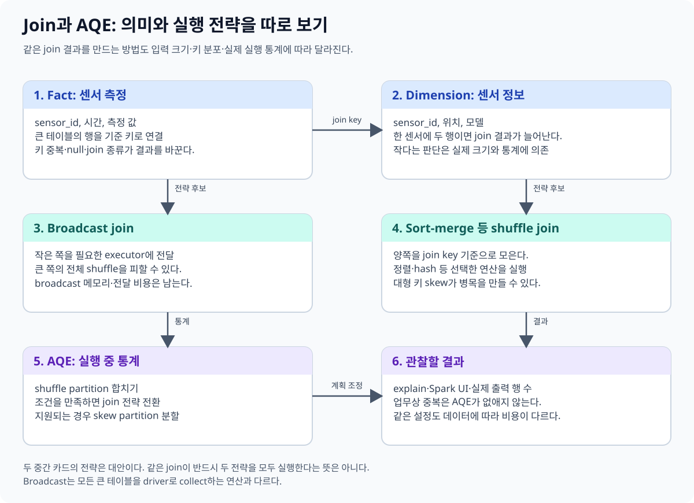
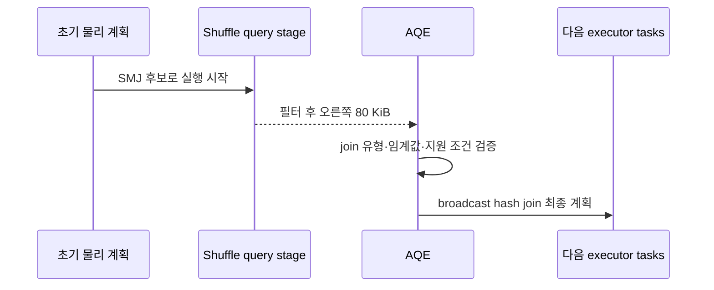
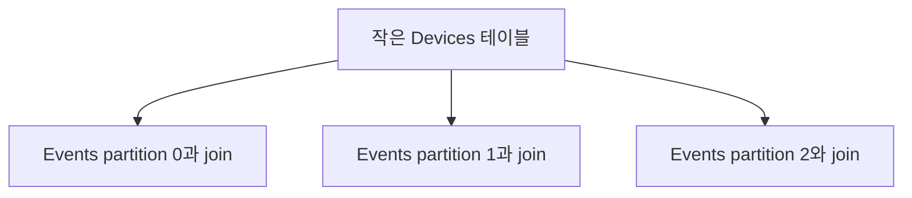
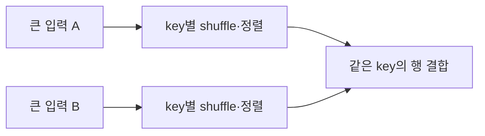

# 05. Join과 AQE

[이 책 목차](README.md) · [이전](04-partitions-and-shuffle.md) · [다음](06-memory-and-performance.md)

Join의 결과 의미를 먼저 정하고, 그 결과를 어떤 실행 전략으로 만들지 살핀다. 빠른 물리 계획이 잘못된 join 조건을 올바르게 고쳐 주지는 않는다.



## 1. 두 테이블을 붙인다

측정값과 장치 목록이 다음과 같다고 하자.

| Events의 device_id | 온도 |
| --- | --- |
| S1 | 20 |
| S1 | 22 |
| S2 | 19 |
| S9 | 25 |

| Devices의 device_id | 위치 |
| --- | --- |
| S1 | Lab-A |
| S2 | Lab-B |

```sql
SELECT e.device_id, e.temperature, d.location
FROM events e
LEFT JOIN devices d ON e.device_id = d.device_id;
```

Left join은 왼쪽 Events의 행을 유지하고 일치하는 Devices 값을 붙인다. S9의 위치는 NULL이다. Inner join이면 일치하지 않는 S9는 제외된다.

| 종류 | 의미 |
| --- | --- |
| Inner | 양쪽 조건이 일치하는 행 조합 |
| Left outer | 왼쪽 행 유지, 오른쪽 미일치는 NULL |
| Full outer | 양쪽의 미일치 행도 유지 |
| Left semi | 오른쪽에 일치가 있는 왼쪽 행만 반환 |
| Left anti | 오른쪽에 일치가 없는 왼쪽 행 반환 |
| Cross | 양쪽 행의 모든 조합 |

## 2. Key 중복은 결과를 곱셈으로 늘린다

Devices에 S1이 두 행이면 S1의 측정 두 행이 각각 두 장치 행과 연결되어 네 행이 된다. 일대일 join을 의도했다면 오른쪽 key의 유일성·유효 시각을 먼저 확인한다.

```text
Events S1: 2행
Devices S1: 2행
Join 결과 S1: 2 × 2 = 4행
```

단순 `dropDuplicates`로 어느 장치 상태든 임의 선택하면 업무 의미가 달라질 수 있다. 최신 상태·사건 시점 상태·우선순위 등 선택 규칙을 명시한다.

NULL의 일반 `=` 비교는 두 NULL을 자동 일치시키지 않는다. Null-safe 비교가 필요한지 데이터 계약으로 정한다. Timestamp join에서는 미래 정보가 과거 사건에 붙는 데이터 누수도 검토한다.

## 3. Broadcast join

### 중복 행과 물리 전략을 한 예제에서 분리한다

Events에 S1이 2행, Devices에 S1이 2행이면 어떤 전략을 골라도 S1 결과는 4행이다. Broadcast hash join은 오른쪽의 두 S1 행을 각 executor의 hash relation에 넣고 왼쪽 S1 한 행마다 두 값을 찾는다. Sort-merge join은 양쪽 S1 구간을 맞춰 같은 네 조합을 만든다. 전략은 비용을 바꾸지만 cardinality 의미는 바꾸지 않는다.

| 전략 | Driver가 정하는 것 | Executor가 하는 것 | 이 예제의 S1 결과 |
| --- | --- | --- | ---: |
| Broadcast hash join | 작은 쪽을 broadcast할 계획 | 작은 쪽 복사본으로 각 큰 partition을 조회 | 4행 |
| Sort-merge join | 양쪽을 key 분포·정렬할 계획 | shuffle partition의 같은 key 구간 결합 | 4행 |

Devices가 8 MiB로 추정되었지만 실제 필터 뒤 80 KiB라고 하자. 초기 계획이 sort-merge join이어도 AQE는 지원 조건에서 실행 통계를 보고 broadcast join으로 바꿀 수 있다. 그 변화는 첫 shuffle query stage가 materialize된 뒤에야 실제 크기를 알았기 때문에 가능하다.



반대로 오른쪽이 80 KiB여도 broadcast할 수 없는 join 유형이거나 명시적 설정·지원 조건이 맞지 않으면 전환되지 않을 수 있다. 또 오른쪽 80 KiB를 driver가 수집·직렬화하고 executor마다 보관하는 비용은 0이 아니다. 작은 lookup을 반복 broadcast하는 여러 동시 쿼리는 각 executor의 메모리를 함께 사용한다.

다음 순서로 문제를 나누면 “AQE가 해결해 줄 것”이라는 추측을 피할 수 있다.

1. Join 전후 key별 행 수를 계산해 의도한 cardinality인지 확인한다.
2. 초기 계획의 통계와 join 전략을 기록한다.
3. 실행 후 최종 adaptive plan에서 전략과 partition 수 변화를 확인한다.
4. Shuffle read, broadcast 크기, task 최대 시간을 결과 행 수와 함께 비교한다.

**반례.** Devices의 S1 중복이 데이터 오류인데 broadcast로 빨라졌다면 쿼리는 더 빠르게 틀린 네 행을 만든다. 중복의 업무 규칙을 고친 뒤 실행 전략을 조정해야 한다.

**Broadcast**는 작은 입력을 여러 실행 task 쪽으로 전달하는 전략이다. 작은 Devices를 전달하면 큰 Events의 모든 행을 join key로 이동시키는 비용을 줄일 수 있다.



작다는 판단은 행 수만이 아니라 실제 표현 크기·통계·메모리 조건과 관계된다. 문자열이 긴 행은 같은 행 수여도 클 수 있다. Broadcast 준비·전달·각 executor의 보관 비용도 있다.

힌트는 원하는 전략을 표현할 수 있지만 모든 join 유형·지원 조건에서 강제로 적용되는 것은 아니다. 설정 임계값과 실제 물리 계획을 확인한다.

## 4. Shuffle와 sort-merge join

큰 두 입력은 같은 join key의 행을 맞출 수 있도록 분포를 바꾸는 경로를 사용할 수 있다. **Sort-merge join**은 key로 정렬된 양쪽 입력을 맞추며 결합하는 전략이다.



실제 join은 이미 가진 partitioning·정렬·source capability·통계에 따라 이동이 줄어들 수 있다. 물리 계획의 `Exchange`, `Sort`, join operator를 읽는다.

## 5. AQE는 실행 통계로 계획을 조정한다

**AQE(Adaptive Query Execution)**는 실행 중 얻은 통계로 일부 물리 전략을 조정하는 기능이다. Spark 3.2부터 기본 활성화되어 왔다. 대표 기능은 post-shuffle partition 합치기, 지원되는 skew join 처리, join 전략 전환이다.

예를 들어 필터 뒤 Devices가 예상보다 작아지면 지원 조건에서 sort-merge 계획을 broadcast 방식으로 바꿀 수 있다. 작은 shuffle partition 여러 개를 합쳐 task 준비 비용을 줄일 수도 있다.

AQE가 모든 잘못된 데이터 분포와 계획을 해결하는 것은 아니다. 큰 단일 key, unsupported join, 잘못된 조건, 원천 I/O 제한은 남을 수 있다. 초기 계획과 실행 후 최종 계획을 나눠 기록한다.

## 6. 계획을 읽을 순서

1. 어떤 테이블·컬럼·필터를 읽는가?
2. Join 조건과 유형이 업무 의미에 맞는가?
3. 각 입력의 추정 크기와 실제 크기는 얼마인가?
4. Exchange와 sort가 어디에 있는가?
5. 작은 쪽을 broadcast했는가, 가능한 이유는 무엇인가?
6. AQE 이후 partition 수·join 전략·skew 처리가 바뀌었는가?

`explain` 출력은 버전·설정에 따라 달라진다. 특정 operator 번호를 외우는 대신 실행 의미를 읽는다.

## 7. 확인 문제

**질문.** 작은 테이블과 join하면 항상 broadcast인가?

**해설.** 크기 통계·설정·join 유형·힌트·지원 경로에 따라 결정된다.

**질문.** Join 결과가 두 배인데 task가 중복 실행된 것인가?

**해설.** Join key 중복으로 정상적인 행 조합이 늘었을 수 있다. 먼저 입력 cardinality를 검사한다.

**질문.** AQE가 켜졌으니 초기 계획과 입력 분포는 기록하지 않아도 되는가?

**해설.** 실제 조정의 이유와 효과를 비교하려면 둘 다 필요하다.

## 공식 자료

[Join syntax](https://spark.apache.org/docs/4.2.0/sql-ref-syntax-qry-select-join.html), [SQL performance tuning과 AQE](https://spark.apache.org/docs/4.2.0/sql-performance-tuning.html)를 참고한다.
