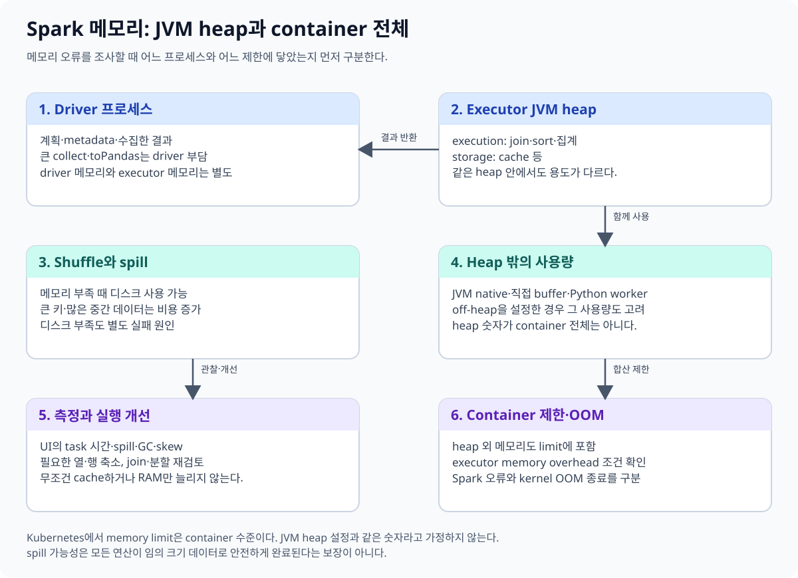
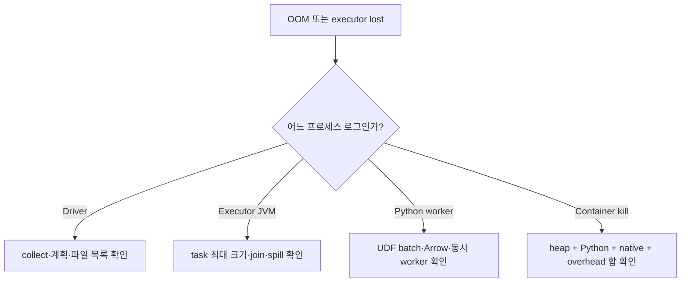
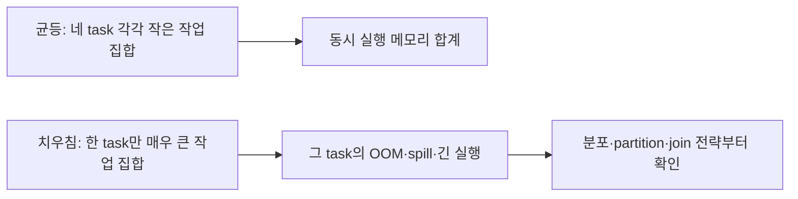
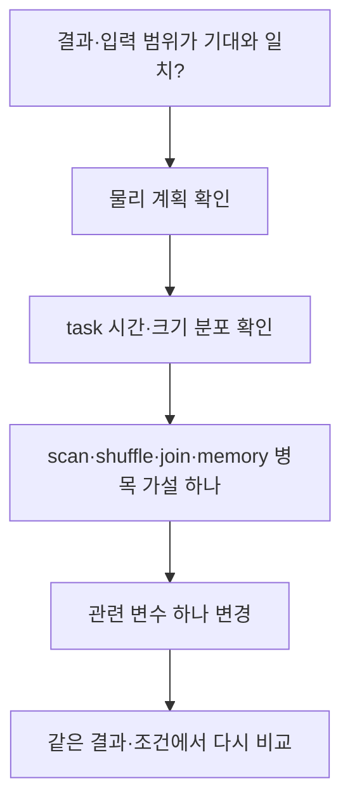

# 06. 메모리와 성능

[이 책의 목차](README.md) · [이전 장](05-joins-and-aqe.md)

Spark 성능을 설명하려면 “RAM을 더 준다”보다 어느 프로세스의 어떤 작업이 자원을 사용하는지 먼저 구분한다. 이 장의 수치는 계산용 가정이며 실제 연구실 측정이 아니다.



## 1. 모든 데이터를 RAM에 올려야 하는가

Spark는 partition 단위로 데이터를 읽고 처리하며 중간 결과를 메모리나 디스크에 둘 수 있다. 전체 입력이 RAM보다 크다는 사실만으로 실행 불가능한 것은 아니다.

그러나 특정 task가 큰 hash table·정렬·집계 상태를 만들거나 결과를 driver에 모으면 메모리가 부족할 수 있다. 전체 데이터량보다 **동시에 실행되는 task별 작업 집합, 분포, 출력 크기**가 중요하다.

**Working set, 작업 집합**은 계산 과정에서 동시에 다루는 데이터·상태를 가리킨다. **Spill**은 메모리에서 감당하기 어려운 중간 데이터를 디스크 등에 내리는 동작이다. Spill이 발생했다고 반드시 실패한 것은 아니지만 I/O 비용이 증가할 수 있다.

## 2. Driver와 executor의 OOM은 다르다

**OOM(Out Of Memory)**은 필요한 메모리를 확보하지 못하는 상태다.

| 위치 | 흔한 원인 | 먼저 살펴볼 것 |
| --- | --- | --- |
| Driver | 큰 `collect`·`toPandas`, 거대한 계획·파일 목록 | driver로 모으는 결과·metadata 크기 |
| Executor JVM | 큰 join·aggregation·sort·동시 task | partition 크기·skew·join 전략·heap |
| Python worker | Python UDF·Arrow/Pandas 변환·큰 객체 | Python 메모리·batch 크기·overhead |
| Container | 프로세스 합계가 cgroup 한도 초과 | heap 밖 메모리·Python·native buffer·컨테이너 limit |

Executor 메모리를 늘려도 driver의 `collect` 문제가 그대로 남을 수 있다. JVM heap만 늘려도 Python worker나 container OOM이 해결되지 않을 수 있다. 로그에서 어떤 프로세스가 어떤 이유로 종료되었는지 확인한다.

## 3. Heap·execution·storage·overhead

### 같은 OOM처럼 보여도 고칠 위치가 다르다

Executor container 한 개에 JVM heap 4 GiB와 네 개의 동시 task가 있다고 가정하자. 각 JVM task가 join 상태로 700 MiB를 요구하면 단순 합은 2.8 GiB다. 여기에 broadcast 500 MiB와 cache 900 MiB가 동시에 살아 있으면 4.2 GiB이므로 heap 압박이 생긴다. 이 경우 Python을 쓰지 않아도 executor JVM에서 spill이나 OOM이 날 수 있다.

다른 작업에서 JVM task 상태가 각각 200 MiB여도 네 Python worker가 각각 600 MiB를 사용하면 Python 쪽 합만 2.4 GiB다. JVM heap 그래프가 여유 있어 보여도 container 총 한도를 넘거나 Python worker가 먼저 종료될 수 있다.

| 관찰 시점 | 소유 프로세스 | 예시 증상 | 먼저 줄일 대상 |
| --- | --- | --- | --- |
| 결과 수집 | Driver JVM·client | `collect` 뒤 driver 종료 | 수집 행·결과 크기 |
| JVM join·sort | Executor JVM | GC 증가, spill, heap OOM | 큰 task·skew·join 상태 |
| Python UDF | Python worker | worker crash, container kill | batch·동시성·Python 객체 |
| 전체 합 | Container/cgroup | heap OOM 로그 없이 exit | heap 밖 사용량과 limit |



메모리를 바꾸는 주체와 시점도 다르다. Driver는 계획과 작은 결과를 보유한다. Executor JVM은 task 시작 시 실행 상태를 만들고 완료 뒤 해제하거나 cache를 남긴다. Python worker는 JVM에서 batch를 전달받을 때 Python 객체나 Arrow buffer를 만든다. Cluster manager나 Kubernetes는 이 프로세스들의 합을 container 한도와 비교한다.

**왜 executor heap 증설이 Python OOM을 악화시킬 수도 있는가.** Container limit을 그대로 둔 채 heap만 4 GiB에서 6 GiB로 올리면 heap 밖에 남는 여유가 줄어든다. Python worker의 사용량이 같아도 container kill 가능성이 커질 수 있다. 자원 설정은 heap 한 숫자가 아니라 배포 모드의 전체 계산식으로 맞춘다.

**반례.** 모든 task가 같은 입력 크기인데 특정 host에서만 container kill이 반복되면 key skew만으로 설명되지 않는다. 같은 host의 다른 pod, 디스크, native library, node pressure도 확인해야 한다. Spark UI의 task 분포와 cluster-level 종료 이유를 함께 봐야 한다.

**Heap**은 JVM이 객체를 관리하는 메모리 영역이다. Spark는 heap 안에서 실행용 메모리와 cache 등의 저장용 메모리를 관리한다. **Execution memory**는 정렬·집계·join 등, **storage memory**는 cache 같은 용도와 관련된다.

Spark의 메모리 모델에서는 execution과 storage가 공유 영역을 사용하며 서로 영향을 줄 수 있다. `spark.memory.fraction` 같은 설정은 전체 heap에서 관리할 영역을 정한다. 초보 단계에서 이 값을 임의로 조정하기보다 task 크기·join·cache를 먼저 관찰한다.

**Overhead**에는 JVM heap 밖의 프로세스 메모리와 native·Python 사용 등이 관계된다. Kubernetes/YARN의 자원 요청에는 executor heap 외의 overhead, 별도 off-heap·PySpark memory 설정 등이 반영될 수 있다. 설정한 항목을 실제 배포 모드의 계산식으로 확인한다.

**Off-heap**은 JVM heap 밖의 메모리다. 사용한다고 메모리 비용이 사라지는 것이 아니며 프로세스·컨테이너의 총 사용량에 포함된다.

## 4. 동시 task 수가 메모리 요구를 바꾼다

Executor 하나가 4개 task를 동시에 실행하고 각 task의 작업 집합이 300 MiB라고 가정하자. 단순 합은 `4×300=1200 MiB`다. 여기에 cache·broadcast·객체·프로세스 비용이 추가된다.

Partition 하나가 다른 것보다 10배 커서 그 task만 3 GiB를 요구하면 전체 평균 크기가 작아도 실패할 수 있다. **Skew, 치우침**은 task별 부하가 균등하지 않은 상황이다. 메모리·시간의 최대값을 평균과 함께 본다.



## 5. Cache는 재사용할 때 비용을 갚는다

**Cache/Persist**는 중간 결과를 재사용하도록 보관하는 요청이다. 반복하는 비싼 계산에 도움이 될 수 있지만 cache를 만들고 유지하는 비용도 있다.

```text
clean = readings.filter(...).select(...)
clean.cache()
clean.count()         # 실제 계산하면서 cache를 채울 수 있음
run_summary(clean)
run_quality_report(clean)
clean.unpersist()     # 더 이상 필요 없으면 해제
```

한 번만 읽는 거대한 중간 결과를 무조건 cache하면 다른 task의 execution memory를 압박할 수 있다. Cache를 사용할 때는 재사용 횟수·크기·storage level·eviction·원천의 비용을 본다. Python 변수에 DataFrame을 저장한 것만으로 데이터가 cache되는 것은 아니다.

**Eviction**은 공간을 확보하기 위해 cache 내용을 내보내는 것이다. Cache hit와 전체 소요 시간을 관찰하지 않고 “cache 설정을 넣었으니 빨라졌다”고 주장하지 않는다.

## 6. 내장 함수와 Python UDF

**UDF(User-Defined Function)**는 사용자가 정의한 함수다. Spark 내장 함수로 표현 가능한 계산은 엔진이 타입·조건·계획을 더 잘 이해할 수 있는 경우가 많다.

```text
내장 표현:
temperature * 9 / 5 + 32

Python UDF 표현:
사용자 Python 함수로 같은 계산 호출
```

Python 함수 경로에는 JVM과 Python 사이의 데이터 전달·직렬화·batch 변환 등의 비용이 생길 수 있다. **Serialization, 직렬화**는 값을 전송·저장할 바이트 표현으로 바꾸는 것이다.

**Arrow**는 컬럼 데이터를 메모리와 프로세스 사이에서 다루기 위한 표현·교환 기술이다. Arrow를 사용하는 UDF 경로는 전송을 개선할 수 있지만 Python 실행과 메모리·지원 타입의 조건을 없애지는 않는다. 최신 Arrow 기본값은 [13장](13-versions-and-migration.md)에서 버전별로 다룬다.

## 7. Spark UI와 event log

**Spark UI**는 실행 중인 application의 job·stage·task·executor·SQL 정보를 관찰하는 인터페이스다. **Event log**는 지원되는 실행 이벤트를 남겨 History Server 등에서 이후 살펴볼 수 있게 하는 기록이다.

로컬 실습은 외부 노출을 줄이고 결과를 간단히 하기 위해 UI를 끈다. 실제 개발·연구 환경에서는 접근 권한과 기록 보존을 정해 UI와 event log를 사용할 수 있다.

| 관찰 | 해석할 질문 |
| --- | --- |
| Input size / records | 예상 입력을 실제로 얼마나 읽었는가? |
| Shuffle read / write | 어느 연산에서 얼마나 이동했는가? |
| Task duration 분포 | 일부 task만 긴가, 전부 긴가? |
| Spill bytes | 어느 stage가 메모리 압박을 받는가? |
| GC time | 객체 회수 시간이 계산을 차지하는가? |
| Executor lost / retries | 자원·네트워크·파일·외부 시스템 실패인가? |
| SQL physical plan | 기대한 scan·join·AQE 계획인가? |

UI의 여러 시간 항목은 합산 방식·중첩·task 병렬성에 따라 의미가 다르다. CPU time, task duration 합계, 사용자 elapsed time을 같은 숫자로 취급하지 않는다.

## 8. 병목을 한 단계씩 좁힌다

먼저 결과와 입력 범위를 확인한다. 그다음 계획, task 분포, 읽기·shuffle·spill·GC를 보고 가설 하나를 세운다.



예를 들어 shuffle이 크고 같은 key가 몰린 경우 executor 수만 늘리는 것보다 key 분포·join·partition 전략을 조정하는 것이 원인에 가깝다. 파일이 너무 많아서 계획이 느리면 데이터 source의 파일 배치와 metadata도 살핀다.

## 9. 서버를 두 배 늘리면 두 배 빨라지는가

실행 시간 100초 중 20초가 직렬 준비, 80초가 완전히 병렬화 가능한 계산이라고 가정하자. 병렬 계산만 두 배 빠르게 하면 `20+80/2=60초`, 배속은 `100/60≈1.67`이다.

이 계산은 데이터 이동·경합·추가 준비 비용이 변하지 않는 단순 모델이다. 실제 Spark에서는 서버를 늘리면서 shuffle·캐시·task 배치도 변할 수 있다. 숫자는 하한·가설을 이해하는 데 사용하고 실측 예측으로 단정하지 않는다.

## 10. 확인 질문과 해설

**질문.** Executor heap이 8 GiB면 container limit도 8 GiB면 충분한가?

**해설.** Heap 밖 메모리·Python·overhead 등 추가 사용을 고려해야 한다. 배포 모드의 자원 계산식을 확인한다.

**질문.** 전체 데이터는 10 GiB인데 100 GiB RAM 클러스터에서 OOM이 났다. 가능한가?

**해설.** 한 task나 driver에 데이터가 몰리거나 중간 상태가 커지면 가능하다. RAM의 총합만으로 판정하지 않는다.

**질문.** Cache한 DataFrame에서 두 번째 action도 느리다. 왜 가능한가?

**해설.** Cache가 아직 채워지지 않았거나 evict되었거나, 이후 join·shuffle·집계가 더 큰 비용일 수 있다.

## 공식 자료

[Tuning guide](https://spark.apache.org/docs/4.2.0/tuning.html), [SQL performance tuning](https://spark.apache.org/docs/4.2.0/sql-performance-tuning.html), [Monitoring](https://spark.apache.org/docs/4.2.0/monitoring.html), [Configuration](https://spark.apache.org/docs/4.2.0/configuration.html)를 참고한다.

[다음: 07. 읽기와 쓰기](07-reading-and-writing.md)
