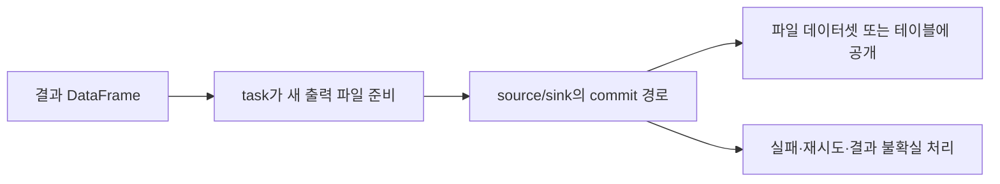

# 07. 읽기와 쓰기

[이 책의 목차](README.md) · [이전 장](06-memory-and-performance.md)

Spark partition, 출력 파일, 테이블 partition은 서로 다른 단위다. 이 장에서는 하나의 파일을 읽고 결과를 쓰는 것부터 테이블의 커밋까지 연결한다.

## 1. Data source가 읽기·쓰기를 제공한다

**Data source**는 Spark가 데이터에 접근하는 경로다. CSV·JSON·Parquet 파일, JDBC 테이블, Kafka, Iceberg connector 등이 예다. Source별 schema·필터·분산 읽기·쓰기·commit 지원은 다르다.

CSV는 문자 구분자로 값을 나타내고 JSON은 키와 값의 구조를 나타낸다. Parquet는 컬럼 단위 저장을 제공한다. 확장자가 같다고 모든 파일이 같은 schema·단위·시간 의미를 갖지는 않는다.

```text
CSV/JSON → schema와 파싱 정책 → DataFrame
Parquet → 파일 schema와 필요한 컬럼 → DataFrame
Iceberg → catalog·snapshot·manifest·파일·삭제 적용 → DataFrame
```

## 2. CSV·JSON은 schema와 오류 정책을 정한다

대규모 파일에서 schema 추론을 반복하면 추가 읽기와 잘못된 타입 추론이 생길 수 있다. 이미 데이터 계약이 있다면 명시적 schema를 사용하고 불량 레코드의 처리 방식을 정한다.

| 경우 | 기록할 정책 |
| --- | --- |
| 숫자 컬럼에 문자열 `error` | 실패·NULL 변환·격리 중 무엇인가? |
| 필수 장치 ID 누락 | 거부하거나 불량 테이블로 분리할 것인가? |
| JSON 필드 추가 | 허용 범위와 schema 변경 책임은 누구인가? |
| 시간 문자열 포맷 혼합 | 어떤 format·timezone으로 해석하는가? |

실패한 행을 모두 버리면 계산은 빨라질 수 있어도 데이터 손실을 숨긴다. 유효 행 수·불량 행 수·원인별 수를 집계하고 원천 위치를 연결한다.

## 3. Parquet에서 필요한 컬럼과 row group을 읽는다

**Row group**은 Parquet에서 여러 행의 컬럼 묶음을 구성하는 단위다. Spark는 필요한 컬럼만 읽고 지원되는 조건·통계를 이용해 일부 후보를 제외할 수 있다.

```sql
SELECT device_id, AVG(temperature)
FROM parquet_measurements
WHERE event_time >= TIMESTAMP '2026-10-01 00:00:00'
  AND event_time < TIMESTAMP '2026-10-02 00:00:00'
GROUP BY device_id;
```

위 계산에는 모든 다른 컬럼이 필요하지 않을 수 있다. `explain`의 scan에서 `ReadSchema`, `PushedFilters`, `PartitionFilters` 등 지원되는 항목을 확인한다. 출력에 filter가 존재한다고 모든 데이터가 storage에서 이미 걸러졌다는 뜻은 아니다.

## 4. 네 가지 partition·파일 단위를 구별한다

| 단위 | 관리 주체·목적 | 관계 |
| --- | --- | --- |
| Spark input partition | 읽기 task에 나누는 실행 단위 | 파일 split·여러 파일 묶음 등으로 결정 |
| Spark shuffle partition | 재분배 뒤 task에 나누는 실행 단위 | group·join·repartition과 설정·AQE 영향 |
| 저장 테이블 partition | 날짜·지역 등으로 저장 데이터를 묶는 규칙 | 파일 배치와 pruning에 사용 |
| Parquet file / row group | 저장 바이트와 파일 내부 조직 | task·table partition과 일대일 아님 |

큰 파일 하나를 여러 task가 split해 읽을 수도 있고 작은 파일 여러 개를 한 task에 묶을 수도 있다. 출력 task가 여러 table partition에 걸친 데이터를 쓰면 여러 파일을 만들 수 있다.

## 5. `partitionBy`와 `repartition`을 혼동하지 않는다

Spark 파일 writer의 `partitionBy("date")`는 경로 기반으로 값을 묶어 저장하는 규칙이다. `repartition`은 DataFrame의 실행 분포를 바꾸는 연산이다.

```text
clean.repartition(4).write.partitionBy("date").parquet(output_path)
```

이 표현을 “정확히 파일 4개 생성”으로 읽지 않는다. 날짜 수·각 task에 들어간 날짜·쓰기 설정 등에 따라 파일 수가 달라질 수 있다. 빈 task·파일 크기 제한·동적 writer 동작도 영향을 준다.

Iceberg의 hidden partitioning과 파일 writer의 폴더 기반 `partitionBy`는 다른 인터페이스다. Iceberg 테이블은 table partition spec과 지원되는 writer distribution 규칙을 따른다.

## 6. 작은 파일이 늘어나는 이유

한 partition에 입력이 조금씩 들어오고 자주 commit하면 작은 파일이 생기기 쉽다. 작은 파일이 많으면 파일 목록·메타데이터·요청·task 준비 비용이 늘 수 있다.

```text
한 번에 1 GiB 입력 → 여러 적절한 크기의 파일 후보
1 MiB 입력을 1024번 각각 저장 → 1024개의 작은 파일 후보
```

교육용 비교이며 실제 파일 수는 writer와 partition 배치에 따라 달라진다. 새 출력 배치, trigger, 입력 묶음, table partition cardinality, compaction을 함께 검토한다.

`coalesce(1)`로 모든 출력을 하나에 모으면 작은 파일 수는 줄일 수 있지만 쓰기 병렬성이 한쪽으로 몰린다. 매우 큰 결과에서 무조건 사용하는 일반 최적화로 생각하지 않는다.

## 7. Append·overwrite·기존 경로 처리

**Append**는 기존 대상에 결과를 추가하는 방식, **overwrite**는 정해진 범위를 새 결과로 교체하는 방식이다. 무엇을 교체하는지는 데이터 소스·API·설정에 따라 확인해야 한다.

파일 경로를 직접 overwrite하는 것과 Iceberg 테이블의 snapshot commit으로 파일 집합을 교체하는 것은 다른 동작이다. Dynamic/static overwrite, partition overwrite의 범위를 혼동하면 정상 데이터를 제거할 수 있다.

로컬 실습에서는 자신이 만든 새로운 임시 경로를 사용한다. 재실행을 편하게 하려고 사용자 기존 경로를 광범위하게 지우는 방식은 사용하지 않는다.



파일시스템 rename에 의존하는 commit과 객체 저장소·카탈로그 commit은 보장과 요구가 다르다. Local에서 성공한 writer를 경로만 S3로 바꾸어 동일한 동시성·실패 동작이라고 단정하지 않는다.

## 8. 파일 저장과 Iceberg 테이블 저장

```text
일반 Parquet 저장:
DataFrame → Parquet 파일들 → 파일 경로로 다시 읽기

Iceberg 테이블 저장:
DataFrame → 데이터/삭제 파일 → manifests와 snapshot 준비
          → catalog commit → 이름과 snapshot으로 읽기
```

Iceberg에서는 저장소에 파일이 생겨도 아직 유효 snapshot이 참조하지 않으면 일반 테이블 조회에 공개되지 않을 수 있다. 과거 snapshot·실패한 쓰기의 파일이 저장소에 남아 있을 수도 있다.

**실제 데이터 파일을 직접 읽은 결과와 Iceberg 테이블을 읽은 결과는 다를 수 있다.** 후자는 현재 파일 집합과 관련 삭제 정보를 적용한다. 정확한 경로는 [09장](09-iceberg-integration.md)과 [Iceberg 내부 지도](../apache-iceberg/01-metadata-and-files.md)를 참고한다.

## 9. JDBC 읽기·쓰기에서의 분산 경계

**JDBC(Java Database Connectivity)**는 JVM 프로그램이 관계형 DB에 연결하는 API다. JDBC source를 여러 partition으로 읽으면 여러 연결·쿼리가 원천 DB에 부하를 줄 수 있다.

읽기 범위 분할 설정을 원천의 행 필터와 동일하다고 가정하지 않는다. 각 partition의 질의 범위·NULL 처리·일관된 snapshot 제공 여부를 확인한다. 쓰기 task마다 DB transaction이 생기는 경로를 Spark application 전체의 단일 transaction으로 확대하지 않는다.

분산 처리 속도를 위해 원천 DB 연결 수를 무조건 늘리면 운영 DB를 압박할 수 있다. 조회용 복제본·추출 범위·동시성 제한·source 보장을 함께 고려한다.

## 10. 확인 질문과 해설

**질문.** 입력 Parquet 파일이 10개면 Spark task도 정확히 10개인가?

**해설.** 아니다. Split·묶음·파일 크기·source 계획으로 달라질 수 있다.

**질문.** `repartition(4)` 뒤 날짜로 partitionBy하면 출력은 반드시 4개 파일인가?

**해설.** 아니다. 실행 partition과 저장 partition은 다른 축이다.

**질문.** 새 Parquet를 저장했으니 Iceberg 테이블 입력도 완료되었는가?

**해설.** Iceberg의 유효 metadata·snapshot 커밋이 필요하다.

## 공식 자료

[SQL data sources](https://spark.apache.org/docs/4.2.0/sql-data-sources.html), [Parquet](https://spark.apache.org/docs/4.2.0/sql-data-sources-parquet.html), [CSV](https://spark.apache.org/docs/4.2.0/sql-data-sources-csv.html), [JDBC](https://spark.apache.org/docs/4.2.0/sql-data-sources-jdbc.html), [Iceberg Spark writes](https://iceberg.apache.org/docs/latest/spark-writes/)를 참고한다.

[다음: 08. Structured Streaming](08-structured-streaming.md)
