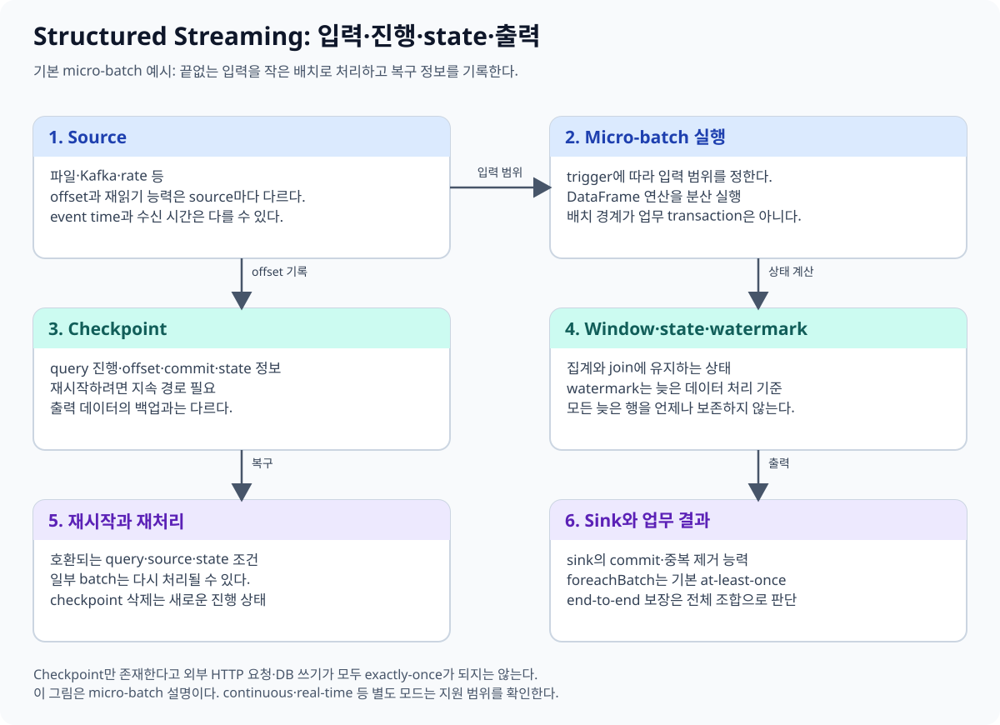
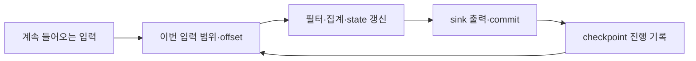
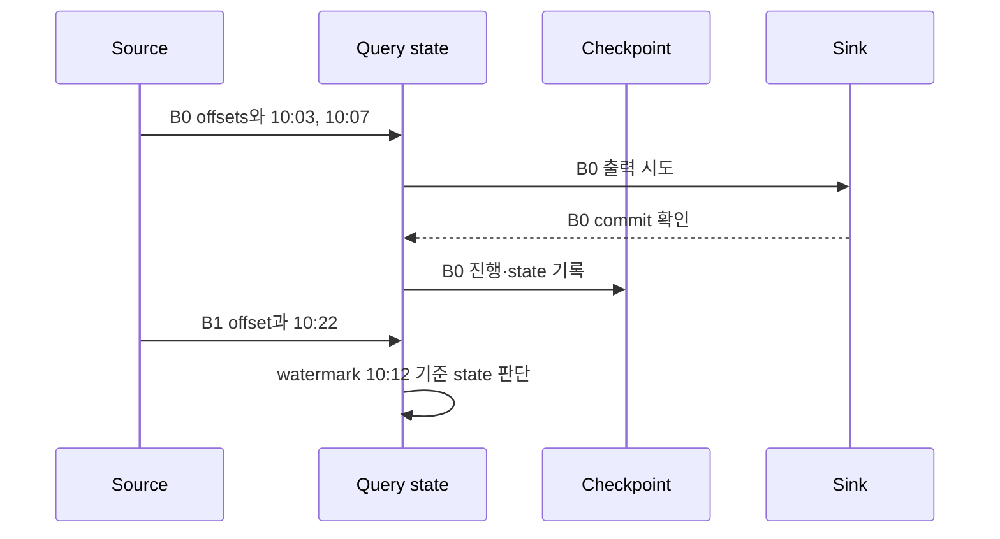
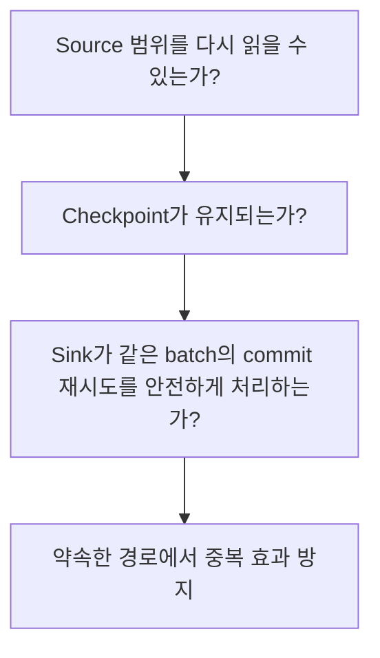
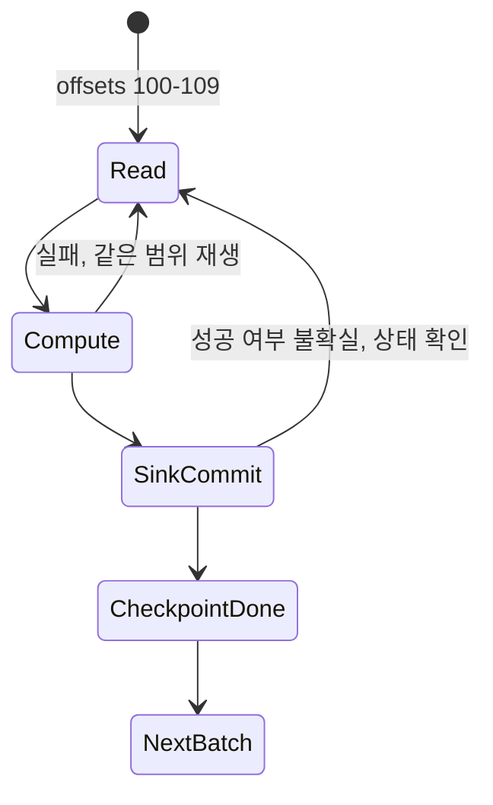

# 08. Structured Streaming

[이 책 목차](README.md) · [이전](07-reading-and-writing.md) · [다음](09-iceberg-integration.md)

끝없이 들어오는 데이터에 대한 계산을 DataFrame과 SQL로 표현한다. 실행 엔진의 처리 보장과 원천·sink·업무 중복의 조건을 나누어 이해한다.



## 1. 끝없는 표의 일부를 반복 처리한다

Batch는 범위가 정해진 입력, streaming은 계속 늘어나는 입력을 다룬다. 기본 micro-batch 실행은 새 입력을 작은 범위로 나누어 이전 상태와 함께 처리한다.



그림은 이해를 위한 관계다. 실제 commit·offset·state 로그의 순서는 엔진과 sink 계약을 따른다. 파일 원천·Kafka 원천·사용자 sink가 모두 같은 보장을 갖는 것은 아니다.

## 2. Source·sink·trigger

**Source**는 입력 경로, **sink**는 출력 경로, **trigger**는 다음 실행을 언제 시작할지 정하는 방식이다.

| 예 | 의미 |
| --- | --- |
| Kafka source | Topic partition과 offset으로 입력 범위 식별 |
| File source | 새 입력 파일을 발견해 처리 |
| `processingTime` trigger | 주기적으로 새 범위를 처리 |
| `availableNow` trigger | 현재 이용 가능한 입력을 처리한 뒤 종료 |
| File·Iceberg·사용자 sink | 각각의 출력·commit 계약을 확인 |

주기 1초를 설정해도 계산이 5초 걸리면 결과가 반드시 1초마다 완료되지는 않는다. 입력 backlog·처리 시간·커밋·조회 지연을 함께 관찰한다.

## 3. 네 가지 시간

| 시각 | 뜻 |
| --- | --- |
| Event time | 실제 사건 발생 시각 |
| Ingestion time | 입력 시스템에 도착한 시각 |
| Processing time | 엔진이 계산하는 시각 |
| Commit time | 출력 테이블 상태가 확정되는 시각 |

어제 측정값이 오늘 늦게 도착하면 어제 구간의 집계에 영향을 줄 수 있다. 서버의 시계 동기화와 timezone도 명시한다.

## 4. Window와 state

**Window**는 시간 구간 등으로 묶어 계산하는 범위다. 예를 들어 10분 단위의 장치 평균을 구할 수 있다. **State**는 이후 입력을 처리할 때 필요한 누적 정보다. 집계의 합계·개수나 중복 제거 key 집합이 예다.

```text
첫 묶음: 10:00~10:10 S1의 sum=20, count=1
다음 묶음: 같은 구간의 S1=22 도착
새 state: sum=42, count=2 → 평균 21
```

State가 끝없이 늘면 메모리·디스크·checkpoint 비용이 커진다. 어느 시점에 결과를 확정하고 state를 정리할지 정해야 한다.

## 5. Watermark는 늦은 사건과 정리의 기준이다

**Watermark**는 event-time 진행과 허용 지연을 이용해 늦은 데이터 처리·state 정리를 결정하는 기준이다. 지원되는 연산에서 특정 지연 이내 데이터가 처리되도록 하는 보장이 있으며, 그보다 오래 늦은 데이터의 처리 여부는 실행 조건에 따라 달라질 수 있다.

```text
설명용 표현
events.withWatermark("event_time", "10 minutes")
```

이 설정이 “모든 결과를 정확히 10분 기다리고 출력”하거나 “10분 늦으면 모든 경로에서 즉시 버림”을 뜻하지는 않는다. Window·join·output mode·state 연산의 조건을 확인한다.

## 6. Output mode

### Watermark가 움직이는 정확한 시점 예제

10분 tumbling window와 10분 watermark 지연을 사용한다고 하자. 아래 값은 개념을 설명하기 위한 시각이다. Watermark는 일반적으로 관측한 최대 event time에서 지연을 뺀 값에 근거하며, 실제 진행은 query와 batch 경계에서 반영된다.

| micro-batch | 도착한 event time | 관측 최대 event time | 설명용 watermark | 10:00~10:10 state |
| --- | --- | --- | --- | --- |
| B0 | 10:03, 10:07 | 10:07 | 09:57 | 유지, 두 행 집계 |
| B1 | 10:22 | 10:22 | 10:12 | 연산 조건에 따라 10:00 window 정리 가능 |
| B2 | 10:05 늦은 행 | 10:22 | 10:12 | 이미 제거된 state에는 반영되지 않을 수 있음 |

B1에서 처리 시각이 11:00이어도 기준은 10:22라는 event time 진행이다. 반대로 processing time이 빨라도 event time이 10:08에 머물면 watermark도 충분히 나아가지 않아 오래된 state가 남을 수 있다. “벽시계로 10분 지났으니 state 삭제”라는 해석은 틀리다.

Append mode의 window 집계에서는 결과가 더 이상 바뀌지 않는다고 판단할 수 있어야 출력할 수 있다. Update mode는 그 전에 변경된 집계를 낼 수 있지만 sink가 같은 업무 key의 여러 버전을 어떻게 다룰지 정해야 한다. Watermark는 output mode와 stateful operator의 조건 속에서 해석한다.



이 순서 그림은 계약을 이해하기 위한 모형이다. 내부 로그 기록 순서를 모든 source와 sink에 고정하지 않는다. 핵심은 source의 재생 가능한 범위, checkpoint의 batch 식별, sink의 commit이 함께 있어야 재시도 중복 효과를 통제할 수 있다는 점이다.

### 실패 지점별 보장 경계

| 실패 시점 | 재시작 때 필요한 것 | 중복 위험 |
| --- | --- | --- |
| Source를 읽기 전 | 유지된 checkpoint | 이전 완료 offset 뒤에서 계속 |
| 계산 후 sink commit 전 | 재생 가능한 source와 state | 같은 batch 계산 재실행 |
| Sink commit 성공 후 응답 유실 | batch ID를 아는 sink 계약 | sink가 멱등하지 않으면 중복 효과 |
| Checkpoint 삭제 후 | 새 query 시작 정책 | 과거 입력 재독·state 유실 |

파일 sink처럼 query가 지원하는 commit protocol을 사용하는 경로와 `foreachBatch`에서 임의 REST API를 호출하는 경로는 같은 보장이 아니다. `batchId=17`을 외부 저장소의 고유 key로 기록하고 이미 처리한 ID를 거절하도록 만들 수 있지만, 외부 요청과 그 기록이 원자적으로 묶이지 않으면 사이 실패를 별도로 다뤄야 한다.

**반례.** Kafka offset 100의 event ID `E7`과 offset 205의 event ID `E7`은 서로 다른 source 레코드다. 엔진이 각 offset을 정확히 한 번 sink에 반영해도 업무상 주문 `E7`은 두 번일 수 있다. Source 처리 보장과 event ID deduplication은 별도 계약이다.

| 모드 | 의미 | 대표 주의점 |
| --- | --- | --- |
| Append | 새로 추가되는 결과 행 출력 | Stateful 결과 확정에는 watermark 등이 필요할 수 있음 |
| Update | 바뀐 결과 행 출력 | Sink가 해당 mode와 의미를 지원해야 함 |
| Complete | 결과 테이블 전체 출력 | 큰 state·출력 비용, sink 지원 확인 |

출력 모드와 sink의 append/overwrite·업무 upsert는 동일한 용어가 아니다. 최신 상태 테이블을 만들려면 key·삭제·순서의 의미를 정한다.

## 7. Checkpoint와 exactly-once

Checkpoint는 입력 진행·query 식별·state 등 복구 정보를 보관한다. 재생 가능한 source, checkpoint 로그, 올바른 idempotent/transactional sink가 맞물려 end-to-end 보장 범위를 만든다.



`foreachBatch`의 기본 전달 의미는 at-least-once다. Batch ID를 이용한 deduplication이나 sink transaction을 별도로 설계해야 중복 효과를 통제할 수 있다. 임의의 외부 API 호출이 자동으로 한 번만 실행되는 것은 아니다.

원천에 같은 event ID가 서로 다른 offset으로 두 번 들어 있으면 두 입력을 각각 정확히 한 번 처리해도 업무 중복이 남는다. Exactly-once는 데이터의 의미적 유일성을 대신하지 않는다.

## 8. 재시작과 변경

### 같은 checkpoint로 재시작하는 경우와 새 query를 구분한다

Kafka partition 0의 offset 100~109를 batch 7이 처리한다고 하자. Query가 계산을 끝낸 뒤 sink commit 전에 죽으면 checkpoint에는 batch 7 완료가 기록되지 않을 수 있다. 재시작은 같은 범위를 다시 계산한다. Sink가 batch 7의 재시도를 식별하지 못하면 외부 효과가 두 번 생길 수 있다.

반대로 sink commit은 성공했지만 driver가 성공 응답을 받기 전에 죽을 수도 있다. 이때도 query는 batch 7을 재시도할 수 있다. Transactional sink나 `batchId=7` 멱등 key가 이미 commit된 출력을 알아보아야 중복 효과를 막는다.

| source 위치 | checkpoint 상태 | sink 상태 | 재시작 판단 |
| --- | --- | --- | --- |
| 100~109 읽음 | batch 7 미완료 | 미커밋 | 100~109 다시 계산 |
| 100~109 읽음 | batch 7 미완료 | commit 성공 | sink가 batch 7 재시도를 식별해야 함 |
| 100~109 읽음 | batch 7 완료 | commit 성공 | 다음 offset 범위로 진행 |
| checkpoint 삭제 | 과거 식별 없음 | 기존 결과 남음 | 새 query 정책과 중복 cutover 필요 |



Checkpoint는 단순히 “마지막 offset 숫자 하나”가 아니다. Query metadata, source 진행, state store 정보, commit log 등이 query에 맞물린다. Stateful aggregate의 checkpoint를 버리고 offset만 수동으로 맞추면 이전 window 합계·deduplication key가 사라져 결과가 달라질 수 있다.

### Source·엔진·sink·업무 보장을 네 층으로 기록한다

| 층 | 질문 | `E7` 중복 예시 |
| --- | --- | --- |
| Source | 같은 범위를 재생할 수 있는가? | Kafka offset 100과 205는 둘 다 유효 |
| Engine checkpoint | 완료한 batch를 식별하는가? | batch 7 재시도 여부 기록 |
| Sink | 같은 batch commit을 멱등 처리하는가? | batch 7 두 번째 commit 거절 |
| 업무 데이터 | event ID가 유일한가? | offset이 달라도 `E7`이면 dedup 필요 |

이 네 층 중 하나만 “exactly-once”라고 부르고 전체 시스템을 같은 말로 단정하면 장애 시 해석이 어긋난다. 특히 `foreachBatch`가 JDBC나 REST API에 여러 독립 write를 한다면 그 write 전체가 한 transaction인지, 일부 성공 뒤 재시도될 수 있는지 확인한다.

Watermark state도 checkpoint에 연결된다. B1까지 최대 event time 10:22를 관찰한 query를 빈 checkpoint로 다시 시작하면 이전 state와 watermark 진행을 잃는다. Source를 과거부터 다시 읽으면 state를 재구성할 수 있지만 sink의 기존 결과와 중복될 수 있고, 최신부터 읽으면 과거 state를 복구하지 못한다.

**반례.** `startingOffsets=latest`를 지정해도 기존 checkpoint가 선택한 복구 위치를 무조건 덮어쓰는 스위치가 아니다. 새 query의 시작 옵션과 기존 query 복구를 구분한다.

같은 checkpoint로 재시작하면 기록된 진행 위치를 사용한다. Kafka의 `startingOffsets`는 새 query 시작과 기존 checkpoint 복구에서 의미가 다르다.

Stateful query에서 shuffle partition 수·state store provider·state schema·watermark 정책 등의 변경은 checkpoint 호환성을 깨뜨릴 수 있다. 새 checkpoint가 필요하면 기존 sink 데이터와 중복·cutover를 함께 설계한다.

## 9. Iceberg와 연결할 때

Iceberg sink의 지원 output mode·trigger·commit 경로를 해당 runtime에서 확인한다. Spark의 모든 streaming 모드가 모든 Iceberg sink에 지원되는 것은 아니다.

Iceberg append streaming read는 전체 UPDATE·DELETE 이력을 자동으로 CDC 이벤트로 출력하는 기능과 다르다. Snapshot 종류·changelog 지원·retention과 reader 지연을 함께 고려한다.

## 10. 확인 문제

**질문.** Checkpoint를 삭제하고 다시 시작해도 같은 query 복구인가?

**해설.** 새 시작으로 입력을 다시 읽을 수 있다. 중복·state·sink 식별 정책을 확인한다.

**질문.** Watermark를 설정하면 원천의 늦은 데이터가 없어진 것인가?

**해설.** 원천 도착과 처리 정책은 별개다. 제외·정리되는 범위와 품질 요구를 정한다.

**질문.** `foreachBatch`에 DB insert를 작성하면 자동 exactly-once인가?

**해설.** 아니다. 재시도 중복을 sink에서 통제해야 한다.

## 공식 자료

[Structured Streaming](https://spark.apache.org/docs/4.2.0/streaming/index.html), [DataFrame streaming APIs](https://spark.apache.org/docs/4.2.0/streaming/apis-on-dataframes-and-datasets.html), [Iceberg streaming](https://iceberg.apache.org/docs/latest/spark-structured-streaming/)을 참고한다.
