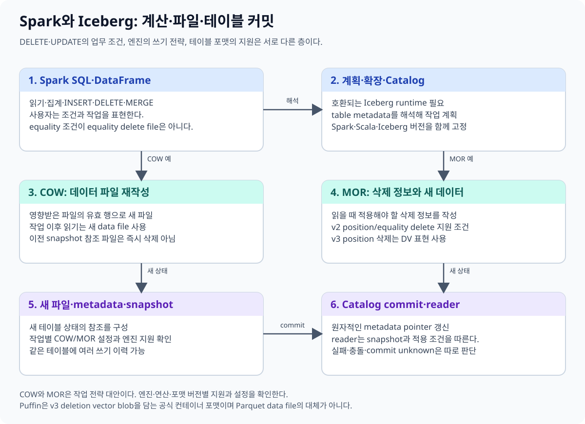
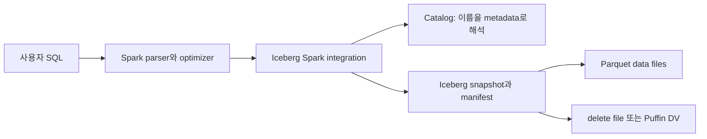
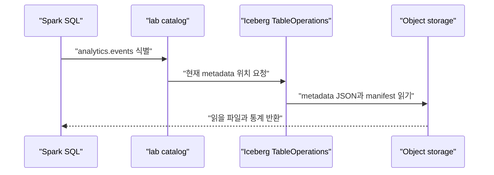
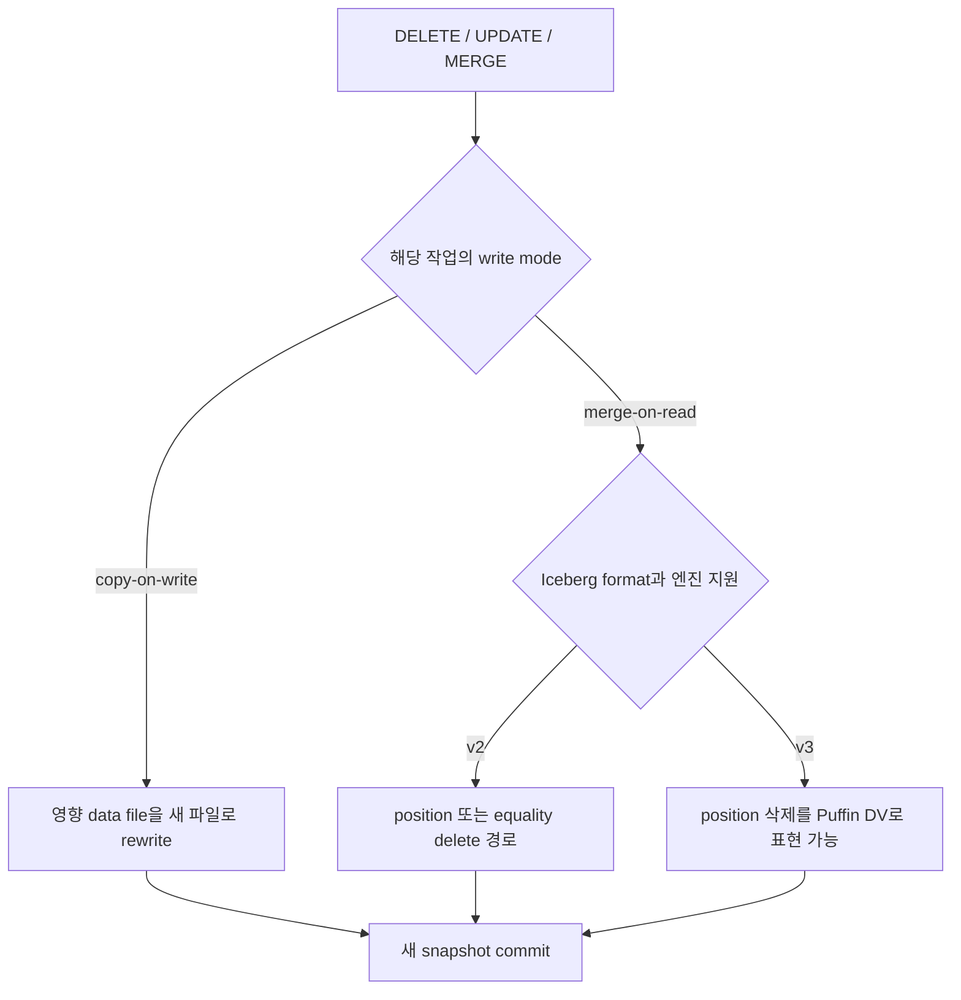
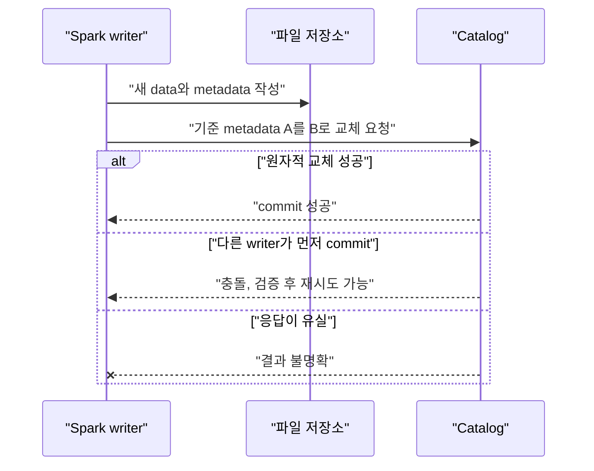

# 09. Spark와 Iceberg를 함께 읽는 법

[이 책 목차](README.md) · [이전: Structured Streaming](08-structured-streaming.md) · [다음: 배포와 Spark Connect](10-deployment-and-connect.md)

Spark와 Iceberg를 처음 함께 쓰면 이름이 모두 “데이터 시스템”처럼 보여 역할이 섞이기 쉽다. 이 장의 목표는 SQL 한 줄이 어느 계층을 지나 어떤 파일과 메타데이터를 바꾸는지 설명하는 것이다. Iceberg 내부 형식의 자세한 설명은 [별도 Iceberg 교재](../apache-iceberg/README.md)에 맡기고, 여기서는 Spark가 그 형식을 어떻게 사용하는지에 집중한다.



## 1. 네 가지 역할부터 분리한다

| 구성 요소 | 맡는 일 | 맡지 않는 일 |
| --- | --- | --- |
| Spark 엔진 | SQL 분석, 실행 계획 작성, task 분배, 파일 읽기·쓰기 | 테이블의 영구 이력 자체가 되지는 않음 |
| Iceberg 테이블 포맷 | snapshot, schema, partition, data/delete file 관계와 commit 규칙 정의 | CPU·메모리를 배정해 쿼리를 실행하지 않음 |
| Parquet 파일 | 실제 행을 columnar 형식으로 저장 | 어떤 파일이 현재 테이블에 속하는지 결정하지 않음 |
| Catalog | `prod.sales.orders` 같은 이름을 현재 Iceberg metadata 위치로 연결 | SQL join 순서나 executor 수를 결정하지 않음 |

**엔진**은 계산을 수행하는 프로그램이고 **테이블 포맷**은 파일 집합을 테이블로 해석하는 계약이다. **파일 형식**은 각 파일 내부의 byte 배치를 정의하며, **catalog**는 이름을 테이블 metadata로 해석한다.



`SELECT * FROM prod.sales.orders`를 실행할 때 Spark는 파일 이름을 추측하지 않는다. `prod` catalog에서 `sales.orders`를 찾고, 현재 metadata와 snapshot을 따라가며 읽을 data/delete file을 계획한다. 이 계층 구조는 Iceberg [Spark configuration](https://iceberg.apache.org/docs/latest/spark-configuration/)과 [Table specification](https://iceberg.apache.org/spec/)에 정의되어 있다.

## 2. 실행 조합은 네 숫자를 함께 고정한다

이 책의 실제 검증 기준선은 다음과 같다.

| 항목 | 고정값 |
| --- | --- |
| PySpark | `4.0.4` |
| Scala binary | `2.13` |
| Java | `21` |
| Iceberg | `1.12.0` |
| runtime artifact | `org.apache.iceberg:iceberg-spark-runtime-4.0_2.13:1.12.0` |

2026-10-09 현재 Spark의 최신 안정 계열은 4.2.0이지만, Iceberg 1.12.0 공식 지원표에는 Spark 3.5, 4.0, 4.1 integration이 있고 4.2 runtime artifact는 없다. 따라서 “각 프로젝트의 최신 버전”을 조합하면 된다고 생각하면 안 된다. 실제 지원 artifact가 있는 조합을 고른다. 근거는 Spark [4.2.0 release](https://spark.apache.org/releases/spark-release-4-2-0.html), Iceberg [1.12.0 release](https://iceberg.apache.org/blog/apache-iceberg-1.12.0-release/), [multi-engine support](https://iceberg.apache.org/multi-engine-support/)에서 확인한다.

다음은 읽기용 고정 설정 예시다. 의존성을 내려받는 명령이므로 이 문서에서는 실행하지 않는다.

```text
spark-submit \
  --packages org.apache.iceberg:iceberg-spark-runtime-4.0_2.13:1.12.0 \
  app.py
```

```text
# 문서 예시: 실행 환경에는 해당 Iceberg JAR가 먼저 있어야 한다.
from pyspark.sql import SparkSession

spark = (
    SparkSession.builder
    .appName("iceberg-reader")
    .master("local[2]")
    .config(
        "spark.sql.extensions",
        "org.apache.iceberg.spark.extensions.IcebergSparkSessionExtensions",
    )
    .config("spark.sql.catalog.lab", "org.apache.iceberg.spark.SparkCatalog")
    .config("spark.sql.catalog.lab.type", "hadoop")
    .config("spark.sql.catalog.lab.warehouse", "/tmp/iceberg-warehouse")
    .getOrCreate()
)
```

`IcebergSparkSessionExtensions`는 Iceberg의 행 변경 SQL과 procedure 같은 확장을 Spark에 연결한다. `SparkCatalog`는 Spark catalog API 요청을 Iceberg catalog 작업으로 바꾼다. 운영에서는 `/tmp`가 아니라 지속 저장소와 적절한 catalog를 사용한다.

이 `/tmp` HadoopCatalog 구성은 한 프로세스 교육용이며 여러 writer의 동시 commit 안전성을 검증한 구성이 아니다.

## 3. 이름은 어떻게 실제 테이블이 되는가

`lab.analytics.events`는 세 부분 이름이다.

- `lab`: Spark session에 등록된 catalog 이름
- `analytics`: namespace
- `events`: table 이름



Iceberg의 Spark integration은 Hadoop, Hive, REST, Glue, JDBC, Nessie 등의 catalog 구성을 지원한다. 이름은 비슷해도 동시 commit, 인증, 잠금 또는 원자적 pointer 갱신 방식이 다르므로 backend 문서를 함께 읽는다. 구성 종류는 공식 [Spark configuration](https://iceberg.apache.org/docs/latest/spark-configuration/)에 정리되어 있다.

REST catalog 예시는 다음과 같다.

```text
spark.sql.catalog.prod=org.apache.iceberg.spark.SparkCatalog
spark.sql.catalog.prod.type=rest
spark.sql.catalog.prod.uri=https://catalog.example.internal
spark.sql.catalog.prod.warehouse=analytics
```

이 예시는 자격 증명과 TLS 설정을 생략했다. 실제 값은 catalog 운영자가 제공해야 한다.

## 4. SQL 조건과 delete file 형식을 혼동하지 않는다

```sql
DELETE FROM lab.analytics.events
WHERE customer_id = 7;
```

여기서 `customer_id = 7`은 사용자가 원하는 **논리 조건**이다. 이 SQL을 썼다고 반드시 equality delete file이 생기는 것은 아니다. Spark와 Iceberg integration은 테이블 설정, 포맷 버전, 실행 계획에 따라 data file rewrite, position delete, deletion vector 등을 선택할 수 있다.

| 층 | 질문 | 예시 |
| --- | --- | --- |
| SQL | 어떤 행을 결과에서 없앨까? | `customer_id = 7` |
| write mode | 기존 data file을 다시 쓸까? | COW 또는 MOR |
| delete 표현 | MOR 삭제를 물리적으로 어떻게 기록할까? | v2 position/equality delete, v3 DV |

Spark의 `DELETE`, `UPDATE`, `MERGE` 동작은 Iceberg [Spark writes](https://iceberg.apache.org/docs/latest/spark-writes/)에 설명되어 있고, delete 형식 자체는 [Iceberg 교재 05장](../apache-iceberg/05-format-v1-v2.md)과 [06장](../apache-iceberg/06-format-v3.md)에서 더 자세히 다룬다.

## 5. COW와 MOR은 작업별 설정이다

Iceberg의 Spark write property는 delete, update, merge마다 따로 있다. 기본값은 `copy-on-write`다.

```sql
ALTER TABLE lab.analytics.events SET TBLPROPERTIES (
  'write.delete.mode' = 'merge-on-read',
  'write.update.mode' = 'merge-on-read',
  'write.merge.mode' = 'copy-on-write'
);
```

| 작업 | property | 기본값 |
| --- | --- | --- |
| `DELETE` | `write.delete.mode` | `copy-on-write` |
| `UPDATE` | `write.update.mode` | `copy-on-write` |
| `MERGE INTO` | `write.merge.mode` | `copy-on-write` |

COW는 영향받은 data file을 읽고 살아남은 행으로 새 파일을 만든다. MOR는 기존 data file을 유지하고 삭제 정보를 추가한 뒤 reader가 합쳐 읽는다. 전체 partition이나 data file이 조건에 완전히 포함되면 metadata에서 그 파일 참조를 제거하는 최적화가 가능하므로 “DELETE 한 번은 delete file 한 개”라는 계산은 맞지 않는다. property 기본값은 공식 [Configuration](https://iceberg.apache.org/docs/latest/configuration/)에서 확인한다.



v3라고 모든 변경이 DV가 되는 것도 아니다. COW라면 data file을 다시 쓰며, 파일 전체 삭제는 metadata-only가 될 수 있다. 실제 생성물을 확인하려면 SQL 문장보다 metadata table을 본다.

## 6. 읽기는 논리 테이블과 물리 파일을 함께 해석한다

`SELECT` 결과에는 현재 snapshot에서 유효한 data file 행만 나타난다. 과거 snapshot이 참조하는 옛 Parquet 파일이 저장소에 남아 있어도 현재 쿼리는 그것을 자동으로 합치지 않는다. 반대로 MOR의 현재 data file에는 논리적으로 삭제된 row byte가 남을 수 있으며 reader가 delete 정보를 적용한다.

```text
논리 결과 = 현재 snapshot의 data rows
          - 적용 가능한 delete rows
          + 같은 snapshot에서 추가된 rows
```

따라서 객체 저장소에서 `*.parquet`를 직접 glob하여 읽는 코드는 Iceberg 테이블 읽기와 다르다.

```text
# Iceberg metadata와 delete를 적용하는 테이블 읽기
df = spark.table("lab.analytics.events")

# 단순 Parquet glob: Iceberg 테이블의 현재 상태를 보장하지 않는다.
raw = spark.read.parquet("/warehouse/analytics/events/data/*.parquet")
```

## 7. schema와 partition evolution은 ID와 변환으로 읽는다

Iceberg는 column 이름만이 아니라 field ID로 schema를 추적한다. 이름을 바꾸어도 같은 field ID라면 과거 파일의 열과 연결할 수 있다. partition evolution에서는 과거 파일과 새 파일이 서로 다른 partition spec을 사용할 수 있고, Spark reader는 각 파일의 spec을 이용해 계획한다. 자세한 내부 규칙은 [Iceberg 교재 03장](../apache-iceberg/03-schema-and-partition-evolution.md)을 본다.

```sql
ALTER TABLE lab.analytics.events RENAME COLUMN payload TO event_payload;

ALTER TABLE lab.analytics.events
ADD PARTITION FIELD days(event_time);
```

사용자는 원래 열 조건을 작성한다.

```sql
SELECT event_id, event_payload
FROM lab.analytics.events
WHERE event_time >= TIMESTAMP '2026-10-01 00:00:00';
```

Iceberg 통합은 partition 값과 file 통계로 읽을 파일을 줄이고, Parquet reader는 필요한 column과 row group을 더 줄일 수 있다. 이를 각각 partition pruning, file pruning, column pruning, predicate pushdown이라고 부른다. 필터가 있다고 항상 파일을 0 byte만 읽는 것은 아니며 통계·변환·지원 연산에 따라 범위가 달라진다. Spark의 계획은 `EXPLAIN`, Iceberg의 실제 선택 파일은 metadata table과 실행 metric으로 확인한다.

## 8. 현재 파일을 관찰하는 metadata SQL

```sql
SELECT file_path, file_format, record_count, file_size_in_bytes
FROM lab.analytics.events.files
ORDER BY file_path;

SELECT committed_at, snapshot_id, operation, summary
FROM lab.analytics.events.snapshots
ORDER BY committed_at DESC;

SELECT content, file_path, record_count, equality_ids
FROM lab.analytics.events.entries;
```

`files`는 현재 snapshot의 파일 관찰에 유용하고, `snapshots`는 commit 이력을 보여 준다. `entries`의 실제 schema는 포맷과 버전에 따라 달라질 수 있으므로 `DESCRIBE`로 먼저 확인한다. 목록은 공식 [Spark queries](https://iceberg.apache.org/docs/latest/spark-queries/)를 따른다.

고수준 `spark.table(...).show()`는 논리 결과를 보여 준다. metadata table과 저장소 listing은 물리 상태를 조사하는 수단이다. 둘의 행 수가 같아야 한다는 기대를 하지 않는다.

## 9. procedure는 테이블 유지보수 작업이다

```sql
CALL lab.system.rewrite_data_files(
  table => 'analytics.events',
  options => map('target-file-size-bytes', '536870912')
);

CALL lab.system.expire_snapshots(
  table => 'analytics.events',
  older_than => TIMESTAMP '2026-09-01 00:00:00',
  retain_last => 5
);
```

`rewrite_data_files`는 작은 파일이나 삭제 상태를 새 data file로 정리할 수 있다. `expire_snapshots`는 시간 여행·rollback 가능 범위를 줄일 수 있는 운영 작업이다. 위 날짜와 크기는 예시이며 그대로 운영에 적용하지 않는다. 지원 인자와 안전 조건은 [Spark procedures](https://iceberg.apache.org/docs/latest/spark-procedures/)와 [Maintenance](https://iceberg.apache.org/docs/latest/maintenance/)를 확인한다.

## 10. commit은 원자적이지만 결과 불확실성은 남는다

writer는 새 파일과 metadata를 준비한 다음 catalog의 현재 metadata pointer를 원자적으로 바꾸려 시도한다. 충돌하면 검증·재시도 규칙에 따라 다시 commit할 수 있다. 독자는 이전 snapshot 전체 또는 새 snapshot 전체를 보며 중간 파일 집합을 현재 테이블로 보지 않는다.



네트워크가 끊겨 응답을 받지 못했다고 commit 실패로 단정할 수 없다. catalog에는 새 pointer가 반영되었을 수 있다. 이것이 **unknown commit outcome**이다. 동일 작업을 무조건 다시 실행하면 중복 효과가 날 수 있으므로 현재 table state와 snapshot을 먼저 확인하고 Iceberg가 제공하는 commit 상태 확인·재시도 경로를 따른다. commit 원리는 [Reliability](https://iceberg.apache.org/docs/latest/reliability/)와 [Table specification](https://iceberg.apache.org/spec/)을 참고한다.

## 11. 자주 생기는 오해

| 오해 | 정확한 설명 |
| --- | --- |
| Spark가 테이블 포맷이다 | Spark는 실행 엔진이고 Iceberg가 테이블 포맷이다 |
| Parquet 폴더가 곧 Iceberg 테이블이다 | 현재 snapshot과 manifest가 파일 membership을 결정한다 |
| `WHERE id=7`이면 equality delete다 | SQL 조건과 delete 파일의 물리 표현은 별개다 |
| v3이면 항상 DV다 | COW, metadata-only, 지원 여부에 따라 다른 경로가 가능하다 |
| catalog는 파일 목록만 저장한다 | 이름 해석과 current metadata pointer commit 경계에도 관여한다 |
| 최신 Spark와 최신 Iceberg는 자동 호환된다 | Spark·Scala suffix가 맞는 공식 runtime artifact를 확인해야 한다 |

## 12. 연습 문제

### 문제 1

`DELETE ... WHERE account_id=9`를 실행한 뒤 Puffin 파일이 생기지 않았다. 가능한 이유를 세 가지 적어라.

### 문제 2

현재 논리 테이블은 90행인데 data Parquet를 직접 읽으면 100행이다. 어느 경로가 잘못되었다고 단정할 수 있는가?

### 문제 3

팀이 Spark 4.2.0과 Iceberg 1.12.0을 각각 최신이므로 바로 묶겠다고 한다. 무엇을 먼저 확인해야 하는가?

## 13. 해설

### 해설 1

COW로 설정되어 data file이 rewrite되었을 수 있다. 조건이 파일 전체와 맞아 metadata-only 삭제가 되었을 수 있다. v2 table이거나 해당 Spark/Iceberg 경로가 v3 DV를 쓰지 않았을 수도 있다. `snapshots`, `files`, `entries`를 함께 확인한다.

### 해설 2

Parquet 직접 읽기는 Iceberg snapshot과 delete 정보를 적용하지 않으므로 논리 테이블 읽기가 아니다. MOR 삭제 row가 byte로 남아 있거나 과거 snapshot의 파일이 섞였을 수 있다. 100행만으로 파일 손상을 단정하지 않는다.

### 해설 3

Iceberg가 Spark 4.2·Scala 2.13용 runtime artifact를 제공하고 해당 기능을 지원하는지 확인해야 한다. Iceberg 1.12.0 공식 범위에는 4.2 runtime이 없으므로 이 책은 검증된 4.0.4 조합을 사용한다.

다음 장에서는 이 엔진을 local, standalone, YARN, Kubernetes에 배치할 때 driver와 executor가 어디에서 실행되는지, Spark Connect가 classic client와 무엇이 다른지 살펴본다.
