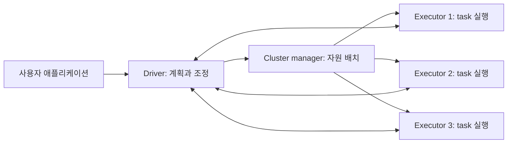
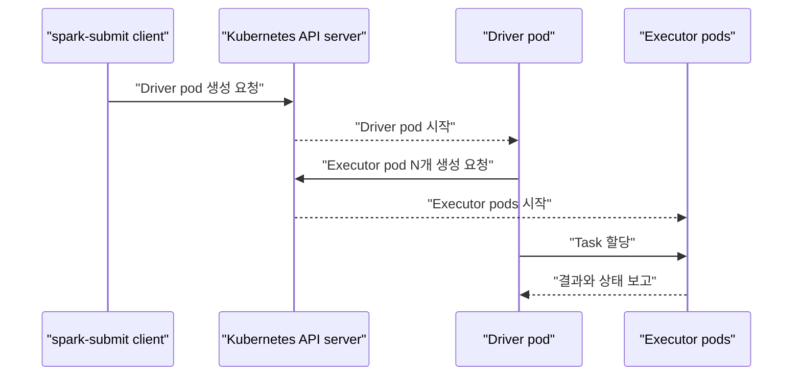
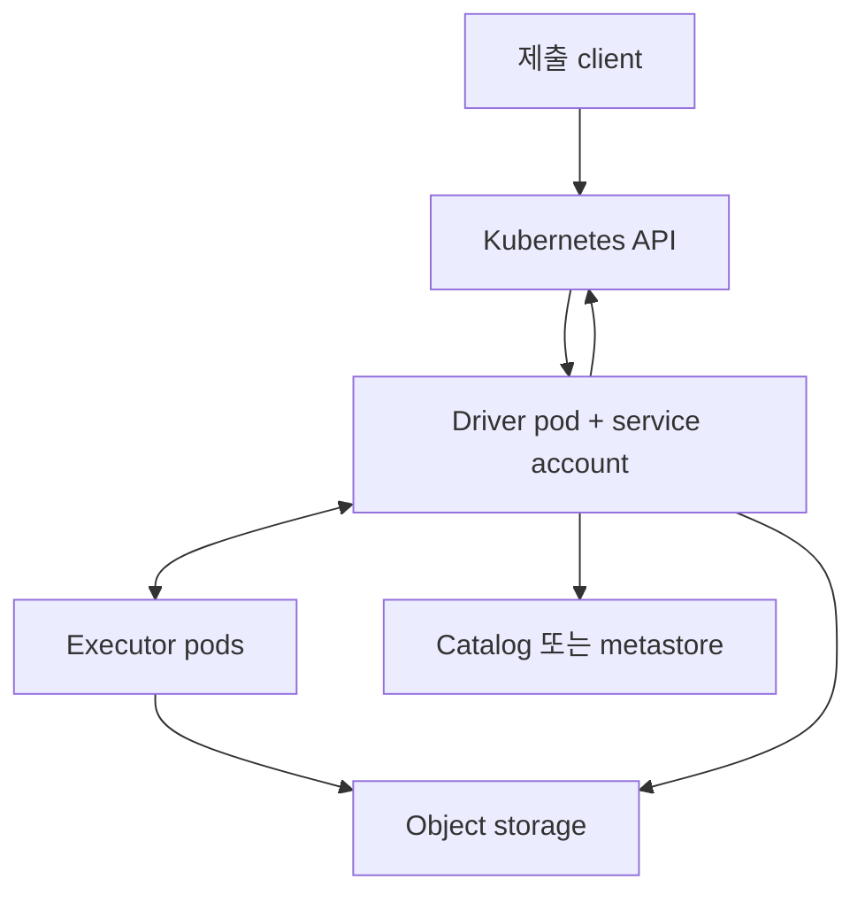
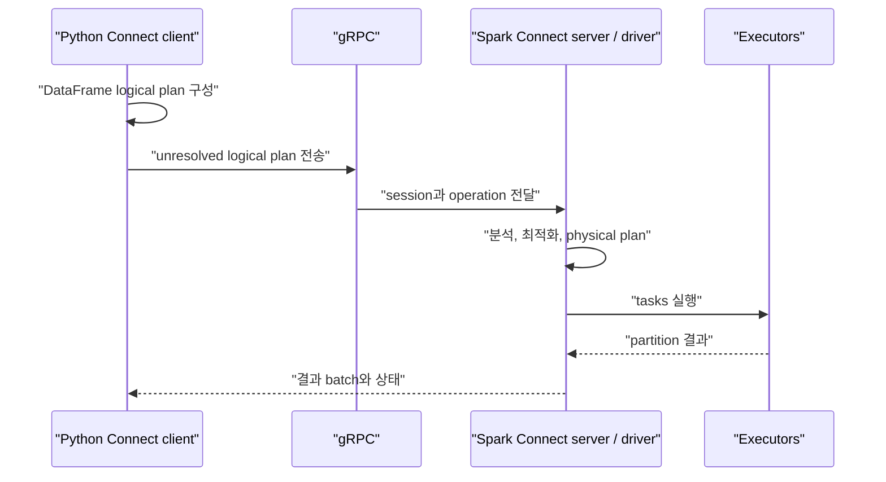

# 10. Spark 배포와 Spark Connect

[이 책 목차](README.md) · [이전: Spark와 Iceberg](09-iceberg-integration.md) · [다음: 로컬 실습](11-local-labs.md)

같은 Spark 프로그램도 어디에서 driver가 실행되고 누가 executor를 만들며 client가 어느 프로세스와 통신하는지에 따라 장애와 보안 경계가 달라진다. 이 장에서는 local, standalone, YARN, Kubernetes 배포를 한 지도에 놓고 Spark Connect를 classic Spark와 구분한다. 예시는 구조를 설명하기 위한 설정 조각이며 운영 cluster를 배포하는 완성 manifest가 아니다.


## 1. 세 프로세스 역할을 먼저 구분한다

**Driver**는 사용자의 main 프로그램을 실행하고 SparkSession을 소유하며 job을 stage와 task로 계획한다. **Executor**는 task를 실행하고 cache·shuffle data를 보관하는 worker 프로세스다. **Cluster manager**는 어느 machine이나 container에 driver·executor 자원을 배치할지 관리한다.



Cluster manager는 query optimizer가 아니다. Catalyst optimizer와 physical planner는 Spark driver 쪽에서 동작한다. Kubernetes scheduler나 YARN ResourceManager는 pod/container 자원을 놓지만 join 순서, partition pruning, shuffle exchange를 설계하지 않는다. 기본 구조는 Spark [Cluster overview](https://spark.apache.org/docs/4.0.4/cluster-overview.html)에 설명되어 있다.

## 2. local mode는 한 machine 안의 학습 환경이다

```text
spark-submit --master 'local[4]' app.py
```

`local[4]`는 한 JVM에서 최대 네 task thread를 사용한다는 뜻이다. 별도 executor JVM과 cluster manager가 생기는 분산 배포가 아니다. driver와 실행 thread가 같은 machine의 CPU, memory, disk를 공유한다.

| 장점 | 한계 |
| --- | --- |
| 시작이 빠르고 debugger 사용이 쉬움 | machine 한 대의 자원만 사용 |
| 단위 실습과 작은 재현에 적합 | 실제 network·executor 손실을 재현하지 못함 |
| 별도 cluster가 필요 없음 | local 경로와 credential에 의존하기 쉬움 |

테스트가 local에서 성공했다는 사실은 분산 object storage 권한, executor network, shuffle, pod eviction까지 검증했다는 뜻이 아니다.

## 3. standalone은 Spark 자체 cluster manager다

Spark standalone cluster는 master와 worker daemon으로 자원을 관리한다. 애플리케이션 driver는 deploy mode에 따라 제출 machine 또는 cluster worker에 놓인다.

제출 예시는 `spark-submit --master spark://spark-master.example:7077 --deploy-mode client --executor-memory 4g --executor-cores 2 app.py`다.

`client` mode에서는 driver가 `spark-submit`을 실행한 프로세스에 있다. 그러므로 그 machine은 job이 끝날 때까지 살아 있고 executor가 접근 가능한 주소를 가져야 한다. `cluster` mode에서는 standalone worker가 driver를 실행한다. 다만 standalone cluster mode는 Python application을 지원하지 않는다는 제한이 있으므로 PySpark 배포 전에 현재 Spark [Standalone mode](https://spark.apache.org/docs/4.0.4/spark-standalone.html) 문서를 확인한다.

## 4. YARN에서는 container로 배치한다

YARN은 Hadoop 생태계의 resource manager다. Spark driver 역할의 위치가 deploy mode에 따라 바뀐다.

| deploy mode | driver 위치 | 제출 terminal이 끊어질 때 |
| --- | --- | --- |
| `client` | 제출 machine | driver도 영향을 받을 수 있음 |
| `cluster` | YARN ApplicationMaster container | 제출 client와 분리해 계속 실행 가능 |

제출 예시는 `spark-submit --master yarn --deploy-mode cluster --driver-memory 2g --executor-memory 8g --executor-cores 4 --num-executors 6 app.py`다.

YARN이 executor를 재배치할 수 있어도 외부 database transaction이나 Iceberg commit 결과를 자동으로 되돌리지는 않는다. 공식 세부 설정은 [Running Spark on YARN](https://spark.apache.org/docs/4.0.4/running-on-yarn.html)을 따른다.

## 5. Kubernetes에서는 driver pod와 executor pod가 생긴다

Kubernetes cluster mode의 기본 흐름은 다음과 같다.



정적 할당에서 대략적인 pod 수는 다음처럼 생각할 수 있다.

```text
Spark application pod 수 ≈ driver pod 1개 + executor pod 수
executor pod 수 = spark.executor.instances
```

예를 들어 executor가 5개면 보통 Spark application pod는 driver 1개와 executor 5개로 시작한다. dynamic allocation을 켜면 executor 수는 backlog와 idle 상태에 따라 범위 안에서 변한다. 별도 shuffle 서비스, operator, monitoring sidecar 같은 구성은 이 단순 계산 밖이다.

다음은 제출 설정의 일부이며 Kubernetes manifest 전체가 아니다.

```text
spark-submit \
  --master k8s://https://kubernetes.default.svc \
  --deploy-mode cluster \
  --name event-etl \
  --conf spark.kubernetes.container.image=registry.example/spark:4.0.4 \
  --conf spark.executor.instances=5 \
  --conf spark.executor.cores=2 \
  --conf spark.executor.memory=6g \
  --conf spark.executor.memoryOverhead=1g \
  local:///opt/spark/jobs/app.py
```

실제 image, service account, namespace, secret, volume, registry 권한은 조직 환경에 맞게 설계한다. 공식 옵션은 Spark [Running on Kubernetes](https://spark.apache.org/docs/4.0.4/running-on-kubernetes.html)에 있다.

## 6. Spark 자원 값과 container limit은 같은 숫자가 아니다

다음 설정은 서로 다른 경계를 나타낸다.

| 설정 | 의미 |
| --- | --- |
| `spark.executor.cores` | executor가 동시에 task를 실행하는 기본 CPU slot 수 |
| `spark.kubernetes.executor.request.cores` | Kubernetes scheduler에 요청할 executor CPU |
| `spark.kubernetes.executor.limit.cores` | executor container가 사용할 수 있는 CPU 상한 |
| `spark.executor.memory` | JVM heap 기준 executor memory |
| `spark.executor.memoryOverhead` | non-heap, native, container 보조 memory 공간 |
| `spark.executor.pyspark.memory` | 설정 시 Python worker memory 몫 |

`spark.executor.cores=4`라고 container CPU limit도 자동으로 정확히 4라고 가정하지 않는다. request와 limit을 따로 설정할 수 있으며 limit이 너무 낮으면 CPU throttling이 생긴다. 반대로 memory limit은 heap만 담는 상자가 아니다.

개념적으로 executor container가 필요로 하는 memory는 다음 항목을 포함한다.

```text
executor container memory
  = spark.executor.memory
  + spark.executor.memoryOverhead
  + spark.memory.offHeap.size  (off-heap을 켠 경우)
  + spark.executor.pyspark.memory  (명시한 경우)
```

정확한 계산과 기본 factor는 언어·Spark 버전에 따라 달라질 수 있으므로 [Spark configuration](https://spark.apache.org/docs/4.0.4/configuration.html)과 Kubernetes 문서를 기준으로 잡는다.

## 7. network와 권한 경계

Driver는 executor와 양방향 통신하고 Kubernetes cluster mode에서는 executor pod를 만들기 위해 API 권한이 필요하다. Executor는 input/output storage, catalog, shuffle 상대에게 접근해야 한다.



client deploy mode로 driver가 cluster 밖에 있으면 executor가 그 driver 주소에 도달할 수 있어야 한다. 방화벽, NAT, DNS 때문에 연결이 막히는 일이 흔하다. cluster mode에서는 제출 client가 사라져도 driver pod는 남을 수 있지만, driver pod의 service account와 network policy를 최소 권한으로 구성해야 한다.

## 8. Spark Connect는 계산 client와 server를 분리한다

Classic PySpark에서는 Python client가 JVM driver와 같은 application 경계에 붙어 Py4J로 통신한다. Spark Connect에서는 가벼운 client가 unresolved logical plan을 만들고 gRPC로 원격 Spark Connect server에 보낸다. server가 분석·최적화·실행을 담당하고 Arrow 기반 결과 등을 client로 돌려준다. 공식 구조는 [Spark Connect overview](https://spark.apache.org/docs/4.0.4/spark-connect-overview.html)에 설명되어 있다.



Connect client는 executor에 task를 직접 보내지 않는다. server가 driver 역할을 하며 여러 client session을 격리하고 실행을 조정한다.

```text
# 문서 예시: 실행 중인 Connect server 주소가 필요하다.
from pyspark.sql import SparkSession

spark = SparkSession.builder.remote("sc://spark-connect.example:15002").getOrCreate()

result = (
    spark.read.table("prod.analytics.events")
    .where("event_date >= DATE '2026-10-01'")
    .groupBy("event_type")
    .count()
)

result.show()
```

## 9. Connect에서 사용할 수 없는 classic 탈출구

Spark Connect는 server와 client를 분리하므로 client에 JVM 객체를 직접 노출하지 않는다.

- `SparkContext`와 RDD API에 의존하는 코드는 Connect용이 아니다.
- `_jdf`, `_jvm` 같은 private JVM handle을 사용하는 코드는 동작하지 않는다.
- server local filesystem 경로를 client local 경로처럼 다루면 안 된다.
- custom code와 dependency는 server/executor가 접근할 수 있게 배포해야 한다.

```text
# Classic 전용 성격의 코드: Connect 이식 대상에서는 피한다.
sc = spark.sparkContext
rdd = sc.parallelize([1, 2, 3])
internal = dataframe._jdf
```

DataFrame, SQL, function 중심으로 작성하고 지원 여부는 Spark의 현재 [Connect API 문서](https://spark.apache.org/docs/4.0.4/api/python/getting_started/spark_connect.html)에서 확인한다. private API를 사용했다면 public DataFrame 연산이나 server plugin으로 경계를 다시 설계한다.

## 10. 배포 mode와 Connect는 서로 다른 축이다

`client/cluster deploy mode`는 driver 프로세스를 어디에 놓을지 정한다. `classic/Connect`는 사용자의 client code가 Spark driver와 어떤 protocol·API 경계로 상호작용할지 정한다.

| 질문 | 선택지 예시 |
| --- | --- |
| 자원 관리자는 누구인가? | standalone, YARN, Kubernetes |
| driver는 어디에서 실행되는가? | client mode 또는 cluster mode |
| 사용자는 driver와 어떻게 상호작용하는가? | classic PySpark 또는 Spark Connect |

따라서 “Kubernetes니까 Connect” 또는 “Connect니까 cluster mode”라는 필연 관계는 없다. 조직의 notebook 격리, dependency, network, session 수명 요구에 맞춰 두 축을 따로 결정한다.

## 11. retry는 transaction 보장이 아니다

Spark는 executor 손실이나 task 실패 때 같은 task를 다시 실행할 수 있다. 이는 deterministic transformation과 Spark가 관리하는 shuffle 복구에는 유용하다. 그러나 task 안에서 외부 REST API 호출, e-mail 발송, database insert를 했다면 첫 시도가 이미 side effect를 남긴 뒤 응답만 잃었을 수 있다.


task retry는 end-to-end transaction이 아니다. idempotency key, transactional sink, commit protocol, deduplication을 sink 특성에 맞게 설계한다. Iceberg commit도 [09장](09-iceberg-integration.md)의 atomic metadata commit과 unknown outcome 규칙을 따라야 한다.

## 12. streaming checkpoint는 지속 저장소에 둔다

Structured Streaming checkpoint에는 query progress, offsets, state store metadata 등이 들어간다. driver pod의 `emptyDir`나 container writable layer에만 두면 pod 교체와 함께 사라질 수 있다.

```text
# 문서 예시: URI와 credential은 실제 공유 저장소에 맞춰야 한다.
query = (
    events.writeStream
    .format("parquet")
    .option("path", "s3a://lake/output/events")
    .option("checkpointLocation", "s3a://lake/checkpoints/events-v1")
    .start()
)
```

같은 논리 query를 재시작할 때 같은 checkpoint를 사용해야 하는지, schema나 query plan 변경이 허용되는지는 [Structured Streaming recovery semantics](https://spark.apache.org/docs/4.0.4/streaming/apis-on-dataframes-and-datasets.html#recovery-semantics-after-changes-in-a-streaming-query)를 확인한다. checkpoint 지속성만으로 임의 sink의 exactly-once가 자동 보장되는 것도 아니다.

## 13. 장애를 계층별로 읽는다

| 증상 | 먼저 볼 경계 |
| --- | --- |
| executor pod가 Pending | request, quota, node selector, image pull |
| executor가 driver에 연결 못함 | driver 주소, service, DNS, network policy |
| driver OOM | collect, plan 크기, file 수, driver memory |
| executor OOMKilled | heap, overhead, Python/native memory, container limit |
| 재시작 후 stream이 처음부터 읽음 | checkpoint URI와 영속성, 권한 |
| Connect에서 `_jdf` 오류 | classic private JVM API 의존 |
| task 재시도 후 외부 row 중복 | sink idempotency·transaction 경계 |

한 증상에 `executor-memory`만 올리는 식으로 대응하지 않는다. Kubernetes event, driver log, executor log, Spark UI, storage/catalog log를 같은 application ID와 시간축으로 맞춰 본다.

## 14. 연습 문제

### 문제 1

Kubernetes에서 executor 8개를 고정하고 driver 하나를 실행한다. sidecar와 operator를 제외하면 Spark application pod는 몇 개인가?

### 문제 2

`spark.executor.cores=4`인데 Kubernetes CPU limit이 `1`이다. task slot과 실제 CPU 실행에는 어떤 차이가 생길 수 있는가?

### 문제 3

Connect client 코드가 `spark.sparkContext.parallelize(...)`를 사용한다. 왜 문제가 되며 어떻게 바꾸는가?

### 문제 4

executor가 실패해 task가 재시도되면 외부 database insert도 정확히 한 번만 일어난다는 주장에 답하라.

## 15. 해설

### 해설 1

기본 계산은 driver 1개와 executor 8개이므로 9개다. dynamic allocation, init container, sidecar, 별도 서비스 component는 별도로 센다.

### 해설 2

Spark는 네 task를 동시에 배치하려 할 수 있지만 container는 CPU 한 개 수준으로 throttling될 수 있다. `executor.cores`, Kubernetes request, limit을 함께 설계하고 실제 CPU 사용과 throttling metric을 확인한다.

### 해설 3

Connect client에는 SparkContext/RDD와 직접 JVM handle이 없다. 입력을 DataFrame reader, `spark.range`, SQL 등 지원되는 DataFrame API로 표현하고 필요한 처리는 server가 실행할 logical plan에 넣는다.

### 해설 4

재시도는 같은 side effect를 다시 만들 수 있다. database의 transaction·unique key·idempotency key 또는 검증된 connector commit protocol이 필요하다. Spark task retry 자체는 외부 시스템까지 묶는 transaction이 아니다.

다음 장에서는 한 machine에서 SparkSession, transformation, action, shuffle, partition을 직접 관찰한다.
