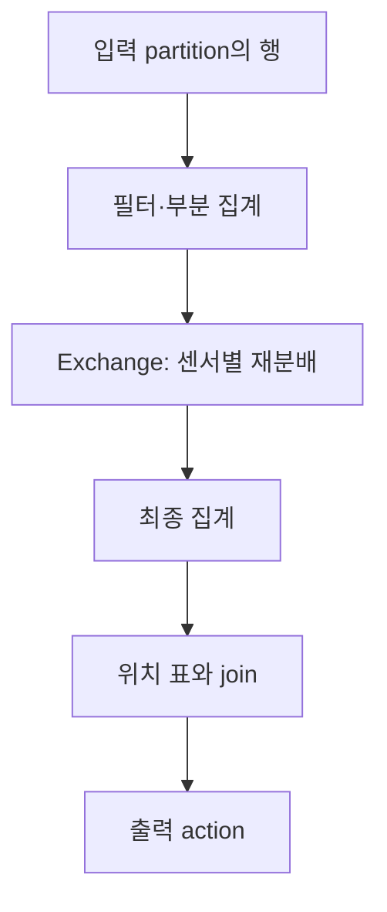

# 11. 로컬 실습: 표가 실행 계획과 파일로 바뀌는 과정

이 장은 한 컴퓨터에서 `local[2]`로 Spark를 실행한다. 숫자 2는 로컬 task 실행 스레드 수다. 서버 두 대나 executor 두 개를 뜻하지 않는다. 입력은 여섯 행뿐이지만, 분산 실행에 쓰이는 DataFrame·집계·shuffle·join·파일 쓰기 원리를 관찰할 수 있다.

**이 장의 새 예제는 교육용 프로그램이며 이번 문서 작성 과정에서 실행하지 않았다. 아래 출력은 코드와 입력에서 계산한 예상 결과다.** 앞서 실제 실행한 Iceberg 실습은 [Iceberg 실습 장](../apache-iceberg/README.md)의 별도 실행 기록을 따른다.

## 11.1 준비: 버전을 선택하는 이유

이 실습은 **Python 3.11·PySpark 4.0.4·Java 21**을 기준으로 한다. Spark 4.0 계열은 Java 17/21을 지원한다. 최신 Spark 4.2.0을 설명하는 장과 실습 조합은 다르다. 09장의 Iceberg 1.12.0 연계 조합과 맞추기 위해 실습을 4.0.4로 고정했다.

필요한 것은 Python, Java, 인터넷 연결이 가능한 최초 패키지 설치 환경이다. Kubernetes나 Kafka, 외부 Spark 클러스터는 필요하지 않다. `JAVA_HOME`은 사용할 JDK의 설치 디렉터리여야 한다. Java 실행 파일 자체의 경로를 넣지 않는다.

```bash
python3 --version
java -version
python3 -m venv /tmp/netai-spark-lab-venv
source /tmp/netai-spark-lab-venv/bin/activate
python -m pip install -r learning/apache-spark/examples/requirements.txt
```

위 상대 경로는 이 저장소 최상위에서 실행할 때의 경로다. 다른 Python 프로젝트의 패키지와 섞지 않도록 별도 가상 환경을 쓴다. 패키지 설치는 사용자의 실습 단계이며 이 문서 작성 때 실행한 명령이 아니다.

## 11.2 먼저 손으로 결과 계산하기

프로그램의 [batch_sensor_lab.py](examples/batch_sensor_lab.py)는 다음 교육용 입력을 직접 만든다.

| event_id | sensor_id | temperature | 판정 |
| --- | --- | --- | --- |
| e1 | S1 | 20.0 | 유효 |
| e2 | S1 | 22.0 | 유효 |
| e3 | S2 | 19.0 | 유효 |
| e4 | S2 | 99.0 | 범위 밖 |
| e5 | S3 | 23.0 | 유효 |
| e6 | S3 | null | 결측 |

조건은 `-40 <= temperature <= 60`이다. 결측은 별도 유효성 조건으로 제외한다. 유효 행은 네 개다. 평균은 S1=21, S2=19, S3=23이다. S2의 99를 평균에 포함하면 결과가 달라지므로 필터가 집계 앞에 와야 한다.


## 11.3 실행과 예상 결과

```bash
python learning/apache-spark/examples/batch_sensor_lab.py
```

프로그램은 임시 디렉터리에 Parquet를 쓰고 다시 읽는다. 정상 종료하면 그 임시 디렉터리를 정리한다. 다른 연구 데이터 경로에 `overwrite`를 하지 않는다. 출력 중 핵심 예상 값은 다음과 같다. 실행 계획의 줄 순서, stage 수와 로그는 환경에 따라 달라질 수 있다.

```text
raw_rows=6, valid_rows=4
S1 site=north valid_count=2 avg_temperature=21.0
S2 site=south valid_count=1 avg_temperature=19.0
S3 site=west valid_count=1 avg_temperature=23.0
parquet_roundtrip_rows=3
```

프로그램에는 예상 집계 값과 재읽기 결과를 비교하는 assertion이 있다. assertion이 통과하는 범위는 이 작은 입력의 결과다. 운영 규모 성능, 장애 복구, Iceberg 커밋이나 모든 Spark 버전의 호환성을 증명하지 않는다.

## 11.4 실행 계획 읽기

파일의 `summary.explain("formatted")`는 물리 계획을 출력한다. 다음 연산을 찾아본다.

| 계획에서 찾을 항목 | 관찰할 뜻 |
| --- | --- |
| Filter | 유효성 조건을 적용한다 |
| HashAggregate 등 집계 연산 | 센서별 합·개수 또는 최종 평균을 계산한다 |
| Exchange | 같은 센서의 집계 값을 모으는 재분배 경계다 |
| Join 연산 | 센서 요약과 위치 표를 붙인다 |
| AdaptiveSparkPlan | AQE가 적용되는 실행 계획일 수 있다 |

작은 데이터에서도 shuffle이 나타날 수 있다. Spark가 분산 계산을 표현하는 계획을 사용하기 때문이다. 이것만 보고 Spark가 느리다거나 빠르다고 결론짓지 않는다. 첫 실행에는 JVM 시작과 코드 생성 등 준비 비용도 들어간다.



## 11.5 결과를 바꿔 보는 실험

1. e4의 온도를 25로 바꾼다. 유효 행은 5개, S2 평균은 22가 된다.
2. 위치 표에 S1 행을 두 개 넣는다. S1 요약 행이 join 뒤 두 행으로 늘어난다. 다른 프로그램의 assertion을 조정하기 전에 이 중복의 업무 의미부터 설명한다.
3. `spark.sql.shuffle.partitions`를 4에서 8로 바꾼다. 최종 센서별 평균은 같다. 실행 계획과 작업 분할은 달라질 수 있고 AQE가 partition을 다시 합칠 수 있다.
4. 필터를 제거한다. 결측 제외 여부와 범위 제외 여부가 서로 다른 조건임을 비교한다. `avg`는 null을 제외하지만 99는 자동으로 이상치라고 판단하지 않는다.
5. `collect()` 앞에 필터를 추가해 보며 transformation과 action을 구분한다. 큰 입력에서 전체 행을 driver에 가져오는 연습으로 확대하지 않는다.

각 변경은 원본 파일을 복사해 별도 실습 파일에서 해도 된다. 이 장의 기준 프로그램은 위 예상 결과에 대응한다.

## 11.6 스트리밍은 별도 프로그램으로 보기

[streaming_rate_lab.py](examples/streaming_rate_lab.py)는 Spark의 `rate` 소스로 가상의 연속 입력을 만든다. 실제 센서나 Kafka에 연결하지 않는다. 2초 간격으로 micro-batch를 실행하고 약 10초 동안 console sink를 관찰한다.

```bash
python learning/apache-spark/examples/streaming_rate_lab.py
```

예상 관찰은 `Batch: 0`, `Batch: 1` 등의 구분과 `timestamp`, `value`, `sensor_id` 열이다. 최초 batch가 비어 있을 수 있고, batch 번호·행 개수·시각은 실측 전에 고정할 수 없다. `rowsPerSecond=2`는 소스의 목표 생성률이며 각 trigger에 반드시 정확히 네 행이 보인다는 보장은 아니다.

이 프로그램의 checkpoint는 임시 경로다. 실행을 종료하면 제거하므로 다음 실행은 새로운 실습이다. 재시작 복구를 공부할 때는 지속 경로를 사용하고, 같은 논리 query·호환되는 state schema·소스와 sink의 조건을 함께 고려한다. console 출력은 업무 저장소의 exactly-once 실험에 적합한 sink가 아니다.

## 11.7 막혔을 때 확인할 순서

| 증상 | 먼저 확인할 항목 |
| --- | --- |
| Java gateway 시작 실패 | `java -version`, JDK 지원 범위, `JAVA_HOME` |
| pyspark를 찾지 못함 | 가상 환경 활성화, 설치에 사용한 Python과 실행 Python |
| 호스트 이름 해석 오류 | 로컬 호스트 이름·네트워크 설정; 실제 오류 메시지 확인 |
| 첫 실행이 예상보다 오래 걸림 | JVM 시작 비용과 패키지 준비; 여섯 행의 계산 시간과 구분 |
| 파일 개수가 예상과 다름 | 출력 partition·AQE·writer 동작; 행 결과부터 비교 |
| assertion 실패 | 바꾼 입력, 필터, 중복 join 키, null 처리 |

## 11.8 이해 확인

**문제:** 두 출력 파일이 생기면 executor도 두 개였다는 뜻인가? **해설:** 아니다. 출력 task와 파일, executor 프로세스는 서로 다른 개념이다. `local[2]`에서도 여러 task가 실행되고 여러 파일을 쓸 수 있다.

**문제:** 센서 평균을 구할 때 Spark가 99를 자동으로 삭제하는가? **해설:** 아니다. 사용자가 정의한 필터가 제거한다. 엔진은 업무의 정상 온도 범위를 스스로 정하지 않는다.

공식 자료: [PySpark 설치](https://spark.apache.org/docs/4.0.4/api/python/getting_started/install.html), [DataFrame 빠른 시작](https://spark.apache.org/docs/4.0.4/api/python/getting_started/quickstart_df.html), [Structured Streaming](https://spark.apache.org/docs/4.0.4/streaming/index.html).

[이전: 배포와 Connect](10-deployment-and-connect.md) · [다음: 연구 데이터 처리](12-research-workflows.md) · [목차](README.md)
