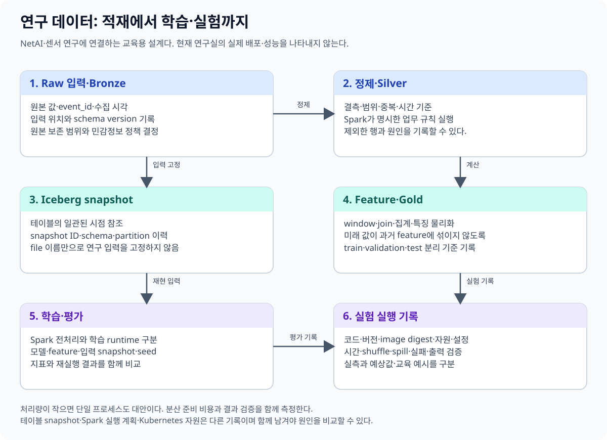

# 12. 연구 데이터 처리에 Spark를 연결하기

[이 책의 목차](README.md) · [이전 장](11-local-labs.md)

이 장은 연구실의 현행 배포를 보고하는 문서가 아니다. 이 저장소의 [Spark archive 설계](../../kubernetes/observability/data-pipelines/06-spark.md)와 [NetAI 평가 경로](../../kubernetes/storage/lakehouse/03-netai-evaluation.md)를 출발점으로, 센서·실험·멀티모달 데이터를 어떻게 처리하고 어떤 증거를 남길지 설명하는 학습용 구성이다.



## 1. Spark가 연구에서 담당할 수 있는 일

| 연구 작업 | Spark의 역할 | 함께 필요한 다른 계약 |
| --- | --- | --- |
| 원천 데이터 축적 | batch·micro-batch로 정리해 저장 | 입력 전달·offset·원본 보존 |
| 데이터 정제 | 타입·단위·범위·중복·시간 처리 | 품질 규칙과 오류 정책 |
| 테이블 물리화 | 계산 결과를 Parquet·Iceberg 등에 저장 | schema·snapshot·commit·retention |
| 실험 데이터셋 구성 | join·집계·표본·feature 구성 | split·누수 방지·재현성 |
| 성능 비교 | 계획·task·shuffle·메모리 관찰 | 동일 결과·자원·캐시·입력 조건 |

**Materialization, 물리화**는 계산 표현이나 조회 결과를 실제 저장된 데이터로 만드는 것이다. DataFrame 변수나 임시 view를 만든 것과 다르다.

단일 컴퓨터에서 충분한 입력이라면 Spark의 분산 비용이 이득보다 클 수 있다. 반대로 여러 파일·큰 입력·복잡한 join·반복 적재가 연구의 핵심이면 Spark의 계획과 실행을 이해하는 것이 설계와 측정의 근거가 된다.

## 2. Bronze·Silver·Gold를 의미로 구분한다

이 이름은 원본→정제→활용 단계를 표현하는 흔한 설계 관례다. Spark나 Iceberg가 강제하는 파일 형식의 버전은 아니다.

| 단계 | 보관할 내용 | 품질·복구 질문 |
| --- | --- | --- |
| Bronze | 원천 사건·payload·수신 시각·source 위치 | 원본을 다시 읽고 실패를 재현할 수 있는가? |
| Silver | 명시적 schema·단위·중복 정책을 적용한 행 | 어떤 규칙으로 어떤 행이 제외·변경되었는가? |
| Gold | 연구·대시보드용 집계나 feature | 입력 snapshot과 계산 코드를 고정할 수 있는가? |

세 테이블을 쓰는 한 프로그램이 자동으로 멀티테이블 원자 트랜잭션이 되는 것은 아니다. Bronze 성공 뒤 Silver 실패, Silver 성공 뒤 Gold 실패를 추적할 run ID·입출력 상태·재시도 정책을 마련한다.

## 3. 사건 ID·원천 위치·행 ID·snapshot ID

| 번호 | 무엇을 식별하는가? | 자동 동일하지 않은 것 |
| --- | --- | --- |
| `event_id` | 업무 사건 | Kafka offset·Spark task ID |
| Source partition/offset | 원천 메시지의 위치 | 업무 사건의 유일성 |
| Spark batch/epoch ID | 스트리밍 처리 묶음 | 영구적인 전역 사건 ID |
| Iceberg snapshot ID | 커밋된 테이블 상태 | 원천 DB transaction ID |
| Iceberg v3 row ID | 논리 행의 계보 | 모든 원천 사건의 ID |

같은 사건이 두 offset에 들어오면 source 처리를 정확히 한 번 수행해도 업무 중복이 남을 수 있다. 원천의 재전송, connector 보장, key·sequence 정책을 함께 다룬다.

## 4. 하루 데이터량을 가정으로 계산한다

장치 1000대가 분당 사건 하나를 만든다고 가정한다.

```text
하루 사건 수 = 1000 × 60 × 24 = 1,440,000
사건 payload를 120 B로 가정한 원천량
             = 1,440,000 × 120 B
             = 172,800,000 B ≈ 164.8 MiB
```

여기서 120 B는 예시 가정이다. Kafka envelope·메타데이터·저장 포맷·압축·복제·index·snapshot 보존은 별도다. Parquet 파일 크기를 payload 단순 합으로 단정하지 않는다.

정제 전후 실제 행 수·바이트·분포를 측정한 뒤 partition과 commit 주기를 정한다. 하루 평균만 보고 burst·late event·장치별 skew를 놓치지 않는다.

## 5. 센서 데이터의 품질과 시간

원천에는 다음 문제가 생길 수 있다.

- 같은 event ID의 재전송.
- 장치마다 다른 timezone 또는 잘못된 시계.
- 섭씨·화씨·밀리초·마이크로초의 혼용.
- 누락값과 실패 코드를 실제 0으로 오해.
- 늦은 사건이 이미 집계한 과거 구간에 도착.

Spark는 규칙을 실행할 수 있지만 올바른 규칙을 자동 발견해 주는 책임을 지지 않는다. 허용 범위·단위 변환·늦은 사건·중복 처리의 계약을 먼저 쓴다. 오류를 버릴 때는 오류 행과 원천 위치·이유를 별도 기록한다.

Event time·ingestion time·processing time·commit time을 구분한다. “1초 이내 적재”라고 말할 때 어느 두 시각의 차이를 측정했는지 정의한다.

## 6. 멀티모달 데이터는 메타데이터와 큰 객체를 나눈다

**멀티모달(multimodal)**은 센서 값·이미지·영상·텍스트처럼 여러 종류의 정보를 함께 다루는 것이다. 큰 영상 객체 전체를 매번 테이블의 작은 행처럼 복사할 필요는 없다.

교육용 구성은 객체 저장소에 원본 바이트를 보관하고 테이블에 주소·checksum·촬영 시각·장치·길이·해석 버전을 기록한다. **Checksum**은 내용의 변경이나 오류를 확인할 때 사용하는 계산값이다.

Spark는 이런 메타데이터의 검증·join·표본 선택·batch 전처리에 사용할 수 있다. 실제 영상 decode·GPU 추론·학습은 사용하는 라이브러리·실행 자원·데이터 전송 경로에 따라 다르다. Spark를 쓰는 사실만으로 영상 계산이 GPU에 자동 분산되지는 않는다.

## 7. 학습 데이터에서 미래 정보 누수를 막는다

**Data leakage, 데이터 누수**는 평가 시점에 알 수 없어야 하는 정보가 학습·feature에 들어가 결과를 부풀리는 것이다. 나중에 수정된 장치 상태를 과거 측정값에 무조건 join하면 미래 상태를 사용하게 될 수 있다.

장치 상태에 유효 시작·종료 시각을 두고 사건 시점에 맞는 기록을 연결하는 등 시간 의미를 정한다. Random split이 같은 장치·사용자·시간의 매우 비슷한 행을 학습과 평가에 함께 넣는지도 검토한다.

Spark의 join이 문법상 성공했다는 사실은 연구의 평가 설계가 올바르다는 증거가 아니다. Join cardinality·중복·시간 범위를 검사한다.

## 8. 재현 가능한 run 기록

| 기록 | 목적 |
| --- | --- |
| Run ID·프로그램 commit·SQL | 어떤 계산을 실행했는지 식별 |
| Source 범위·table UUID·snapshot ID | 어떤 입력 상태였는지 고정 |
| Spark·Java·Python·Scala·connector 버전 | 실행과 타입·API 호환 재현 |
| Session timezone·ANSI·random seed | 해석·오류·표본 의미 재현 |
| 초기·최종 물리 계획·AQE 설정 | 실제 선택한 실행 전략 기록 |
| Executor 수·cores·memory·배포 모드 | 자원 조건 기록 |
| 입력/출력 행·오류·중복·집계 | 결과 의미 확인 |
| 소요 시간·읽기/shuffle/spill·cache 조건 | 성능 주장 근거 |

Spark의 DAG lineage는 계산 의존 관계이고 Iceberg row lineage는 행의 ID·변경 정보다. 위 연구 run 기록 전체를 두 기능 중 하나가 자동으로 제공하는 것은 아니다.

## 9. 성능 실험의 비교 대상을 정한다

“Spark가 빠르다”는 말 대신 다음처럼 가설을 구체화한다.

```text
가설 예시
동일한 입력 snapshot과 집계 SQL에서, 날짜 조건으로 제외할 수 있는
파일 배치를 개선하면 읽은 bytes와 scan 시간이 줄어든다.

관찰할 것
행 결과, planning time, 읽은 files/bytes, task 분포, shuffle,
cache 상태, 배치 개선의 rewrite 비용
```

스냅샷을 고정하지 않고 서로 다른 입력을 읽으면 비교가 어긋난다. 한쪽만 cache가 따뜻하거나 executor 수가 다르면 원인을 분리하기 어렵다. 초소형 local 실행은 실제 분산 네트워크와 장애를 재현하지 않는다.

## 10. 실패와 복구를 연구 주장에 포함한다

| 실패 | 재현할 조건 | 확인할 결과 |
| --- | --- | --- |
| Task 재시도 | task 실패·executor loss | 외부 부작용 중복 여부 |
| Commit 응답 유실 | 서버 성공 뒤 응답 실패 | 성공 여부 확인·전체 재입력 중복 |
| Streaming 재시작 | 같은 checkpoint 유지 | 입력 위치·state·sink 효과 |
| Checkpoint 상실 | 의도적으로 분리한 시험 환경 | 새 시작과 중복 정책 |
| 과거 snapshot 만료 | 실습용 보존 조건 변경 | 연구 재현성이 깨지는 범위 |

이는 시험 계획이지 이 저장소에서 모두 실행한 장애 실험의 결과가 아니다. 논문이나 보고서에서는 설계 제안·실행한 관찰·아직 확인하지 않은 조건을 나누어 기록한다.

## 11. 확인 질문과 해설

**질문.** Spark가 실행 완료를 출력했으니 Silver와 Gold가 함께 원자적으로 공개되었는가?

**해설.** 사용한 sink·카탈로그·프로그램의 멀티테이블 보장을 확인해야 한다.

**질문.** Spark의 exactly-once 경로이면 원천 사건 중복도 자동 제거되는가?

**해설.** 입력 위치의 처리 효과와 업무 사건의 유일성은 다른 문제다.

**질문.** Run에 snapshot ID만 적으면 성능 실험을 재현할 수 있는가?

**해설.** 코드·엔진·설정·자원·보존·cache·측정 조건도 필요하다.

## 연결 자료

[기존 Spark archive 설계](../../kubernetes/observability/data-pipelines/06-spark.md), [Lakehouse 연구 경로](../../kubernetes/storage/lakehouse/README.md), [AI 입력 파이프라인](../../ai/learning/ai-infrastructure/04-training-and-input-pipelines.md), [Spark monitoring](https://spark.apache.org/docs/4.2.0/monitoring.html), [Spark streaming](https://spark.apache.org/docs/4.2.0/streaming/index.html)을 참고한다.

[다음: 13. 버전과 마이그레이션](13-versions-and-migration.md)
