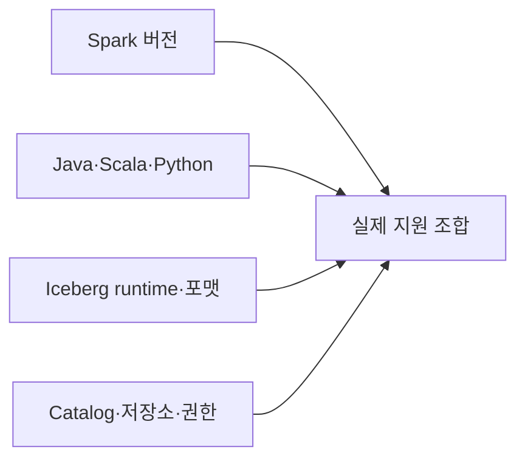
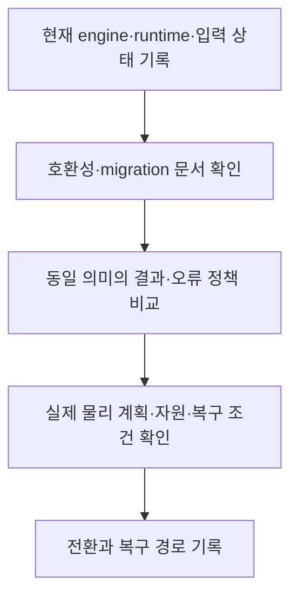

# 13. 버전과 마이그레이션

[이 책 목차](README.md) · [이전](12-research-workflows.md) · [다음](14-exercises-and-glossary.md)

기준일은 **2026-10-09**다. Spark 버전, Python·Java·Scala 버전, connector와 테이블 포맷을 각각 기록한다. 최신 버전이라는 사실은 배포 조합의 호환성을 자동 보장하지 않는다.

## 1. 최신 설명과 실습 기준선을 구분한다

공식 최신 안정 릴리스는 Spark **4.2.0**이다. 4.1.3·4.0.4·3.5.9 같은 유지보수 릴리스도 별도 계열에 존재한다. 이 책은 최신 기능을 설명하되 실습은 PySpark 4.0.4와 Java 21로 고정한다. [다운로드와 릴리스](https://spark.apache.org/downloads)

| 계열 | Java | Scala binary | Python |
| --- | --- | --- | --- |
| 3.5 | 8·11·17 계열 지원 조건 확인 | 2.12·2.13 | 3.8 이상 |
| 4.0 | 17·21 | 2.13 | 3.9 이상 |
| 4.1 | 17·21 | 2.13 | 3.10 이상 |
| 4.2 | 17·21·25 | 2.13 | 3.10 이상 |

실제 배포판·connector가 더 좁은 요구를 둘 수 있다. Spark가 Java 25를 지원한다고 Iceberg나 모든 외부 라이브러리도 같은 조합을 지원하는 것은 아니다.

## 2. 3.5에서 4.x로 바뀌는 실행 기반

4.0은 Java 8/11·Scala 2.12·Python 3.8 지원을 제거한 전환이다. 빌드 artifact의 Scala suffix와 Spark integration 버전을 맞춘다.

```text
iceberg-spark-runtime-4.0_2.13:1.12.0
                       │    │
                       │    └ Scala binary
                       └ Spark integration 계열
```

같은 JAR 이름이 일부 비슷하다는 이유로 3.5·4.0·4.2 runtime을 바꾸어 사용하지 않는다. JDBC driver·Python 패키지·Arrow·사용자 UDF의 요구도 확인한다.

## 3. Spark 4.0의 주요 변화

VARIANT, SQL UDF, session variable, pipe syntax, collation 등의 SQL 기능과 Connect 경로의 확장이 포함된다. 각 API·SQL 문법의 지원 범위는 버전 문서를 따른다.

**VARIANT**는 반정형 값 표현과 관련된다. **Collation**은 문자열의 정렬·비교 규칙이다. 같은 글자를 어떤 순서와 동일성으로 다루는지 바뀌면 join·집계 결과에도 영향이 있다.

SQL 함수 등록과 계산 의미가 달라질 수 있으므로 새 기능이 필요 없는 기존 프로그램도 migration guide를 읽는다.

## 4. Spark 4.1·4.2의 주요 방향

| 계열 | 주요 변화 | 구별할 것 |
| --- | --- | --- |
| 4.1 | SQL scripting·VARIANT의 정식 기능, Declarative Pipelines, streaming real-time mode, Python·Connect 확장 | 모든 source/sink의 같은 저지연·보장으로 일반화하지 않음 |
| 4.2 | GEOMETRY/GEOGRAPHY·공간 함수, CDC `CHANGES`, Arrow 최적화 경로·Data Source V2·Connect 확장 | Spark 기능과 Iceberg integration의 지원을 구분 |

**Declarative pipeline**은 원하는 처리 관계를 표현하고 실행을 관리하는 기능 영역이다. **CDC(Change Data Capture)**는 데이터 변경을 추적하는 개념이다. Spark의 CDC 기능이 모든 Iceberg 테이블과 모든 connector에서 자동 동작한다고 가정하지 않는다.

새 feature의 활성화·기본값·제약을 해당 release notes에서 확인한다. Preview 문서의 기능을 이전 안정 릴리스에서 실행 가능한 것으로 섞지 않는다.

## 5. ANSI·타입·시간의 변화

Spark 4.x의 ANSI 기본 동작, cast 실패, timestamp·interval·문자열 비교·함수 의미를 확인한다. 과거에는 NULL이나 다른 값으로 처리되던 오류가 명시적 실패가 될 수 있다.

```sql
SELECT try_cast(raw_temperature AS DOUBLE)
FROM raw_measurements;
```

오류를 NULL로 표현한다면 그 행의 수와 원천 값을 기록한다. 새 엔진에서 실행 성공만 확인하면 조용한 값 변경·손실을 놓칠 수 있다.

## 6. Classic과 Connect

Classic PySpark의 SparkContext·RDD·private JVM 접근을 Connect에서 그대로 사용할 수 있는 것은 아니다. Connect는 논리 계획을 서버에 전달하는 모델이며 client와 server의 API·버전 호환 조건을 따로 확인한다.

DataFrame reference의 `Supports Spark Connect` 표기를 확인한다. API 이름이 같아도 내부 JVM 접근을 가정한 사용자 코드가 동작하지 않을 수 있다.

## 7. Iceberg 호환성

Iceberg 1.12.0의 공식 runtime 지원은 Spark 3.5·4.0·4.1이며, 기준일 현재 Spark 4.2 runtime을 제공하지 않는다. 최신 Spark 이론과 이 책의 4.0.4+Iceberg1.12.0 실습을 분리한 이유다. [공식 지원표](https://iceberg.apache.org/multi-engine-support/)



## 8. Streaming 업그레이드

Checkpoint와 state schema·partition 설정·query 식별·sink 계약을 함께 점검한다. 새 실행 프로그램을 만들었다고 기존 checkpoint의 모든 상태가 자동 호환되는 것은 아니다.

4.x streaming migration에는 trigger fallback, stateless AQE, checkpoint metadata 검증 등 변화가 있다. 일반적인 성공 실행과 장애 복구·재시도의 의미를 분리한다. 운영에서는 복제 입력·격리 sink로 재시작 조건을 확인한 뒤 전환한다.

## 9. 버전 전환 기록



Rollback은 패키지 번호 하나를 낮추는 작업만이 아니다. 새 포맷·checkpoint·테이블 기능·schema를 이전 프로그램이 이해할 수 있는지 확인한다.

## 10. 확인 문제

**질문.** 최신 Spark와 최신 Iceberg면 항상 호환되는가?

**해설.** 실제 integration artifact와 지원 범위를 확인해야 한다.

**질문.** Python 요구 버전만 맞추면 3.5 코드를 4.x로 옮길 수 있는가?

**해설.** Java·Scala·connector·SQL 의미·기본 설정·checkpoint까지 확인한다.

## 공식 자료

[4.0 release](https://spark.apache.org/releases/spark-release-4-0-0.html), [4.1 release](https://spark.apache.org/releases/spark-release-4.1.0.html), [4.2 release](https://spark.apache.org/releases/spark-release-4-2-0.html), [PySpark migration](https://spark.apache.org/docs/4.2.0/api/python/migration_guide/pyspark_upgrade.html), [Streaming migration](https://spark.apache.org/docs/4.2.0/streaming/ss-migration-guide.html)를 참고한다.
