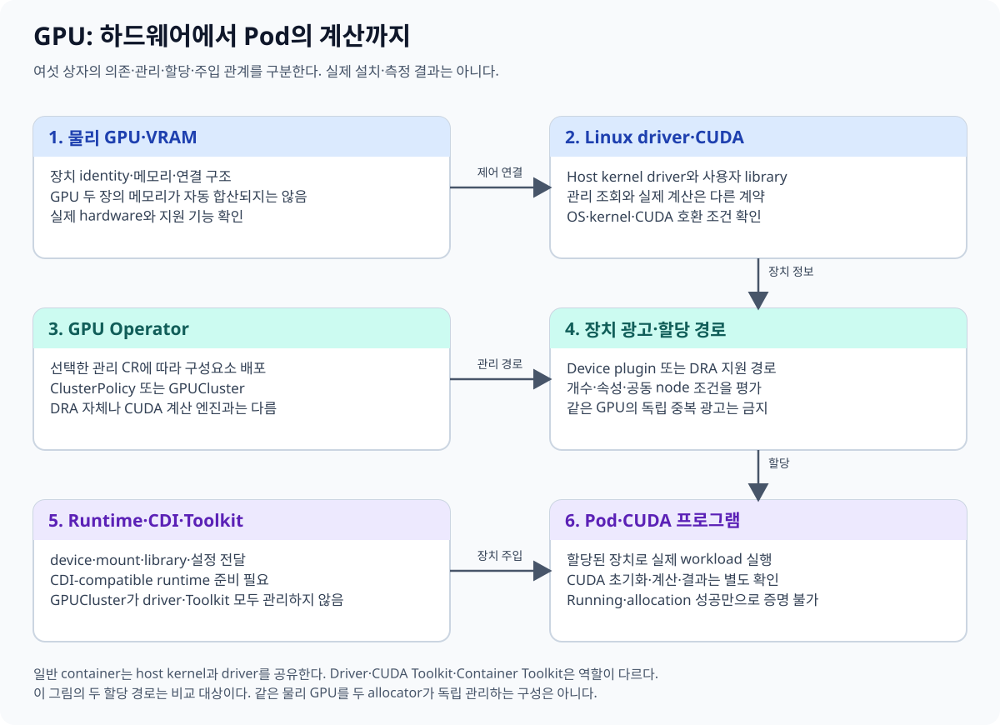
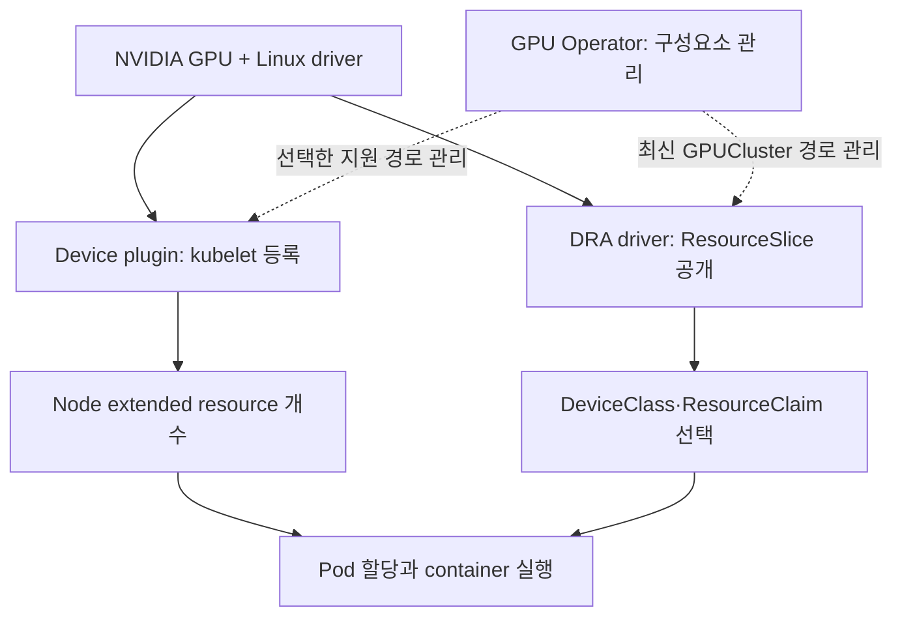

# 00. 전체 지도: GPU가 있어도 Pod가 못 쓰는 이유

노트북의 GPU를 사용하는 프로그램과 서버 여러 대의 GPU를 Kubernetes에서 배정받는 프로그램에는 공통 부분과 추가 부분이 있다. 이 책은 “GPU를 설치한다”라는 말을 작은 단계로 나눈다. 하드웨어 장착, Linux driver 준비, container 접근, 장치 광고, workload 할당, 실제 계산은 다른 단계다.

## 00.1 먼저 이름의 대상을 나눈다

| 이름 | 무엇을 가리키는가 | 이 이름만으로 알 수 없는 것 |
| --- | --- | --- |
| GPU | 병렬 계산을 수행하는 물리 장치 | 어떤 Pod가 사용할 수 있는지 |
| VRAM | GPU가 계산에 사용하는 장치 메모리 | host RAM 사용량·container memory limit |
| Node | Kubernetes에 등록된 서버 | 그 안의 GPU 준비 상태 |
| Pod | 같은 node에 함께 배치하는 container 묶음 | CUDA 프로그램의 계산 성공 |
| Driver | 운영체제·프로그램이 장치를 제어하는 소프트웨어 | scheduler의 자원 할당 정책 |
| CUDA | NVIDIA GPU 프로그래밍·실행 생태계 | Kubernetes 객체의 배치 상태 |
| Device plugin | kubelet에 장치 자원을 알리는 확장 구현 | 모든 장치 속성의 표준 요청 문법 |
| GPU Operator | GPU 구성요소를 선언에 맞춰 관리하는 controller | 모든 최신 GPU 기능의 동일한 지원 단계 |
| DRA | 장치 요청·선택·할당·준비를 연결하는 Kubernetes 경로 | NVIDIA driver 자체의 설치 성공 |
| NVIDIA DRA Driver | DRA 경로에 NVIDIA 장치를 연결하는 구현 | 모든 vendor 장치의 일반적 동작 |
| CDI | runtime에 장치와 관련 설정을 전달하는 규격 | 독립 VRAM·성능·장애 격리 보장 |

약어를 외우기보다 이 대상 중 **누가 누구에게 무엇을 전달하는가**를 설명한다. 예를 들어 GPU Operator라는 controller가 GPU kernel의 수학 계산을 수행하는 것은 아니다.

## 00.2 작은 교육용 서버 예시

node-a에 GPU 두 장이 있고 각각 광고된 메모리가 24 GiB라고 가정한다. 프로그램 하나가 30 GiB를 한 장치에 할당하려고 한다. 서버 전체 GPU 메모리는 합계 48 GiB지만, 이것만으로 한 GPU의 30 GiB 할당이 가능해지지는 않는다.

프로그램이 두 GPU로 모델을 분할하는 실행 구조를 구현해야 할 수 있다. Kubernetes에서 GPU 두 개를 배정받았다고 모델이 자동 분할되는 것도 아니다. **자원 할당과 모델 병렬화**는 별도다. Unified Memory나 특수 메모리 연결을 사용하면 조건이 추가되며, 단순 합계만으로 성능과 성공을 보장할 수 없다.

다음은 교육용 단계 표다. 같은 행의 성공이 다음 행을 자동 보장하지 않는다.

| 단계 | 질문 |
| --- | --- |
| 물리 장치 | 서버가 GPU PCI 장치를 인식하는가? |
| Node driver | 그 장치를 사용할 driver가 준비됐는가? |
| Runtime | container에 필요한 device·library를 전달할 수 있는가? |
| Inventory | device plugin 또는 DRA driver가 사용할 장치를 공개했는가? |
| Allocation | 이 Pod 요청에 맞는 장치를 배정했는가? |
| Preparation | 배정 장치를 node에서 container 시작에 맞게 준비했는가? |
| Application | 실제 CUDA 계산과 결과 확인이 성공하는가? |

이 그림은 학습 순서다. 모든 설치가 이 시간 순서로 한 번씩만 끝난다는 뜻은 아니다. 실제 controller는 상태를 계속 관찰하고 재시도한다.

## 00.3 기존 device plugin과 DRA는 어디에 놓나

기존 device plugin 경로는 kubelet에 장치를 등록하고 Node의 extended resource 개수로 요청을 받는다. DRA는 ResourceSlice·DeviceClass·ResourceClaim으로 inventory와 요청을 구조화한다. 선택한 GPU를 실제 container에 연결하려면 어느 경로든 node driver와 runtime 준비가 필요하다.

위 두 가지 가지는 경로를 비교하기 위한 것이다. 같은 물리 GPU를 양쪽이 독립적으로 할당하도록 동시에 광고하는 설치 지침이 아니다. 최신 Operator의 관리 모드 제약은 [03장](03-gpu-operator-components.md)과 [10장](10-deployment-compatibility-and-gitops.md)에서 설명한다.

Kubernetes 1.37의 DRA extended-resource 지원에서는 기존 개수 요청을 DRA backend가 처리할 수도 있다. 따라서 `nvidia.com/gpu`라는 글자 하나만 보고 내부 구현 경로까지 확정하지 않는다. 이 구분은 [02장](02-device-plugin-path.md)에서 다룬다.

## 00.4 연구에서 왜 중요한가

GPU 배정 대기 시간이 긴 문제, 배정 후 CUDA가 실패하는 문제, 계산은 되지만 VRAM이 부족한 문제, 여러 GPU의 통신이 느린 문제는 관측 대상이 다르다. 이들을 모두 “GPU가 안 된다”로 기록하면 원인을 비교하기 어렵다.

실험 기록에 물리 GPU identity·할당 경로·driver/runtime 버전·프로그램 입력·메모리·통신·결과를 함께 남긴다. Operator가 설치된 사실은 연구 성능의 결과가 아니고, claim이 할당된 사실도 계산 정확성의 결과가 아니다.

## 00.5 처음 읽는 사람의 준비 순서

1. [Kubernetes Pod 장](../kubernetes/03-pods-and-namespaces.md)에서 node·Pod·container를 구분한다.
2. [Kubernetes 자원 장](../kubernetes/08-resources-scheduling.md)에서 CPU/RAM request·limit을 읽는다.
3. [AI 인프라 교재](../../ai/learning/ai-infrastructure/README.md)에서 GPU 메모리와 모델의 관계를 확인한다.
4. 이 책 01~03에서 Linux·CUDA·기존 plugin·Operator를 연결한다.
5. 04~07에서 DRA 객체·할당·CDI를 따라간다.

**문제:** `ResourceClaim`이 있으면 GPU driver는 없어도 되는가? **해설:** 아니다. 요청 객체와 실제 GPU 제어 소프트웨어는 서로 다른 대상이다.

**문제:** Pod가 Running이면 모델 학습도 성공했는가? **해설:** 아니다. container 프로세스가 실행 중이라는 상태와 CUDA 초기화·계산·학습 지표는 별도로 관찰한다.

공식 자료: [Kubernetes DRA 개념](https://kubernetes.io/docs/concepts/resource-management/dynamic-resource-allocation/), [NVIDIA Operator DRA 경로](https://docs.nvidia.com/datacenter/cloud-native/gpu-operator/26.7/dra-intro-install.html).

[다음: Linux·CUDA·컨테이너](01-gpu-linux-cuda-container.md) · [목차](README.md)
