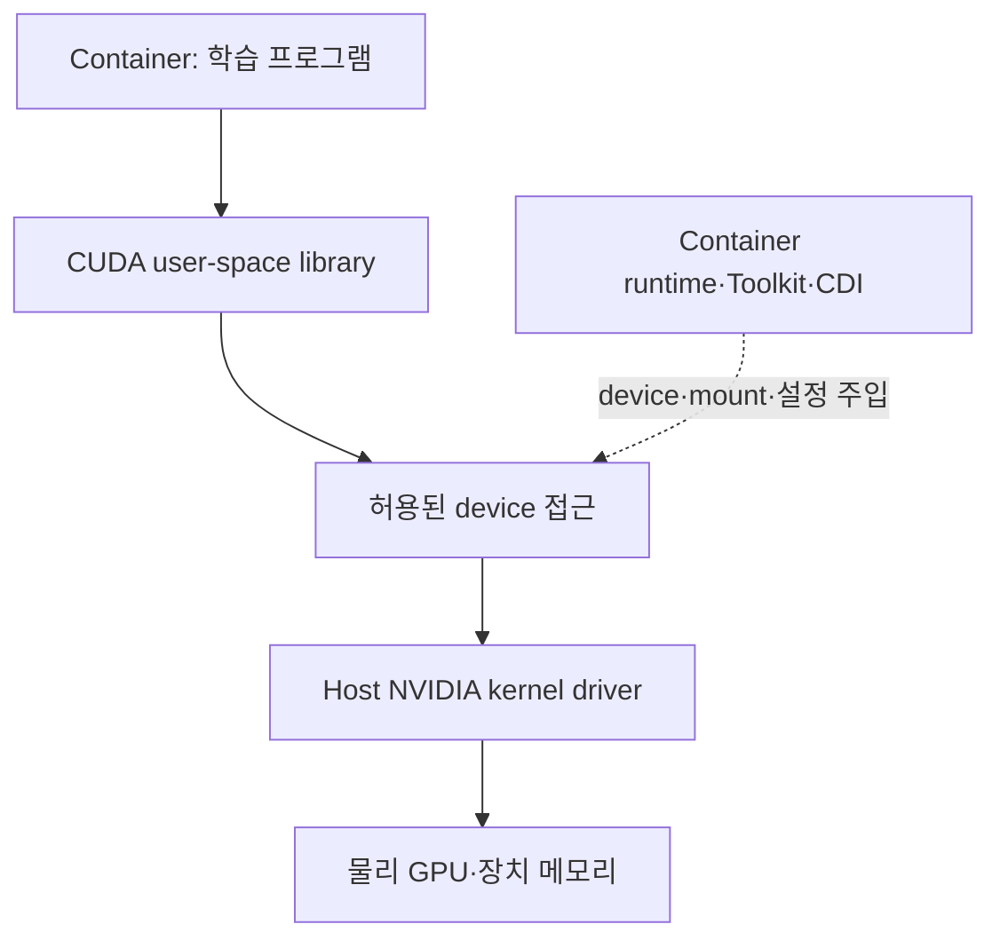
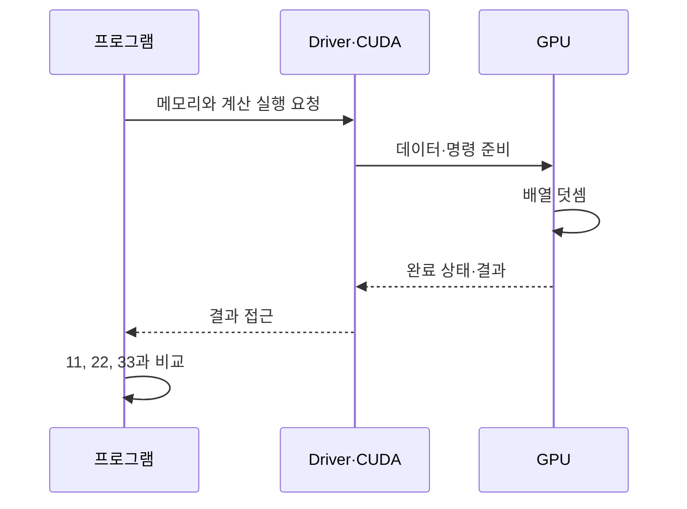

# 01. Linux·CUDA·컨테이너: 장치가 보이는 것과 계산되는 것

GPU를 container에서 사용하는 일은 프로그램에 GPU 주소를 문자열로 알려 주는 것으로 끝나지 않는다. host의 kernel driver, 프로그램이 사용하는 user-space library, container의 device 접근과 runtime 설정이 함께 필요하다.

## 01.1 Host와 container의 경계를 먼저 그린다

일반 Linux container는 host kernel을 공유한다. container image 안에 라이브러리와 프로그램을 넣을 수 있어도, image 하나가 독립된 host kernel과 물리 GPU driver를 가지는 것은 아니다. VM 기반 sandbox는 추가 경계가 있으므로 별도 지원 구성을 확인한다.

| 계층 | 예 | 역할 |
| --- | --- | --- |
| 학습 프로그램 | PyTorch 코드, CUDA 예제 | 입력과 계산을 정의 |
| 사용자 공간 라이브러리 | CUDA runtime·driver API library | GPU 호출·호환 기능 제공 |
| Device node | `/dev/nvidia0`, `/dev/nvidiactl` 등 | kernel 장치 인터페이스 접근 |
| Kernel module | NVIDIA kernel driver·UVM 관련 구성 | GPU 제어와 메모리 기능 구현 |
| Runtime 연결 | containerd·CRI-O와 CDI/Toolkit | container spec에 접근 설정 전달 |
| GPU hardware | 계산 엔진·장치 메모리 | 실제 명령과 데이터 처리 |

경로와 파일은 구현·기능에 따라 달라질 수 있다. 모든 NVIDIA GPU 프로그램이 표의 모든 파일을 같은 방식으로 사용하는 것은 아니다.

## 01.2 Driver, CUDA Toolkit, Container Toolkit은 다르다

**NVIDIA driver**는 GPU를 운영체제와 프로그램에 연결한다. **CUDA Toolkit**은 CUDA 프로그램 개발·실행을 위한 compiler·library·도구 묶음이다. **NVIDIA Container Toolkit**은 GPU 접근을 container runtime에 연결하는 소프트웨어 묶음이다.

이름이 비슷해도 설치 대상과 역할은 다르다. `nvcc`는 CUDA compiler이고 `nvidia-smi`는 GPU 상태를 보는 관리 도구다. 두 명령 중 하나가 없는 것이 곧 물리 GPU가 없다는 뜻은 아니다. 실행 image에는 compiler를 넣지 않고 필요한 runtime library만 넣을 수도 있다.

공식 [Container Toolkit 아키텍처](https://docs.nvidia.com/datacenter/cloud-native/container-toolkit/latest/arch-overview.html)는 container runtime·library·CLI가 어떤 역할을 맡는지 설명한다. 설치 패키지 이름과 내부 runtime 구성요소 이름을 같은 개념으로 외우지 않는다.

## 01.3 프로그램에서 GPU까지 가는 한 번의 계산

두 숫자 배열 `a=[1,2,3]`, `b=[10,20,30]`을 더한다고 가정한다. 결과는 `[11,22,33]`이다. 다음은 전형적인 설명용 흐름이다.

1. CPU 쪽 프로그램이 배열과 실행할 kernel을 준비한다.
2. GPU가 사용할 메모리를 확보하고 필요한 값을 전달한다.
3. GPU에 kernel 실행을 요청한다.
4. GPU 계산 완료와 필요한 동기화 조건을 확인한다.
5. 결과를 읽어 예상 값과 비교한다.

실제 프레임워크는 메모리 pool, 비동기 stream, Unified Memory, 재사용 buffer 등을 쓸 수 있다. 그래서 매 호출마다 반드시 같은 복사·동기화가 발생한다고 단정하지 않는다. 위 흐름의 목적은 **배열 계산과 관리 API 조회가 서로 다른 작업**임을 보이는 것이다.

## 01.4 nvidia-smi 성공이 증명하는 범위

`nvidia-smi`가 GPU 이름과 사용량을 출력하면 관리 경로의 접근이 확인된 것이다. 그것만으로 workload에 필요한 CUDA 메모리 할당·kernel 실행·결과가 모두 성공했다고 판단하지 않는다.

저장소의 [2026-08-24 GPU 운영 기록](../../kubernetes/gpu/twinx-kiss-gpu-node-onboarding-2026-08-24.md)은 실제로 `nvidia-smi`는 성공했지만 DRA 경로의 CUDA vectorAdd가 실패한 사례를 기록한다. 당시 CDI 명세에 UVM device 일부가 빠진 준비 순서 문제가 있었다. 이것은 그 환경에서 관찰한 원인이지 모든 CUDA 실패의 원인이 UVM이라는 뜻은 아니다.

| 관찰 | 알 수 있는 것 | 다음 확인 |
| --- | --- | --- |
| Host에서 관리 도구 성공 | host 관리 경로 접근 | container에서도 접근 가능한가? |
| Container에서 관리 도구 성공 | 해당 container의 관리 경로 접근 | 실제 CUDA 초기화·메모리·계산 결과 |
| CUDA 예제 결과 일치 | 그 예제의 계산 경로 | 실제 모델과 입력·메모리 규모 |
| 모델 한 step 성공 | 그 실행의 한 step | 지속 실행·통신·checkpoint·재현성 |

## 01.5 CUDA 버전 숫자를 읽는 법

host driver 버전, image의 CUDA runtime 버전, 프레임워크가 빌드된 CUDA 버전, 개발 toolkit의 compiler 버전은 별도로 기록한다. `nvidia-smi`의 CUDA 표시를 image 안에 설치한 toolkit 목록으로 해석하지 않는다.

CUDA에는 문서로 정의된 minor/forward compatibility 경로가 있다. 그러나 아무 driver와 아무 CUDA image를 섞어도 된다는 의미는 아니다. 필요한 driver 최소 버전·GPU 지원·기능 제한을 [CUDA Compatibility](https://docs.nvidia.com/deploy/cuda-compatibility/latest/index.html)에서 확인한다. 최신 번호로만 크기 비교하는 대신 실제 지원 조합을 쓴다.

교육용 기록 표를 다음과 같이 만들 수 있다. 값은 실습 후 관찰로 채우며 임의로 적지 않는다.

| 대상 | 기록할 값 |
| --- | --- |
| Host | OS·kernel·GPU driver 버전 |
| GPU | 모델·UUID·MIG 구성·PCI 위치 |
| Runtime | containerd/CRI-O·CDI 지원·Toolkit |
| Workload | image digest·CUDA runtime·framework |
| 계산 | 입력·기대 결과·실제 결과·오류 |

## 01.6 VRAM과 host RAM의 OOM

host RAM은 CPU와 프로세스가 쓰는 시스템 메모리다. VRAM은 GPU 작업이 사용하는 장치 메모리다. Kubernetes의 일반 `resources.limits.memory`는 container host-memory 제한이다. 그 값이 곧 GPU VRAM 제한을 설정하는 것은 아니다.

교육용 24 GiB GPU에서 모델과 optimizer가 16 GiB, 활성값과 임시 buffer가 10 GiB를 요구하면 단순 합계 26 GiB다. 실제 peak·재사용·allocator 동작을 측정해야 하지만 메모리 예산이 이미 빡빡하다는 것을 알 수 있다. GPU 두 장이 있다는 사실만으로 이 한 장의 부족이 자동 해결되지 않는다.

반대로 데이터 loader가 host RAM을 많이 써 container가 OOMKilled됐으면 VRAM을 늘리는 것이 직접적인 해결책은 아닐 수 있다. 오류 계층을 먼저 분리한다.

**문제:** CUDA 개발 image가 있으므로 host driver가 필요 없는가? **해설:** 일반 container는 host kernel과 driver를 사용한다. image 안의 사용자 공간 library와 host driver는 별도다.

**문제:** `nvidia-smi`가 성공했는데 CUDA가 실패하면 모순인가? **해설:** 아니다. 관리 API 접근과 실제 계산에 필요한 기능·device·library 경로는 다를 수 있다.

[이전: 전체 지도](00-map-and-prerequisites.md) · [다음: Device plugin](02-device-plugin-path.md) · [목차](README.md)
