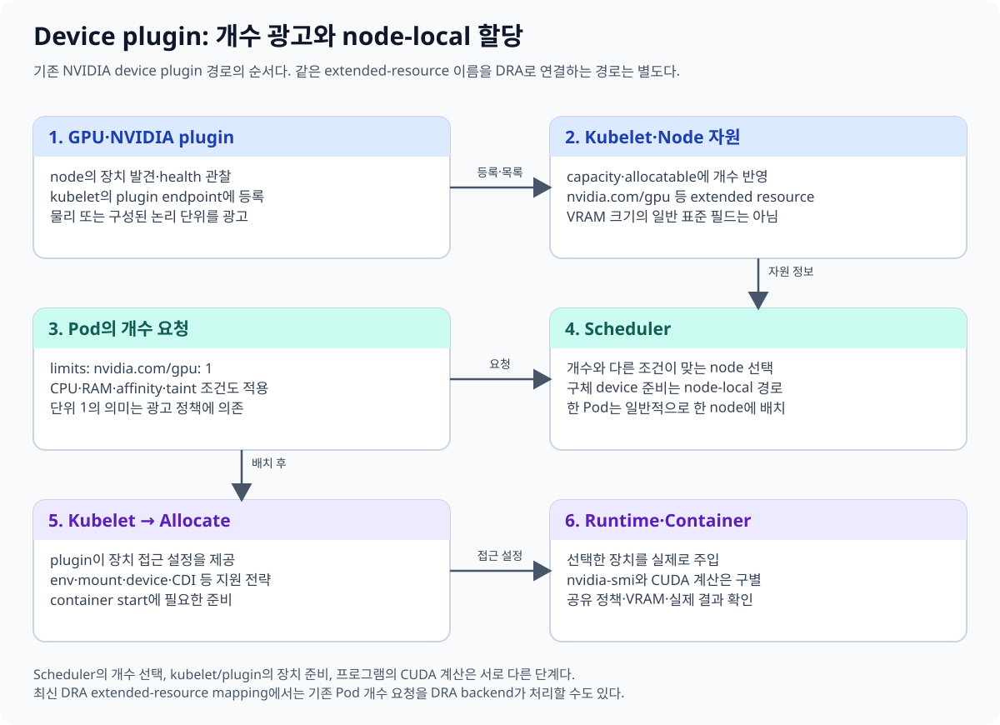
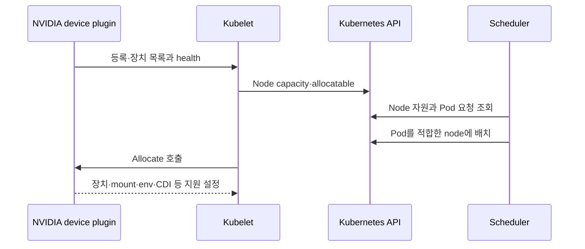
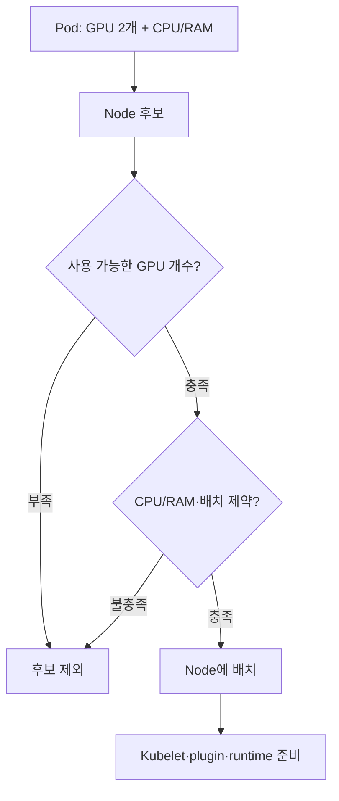

# 02. 기존 device plugin 경로: nvidia.com/gpu: 1의 의미

이 장은 **device plugin이 NVIDIA GPU를 Node extended resource로 공개하는 경로**를 먼저 설명한다. Kubernetes 1.37에서는 같은 extended-resource 이름을 DRA backend와 연결할 수도 있다. YAML의 이름과 내부 할당 구현을 구별한다.

## 02.1 왜 plugin이 필요한가

Kubernetes core가 모든 vendor GPU의 초기화와 device 파일을 직접 구현하지는 않는다. vendor의 device plugin은 node의 장치를 발견하고 kubelet에 등록한다. kubelet은 건강한 장치 등 plugin이 전달한 정보를 Node의 resource 상태에 반영한다.

**Extended resource, 확장 자원**은 CPU·memory 외의 이름 있는 자원이다. `nvidia.com/gpu`는 그 이름의 예다. 기본 extended-resource 개수는 정수이며 scheduler가 과다 배정하지 않도록 계산한다. GPU의 실제 공유 방식은 광고하는 plugin의 별도 정책에 달려 있다.





이 경로의 등록·ListAndWatch·Allocate는 [Kubernetes Device Plugins](https://kubernetes.io/docs/concepts/extend-kubernetes/compute-storage-net/device-plugins/)의 API 책임을 따른다. Scheduler는 개수와 배치 조건을 검토하고, node-local kubelet과 plugin이 구체 장치 준비에 관여한다.

## 02.2 Pod 예시를 줄별로 읽기

아래 YAML은 개념 예시다. 이번 교재 작성 때 적용하지 않았고 기존 연구실 context에 적용하는 지침도 아니다. image tag는 예시이며 실제 재현 기록에는 digest를 남긴다.

```yaml
apiVersion: v1
kind: Pod
metadata:
  name: gpu-observation-example
spec:
  restartPolicy: Never
  containers:
    - name: observe
      image: nvidia/cuda:12.8.1-base-ubuntu22.04
      command: ["nvidia-smi"]
      resources:
        limits:
          nvidia.com/gpu: 1
```

| 줄 | 의미 |
| --- | --- |
| `kind: Pod` | container를 배치하는 API 객체 |
| `restartPolicy: Never` | 이 관찰 예제의 container 자동 재시작 정책 |
| `image` | container filesystem·프로그램의 출처 |
| `command: nvidia-smi` | 관리 경로 조회; CUDA 계산 예제가 아님 |
| `limits.nvidia.com/gpu: 1` | 광고된 자원 한 단위 요청 |

GPU extended resource는 `limits`에만 적으면 그 값이 request로 사용된다. request와 limit을 함께 적으면 같은 값을 사용해야 한다. CPU의 `100m`처럼 GPU를 `0.1`로 적는 기본 정수 자원 모델이 아니다. GPU 요청 방법은 [Kubernetes GPU scheduling](https://kubernetes.io/docs/tasks/manage-gpus/scheduling-gpus/)도 참고한다.

## 02.3 단위 1이 항상 물리 GPU 한 장인가

기본 full-GPU device plugin 구성에서는 한 단위가 GPU 장치 하나에 대응할 수 있다. 그러나 MIG나 time-slicing으로 광고 방식을 바꾸면 자원 이름과 한 단위의 의미도 달라질 수 있다.

**교육용 예:** 물리 GPU 한 장을 time-slicing replica 4개로 광고하면 scheduler가 보는 자원 수는 4가 될 수 있다. 네 Pod가 각각 1을 요청해도 GPU가 물리적으로 네 장으로 늘어난 것은 아니다. 각 Pod에 VRAM 1/4이 독립 보장된다는 의미도 아니다.

따라서 조사할 때 Node capacity의 숫자만 쓰지 말고 plugin configuration·MIG profile·sharing policy를 함께 기록한다. 자세한 격리는 [08장](08-sharing-mig-timeslicing-mps.md)에서 설명한다.

## 02.4 개수 조건과 배치 조건을 동시에 본다

node-a에 GPU 두 개, node-b에 GPU 한 개가 있다고 가정한다. Pod 하나가 두 개를 요청하면 node-a가 개수 조건을 만족한다. 하지만 다음 조건 때문에 배치가 여전히 실패할 수 있다.

- node-a에 taint가 있고 Pod에 대응 toleration이 없다.
- CPU/RAM request를 만족할 allocatable 자원이 부족하다.
- node affinity·node selector·volume의 zone 조건이 맞지 않는다.
- 이미 다른 workload가 해당 GPU 자원을 할당받았다.



두 GPU를 받았다고 둘 사이 NVLink가 있거나, 프로그램이 자동으로 두 process를 만들거나, 두 GPU로 모델이 나뉘는 것은 아니다. 할당·topology·프레임워크 실행 구조를 별도로 설명한다.

## 02.5 Runtime 연결 방식은 하나가 아니다

device plugin Allocate 응답은 지원하는 구현에 따라 device·mount·환경 변수·CDI 이름 등의 설정을 제공할 수 있다. “Device plugin은 환경 변수만, DRA는 CDI만”처럼 기존 plugin의 CDI 지원을 지워 설명하지 않는다.

NVIDIA plugin의 device-list 전략과 sharing 구성은 [공식 NVIDIA device plugin 저장소](https://github.com/NVIDIA/k8s-device-plugin)에서 해당 release의 내용을 확인한다. container 안에 선택한 장치를 실제로 주입하는 과정은 [07장](07-cdi-and-runtime.md)에 연결한다.

## 02.6 nvidia.com/gpu가 DRA backend를 사용할 수도 있다

Kubernetes 1.37에서 DRA extended-resource 경로는 안정화됐다. DeviceClass의 `spec.extendedResourceName`에 기존 자원 이름을 연결하면, 개수 기반 Pod 요청도 지원 DRA driver를 통해 할당할 수 있다. 이때 명시적인 ResourceClaim YAML을 사용자가 항상 만들어야 하는 것은 아니다.

이 기능은 같은 물리 GPU를 서로 독립적인 allocator 두 개에 맡기라는 의미가 아니다. Operator의 관리 모드, DeviceClass mapping, Node 광고, 실제 inventory를 함께 확인한다. [Kubernetes 1.37 DRA 변경](https://kubernetes.io/blog/2026/09/03/kubernetes-v1-37-dra-updates/)과 [DeviceClass API](https://kubernetes.io/docs/reference/kubernetes-api/resource/device-class-v1/)가 이 전환 경로를 설명한다.

| 보이는 요청 | 가능한 구현 확인 |
| --- | --- |
| `nvidia.com/gpu: 1` | 기존 device plugin 또는 구성된 DRA extended-resource backend |
| `resources.claims` | 명시적 Claim/Template 소비 경로 |
| Node GPU 개수 | 무엇이 어떤 단위로 광고했는지 추가 확인 |
| ResourceSlice | 어느 DRA driver·pool·node·device의 광고인지 확인 |

## 02.7 이해 확인

**문제:** `nvidia.com/gpu: 2`면 GPU 메모리를 정확히 두 배로 한 주소 공간에 합쳐 주는가? **해설:** 아니다. 자원 두 단위를 요청한 것이며 실제 장치 종류·sharing·프로그램 메모리 구조가 별도로 있다.

**문제:** GPU 요청을 0으로 바꾸면 CUDA program의 메모리 문제가 해결되는가? **해설:** 요청은 자원 할당 조건이다. 모델·batch·allocator·VRAM 사용 문제의 해결책과 같지 않다.

[이전: Linux·CUDA](01-gpu-linux-cuda-container.md) · [다음: GPU Operator](03-gpu-operator-components.md) · [목차](README.md)
