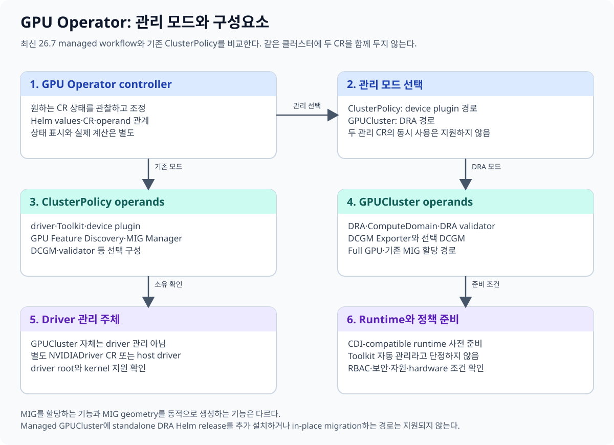
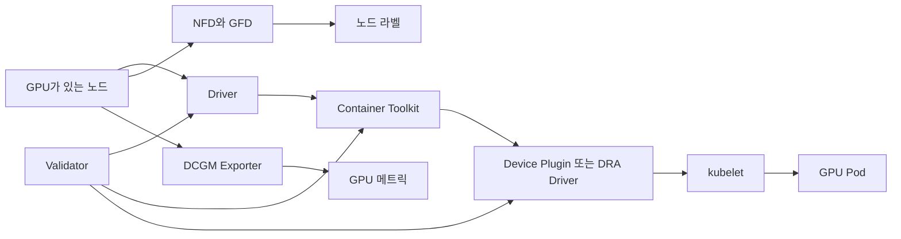
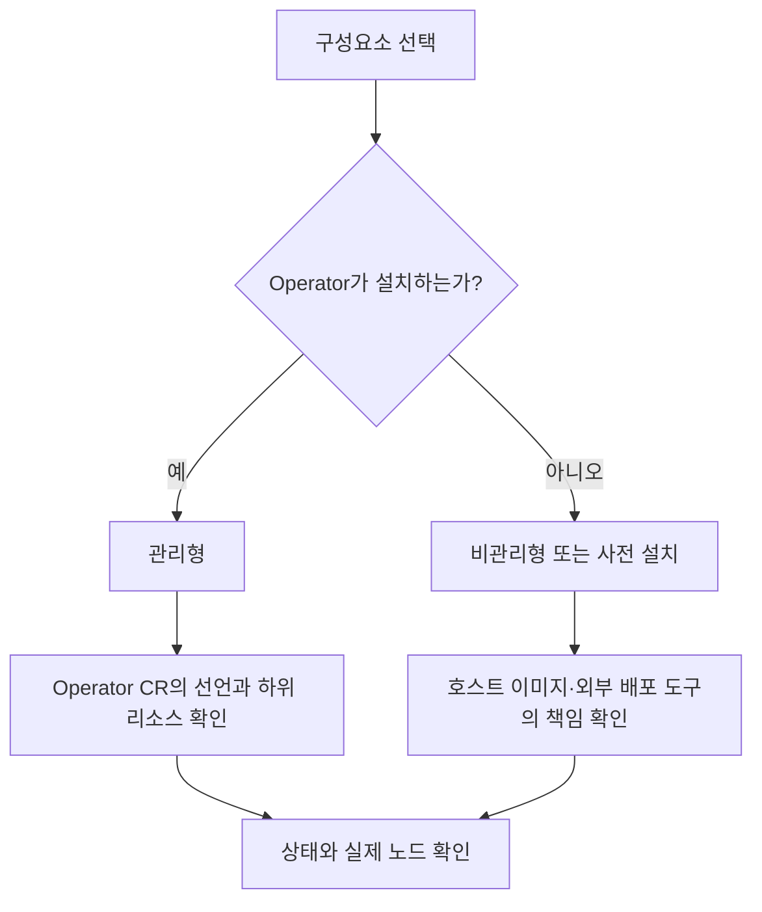
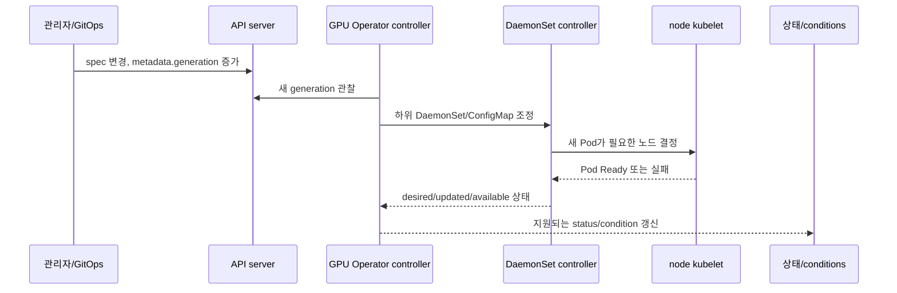

# 03. GPU Operator의 구성요소와 소유권

GPU Operator는 GPU 한 개를 단순히 “설치”하는 프로그램이 아니다.
노드 드라이버, 컨테이너 런타임 연결, Kubernetes 장치 광고, 상태 라벨,
관측과 검증을 여러 DaemonSet과 컨트롤러로 관리하는 운영 계층이다.

이 장의 목표는 다음 세 가지다.

1. 각 구성요소가 어느 문제를 해결하는지 설명한다.
2. Operator가 관리하는 것과 이미 설치된 것을 사용하는 경우를 구분한다.
3. 기존 `ClusterPolicy`와 최신 `GPUCluster` 워크플로의 차이를 이해한다.



## 3.1 먼저 보는 전체 흐름



Pod가 GPU를 쓰려면 어느 한 상자만 정상이어서는 부족하다.
드라이버가 하드웨어를 제어하고, Toolkit이 컨테이너에 필요한 장치를 넣으며,
장치 플러그인이나 DRA 드라이버가 kubelet과 GPU 할당을 연결해야 한다.

NVIDIA의 GPU Operator 구성요소 설명은
[공식 플랫폼 개요](https://docs.nvidia.com/datacenter/cloud-native/gpu-operator/latest/overview.html)에서 확인할 수 있다.

## 3.2 구성요소별 역할

| 구성요소 | 해결하는 문제 | 대표 결과 |
|---|---|---|
| NVIDIA Driver | OS 커널과 GPU 통신 | 커널 모듈, 장치 노드 |
| Container Toolkit | 컨테이너 런타임에 GPU 주입 | CDI 또는 런타임 설정 |
| Device Plugin | 정수형 GPU 자원 광고와 할당 | `nvidia.com/gpu` |
| DRA Driver | claim 기반 동적 장치 할당 | `ResourceClaim` 준비 |
| NFD | 노드 하드웨어 특징 탐지 | 표준 노드 라벨 |
| GFD | NVIDIA GPU 특징 탐지 | GPU 모델·메모리·MIG 라벨 |
| DCGM Exporter | GPU 상태 측정 | Prometheus 메트릭 |
| MIG Manager | MIG 구성을 선언에 맞게 조정 | MIG 인스턴스 구성 |
| Validator | 설치 경로의 주요 기능 확인 | 검증 Pod와 상태 |

### Driver

드라이버는 GPU의 커널 측 경계다.
호스트에 이미 검증된 드라이버가 있으면 Operator가 새로 설치하지 않도록 구성할 수 있다.
Operator 관리 드라이버와 호스트 관리 드라이버를 동시에 덮어쓰려 하면 소유권이 충돌한다.

### Container Toolkit

Toolkit은 컨테이너가 GPU 장치와 라이브러리를 보도록 런타임을 구성한다.
Toolkit은 CUDA 계산 라이브러리 자체와 같은 개념이 아니다.
또한 최신 `GPUCluster` 객체를 만들었다는 사실만으로 Toolkit이 반드시 설치된다고 단정하면 안 된다.
선택한 관리 방식과 실제 생성된 하위 리소스를 확인해야 한다.

### Device Plugin과 DRA Driver

기존 device plugin은 보통 다음처럼 정수형 확장 자원을 제공한다.

```yaml
resources:
  limits:
    nvidia.com/gpu: 1
```

DRA는 `ResourceClaim`과 장치 클래스를 통해 요청을 표현한다.
두 방식은 API와 수명주기가 다르며, 같은 워크로드에 무심코 혼용하면 안 된다.

### NFD와 GFD

NFD는 CPU, PCI, OS 같은 일반 노드 특징을 찾는다.
GFD는 그 위에 GPU 모델, 메모리, MIG 가능 여부 같은 NVIDIA 특징을 라벨로 표현한다.
라벨은 “할당 결과”가 아니라 스케줄링과 관찰을 위한 사실 또는 정책 입력이다.

### DCGM Exporter

DCGM Exporter는 사용률, 온도, 전력, 오류 같은 메트릭을 노출한다.
메트릭이 있다는 사실만으로 장애가 자동 복구되지는 않는다.
경보 규칙, 대시보드, 대응 절차가 별도로 필요하다.

### MIG Manager

MIG Manager는 지원 GPU에서 MIG 구성을 조정한다.
MIG 변경은 실행 중인 작업에 영향을 줄 수 있으므로 선언 변경 전에 워크로드 배출과 변경 창을 설계한다.

### Validator

Validator는 드라이버, Toolkit, CUDA, 플러그인 경로가 기대대로 연결됐는지 확인한다.
모든 애플리케이션 성능과 수치 정확성을 증명하는 종합 시험은 아니다.

## 3.3 관리형과 비관리형



관리형에서는 Operator가 원하는 상태를 만들고 유지한다.
비관리형에서는 구성요소가 사라지는 것이 아니라 다른 주체가 책임진다.

예를 들어 드라이버를 OS 이미지 파이프라인이 설치한다면 다음을 문서화한다.

- 지원 커널과 드라이버 버전 조합
- 노드 이미지 갱신 절차
- 드라이버 검증 책임자
- Operator가 드라이버 DaemonSet을 만들지 않는다는 설정
- 장애 시 어느 팀이 먼저 조사하는지

## 3.4 ClusterPolicy와 GPUCluster

`GPUCluster` 자체는 NVIDIA GPU driver를 관리하지 않는다. Containerized driver는 별도 `NVIDIADriver` CR로 관리하거나 사전 설치한 host driver를 사용한다. CDI-compatible runtime도 사전 준비 조건이다. 따라서 최신 관리 객체가 기존 정책의 모든 driver·Toolkit 관리 책임을 그대로 가진다고 해석하지 않는다.

`ClusterPolicy`는 GPU Operator의 전통적인 클러스터 범위 구성 API다.
하나의 정책 객체가 드라이버, Toolkit, 플러그인, 모니터링 등 여러 구성요소의 설정을 모은다.

최신 릴리스에서는 `GPUCluster`를 중심으로 한 관리형 워크플로가 추가되었다.
두 API를 단순히 이름만 바뀐 같은 객체로 보면 안 된다.
생성되는 리소스, 지원 토글, 상태 필드, 업그레이드 절차가 다를 수 있다.
정확한 버전별 기능은 [14장](14-versions-and-feature-status.md)에서 확인한다.

| 질문 | ClusterPolicy | GPUCluster 워크플로 |
|---|---|---|
| 성격 | 기존 단일 정책 중심 | 최신 관리형 클러스터 구성 |
| 동시에 사용 | GPUCluster와 동시 소유 금지 | ClusterPolicy와 동시 소유 금지 |
| Toolkit | 정책 설정으로 판단 | 객체 존재만으로 설치 단정 금지 |
| 마이그레이션 | 기존 운영 기준점 | in-place 자동 전환으로 가정 금지 |

공식 설치 및 플랫폼 선택은
[GPU Operator 설치 문서](https://docs.nvidia.com/datacenter/cloud-native/gpu-operator/latest/getting-started.html)를 기준으로 한다.

## 3.5 숫자로 보는 교육 예

GPU 노드가 4대이고 각 노드에 GPU가 8개라고 하자.
정수형 device plugin 방식이라면 최대 광고량은 단순 계산으로 32 GPU다.

그러나 다음 상태에서는 실제 사용 가능량이 달라진다.

| 상태 | 계산상 GPU | 스케줄 가능 GPU |
|---|---:|---:|
| 4대 모두 정상 | 32 | 32 |
| 1대 NotReady | 32 | 24 |
| 1대 드라이버 검증 실패 | 32 | 운영 정책에 따라 24 이하 |
| MIG로 재구성 | 물리 GPU 32 | 광고되는 MIG 자원 종류별 계산 |

따라서 “GPU가 32개 있다”는 자산 정보와 “현재 32개를 할당할 수 있다”는 운영 상태는 다르다.

### 3.5.1 선언 한 줄이 노드 상태가 되기까지

Operator의 핵심은 설치 명령 한 번이 아니라 반복되는 **reconciliation(조정)**이다. 사용자가 정책 객체의 `spec`을 바꾸면 API 서버의 desired state가 먼저 바뀌고, controller가 이를 읽어 하위 리소스를 생성·수정한다. DaemonSet controller와 kubelet이 Pod를 노드에 만들고, 각 구성요소가 준비된 뒤에야 actual state가 따라온다.



GPU 노드 3대에 Toolkit Pod를 하나씩 두는 단순 예를 보자.

| 시각 | 정책 generation | DaemonSet desired | updated | available | 해석 |
|---|---:|---:|---:|---:|---|
| t0 | 7 | 3 | 3 | 3 | 이전 선언이 세 노드에서 준비됨 |
| t1 | 8 | 3 | 0 | 3 | 새 선언 저장, rollout은 아직 시작 전 |
| t2 | 8 | 3 | 1 | 2 | 한 노드 교체 중, old/new Pod 혼재 |
| t3 | 8 | 3 | 3 | 2 | 새 Pod는 모두 생성됐지만 한 Pod 미준비 |
| t4 | 8 | 3 | 3 | 3 | 하위 리소스 관점 rollout 완료 |

`generation=8`이라는 숫자만으로 t4라고 말할 수 없다. 이는 spec이 여덟 번째 세대라는 뜻이다. Controller가 제공하는 `observedGeneration`이나 condition이 있다면 어느 세대를 처리했는지 확인하고, 실제 하위 DaemonSet의 desired/updated/available과 노드 Pod 상태를 함께 본다. 정확한 status 필드 이름은 사용 중인 CRD 버전이 제공하는 스키마를 따른다.

노드 한 대가 cordon되어 있어 desired가 3이 아니라 2가 되는지, selector에서 빠졌는지, Pod가 생성됐지만 driver mount 때문에 Ready가 아닌지도 구별한다. “Operator Ready”는 controller process가 살아 있다는 신호일 수 있고, 모든 구성요소가 모든 GPU 노드에서 준비됐다는 증명과는 다르다.

각 단계의 작성 주체도 다르다.

- 관리자 또는 GitOps는 `ClusterPolicy`나 `GPUCluster`의 spec을 바꾼다.
- GPU Operator controller는 선택한 관리 모델에 맞는 하위 객체를 조정한다.
- DaemonSet controller는 노드별 Pod 수를 맞춘다.
- kubelet은 자기 노드에서 image, mount, device 접근을 준비하고 Pod status를 갱신한다.
- Validator와 각 operand는 기능 확인 결과와 로그를 남긴다.

반례로, DaemonSet `available=3`이어도 새 커널로 재부팅한 뒤 host driver가 로드되지 않으면 CUDA 경로는 실패할 수 있다. 반대로 한 validator가 실패했다고 물리 GPU 세 장이 모두 고장 난 것도 아니다. Desired/actual 차이가 어느 객체와 어느 노드에서 생겼는지 좁혀야 한다.

## 3.6 흔한 오해

**오해 1: Operator 하나가 CUDA 애플리케이션까지 설치한다.**
Operator는 플랫폼 구성요소를 관리한다. 애플리케이션 이미지의 CUDA 사용자 공간은 별도 책임이다.

**오해 2: 노드 라벨이 있으면 GPU가 정상이다.**
라벨은 탐지 결과다. 드라이버와 할당 경로의 현재 정상 여부는 상태와 검증 결과를 함께 본다.

**오해 3: DCGM 메트릭이 있으면 자동 복구된다.**
관측, 판단, 복구는 서로 다른 단계다.

**오해 4: GPUCluster는 기존 ClusterPolicy를 자동으로 안전하게 바꾼다.**
지원되는 in-place 마이그레이션으로 가정하지 말고 소유권을 분리한 전환 계획을 세운다.

## 3.7 확인 문제

1. 호스트 이미지가 드라이버를 설치할 때 Operator 설정에서 가장 먼저 확인할 것은 무엇인가?
2. GFD 라벨과 device plugin의 자원 광고는 어떻게 다른가?
3. Validator가 성공했어도 애플리케이션 성능 시험이 필요한 이유는 무엇인가?
4. GPUCluster가 있으면 Toolkit이 반드시 설치된다고 말할 수 있는가?

### 해설

1. Operator도 같은 드라이버를 설치하도록 되어 있는지 확인해 소유권 충돌을 막는다.
2. GFD는 GPU 특징을 라벨로 표현하고, device plugin은 kubelet이 할당할 자원을 광고한다.
3. Validator는 플랫폼 연결을 확인하지만 데이터·모델·통신 패턴별 성능을 보장하지 않는다.
4. 말할 수 없다. 해당 버전의 관리 설정과 실제 하위 리소스 및 상태를 확인해야 한다.

---

[이전 장](02-device-plugin-path.md) · [다음 장](04-dra-concepts-and-objects.md)
