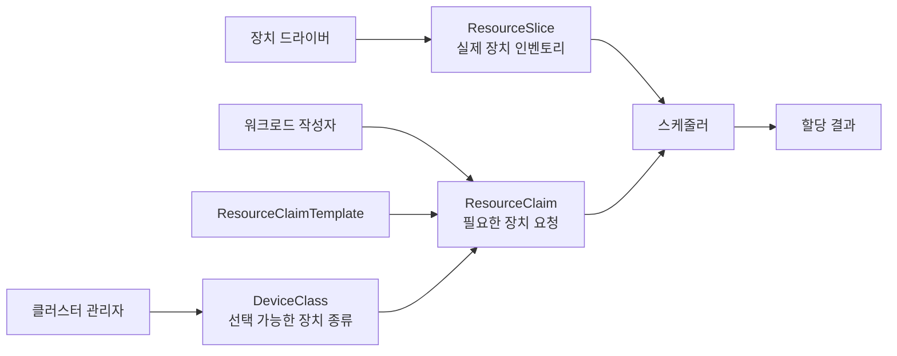
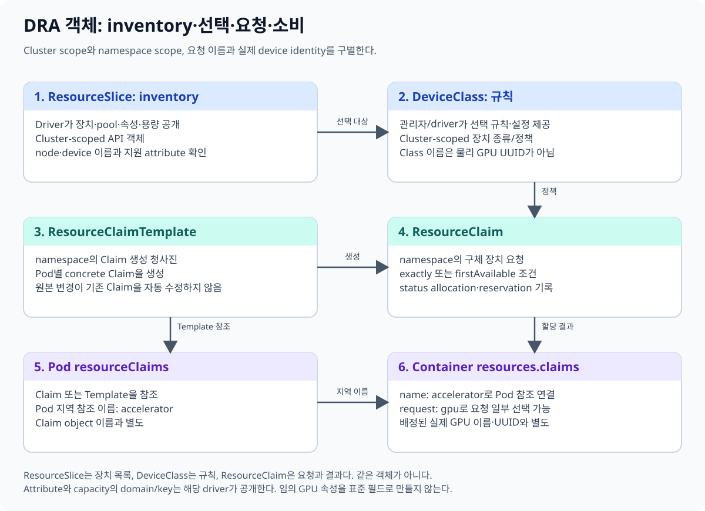
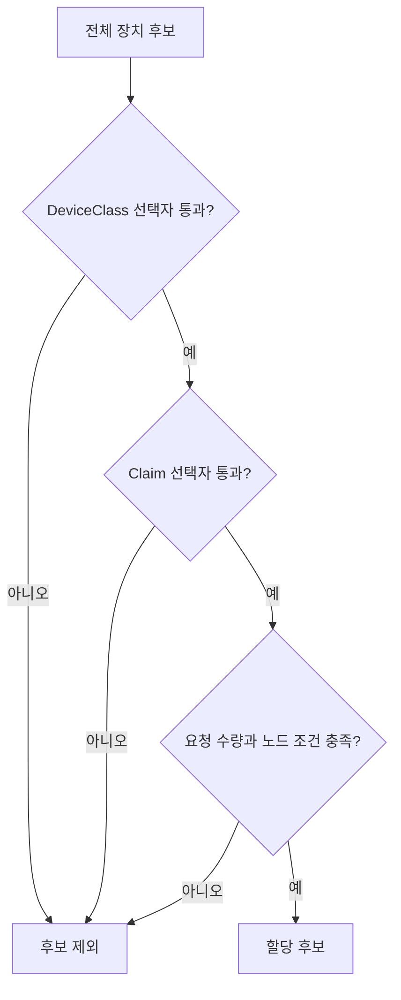
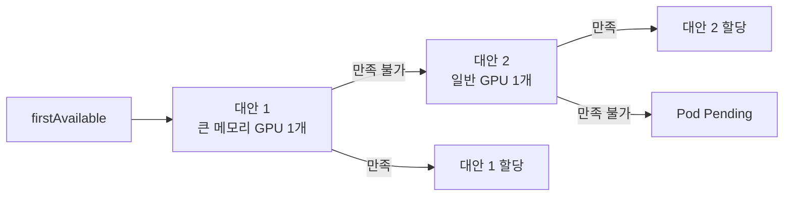

# 04. DRA의 핵심 객체와 요청 언어

[← 이전 장](03-gpu-operator-components.md) · [다음 장 →](05-dra-allocation-lifecycle.md)

> 이 장의 목표는 Dynamic Resource Allocation(DRA)이 어떤 객체로 장치를 표현하고, 사용자가 어떤 방식으로 GPU를 요청하는지 이해하는 것이다.

## 1. 왜 새로운 객체가 필요한가

기존의 단순한 정수형 리소스 요청은 `GPU 1개`처럼 수량을 표현하기 쉽다.
그러나 실제 GPU 선택에는 다음 조건이 필요할 수 있다.

- 메모리가 40 GiB보다 큰 장치
- 특정 기능을 제공하는 장치
- 같은 노드에서 함께 사용할 수 있는 여러 장치
- 여러 대안 중 클러스터가 만족시킬 수 있는 첫 번째 대안

DRA는 장치 인벤토리, 장치 종류, 애플리케이션의 요청, 실제 할당 결과를 서로 다른 객체와 필드로 나눈다.



## 2. 네 객체를 먼저 구분한다

| 객체 | 범위 | 주 작성 주체 | 답하는 질문 |
|---|---|---|---|
| `DeviceClass` | 클러스터 | 관리자 또는 드라이버 배포 구성 | 어떤 종류의 장치를 선택할 수 있는가? |
| `ResourceSlice` | 클러스터 | DRA 드라이버 | 어느 노드에 어떤 장치가 있는가? |
| `ResourceClaim` | 네임스페이스 | 사용자 또는 컨트롤러 | 이 워크로드는 어떤 장치를 원하는가? |
| `ResourceClaimTemplate` | 네임스페이스 | 사용자 | Pod마다 어떤 Claim을 만들어야 하는가? |

`DeviceClass`와 `ResourceSlice`에는 네임스페이스가 없다.
여러 네임스페이스의 워크로드가 같은 클러스터 장치 풀을 보기 때문이다.

`ResourceClaim`과 `ResourceClaimTemplate`은 네임스페이스 객체다.
따라서 Pod와 Claim을 연결할 때 네임스페이스 경계를 함께 고려해야 한다.

## 3. DeviceClass: 선택 정책의 이름

`DeviceClass`는 특정 GPU 한 대를 가리키는 이름이 아니다.
관리자가 제공하는 장치 종류와 공통 선택 정책의 진입점이다.

예를 들어 워크로드가 `gpu.nvidia.com`이라는 DeviceClass를 참조할 수 있다.
그 이름은 드라이버와 클러스터 구성이 제공하는 클래스이며, 실제 물리 GPU UUID는 아니다.

DeviceClass에는 선택자(selector)를 둘 수 있다.
선택자는 해당 클래스로 요청할 수 있는 장치 후보를 제한한다.

## 4. ResourceSlice: 스케줄러가 보는 인벤토리

`ResourceSlice`는 DRA 드라이버가 게시하는 장치 목록이다.
일반 사용자가 수작업으로 유지하는 자산 대장이 아니다.

ResourceSlice가 표현할 수 있는 정보의 예는 다음과 같다.

- 장치가 연결된 노드 또는 노드 집합
- 장치별 속성(attribute)
- 공유 가능한 용량(capacity)
- 드라이버가 장치를 식별하는 이름

속성은 모델명이나 기능처럼 비교 가능한 정보다.
용량은 메모리처럼 양을 비교하거나 나눌 수 있는 정보에 쓰일 수 있다.
어떤 속성과 용량을 게시하는지는 드라이버 구현과 구성에 달려 있다.



## 5. CEL 선택자

DRA는 장치 선택 조건에 CEL(Common Expression Language)을 사용한다.
CEL 표현식은 스케줄러가 후보 장치를 거르는 조건이며, 임의의 셸 명령을 실행하지 않는다.

개념적인 조건은 다음과 같다.

```text
device.capacity["example.com"].memory.isGreaterThan(quantity("40Gi"))
```

이 조건은 드라이버가 `example.com` 아래에 `memory` 용량을 실제로 게시할 때만 의미가 있다.
필드 이름을 추측해서 쓰면 요청이 만족되지 않는다.
먼저 ResourceSlice와 해당 드라이버 문서를 확인해야 한다.



선택자는 후보를 고르는 필터다.
선택자 자체가 장치를 예약하거나 성능 순위를 자동으로 계산하는 것은 아니다.

## 6. ResourceClaim: 장치 사용 의사

ResourceClaim의 `spec.devices.requests`에는 하나 이상의 요청을 넣을 수 있다.
각 요청에는 요청 내부에서 사용하는 이름과 DeviceClass, 수량 또는 선택 조건이 들어간다.

단순한 예를 말로 쓰면 다음과 같다.

> `gpu`라는 요청으로 `gpu.nvidia.com` DeviceClass에서 정확히 한 개를 원한다.

여기서 `gpu`는 요청의 지역 이름이다.
실제 GPU의 UUID나 PCI 주소가 아니다.

## 7. exactly, count, firstAvailable

### exactly

`exactly`는 한 가지 요구 조건을 정확히 기술한다.
DeviceClass, 선택자, 할당 모드와 수량을 조합한다.

### count

`count: 1`은 후보 장치 중 한 개를 요구한다.
`count: 2`라고 해서 자동으로 두 GPU가 동일한 성능이나 토폴로지를 가진다는 뜻은 아니다.
그 조건이 필요하면 드라이버가 제공하는 선택 정보와 정책을 함께 설계해야 한다.

### firstAvailable

`firstAvailable`은 순서가 있는 여러 대안을 제공한다.
첫 번째 대안을 만족할 수 없으면 다음 대안을 검토할 수 있다.

예를 들어 다음 의도를 표현할 수 있다.

1. 우선 큰 메모리 GPU 한 개
2. 불가능하면 일반 GPU 한 개

이는 장치 성능을 점수화해 최적 GPU를 찾는 일반 목적 알고리즘이 아니다.
명시된 대안 순서를 따라 만족 가능한 요청을 찾는 구조다.



## 8. 세 종류의 이름을 섞지 않는다

초보자가 가장 자주 혼동하는 부분이다.

| 이름 | 예 | 의미 |
|---|---|---|
| Claim 안의 요청 이름 | `gpu` | `spec.devices.requests[].name`의 지역 이름 |
| Pod의 Claim 참조 이름 | `accelerator` | Pod 안에서 Claim을 부르는 이름 |
| 실제 장치 식별자 | 드라이버가 정한 값 | 할당된 물리 또는 논리 장치를 드라이버가 식별하는 값 |

Pod의 컨테이너는 `accelerator`라는 Pod 지역 이름을 참조할 수 있다.
그 참조가 Claim 안의 `gpu` 요청을 사용하도록 연결된다.
실제 GPU 식별자는 스케줄러와 드라이버가 할당 결과에 기록한다.

이 세 이름이 우연히 같은 문자열일 수는 있지만 의미는 다르다.

## 9. 작은 예시

노드 A에 장치 `dev-a`, 노드 B에 장치 `dev-b`가 있다고 가정한다.
두 장치 모두 같은 DeviceClass 후보이며 `dev-a`만 메모리 조건을 만족한다.

| 단계 | 결과 |
|---|---|
| Claim이 40 GiB 초과 조건을 요청 | `dev-a`만 후보가 됨 |
| 다른 Pod 조건이 노드 B만 허용 | 공통 노드 후보가 사라짐 |
| 스케줄링 결과 | Claim과 Pod가 할당되지 않고 Pending 가능 |

장치 조건만 따로 만족하면 충분하지 않다.
Pod의 CPU·메모리, affinity, taint, 장치 위치가 모두 같은 노드에서 함께 만족되어야 한다.

## 10. 흔한 오해

**“DeviceClass 하나가 GPU 한 장이다.”**
아니다. DeviceClass는 장치 종류와 선택 정책의 이름이다.

**“ResourceSlice를 사용자가 직접 만들어 GPU를 등록한다.”**
일반적으로 드라이버가 실제 인벤토리를 게시하고 갱신한다.

**“CEL이 가장 빠른 GPU를 알아서 선택한다.”**
CEL은 표현된 조건으로 후보를 필터링한다.

**“count가 2면 두 GPU의 NVLink 연결까지 보장한다.”**
수량만으로는 그런 토폴로지 조건을 보장하지 않는다.

**“Claim 이름이 GPU UUID다.”**
Claim과 요청 이름은 Kubernetes 객체 및 지역 참조 이름이다.

## 11. 확인 문제와 해설

### 문제 1

여러 네임스페이스에서 공통으로 사용하는 장치 인벤토리는 어느 객체에 게시되는가?

**해설:** `ResourceSlice`다. 클러스터 범위 객체이며 보통 DRA 드라이버가 게시한다.

### 문제 2

Pod마다 독립된 Claim을 만들고 싶을 때 출발점으로 적합한 객체는 무엇인가?

**해설:** `ResourceClaimTemplate`이다. 워크로드 컨트롤러가 Pod에 맞는 Claim을 생성하는 데 사용한다.

### 문제 3

`firstAvailable`에 세 대안을 적으면 스케줄러가 세 대안을 성능 벤치마크해 최고 점수를 고르는가?

**해설:** 아니다. 선언된 순서와 만족 가능성을 따르는 대안 요청이며 일반적인 벤치마크나 자동 최적화 기능이 아니다.

## 12. 공식 자료

- [Kubernetes: How DRA works](https://kubernetes.io/docs/concepts/resource-management/dynamic-resource-allocation/how-dra-works/)
- [Resource management for Pods and containers](https://kubernetes.io/docs/concepts/configuration/manage-resources-containers/)
- [ResourceClaim v1 API](https://kubernetes.io/docs/reference/kubernetes-api/workload-resources/resource-claim-v1/)

[← 이전 장](03-gpu-operator-components.md) · [다음 장 →](05-dra-allocation-lifecycle.md)
