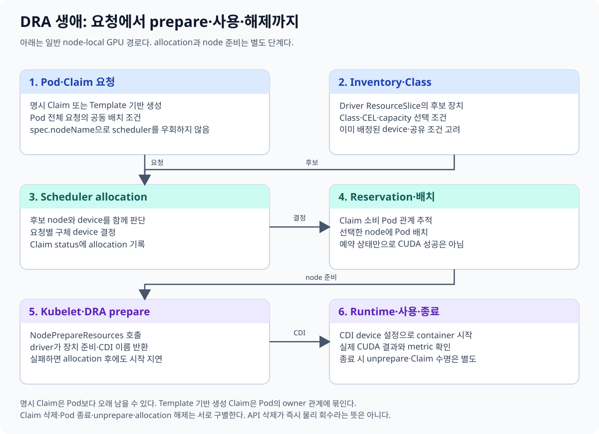
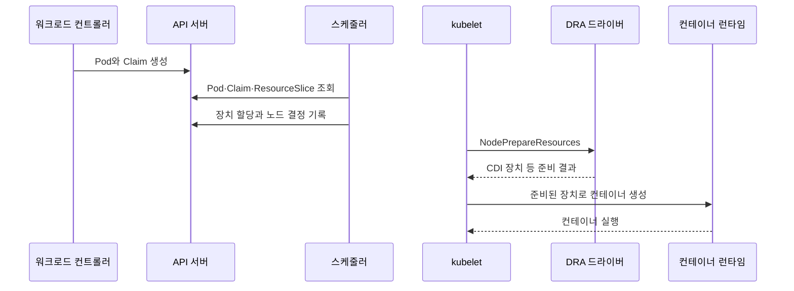
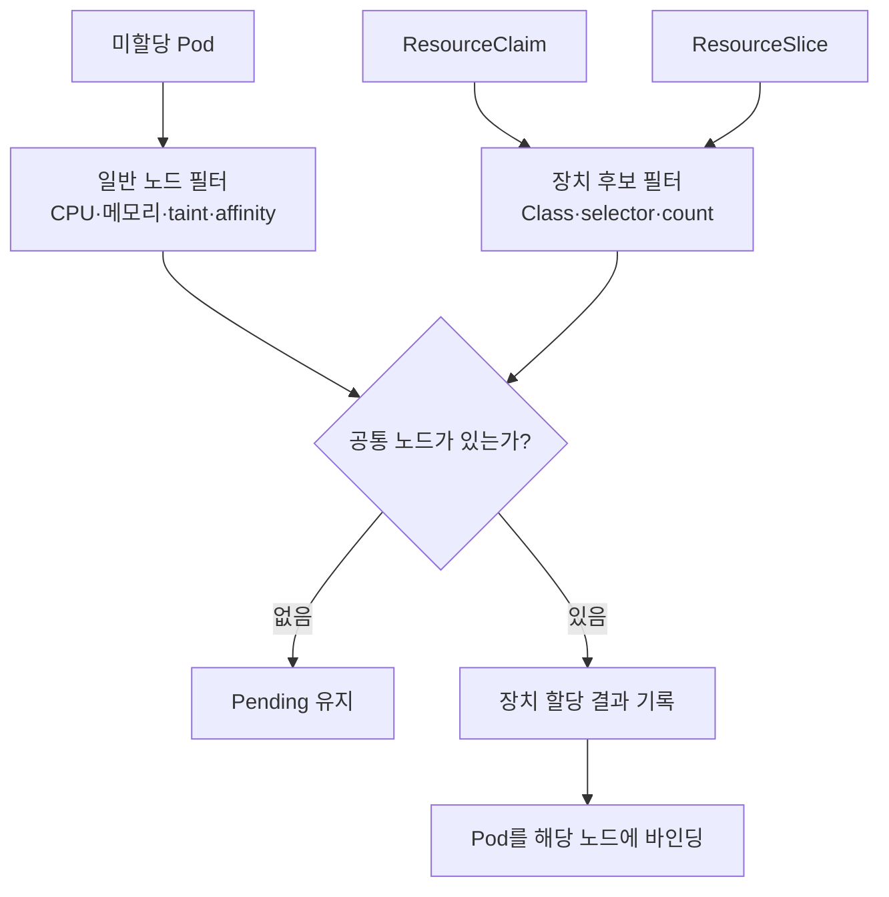
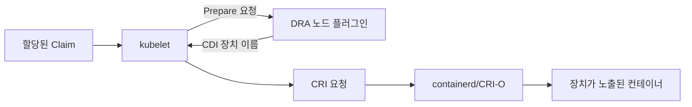

# 05. DRA 할당의 전체 생명주기

[← 이전 장](04-dra-concepts-and-objects.md) · [다음 장 →](06-dra-yaml-walkthrough.md)

> 이 장의 목표는 템플릿에서 Claim이 생기고, 스케줄러가 장치를 할당하고, 노드의 드라이버가 컨테이너 실행 환경을 준비한 뒤 정리하는 순서를 이해하는 것이다.

## 1. 할당은 한 번의 API 호출이 아니다

DRA 장치 사용은 여러 컴포넌트가 이어서 수행하는 상태 전이의 연속이다.

1. Claim이 존재한다.
2. 스케줄러가 Pod와 장치가 함께 들어갈 노드를 찾는다.
3. 할당 결과가 Claim 상태에 기록된다.
4. 선택한 노드의 kubelet이 드라이버에 장치 준비를 요청한다.
5. 컨테이너 런타임이 준비된 장치 정보를 적용한다.
6. Pod가 종료되면 준비 상태를 해제한다.

## 2. 단계 0: 명시적 Claim 또는 템플릿

Claim을 제공하는 방식은 두 가지로 이해하면 쉽다.

### 명시적 ResourceClaim

사용자가 ResourceClaim을 먼저 만들고 Pod가 그 객체를 이름으로 참조한다.
여러 Pod가 재사용하도록 설계할 수도 있지만 동시 사용 가능 여부와 공유 의미는 드라이버 및 요청 정책을 확인해야 한다.

### ResourceClaimTemplate

Pod 명세가 ResourceClaimTemplate을 참조한다.
워크로드 컨트롤러가 Pod에 대응하는 ResourceClaim을 생성한다.
각 Pod에 독립된 Claim이 필요할 때 적합하다.

템플릿 자체가 할당되는 것은 아니다.
템플릿으로부터 만들어진 실제 ResourceClaim이 할당 상태를 가진다.

## 3. 단계 1: Claim 생성과 대기

API 서버에 ResourceClaim이 저장되면 아직 실제 장치가 정해지지 않을 수 있다.
Claim의 명세는 의도이고, 상태는 관측된 할당 결과다.

이 시점에 확인할 것은 다음과 같다.

- 참조한 DeviceClass가 존재하는가
- DRA 드라이버가 ResourceSlice를 게시했는가
- 요청 수량과 선택 조건을 만족할 장치가 있는가
- Claim과 Pod의 참조 이름이 올바르게 연결됐는가

## 4. 단계 2: 스케줄러의 공동 판단

스케줄러는 GPU만 따로 고른 다음 노드를 찾지 않는다.
Pod의 일반 리소스 및 배치 조건과 장치 위치를 함께 만족시켜야 한다.

예를 들어 GPU 후보가 노드 A에만 있는데 Pod의 node affinity가 노드 B만 허용하면 공통 해가 없다.
각 조건을 별도로 보면 만족하는 것처럼 보여도 Pod는 Pending일 수 있다.

스케줄러의 정확한 내부 순서와 점수 계산은 Kubernetes 버전과 구현에 따라 달라질 수 있다.
사용자는 선언된 제약과 최종 상태를 기준으로 관찰해야 한다.

## 5. 단계 3: allocation 상태

스케줄러가 장치를 선택하면 ResourceClaim의 상태에 할당 결과가 기록된다.
여기에는 선택된 장치와 관련 정보가 포함될 수 있다.

명세와 상태를 구분한다.

| 위치 | 의미 |
|---|---|
| `spec` | 사용자가 원한 장치 조건 |
| `status.allocation` | 시스템이 선택한 실제 할당 결과 |

할당이 기록됐다는 사실만으로 컨테이너에서 CUDA가 정상 동작한다고 결론 내릴 수 없다.
노드 준비와 런타임 구성이 뒤에 남아 있다.

## 6. reservation과 reservedFor

Claim 상태에는 어떤 소비자가 해당 할당을 사용하도록 예약되었는지를 나타내는 정보가 관리된다.
`reservedFor`는 Claim을 사용하는 Pod 같은 소비자와 할당의 관계를 추적하는 데 쓰인다.

예약은 수명주기와 안전한 정리에 중요하다.
아직 사용하는 소비자가 있는데 할당을 즉시 회수하면 실행 중인 워크로드가 깨질 수 있기 때문이다.

그러나 `reservedFor`를 보고 다음을 과장하면 안 된다.

- 모든 종류의 장치 공유가 자동 격리된다는 뜻이 아니다.
- 사용자가 객체를 삭제하는 순간 하드웨어가 즉시 초기화된다는 보장이 아니다.
- 애플리케이션 데이터나 GPU 메모리의 보안 삭제 정책을 대신하지 않는다.

정확한 해제 동작은 Kubernetes와 드라이버 수명주기를 함께 확인한다.

## 7. 단계 4: kubelet의 Prepare

Pod가 특정 노드로 배치되면 그 노드의 kubelet이 DRA 드라이버에 할당된 장치 준비를 요청한다.
이 과정은 흔히 `NodePrepareResources` 흐름으로 설명된다.

드라이버는 장치를 컨테이너에서 사용할 수 있도록 필요한 노드 측 작업을 수행한다.
구체적인 작업은 드라이버마다 다르며 다음을 포함할 수 있다.

- 장치 노드 접근 정보 준비
- 마운트 또는 환경 구성 결정
- CDI(Container Device Interface) 장치 이름 반환
- 드라이버 내부 상태 갱신

Prepare 성공은 실제 CUDA 커널 계산 성공과 같은 검증이 아니다.
이는 컨테이너 실행에 필요한 장치 노출 준비 단계다.

## 8. CDI와 컨테이너 런타임

CDI는 컨테이너 런타임에 장치 구성을 전달하는 표준화된 방식이다.
DRA 드라이버가 준비 결과로 CDI 장치 식별자를 제공하면 kubelet과 런타임이 이를 사용해 컨테이너 구성을 완성할 수 있다.

CDI 파일이나 레지스트리 상태에 문제가 있으면 Claim은 할당됐어도 컨테이너 시작이 실패할 수 있다.
따라서 문제를 `스케줄링 실패`와 `노드 준비 실패`로 분리해야 한다.

## 9. 단계 5: 컨테이너 실행

컨테이너가 시작된 뒤에는 여러 검증 수준이 있다.

1. 장치 파일이나 라이브러리가 보인다.
2. `nvidia-smi` 같은 관리 도구가 장치를 나열한다.
3. 런타임 API가 장치를 초기화한다.
4. 실제 CUDA 연산이 성공한다.
5. 애플리케이션의 성능과 정확성이 기대를 만족한다.

앞 단계가 성공했다고 뒤 단계가 자동으로 증명되지는 않는다.

## 10. 단계 6: Stop과 Unprepare

Pod와 컨테이너 사용이 끝나면 kubelet은 드라이버에 장치 준비 해제를 요청한다.
이를 `NodeUnprepareResources` 흐름으로 이해할 수 있다.

드라이버는 노드 측 준비 상태를 정리한다.
정리가 완료되고 Claim을 사용하는 소비자가 없어지면 할당 해제 및 객체 정리로 이어질 수 있다.

노드 장애나 네트워크 단절이 있으면 정리가 즉시 완료되지 않을 수 있다.
운영자는 API 상태와 노드·드라이버 로그를 함께 확인해야 한다.

## 11. 템플릿 Claim의 수명

템플릿 기반 Claim은 워크로드 컨트롤러가 Pod를 위해 만든다.
Pod 교체와 스케일 변화에 따라 Claim 생성과 정리가 연동될 수 있다.

예를 들어 Deployment의 Pod 두 개가 각각 템플릿 Claim을 사용하면 일반적으로 Pod별 Claim이 만들어진다.
Pod가 교체될 때 이전 Claim과 새 Claim의 수명도 관찰해야 한다.

`ResourceClaimTemplate` 객체 하나를 모든 Pod가 직접 공동 할당받는 구조로 이해하면 안 된다.

## 12. 명시적 Claim의 수명과 재사용

명시적으로 만든 Claim은 Pod 삭제와 별개로 남을 수 있다.
따라서 다음 워크로드가 같은 Claim을 다시 참조하는 설계를 할 수 있다.

다만 재사용 전에 확인할 사항이 있다.

- 이전 소비자의 예약이 해제됐는가
- 드라이버가 해당 장치 재사용을 지원하는가
- 장치 내부 상태를 애플리케이션이 어떻게 초기화하는가
- 민감한 데이터가 장치 메모리에 남을 가능성에 대한 정책이 있는가

Kubernetes 객체의 재사용 가능성과 애플리케이션 상태의 안전한 재사용은 별개의 문제다.

## 13. 작은 실패 사례

### 사례 A: Claim은 Pending

DeviceClass 이름 오타 또는 만족할 ResourceSlice가 없다.
스케줄러 이벤트와 Claim 상태부터 확인한다.

### 사례 B: Claim은 할당됐지만 Pod가 ContainerCreating

노드 플러그인의 Prepare, CDI, 컨테이너 런타임 구간을 확인한다.

### 사례 C: 컨테이너는 Running이지만 CUDA 실패

이미지의 사용자 공간 라이브러리, 호스트 드라이버 호환성, 실제 CUDA 테스트를 확인한다.
Running은 GPU 계산 성공을 뜻하지 않는다.

## 14. 흔한 오해

**“스케줄러가 GPU를 할당하면 장치 설정도 모두 끝난다.”**
노드의 kubelet·DRA 드라이버·CDI·런타임 단계가 남아 있다.

**“Pod를 지우면 명시적 Claim도 항상 지워진다.”**
명시적 Claim은 별도 객체로 남을 수 있다. 소유 관계와 정책을 확인해야 한다.

**“Unprepare는 GPU 메모리의 보안 삭제를 보장한다.”**
그런 보장은 DRA 수명주기만으로 단정할 수 없다.

## 15. 확인 문제와 해설

### 문제 1

Claim 상태에 allocation이 있는데 Pod가 시작하지 못한다. 가장 먼저 어느 경계를 나눠 볼 것인가?

**해설:** 스케줄링은 통과했으므로 kubelet Prepare, DRA 노드 플러그인, CDI, 컨테이너 런타임 순서로 범위를 좁힌다.

### 문제 2

Deployment의 각 Pod가 독립 장치를 요구한다. 명시적 Claim 하나보다 어떤 방식이 자연스러운가?

**해설:** ResourceClaimTemplate을 Pod 명세에서 참조해 Pod별 Claim이 생성되도록 하는 방식이다.

### 문제 3

컨테이너에서 `nvidia-smi`가 성공하면 연구 코드의 CUDA 계산도 검증된 것인가?

**해설:** 아니다. 장치 열거와 실제 CUDA 연산은 다른 검증 단계다.

## 16. 공식 자료

- [Kubernetes: How DRA works](https://kubernetes.io/docs/concepts/resource-management/dynamic-resource-allocation/how-dra-works/)
- [ResourceClaim v1 API](https://kubernetes.io/docs/reference/kubernetes-api/workload-resources/resource-claim-v1/)
- [Container Device Interface](https://github.com/cncf-tags/container-device-interface)

[← 이전 장](04-dra-concepts-and-objects.md) · [다음 장 →](06-dra-yaml-walkthrough.md)
