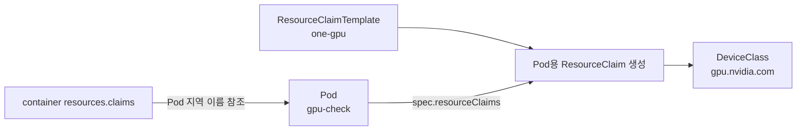
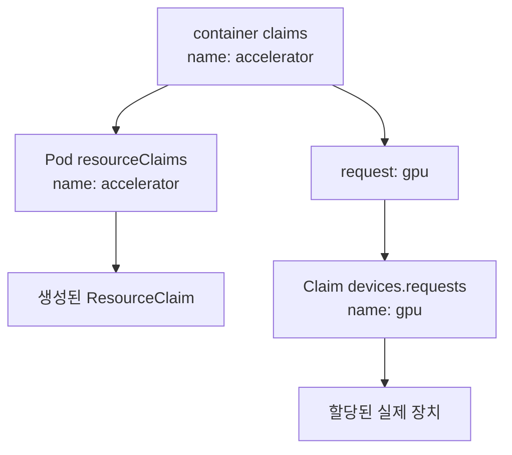
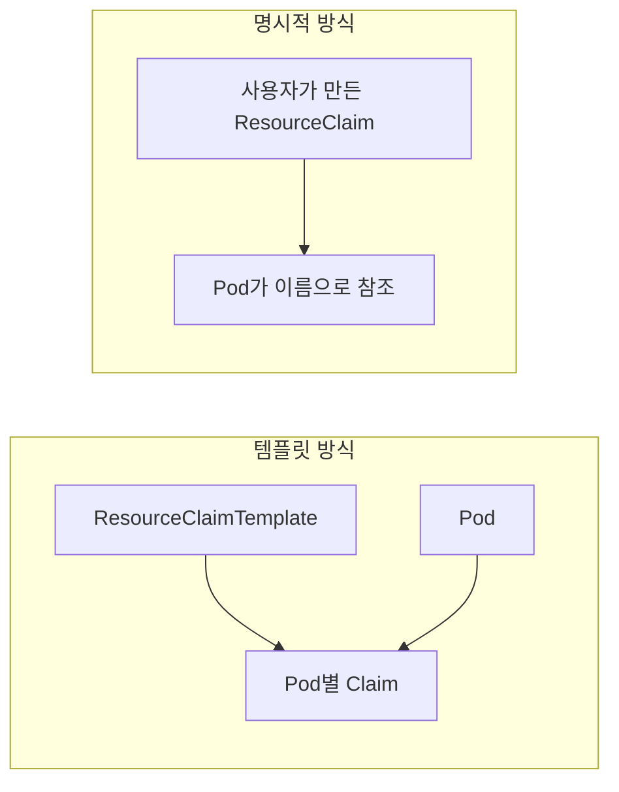

# 06. DRA YAML을 한 줄씩 읽기

[← 이전 장](05-dra-allocation-lifecycle.md) · [다음 장 →](07-cdi-and-runtime.md)

> 이 장에서는 Kubernetes `resource.k8s.io/v1` API로 NVIDIA GPU 한 개를 요청하는 교육용 YAML을 읽는다. GPU 없는 노트북이나 운영 클러스터에 그대로 적용하지 않는다.

## 1. 예제의 전제

이 예제는 다음 조건을 전제로 한다.

- Kubernetes 클러스터가 사용하는 DRA 기능과 `resource.k8s.io/v1` API를 지원한다.
- NVIDIA DRA 드라이버가 설치되어 있다.
- `gpu.nvidia.com` DeviceClass와 장치 ResourceSlice가 준비되어 있다.
- 이미지 레지스트리에 접근할 수 있다.

하나라도 빠지면 YAML 문법이 맞아도 Pod가 실행되지 않는다.
기능 성숙도와 버전 조건은 [14장](14-versions-and-feature-status.md)에서 따로 확인한다.

## 2. 전체 구조

템플릿 기반 요청은 두 문서로 구성한다.

1. `ResourceClaimTemplate`: GPU 요청의 청사진
2. `Pod`: 템플릿으로 만들어진 Claim을 사용



## 3. 전체 교육용 YAML

같은 예제를 [dra-one-gpu.yaml](examples/dra-one-gpu.yaml) 파일로 제공한다. 두 객체는 같은 namespace에서 연결하며, 이 파일은 준비된 GPU 학습 환경에서 읽는 API 예시다. 이번 교재 작성 과정에서는 적용하지 않았다.

```yaml
apiVersion: resource.k8s.io/v1
kind: ResourceClaimTemplate
metadata:
  name: one-gpu
spec:
  spec:
    devices:
      requests:
        - name: gpu
          exactly:
            deviceClassName: gpu.nvidia.com
            allocationMode: ExactCount
            count: 1
---
apiVersion: v1
kind: Pod
metadata:
  name: gpu-check
spec:
  restartPolicy: Never
  resourceClaims:
    - name: accelerator
      resourceClaimTemplateName: one-gpu
  containers:
    - name: check
      image: nvidia/cuda:12.8.1-base-ubuntu22.04
      command: ["bash", "-lc", "nvidia-smi"]
      resources:
        claims:
          - name: accelerator
            request: gpu
```

이 예제는 읽기 위한 예제다.
여기서는 실행하거나 실제 GPU 동작을 측정했다고 주장하지 않는다.

## 4. ResourceClaimTemplate 머리 부분

```yaml
apiVersion: resource.k8s.io/v1
kind: ResourceClaimTemplate
metadata:
  name: one-gpu
```

`apiVersion`은 이 객체가 Kubernetes의 안정 `resource.k8s.io/v1` API 형태를 사용한다고 선언한다.
클러스터 버전과 기능 구성이 이를 지원해야 한다.

`kind`는 이것이 실제 할당 상태를 가진 Claim이 아니라 Claim을 만들기 위한 템플릿임을 뜻한다.

`metadata.name: one-gpu`는 Pod가 템플릿을 찾을 때 사용하는 Kubernetes 객체 이름이다.
GPU의 제품명이나 UUID가 아니다.

## 5. spec 안의 spec

```yaml
spec:
  spec:
    devices:
```

`ResourceClaimTemplate` 바깥쪽 `spec` 안에 새 ResourceClaim의 명세가 들어간다.
그래서 `spec.spec`가 반복된다.

- 첫 번째 `spec`: 템플릿의 명세
- 두 번째 `spec`: 템플릿에서 생성될 ResourceClaim의 명세

오타처럼 보이지만 객체 구조상 필요한 중첩이다.

## 6. requests와 지역 이름

```yaml
requests:
  - name: gpu
```

한 Claim은 여러 장치 요청을 가질 수 있다.
여기서는 요청 하나를 만들고 그 지역 이름을 `gpu`로 정했다.

`gpu`는 뒤에서 컨테이너의 `request` 필드가 참조한다.
실제 장치 식별자가 아니다.

## 7. exactly와 ExactCount

```yaml
exactly:
  deviceClassName: gpu.nvidia.com
  allocationMode: ExactCount
  count: 1
```

각 줄의 의미는 다음과 같다.

| 필드 | 의미 |
|---|---|
| `exactly` | 한 가지 정확한 장치 요구 조건 |
| `deviceClassName` | 후보를 가져올 DeviceClass |
| `allocationMode: ExactCount` | 지정한 수량을 정확히 요구 |
| `count: 1` | 장치 한 개 요청 |

`gpu.nvidia.com`은 NVIDIA DRA 드라이버 문서가 사용하는 DeviceClass 이름이다.
클러스터에 해당 객체가 실제로 존재해야 한다.

`count: 1`은 GPU 메모리 크기나 모델을 지정하지 않는다.
그런 조건이 필요하면 지원되는 선택자를 추가한다.

## 8. Pod의 resourceClaims

```yaml
spec:
  resourceClaims:
    - name: accelerator
      resourceClaimTemplateName: one-gpu
```

`resourceClaims`는 이 Pod가 사용할 Claim들을 선언한다.

`name: accelerator`는 Pod 명세 안에서 사용하는 지역 이름이다.
템플릿 이름과 달라도 된다.

`resourceClaimTemplateName: one-gpu`는 앞에서 만든 템플릿 객체를 참조한다.
컨트롤러는 이 템플릿으로 Pod용 ResourceClaim을 만든다.

## 9. 컨테이너의 claims

```yaml
resources:
  claims:
    - name: accelerator
      request: gpu
```

여기에는 이름이 두 개 나온다.

- `name: accelerator`: Pod의 `spec.resourceClaims[].name`과 같다.
- `request: gpu`: Claim 내부 `devices.requests[].name`과 같다.

즉 `accelerator`는 **어느 Claim인가**를 고르고, `gpu`는 **그 Claim의 어느 요청인가**를 고른다.



두 이름을 모두 `gpu`로 쓸 수도 있지만, 서로 다른 역할을 배우기 위해 예제에서는 다르게 썼다.

## 10. 이미지와 명령의 한계

```yaml
image: nvidia/cuda:12.8.1-base-ubuntu22.04
command: ["bash", "-lc", "nvidia-smi"]
```

고정 태그를 사용해 예제의 사용자 공간을 구체적으로 만들었다.
그래도 이미지와 호스트 드라이버의 호환성은 환경별로 확인해야 한다.

`nvidia-smi` 성공은 다음 정도를 확인한다.

- 도구가 실행된다.
- 드라이버 관리 인터페이스로 장치를 열거할 수 있다.

CUDA 커널 계산, 프레임워크 학습, 수치 정확성, 성능을 검증하지는 않는다.
실제 CUDA 계산 검증은 별도의 작은 프로그램이나 프레임워크 테스트가 필요하다.

## 11. 메모리 용량 선택자 추가 예시

NVIDIA DRA 드라이버가 게시하는 메모리 용량을 사용한다면 요청에 선택자를 추가할 수 있다.

```yaml
selectors:
  - cel:
      expression: >-
        device.capacity['gpu.nvidia.com'].memory.isGreaterThan(quantity("40Gi"))
```

이 표현식은 GPU 메모리 용량이 40 GiB보다 큰 후보만 남긴다.
`40Gi` 이상이 아니라 **초과** 조건이라는 점에 유의한다.

이 필드는 모든 DRA 드라이버에 공통으로 존재하는 임의의 이름이 아니다.
NVIDIA 드라이버가 게시하는 정확한 도메인과 capacity 이름을 공식 문서 및 ResourceSlice에서 확인해야 한다.

## 12. 명시적 ResourceClaim 대안

Pod마다 새 Claim을 만들 필요가 없으면 `ResourceClaim`을 직접 만들 수 있다.
Pod에서는 `resourceClaimTemplateName` 대신 기존 Claim을 참조하는 필드를 사용한다.



명시적 Claim은 Pod 삭제 후에도 남을 수 있으므로 예약 해제, 재사용 정책, 최종 삭제 책임을 정해야 한다.
템플릿 방식은 컨트롤러가 Pod별 수명 관리를 돕지만 운영 중 생성된 Claim 상태를 여전히 관찰해야 한다.

## 13. Extended Resource와의 관계

전통적인 GPU 요청은 다음처럼 보인다.

```yaml
resources:
  limits:
    nvidia.com/gpu: 1
```

DRA는 DeviceClass, ResourceClaim, 선택자, 구조화된 할당 상태를 사용한다.
두 API의 표현 방식과 수명주기는 다르다.

Kubernetes에는 확장 리소스 요청을 DRA 백엔드 할당으로 연결하기 위한 기능도 존재한다.
따라서 `nvidia.com/gpu`라는 문자열만 보고 항상 특정 내부 구현이라고 단정하지 않는다.
클러스터의 기능 설정, DeviceClass 및 드라이버 배포 방식을 확인한다.

## 14. 적용 전에 읽기 전용으로 확인할 것

GPU 없는 노트북에는 이 YAML을 적용하지 않는다.
클러스터에서도 먼저 다음을 읽기 전용으로 확인한다.

```text
kubectl api-resources | grep -E 'resourceclaim|deviceclass|resourceslice'
kubectl get deviceclasses
kubectl get resourceslices
kubectl -n <namespace> get resourceclaims
```

위 명령은 학습용 예시이며 여기서는 실행하지 않았다.
운영 환경에서는 정확한 컨텍스트와 네임스페이스를 먼저 확인한다.

## 15. 흔한 오류

**`spec.spec` 하나를 지웠다.**
템플릿과 생성될 Claim 명세의 중첩이므로 둘 다 필요하다.

**컨테이너의 `name`에 `gpu`를 썼지만 Pod Claim 이름은 `accelerator`다.**
`resources.claims[].name`은 Pod의 Claim 지역 이름과 맞아야 한다.

**`request`를 생략하거나 실제 GPU UUID를 넣었다.**
`request`는 Claim 내부 요청 이름인 `gpu`를 참조한다.

**Pod가 Running이므로 CUDA가 검증됐다고 판단했다.**
Running, 장치 열거, 실제 CUDA 계산은 서로 다른 검증 단계다.

## 16. 확인 문제와 해설

### 문제 1

`one-gpu`, `accelerator`, `gpu`는 각각 무엇인가?

**해설:** 템플릿 객체 이름, Pod 안의 Claim 지역 이름, Claim 안의 장치 요청 이름이다.

### 문제 2

두 GPU를 정확히 요청하려면 가장 직접적으로 어느 값을 바꾸는가?

**해설:** `allocationMode: ExactCount`를 유지하고 `count`를 `2`로 바꾼다. 두 GPU의 토폴로지까지 자동 보장되지는 않는다.

### 문제 3

메모리 선택자에서 속성 이름을 임의로 `vram`이라고 바꿔도 되는가?

**해설:** 아니다. 드라이버가 실제 게시하는 capacity 경로를 사용해야 한다.

## 17. 공식 자료

- [Kubernetes: How DRA works](https://kubernetes.io/docs/concepts/resource-management/dynamic-resource-allocation/how-dra-works/)
- [ResourceClaim v1 API](https://kubernetes.io/docs/reference/kubernetes-api/workload-resources/resource-claim-v1/)
- [NVIDIA DRA driver: Allocating GPUs](https://dra-driver-nvidia-gpu.sigs.k8s.io/docs/guides/gpu-allocation/allocating-gpus/)

[← 이전 장](05-dra-allocation-lifecycle.md) · [다음 장 →](07-cdi-and-runtime.md)
