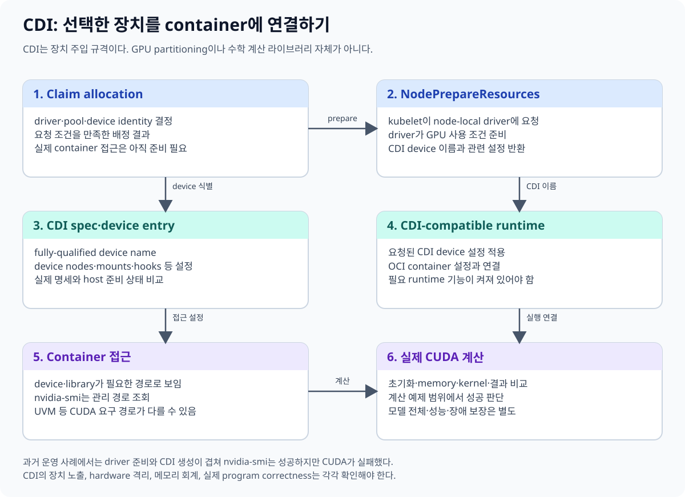
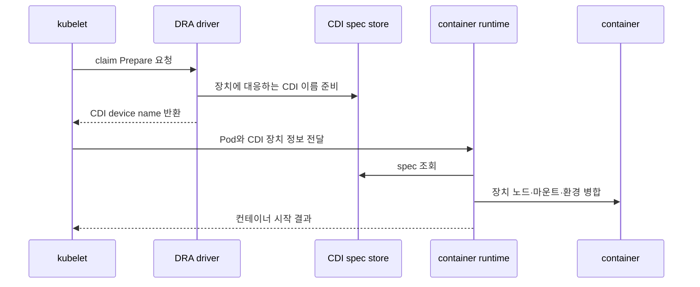
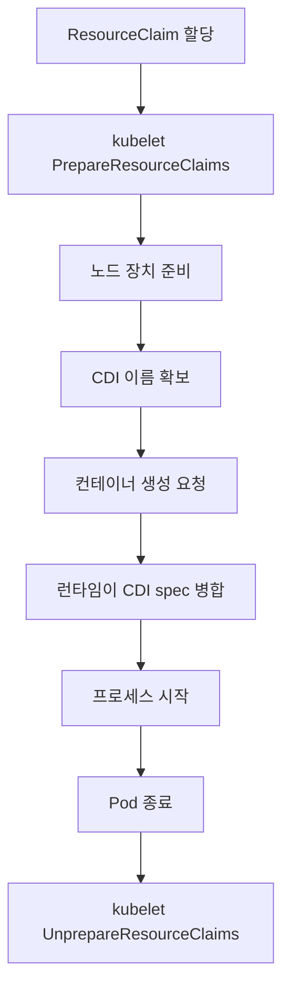
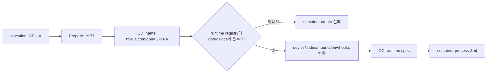

# 07. CDI와 컨테이너 런타임

CDI(Container Device Interface)는 컨테이너에 장치를 넣기 위한 표준 명세다.
장치 공급자가 “어떤 장치 노드, 환경 변수, 마운트, hook이 필요한가”를 CDI 규격 파일로 표현하고,
CDI를 지원하는 런타임이 그 정의를 컨테이너 설정에 합친다.

CDI 자체는 CUDA도 아니고 GPU 격리 기술도 아니다.
CDI는 장치 주입 방법을 표준화한다.



## 7.1 CDI 장치 이름

CDI 장치는 fully-qualified device name으로 식별한다.

```text
vendor.com/class=device-name
```

교육용 예는 다음과 같다.

```text
nvidia.com/gpu=GPU-1234
```

`nvidia.com`은 공급자, `gpu`는 장치 종류, `GPU-1234`는 특정 장치 이름에 해당한다.
실제 이름과 지원 방식은 NVIDIA Toolkit이 만든 CDI spec을 확인해야 한다.

CDI 공식 명세는 [CNCF CDI 저장소](https://github.com/cncf-tags/container-device-interface)에서 관리된다.

## 7.2 spec에는 무엇이 있는가

개념적인 CDI spec은 다음 정보를 담는다.

```yaml
cdiVersion: "0.8.0"
kind: "nvidia.com/gpu"
devices:
  - name: "GPU-1234"
    containerEdits:
      deviceNodes:
        - path: /dev/nvidia0
      env:
        - NVIDIA_VISIBLE_DEVICES=GPU-1234
```

이 예시는 구조 설명용이며 실제 NVIDIA 생성 파일의 전체 표현이 아니다.
버전, 장치 노드, 마운트와 hook은 플랫폼 구성에 따라 달라진다.

## 7.3 런타임 주입 흐름



DRA에서 kubelet은 선택된 claim을 노드에서 사용할 수 있도록 준비한다.
드라이버는 장치 준비 결과에 CDI 장치 이름을 포함할 수 있다.
런타임은 그 이름으로 spec을 찾아 컨테이너 구성을 만든다.

NVIDIA Container Toolkit의 CDI 지원은
[공식 CDI 문서](https://docs.nvidia.com/datacenter/cloud-native/container-toolkit/latest/cdi-support.html)를 참고한다.

## 7.4 prepare와 컨테이너 시작은 같은 단계가 아니다



할당은 “어느 장치를 쓸지” 결정하는 제어 평면 단계다.
prepare는 그 노드에서 장치를 사용할 수 있게 만드는 단계다.
CDI 주입은 컨테이너 생성 설정에 장치 접근 요소를 합치는 단계다.

이 구분은 장애 분석에 유용하다.

| 증상 | 먼저 볼 경계 |
|---|---|
| claim이 할당되지 않음 | 스케줄러·DRA controller |
| claim은 할당됐지만 prepare 실패 | kubelet·노드 DRA plugin |
| prepare 성공 후 컨테이너 생성 실패 | CDI spec·runtime |
| 컨테이너가 시작됐지만 CUDA 실패 | driver·library·application |

## 7.5 UVM과 CDI 갱신 경합

NVIDIA Unified Virtual Memory(UVM) 장치 노드가 늦게 생기거나,
CDI spec 생성 시점과 장치 초기화 시점이 어긋나면 경합이 나타날 수 있다.

예를 들어 다음 순서를 생각하자.

1. Toolkit이 CDI spec을 생성한다.
2. 드라이버 초기화가 아직 끝나지 않아 UVM 관련 장치가 빠진다.
3. kubelet prepare가 성공한 것으로 보인다.
4. 런타임이 오래된 CDI spec으로 컨테이너를 만든다.
5. 애플리케이션이 UVM 장치를 요구할 때 실패한다.

이 문제를 “DRA가 GPU를 잘못 골랐다”라고만 해석하면 원인을 놓친다.
장치 준비 시점, CDI spec 갱신, 런타임이 읽은 spec을 함께 확인한다.

## 7.6 숫자로 보는 교육 예

노드에 GPU가 2개 있고 CDI 이름이 각각 다음과 같다고 하자.

```text
nvidia.com/gpu=GPU-A
nvidia.com/gpu=GPU-B
```

Pod P1의 claim이 GPU-A를, P2의 claim이 GPU-B를 받았다.
P1 런타임 요청에는 GPU-A의 fully-qualified name만 들어가야 한다.

| Pod | claim 결과 | CDI 이름 | 예상 장치 |
|---|---|---|---|
| P1 | GPU-A | `nvidia.com/gpu=GPU-A` | `/dev/nvidia0` 계열 |
| P2 | GPU-B | `nvidia.com/gpu=GPU-B` | `/dev/nvidia1` 계열 |

CDI spec이 두 장치를 모두 정의한다고 해서 P1에 둘 다 주입되는 것은 아니다.
런타임에 요청된 CDI 장치 이름이 컨테이너별 주입 범위를 정한다.

### 7.6.1 Prepare 결과가 실제 파일 편집으로 풀리는 예

GPU-A의 claim이 이미 할당됐다고 가정하자. Node plugin의 Prepare 결과와 CDI spec을 연결하면 다음 두 조각이 있다.

```text
Prepare 결과의 논리 참조
  claim uid: rc-77
  CDI device: nvidia.com/gpu=GPU-A

노드 CDI registry의 정의
  kind: nvidia.com/gpu
  device name: GPU-A
  container edits:
    /dev/nvidia0 추가
    /dev/nvidiactl 추가
    필요한 library mount 또는 hook
    NVIDIA_VISIBLE_DEVICES=GPU-A 같은 환경 편집
```

CDI registry 파일의 기본 검색 경로와 NVIDIA가 생성한 파일 이름은 runtime·Toolkit 설정에 따라 확인해야 한다. 중요한 점은 kubelet이 `/dev/nvidia0`을 문자열로 추측하는 것이 아니라 fully-qualified name을 넘기고, CDI-aware runtime이 registry에서 같은 kind와 device name을 찾아 편집을 합친다는 것이다.



다음은 교육용으로 줄인 CDI 문서와 OCI 편집 결과다. 실제 NVIDIA spec에는 더 많은 장치 노드와 mount, hook이 들어갈 수 있다.

```yaml
cdiVersion: "0.8.0"
kind: "nvidia.com/gpu"
devices:
  - name: "GPU-A"
    containerEdits:
      deviceNodes:
        - path: /dev/nvidia0
        - path: /dev/nvidiactl
      env:
        - NVIDIA_VISIBLE_DEVICES=GPU-A
```

```text
런타임이 container 생성 직전에 얻는 효과
  Linux devices: /dev/nvidia0, /dev/nvidiactl 접근 항목
  Environment:   NVIDIA_VISIBLE_DEVICES=GPU-A
  요청하지 않은 GPU-B 항목: 없음
```

오류 위치도 구체적으로 갈린다.

| 관찰 | 의미 | 다음 확인 |
|---|---|---|
| Prepare가 CDI name을 못 만듦 | node plugin이 allocation을 준비하지 못함 | plugin log, 장치 초기화 |
| CDI name은 반환됐지만 registry에 없음 | 이름과 spec snapshot 불일치 | 생성 시각, registry 검색 경로 |
| spec은 있으나 `/dev/nvidia0` 없음 | 오래된 spec 또는 driver device node 문제 | host device node, spec 재생성 |
| container에 node는 있으나 library load 실패 | 주입 이후 사용자 공간 경계 | image library와 host driver 호환성 |
| library load 후 kernel 실패 | 실행 경계 | 실제 CUDA 오류와 GPU 상태 |

CDI spec을 갱신했다고 이미 실행 중인 컨테이너의 OCI 구성이 자동으로 다시 작성되는 것도 아니다. Container creation 시점에 적용된 편집은 그 컨테이너의 수명 동안 유지된다. 장치 정의가 바뀌었다면 새 container가 어느 spec generation을 읽었는지 확인해야 한다.

반례로, `NVIDIA_VISIBLE_DEVICES=GPU-A` 환경 변수만 수동으로 넣었다고 CDI 주입과 같아지지 않는다. 필요한 device node, library mount, hook, cgroup 허용이 빠질 수 있다. 반대로 `/dev/nvidia0` 하나만 bind mount했다고 UUID와 minor number의 대응이 재부팅 후에도 같은지 보장되지 않는다. 논리 ID와 실제 편집을 CDI spec 한 곳에서 연결하는 이유다.

## 7.7 CDI가 보장하지 않는 것

CDI는 다음을 자동으로 보장하지 않는다.

- 장치의 보안 격리 강도
- GPU 메모리의 공정한 분배
- CUDA와 드라이버 버전 호환성
- NCCL 통신 성능
- claim 할당 정책의 적절성
- 애플리케이션의 수치 정확성

MIG, IOMMU, cgroup, 드라이버 기능과 Kubernetes 정책은 별도 계층에서 작동한다.

## 7.8 흔한 오해

**오해 1: CDI는 NVIDIA 전용이다.**
CDI는 공급자 중립 명세이며 NVIDIA는 이를 GPU 주입에 사용한다.

**오해 2: CDI 이름은 Linux 장치 경로다.**
CDI 이름은 spec의 논리 식별자다. spec이 실제 장치 노드와 설정을 연결한다.

**오해 3: CDI가 있으면 CUDA가 자동 설치된다.**
CDI는 주입 규격이다. 애플리케이션 이미지와 호스트 드라이버 호환성은 별도로 맞춘다.

**오해 4: prepare 성공은 애플리케이션 성공을 뜻한다.**
prepare 이후에도 런타임 주입, 라이브러리 로딩, 커널 실행 단계에서 실패할 수 있다.

## 7.9 확인 문제

1. fully-qualified CDI 장치 이름의 세 부분은 무엇인가?
2. DRA claim 할당과 CDI 주입의 차이는 무엇인가?
3. UVM 장치가 늦게 만들어졌을 때 어떤 세 요소를 함께 확인해야 하는가?
4. CDI가 GPU 격리를 보장한다고 말할 수 없는 이유는 무엇인가?

### 해설

1. 공급자, 장치 종류, 장치 이름이다.
2. claim 할당은 사용할 장치를 고르고, CDI 주입은 선택된 장치를 컨테이너 설정에 반영한다.
3. 장치 준비 시점, CDI spec 갱신 결과, 런타임이 실제 읽은 spec이다.
4. CDI는 장치 접근에 필요한 편집을 전달할 뿐 격리 메커니즘 자체가 아니기 때문이다.

---

[이전 장](06-dra-yaml-walkthrough.md) · [다음 장](08-sharing-mig-timeslicing-mps.md)
