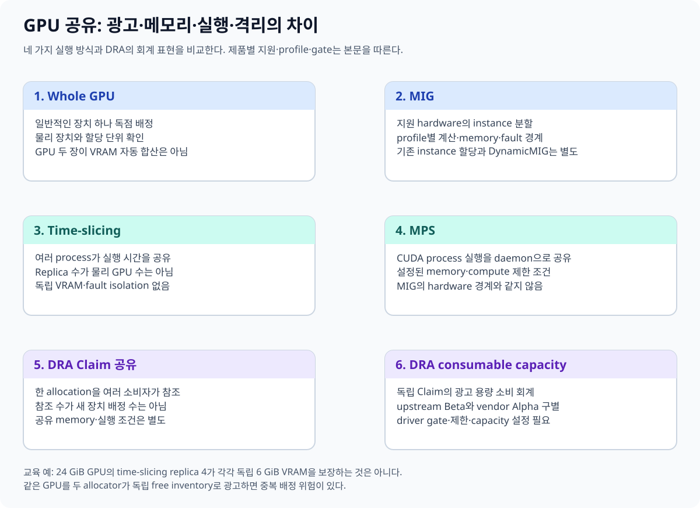
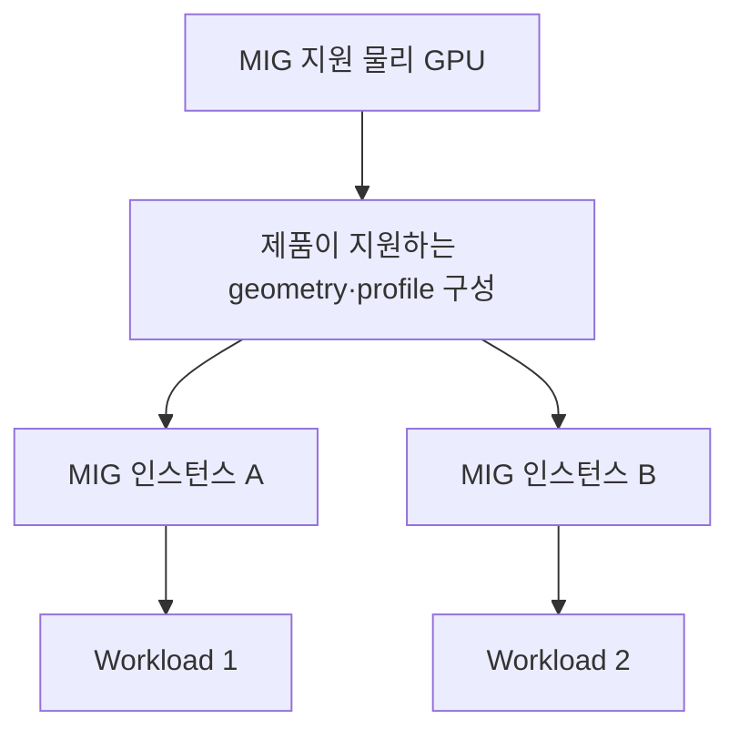
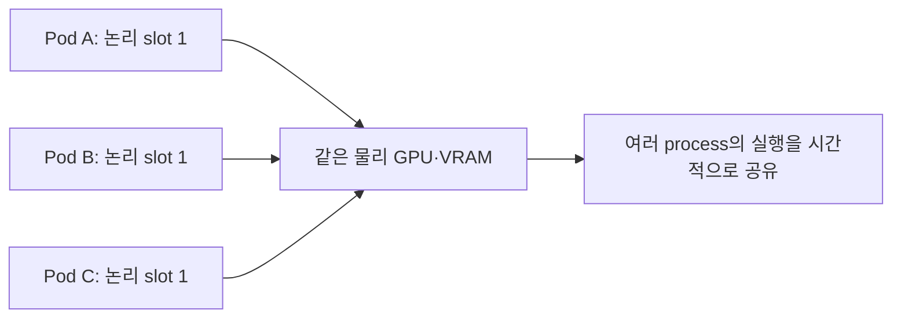
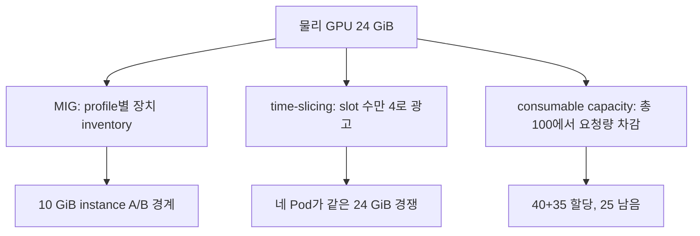

# 08. GPU 공유: MIG·time-slicing·MPS는 무엇을 나누나

“GPU 하나를 여러 사람이 쓴다”에는 서로 다른 구현이 있다. 장치 메모리, 계산 실행 시간, 동시에 실행할 작업, 장애 경계를 각각 질문해야 한다. Kubernetes가 광고받은 자원을 셀 수 있다는 사실과 GPU 안에서 자원이 격리된다는 사실은 다르다.



## 08.1 물리 GPU·논리 장치·요청 단위를 구분한다

물리 GPU는 서버의 실제 장치다. 논리 장치는 그 위에 구현한 접근·분할 단위다. Kubernetes 요청 단위는 plugin이나 driver가 공개한 자원의 단위다. 이 세 개의 개수가 같다고 가정하지 않는다.

| 방식 | 나누는 방법 | 메모리·격리 관점 |
| --- | --- | --- |
| Whole GPU의 일반 독점 할당 | 한 GPU 장치를 workload에 배정 | 일반 allocator의 중복 할당 제외; host 관리자 접근 등은 별도 |
| MIG | 지원 GPU를 정해진 하드웨어 인스턴스로 분할 | 인스턴스의 memory·fault isolation; profile별 제약 |
| Time-slicing | 여러 workload의 실행을 시간적으로 multiplex | 독립 VRAM·fault isolation을 만들지 않음 |
| MPS | control daemon으로 여러 CUDA process 실행 공유 | 구현된 memory/compute 제한과 CUDA 공유; MIG와 다른 경계 |
| DRA consumable capacity | 요청이 소비하는 광고 용량을 scheduler가 회계 처리 | 실제 제한·준비 구현은 driver·runtime 기능에 의존 |

## 08.2 MIG: 지원 하드웨어를 실제 인스턴스로 나누기

**MIG, Multi-Instance GPU**는 지원 NVIDIA GPU에서 작은 독립 GPU 인스턴스를 만드는 기능이다. 어떤 제품에서 지원하는지, 어떤 profile을 만들 수 있는지, 인스턴스마다 어떤 계산·메모리 자원이 있는지는 제품과 driver에 따라 다르다.

교육용 그림에서 GPU를 세 조각으로 그렸다고 실제 제품도 임의의 세 크기로 나눌 수 있는 것은 아니다. `1g.10gb` 같은 profile 이름을 만나면 해당 제품의 profile 표를 찾아 그 뜻을 읽는다. 임의 제품에 다른 제품의 profile을 적용하지 않는다. 상세는 [MIG User Guide](https://docs.nvidia.com/datacenter/tesla/mig-user-guide/latest/index.html)를 따른다.



기존 경로에서 MIG Manager는 사전 구성을 관리할 수 있다. 최신 DRA driver의 **기존 MIG device 할당**과 **claim에 맞춰 MIG를 생성하는 DynamicMIG**는 별도 기능이다. 전자는 GA 할당 경로이고, 후자는 v0.5.0 기준 Alpha·기본 비활성이다. DRA를 켰다고 모든 GPU를 동적으로 분할하는 것이 아니다.

MIG도 host driver·PCI 경로·전력·일부 전체 장치 운영 조건을 공유한다. 인스턴스 격리를 서버의 모든 장애와 보안 문제가 완전히 분리된다는 뜻으로 확대하지 않는다.

## 08.3 Time-slicing: 개수 광고가 늘어도 VRAM은 그대로

교육용으로 24 GiB GPU 한 장에 replica 4개를 광고했다고 하자. scheduler는 요청 단위 네 개를 볼 수 있다. 그러나 실제 장치 메모리는 여전히 그 한 GPU의 메모리다. 네 workload가 각각 10 GiB를 필요로 하면 합계 요구는 40 GiB다. “각각 slot 하나를 받았다”는 사실만으로 이 합계가 안전해지지 않는다.



두 replica를 요청해도 계산 성능이 정확히 두 배이거나 실행 시간 몫이 항상 두 배라고 보장되지 않는다. 여러 process, 실행 길이, kernel 특성과 scheduler 조건이 함께 영향을 준다. [NVIDIA time-slicing 문서](https://docs.nvidia.com/datacenter/cloud-native/gpu-operator/latest/gpu-sharing.html)는 replica 사이 memory·fault isolation이 없고 복수 replica 요청이 비례 compute를 보장하지 않는다고 설명한다.

이 문서는 time-slicing에서 device-plugin 기반 DCGM Exporter의 container별 metric 연결 제약도 명시한다. 따라서 장치 전체 utilization을 한 Pod의 사용량으로 그대로 해석하지 않는다.

## 08.4 MPS: 여러 CUDA process의 실행 공유

**MPS, Multi-Process Service**는 여러 CUDA process의 GPU 실행을 공유하도록 돕는 NVIDIA 기능이다. 단순히 정수 slot 수만 늘리는 것과 달리 control daemon·client 실행 경로가 있다. memory·active-thread 관련 제한 방식은 구현과 설정에 따른다.

기존 NVIDIA device plugin의 MPS 경로는 experimental로 문서화돼 있고 MIG 조합에도 제한이 있다. 최신 DRA driver의 `MPSSupport`도 v0.5.0에서는 Alpha·기본 비활성이다. [DRA MPS 가이드](https://dra-driver-nvidia-gpu.sigs.k8s.io/docs/guides/mps/)에서 지원 구성과 제한을 읽는다.

MPS의 client 제한을 MIG의 하드웨어 인스턴스와 같은 보장으로 표현하지 않는다. 한 가지 throughput 수치만으로 격리·최악 지연·오류 전파까지 판단하지 않는다.

## 08.5 Claim 공유와 독립 Claim의 용량 회계

**같은 Claim을 참조하는 공유**와 **각자 만든 Claim들이 한 장치의 용량을 나누어 소비하는 것**은 다르다.

| 질문 | 같은 Claim 참조 | 독립 Claim의 consumable capacity |
| --- | --- | --- |
| Claim 수 | 한 Claim을 여러 소비자가 참조 | 여러 Claim이 별도 요청 |
| GPU identity | 한 allocation 결과를 함께 사용 가능 | 같은 장치에 여러 allocation 가능하도록 광고 필요 |
| 독립 용량 배정 | 참조만으로 새 용량 할당이 생기지 않음 | scheduler가 capacity 소비를 추적하는 기능 |
| 실제 제한 | 공유 구현·앱·driver 조건에 의존 | advertised capacity와 driver 구현을 함께 확인 |

Kubernetes의 [consumable capacity](https://kubernetes.io/docs/concepts/resource-management/dynamic-resource-allocation/dra-features/)는 1.36에서 Beta·기본 활성이다. 그러나 NVIDIA v0.5.0의 구현은 `ConsumableShares` Alpha gate가 필요하고 기본 비활성이다. 같은 기능을 설명해도 **upstream API 단계와 NVIDIA 구현 단계**가 다르다.

NVIDIA 경로는 gate 외에도 GPU kubelet plugin의 `CONSUMABLE_SHARES` 설정이 필요하다. 지원 값과 설정 위치, MPS와의 조합 제한은 [Operator DRA 제한](https://docs.nvidia.com/datacenter/cloud-native/gpu-operator/26.7/dra-intro-install.html)을 따른다. 이 교재는 연구실에 공유 설정을 자동 적용하지 않는다.

### 08.5.1 세 방식의 capacity 장부를 같은 숫자로 비교하기

물리 GPU 한 장이 24 GiB라고 하자. 아래 세 구성은 모두 Kubernetes에서 “여러 요청을 받을 수 있다”처럼 보이지만 장부의 단위가 다르다.

**구성 A: MIG 인스턴스 두 개.** 제품이 지원하는 profile로 10 GiB 인스턴스 두 개를 이미 만들었다고 가정한다. 나머지 물리 메모리는 임의의 4 GiB claim으로 자동 조각나지 않는다.

```text
inventory: mig-0(10 GiB), mig-1(10 GiB)
Claim A → mig-0
Claim B → mig-1
Claim C → 후보 없음
```

Claim A가 6 GiB만 실제 사용해도 mig-0의 남은 4 GiB가 별도 MIG 장치로 광고된 것은 아니다. 인스턴스 profile이 할당 단위다. 두 workload의 메모리와 fault 경계는 MIG 인스턴스가 제공하는 범위에서 분리된다.

**구성 B: time-slicing replica 4.** Scheduler가 네 논리 slot을 보지만 VRAM 장부는 물리 장치 하나다.

```text
광고 slot: 4
Pod A 실제 peak: 8 GiB
Pod B 실제 peak: 7 GiB
Pod C 실제 peak: 6 GiB
Pod D 실제 peak: 6 GiB
합계 peak: 27 GiB > 물리 24 GiB
```

네 Pod 모두 slot을 성공적으로 받아도 동시에 peak에 도달하면 메모리 압박이나 OOM이 생길 수 있다. `4 replicas × 6 GiB` 같은 격리된 몫은 자동 생성되지 않는다. Slot 장부와 byte 장부가 분리되어 있기 때문이다.

**구성 C: consumable shares 100 단위.** Driver가 한 GPU에 나눠 쓸 수 있는 capacity 100을 게시하고 실제 제한을 구현한다고 가정한다.

| 순서 | Claim 요청 | 할당 전 남음 | 결과 | 할당 후 남음 |
|---:|---:|---:|---|---:|
| 1 | A=40 | 100 | 성공 | 60 |
| 2 | B=35 | 60 | 성공 | 25 |
| 3 | C=30 | 25 | Pending | 25 |
| 4 | A 해제 | 25 | capacity 반환 | 65 |
| 5 | C 재평가=30 | 65 | 성공 | 35 |

여기서 scheduler가 회계한 40과 35가 정확히 40%, 35%의 실행 시간이나 9.6 GiB, 8.4 GiB 메모리 격리를 뜻하는지는 driver의 capacity 정의와 enforcement를 확인해야 한다. 광고 capacity가 admission 장부만 있고 실제 runtime 제한이 없다면 두 workload의 순간 사용량은 여전히 충돌할 수 있다.



같은 Claim을 Pod A와 B가 참조하는 경우도 이 표의 A=40, B=35와 다르다. 같은 Claim 공유는 allocation 하나의 identity를 함께 쓰는 것이며 새 35 capacity 차감을 만들지 않는다. 두 Pod가 독립 몫을 원하면 driver가 지원하는 독립 Claim과 consumable capacity 표현이 필요하다.

DynamicMIG를 켜지 않은 상태에서 `30 GiB MIG를 요청하면 남은 profile을 합쳐 새 인스턴스를 만들 것`이라고 기대하는 것도 반례다. 기존 MIG device 할당은 이미 구성된 instance inventory에서 고른다. Claim 요구에 맞춘 생성·재구성은 별도 Alpha 기능과 사전 조건을 가지며, 실행 중 workload에 영향을 주는 재구성 정책까지 확인해야 한다.

Capacity 실험 결과에는 `물리 GPU 수`, `MIG profile/instance 수`, `광고 slot 또는 share 총량`, `Claim별 차감`, `실제 process별 peak bytes`를 따로 기록한다. 이 중 하나만 남기면 scheduler가 왜 허용했는지와 GPU가 왜 OOM이 났는지를 연결할 수 없다.

## 08.6 독립 광고 두 개의 함정

같은 물리 GPU를 device plugin이 “사용 가능 한 개”로, DRA driver가 “사용 가능 한 개”로 각각 공개했다고 가정한다. 두 allocator가 서로의 할당을 모른 채 같은 장치를 두 workload에 줄 수 있다. 각 API에서는 요청이 맞아도 실제 workload는 경쟁할 수 있다.

최신 GPU Operator의 `GPUCluster`와 `ClusterPolicy`는 같은 클러스터에서 동시에 사용하는 관리 모드가 아니다. 기존 extended-resource workload를 DRA로 받는 호환 경로와, 독립 allocator 두 개가 같은 GPU를 동시에 관리하는 구성은 구별한다.

## 08.7 공유 실험에서 무엇을 측정하나

| 항목 | 질문 |
| --- | --- |
| 정확성 | 각 workload의 결과가 기준과 같은가? |
| Throughput | 단독·동시 실행의 완료량이 어떻게 달라졌나? |
| 지연 분포 | 평균 외 p95/p99와 최대 대기가 어떻게 달라졌나? |
| Memory | 장치 전체와 process별 peak 사용량은? |
| 공정성 | 한 workload가 다른 workload를 오래 기다리게 하나? |
| 실패 경계 | 한 process의 OOM/오류가 다른 작업에 미치는 영향은? |
| 관측 한계 | metric이 장치 단위인가, workload별 귀속이 가능한가? |

**문제:** 24 GiB GPU replica 네 개면 각각 6 GiB를 격리해 주는가? **해설:** time-slicing의 광고 개수만으로 그런 메모리 격리가 생기지 않는다.

**문제:** 기존 MIG를 DRA로 할당했으면 DynamicMIG도 활성화됐는가? **해설:** 아니다. 기존 device 선택과 동적 구성은 다른 기능이며 지원 단계·gate가 다르다.

[이전: CDI](07-cdi-and-runtime.md) · [다음: Topology](09-topology-and-compute-domains.md) · [목차](README.md)
