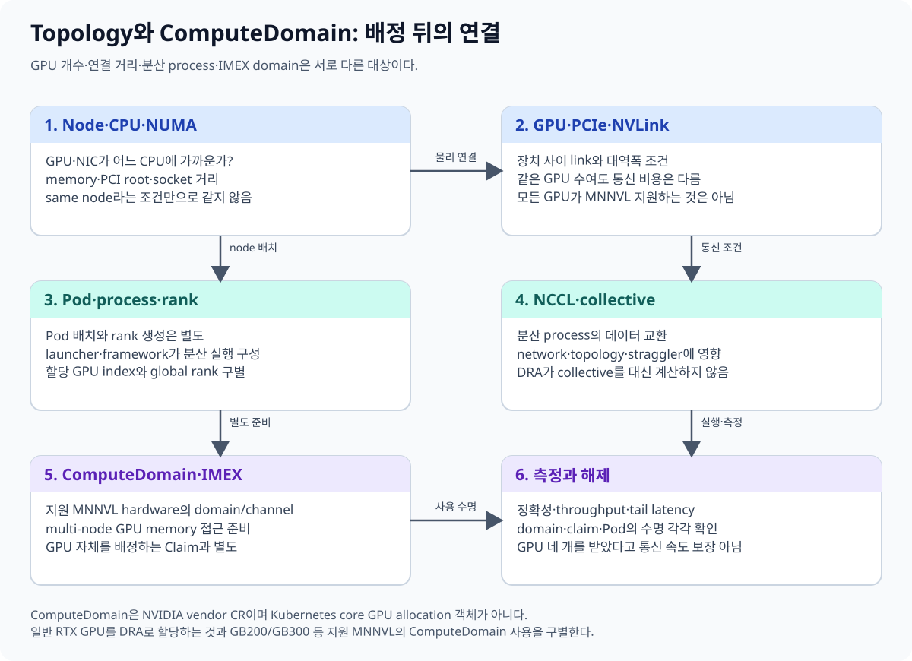
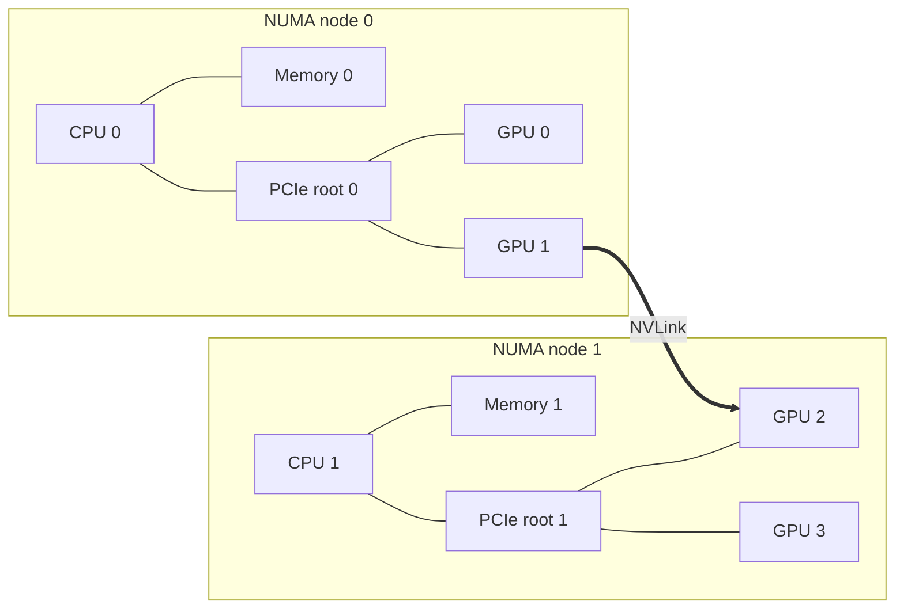
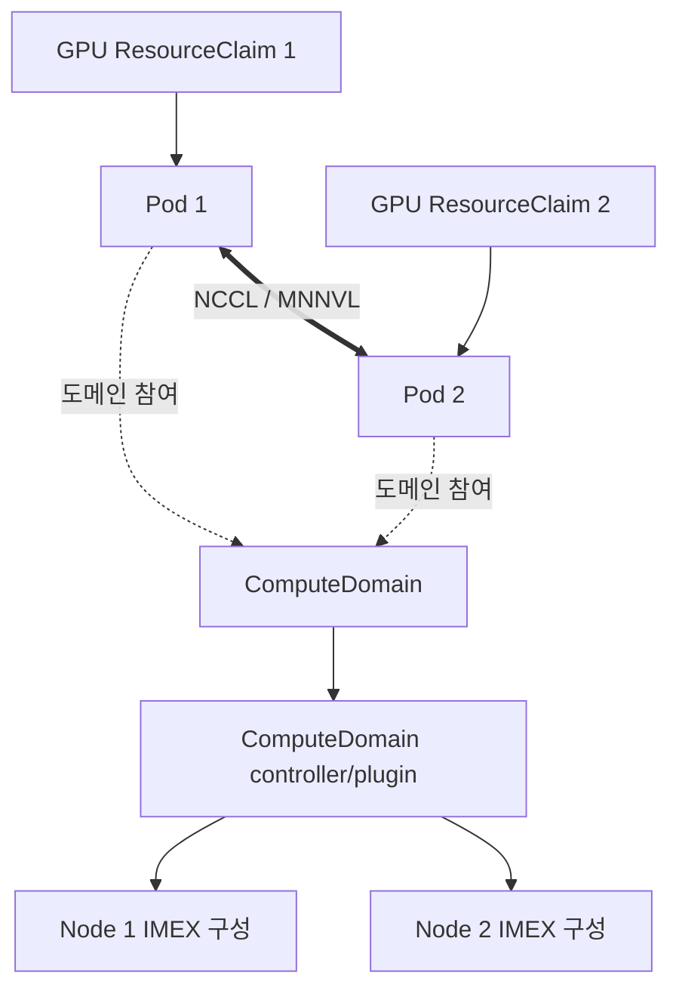
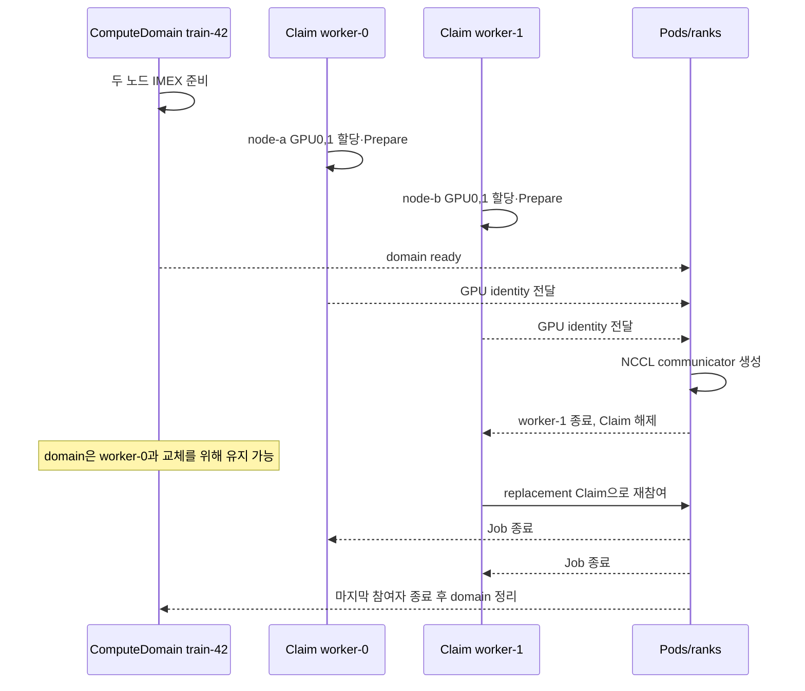

# 09. 토폴로지와 ComputeDomain

GPU 개수만 같아도 성능은 크게 달라질 수 있다.
CPU 메모리에 가까운 GPU인지, GPU끼리 NVLink로 연결되는지,
여러 노드의 GPU가 올바른 통신 도메인에 들어가는지가 분산 학습 성능을 좌우한다.

이 장에서는 NUMA, PCIe, NVLink, NCCL, MNNVL, IMEX와 ComputeDomain을 한 흐름으로 연결한다.
핵심은 **ComputeDomain은 GPU 할당 객체가 아니라는 점**이다.



## 9.1 NUMA부터 시작하기

NUMA(Non-Uniform Memory Access) 시스템에서는 CPU 소켓마다 가까운 메모리가 있다.
GPU도 특정 PCIe root complex를 통해 한 CPU 소켓에 더 가깝게 연결될 수 있다.



GPU 0이 NUMA node 0에 가까운데 CPU 작업 스레드와 메모리를 NUMA node 1에 놓으면
CPU-GPU 데이터 이동이 더 먼 경로를 탈 수 있다.

Kubernetes의 Topology Manager는 CPU, 장치, 메모리 힌트를 조정할 수 있다.
그러나 힌트를 받는 각 구성요소와 정책 설정이 올바르게 연결되어야 한다.
[Topology Manager 공식 문서](https://kubernetes.io/docs/tasks/administer-cluster/topology-manager/)를 함께 참고한다.

## 9.2 PCIe와 NVLink

PCIe는 CPU·메모리·GPU·NIC를 연결하는 범용 입출력 경로다.
NVLink는 지원 GPU 사이에 높은 대역폭 연결을 제공한다.

NVLink가 있다고 모든 통신이 자동으로 NVLink만 사용하는 것은 아니다.
GPU 쌍의 실제 연결, 통신 라이브러리의 경로 선택, 데이터 배치가 모두 영향을 준다.

| 연결 | 주 용도 | 관찰할 점 |
|---|---|---|
| PCIe | CPU-GPU, GPU-NIC, 일반 장치 연결 | root complex, 세대, lane |
| NVLink | GPU-GPU 고속 통신 | 연결된 GPU 쌍, 링크 상태 |
| 네트워크 | 노드 간 통신 | NIC 위치, RDMA, 스위치 구조 |

## 9.3 NCCL은 토폴로지를 사용한다

NCCL은 NVIDIA GPU 집단 통신 라이브러리다.
AllReduce, AllGather, ReduceScatter 같은 연산을 제공하고,
가용한 NVLink, PCIe, 네트워크 경로를 고려해 통신한다.

NCCL은 GPU를 Kubernetes에 할당하지 않는다.
할당된 GPU 집합에서 통신을 수행하는 사용자 공간 계층이다.

NVIDIA NCCL의 개념과 지원 연산은
[공식 NCCL 문서](https://docs.nvidia.com/deeplearning/nccl/user-guide/docs/overview.html)를 기준으로 한다.

## 9.4 MNNVL과 IMEX

MNNVL(Multi-Node NVLink)은 지원 플랫폼에서 여러 노드의 GPU를 NVLink 도메인으로 연결한다.
IMEX는 그 다중 노드 GPU 메모리 접근과 교환을 지원하는 구성요소다.

이 기능은 모든 GPU 서버에서 사용할 수 있는 일반 네트워크 기능이 아니다.
지원 하드웨어, 펌웨어, 드라이버, Operator 버전과 플랫폼 매트릭스를 확인해야 한다.

## 9.5 ComputeDomain의 역할

ComputeDomain은 함께 통신할 워크로드와 노드 측 IMEX 구성을 연결하는 수명주기 객체다.
GPU를 몇 개 할당할지 결정하는 `ResourceClaim`을 대신하지 않는다.



그림에서 두 수명주기를 분리해서 본다.

- `ResourceClaim`: Pod가 사용할 실제 GPU 장치의 선택과 할당
- `ComputeDomain`: 여러 Pod·노드가 공유할 통신 도메인의 구성과 수명

ComputeDomain API는 NVIDIA DRA 문서에서 확인한다.
[NVIDIA DRA 설치와 ComputeDomain 안내](https://docs.nvidia.com/datacenter/cloud-native/gpu-operator/26.7/dra-intro-install.html)는
지원 버전의 실제 필드와 사전 조건을 설명한다.

## 9.6 수명주기 예

2개 노드에 각각 GPU 4개를 사용하는 8-GPU 학습 작업을 생각하자.

1. 관리자가 통신에 참여할 워크로드를 위한 ComputeDomain을 준비한다.
2. 컨트롤러와 노드 플러그인이 필요한 IMEX 구성을 조정한다.
3. 각 Pod는 별도의 GPU `ResourceClaim`으로 4개 GPU를 요청한다.
4. 스케줄러가 claim을 만족하는 노드와 장치를 고른다.
5. Pod가 같은 ComputeDomain에 참여한다.
6. 애플리케이션의 NCCL 프로세스가 할당된 GPU로 집단 통신을 시작한다.
7. 작업 종료 후 claim과 ComputeDomain의 정리 조건에 따라 각각 해제한다.

GPU claim이 성공해도 ComputeDomain 준비가 실패할 수 있다.
반대로 ComputeDomain이 준비되어도 GPU claim이 부족하면 Pod는 실행되지 못한다.

### 9.6.1 두 수명주기를 한 시간축에 겹쳐 보기

2노드 학습 Job에 worker Pod 두 개가 있고, 각 Pod가 GPU 두 개를 요청한다고 하자. ComputeDomain `train-42`는 두 Pod가 함께 쓸 IMEX 통신 구성을 나타내고, Claim `gpu-worker-0`, `gpu-worker-1`은 실제 GPU identity를 가진다.

```text
t0  ComputeDomain train-42 생성
t1  domain controller가 node-a, node-b의 IMEX 준비 시작
t2  worker-0/1 Pod와 각자의 GPU Claim 생성
t3  scheduler가 worker-0 → node-a GPU0,1 할당
t4  scheduler가 worker-1 → node-b GPU0,1 할당
t5  두 Claim의 node Prepare와 CDI 주입 완료
t6  ComputeDomain Ready, 두 Pod 시작
t7  rank 0~3이 NCCL communicator 생성
t8  worker-1 실패, 해당 Pod/Claim 정리 시작
t9  replacement worker-1과 새 Claim 생성·할당
t10 replacement가 train-42 domain에 참여
t11 Job 종료, 모든 GPU Claim 해제
t12 마지막 참여자 종료 뒤 ComputeDomain 정리
```



이 예에서 t8에 GPU Claim 하나가 사라져도 ComputeDomain을 바로 지우면 남은 worker와 교체 Pod의 통신 구성이 깨질 수 있다. 반대로 t11에 GPU Claim을 모두 해제했는데 domain을 무기한 남기면 IMEX 관련 노드 상태와 객체가 누수될 수 있다. Job controller나 상위 워크로드가 두 객체군의 owner와 종료 순서를 분명히 해야 한다.

상태를 판단할 때는 다음 네 질문을 독립적으로 답한다.

| 질문 | 증거 |
|---|---|
| 실제 GPU가 정해졌는가? | 각 ResourceClaim의 allocation |
| 선택 노드에서 GPU 접근이 준비됐는가? | Claim Prepare와 Pod container 상태 |
| 통신 도메인이 준비됐는가? | ComputeDomain과 IMEX controller/plugin 상태 |
| 모든 rank가 통신에 참가했는가? | 애플리케이션/NCCL 로그와 rank membership |

ComputeDomain Ready와 Claim 4개 Allocated는 필요 조건일 수 있지만 충분 조건은 아니다. 예를 들어 rank 3 process가 시작 전에 종료되면 Kubernetes 객체는 준비돼 보여도 communicator 생성은 모든 참가자를 기다리다 실패할 수 있다.

반대로 Claim 하나가 Pending이라고 ComputeDomain controller를 먼저 재시작하는 것도 원인과 맞지 않을 수 있다. GPU 수량, selector, node placement를 먼저 본다. Domain은 GPU capacity를 만들어 내지 않는다.

Replacement Pod가 이전 Pod와 같은 GPU를 다시 받아야 한다고도 단정하지 않는다. 새 Claim allocation은 가용 inventory에서 다른 identity를 고를 수 있다. 애플리케이션이 checkpoint의 rank-to-device mapping을 고정했다면 재시작 시 새 rank, node, GPU mapping을 다시 구성해야 한다. ComputeDomain 이름이 같다는 사실은 물리 GPU identity까지 같다는 뜻이 아니다.

## 9.7 개념 YAML

다음은 객체 관계를 읽기 위한 축약 예다.
정확한 스키마는 설치한 CRD 버전을 확인한다.
더 이상 권장되지 않는 `spec.numNodes: 0` 같은 값을 새 예제로 복사하지 않는다.

```yaml
apiVersion: resource.nvidia.com/v1beta1
kind: ComputeDomain
metadata:
  name: training-domain
spec:
  numNodes: 2
```

이 객체만으로 GPU 8개가 할당되지는 않는다.
각 Pod 또는 워크로드가 사용할 GPU claim을 별도로 정의해야 한다.

## 9.8 숫자로 보는 경로 차이

다음 수치는 원리를 설명하는 가상의 측정값이다.

| 배치 | 1회 AllReduce | 100회 누적 |
|---|---:|---:|
| 같은 NVLink 도메인 | 8 ms | 0.8 s |
| PCIe 중심 경로 | 18 ms | 1.8 s |
| 노드 간 잘못된 NIC 경로 | 35 ms | 3.5 s |

GPU 계산이 동일해도 매 step마다 집단 통신을 하면 경로 차이가 누적된다.
그래서 GPU 개수와 모델만 기록하지 말고 실제 토폴로지와 통신 메트릭도 남긴다.

## 9.9 장애를 계층별로 나누기

| 증상 | 먼저 확인할 계층 |
|---|---|
| Pod가 Pending | claim, 장치 용량, 스케줄링 |
| Pod는 실행되나 도메인 준비 실패 | ComputeDomain controller, IMEX |
| 통신 연결 실패 | NCCL, 네트워크, IMEX 상태 |
| 실행되지만 느림 | NUMA, PCIe/NVLink, NIC affinity |
| 일부 rank만 멈춤 | rank 로그, NCCL 오류, 노드별 링크 |

## 9.10 흔한 오해

**오해 1: GPU 8개를 요청하면 자동으로 가장 빠른 8개가 선택된다.**
요청 표현과 드라이버의 선택 정책이 토폴로지 요구를 담아야 한다.

**오해 2: ComputeDomain이 GPU를 예약한다.**
GPU 할당은 ResourceClaim 수명주기다. ComputeDomain은 통신 도메인을 관리한다.

**오해 3: NVLink가 보이면 노드 간에도 바로 쓸 수 있다.**
노드 간 NVLink는 지원 MNNVL 플랫폼과 IMEX 구성이 필요하다.

**오해 4: NCCL은 Kubernetes 스케줄러다.**
NCCL은 할당 후 애플리케이션 프로세스가 사용하는 통신 라이브러리다.

## 9.11 확인 문제

1. NUMA와 PCIe 위치가 GPU 워크로드에 영향을 주는 이유는 무엇인가?
2. ComputeDomain과 ResourceClaim의 책임을 각각 한 문장으로 설명하라.
3. GPU claim은 성공했지만 분산 통신이 시작되지 않을 때 무엇을 구분해 확인해야 하는가?
4. NCCL의 역할은 무엇이며 무엇을 하지 않는가?

### 해설

1. CPU 메모리와 GPU 사이의 실제 데이터 경로와 지연이 위치에 따라 달라지기 때문이다.
2. ComputeDomain은 다중 노드 통신 구성을, ResourceClaim은 실제 GPU 선택과 할당을 담당한다.
3. ComputeDomain·IMEX 준비 상태와 NCCL·네트워크 연결을 claim 할당 상태와 분리해 본다.
4. NCCL은 GPU 집단 통신을 수행하며 Kubernetes 장치 할당은 하지 않는다.

---

[이전 장](08-sharing-mig-timeslicing-mps.md) · [다음 장](10-deployment-compatibility-and-gitops.md)
