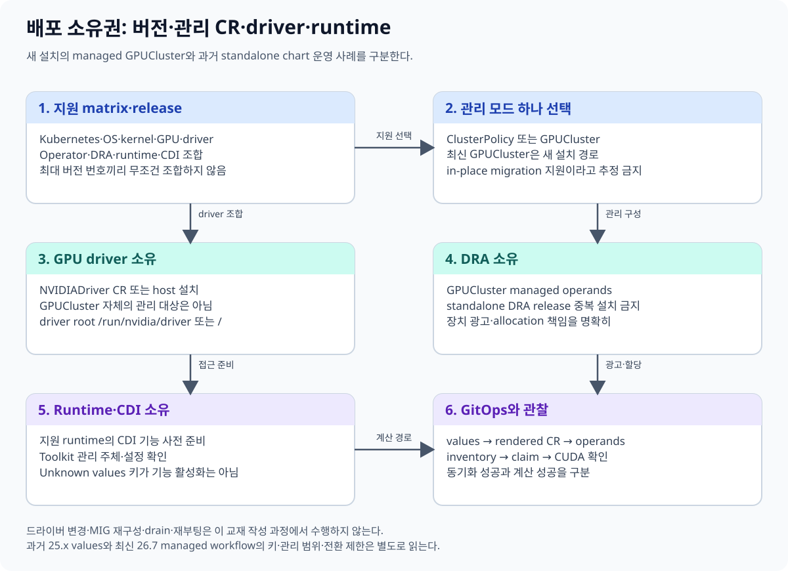
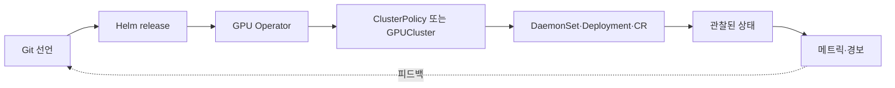
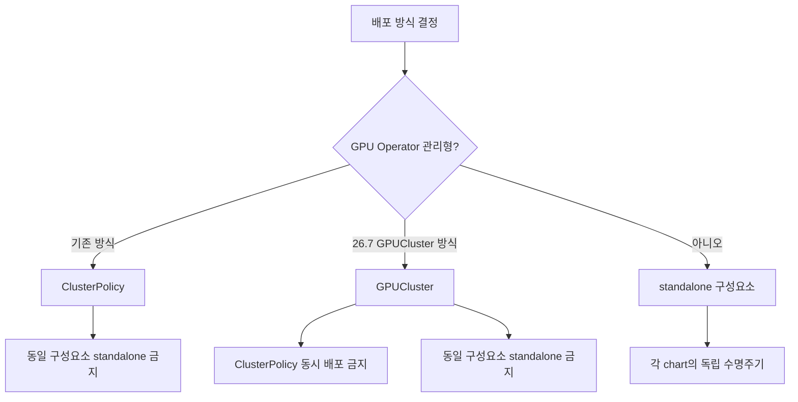

# 10. 배포, 호환성, GitOps

GPU 플랫폼 배포에서 가장 중요한 질문은 “어떤 YAML을 적용할까?”보다
“각 구성요소의 소유자는 누구이며 어떤 버전 조합을 지원하는가?”다.

이 장은 GPU Operator 26.7.1의 `GPUCluster` 관리형 워크플로를 기준 사례로 삼되,
모든 환경에 같은 설정을 복사하지 않는다.



## 10.1 먼저 소유권 표를 만든다

| 구성요소 | 가능한 소유자 | 한 환경의 최종 소유자 |
|---|---|---|
| GPU driver | GPU Operator / OS image / 별도 드라이버 관리자 | 하나 |
| Container Toolkit | GPU Operator / 노드 이미지 / 별도 배포 | 하나 |
| Device Plugin | GPU Operator / standalone chart | 하나 |
| DRA driver | GPU Operator / standalone chart | 하나 |
| NFD | GPU Operator / 공용 NFD 설치 | 하나 |
| DCGM Exporter | GPU Operator / 관측 스택 | 하나 |

여기서 “하나”는 같은 기능을 중복 배포하지 않는다는 뜻이다.
중앙 플랫폼 팀이 NFD를 관리하고 GPU Operator가 그 설치를 사용하도록 하는 구성은 가능하다.

## 10.2 선언과 관찰을 분리한다

Git의 Helm values는 원하는 상태다.
클러스터에서 실제 생성된 DaemonSet, Pod, CR 상태는 관찰된 상태다.



Git에 `enabled: true`가 있어도 Pod가 정상이라는 뜻은 아니다.
반대로 클러스터에서 수동으로 고친 값은 다음 GitOps 동기화 때 원래 선언으로 돌아갈 수 있다.

## 10.3 26.7.1 GPUCluster 워크플로

이 경로에서 `GPUCluster` 자체는 GPU driver를 관리하지 않는다. 아래 driver-CR 토글은 별도 `NVIDIADriver` CR을 생성하는 선택이다. 이미 host driver를 설치한 경우 공식 문서의 pre-installed driver 경로와 `driver.enabled=false`를 따른다. CDI-compatible runtime은 별도 준비 조건이다.

GPU Operator 26.7.1에서 GPUCluster 관리형 워크플로를 선택하는 설치 토글은 다음과 같다.

```text
--version v26.7.1
--set clusterPolicy.deployCR=false
--set gpuCluster.deployCR=true
--set driver.nvidiaDriverCRD.enabled=true
```

이 예는 해당 버전의 공식 절차를 읽기 위한 핵심 토글이다.
release 이름, namespace, repository 설정과 환경별 values는 별도로 필요하다.
[NVIDIA 26.7 DRA 설치 문서](https://docs.nvidia.com/datacenter/cloud-native/gpu-operator/26.7/dra-intro-install.html)를 그대로 기준으로 삼는다.

`GPUCluster`를 선택할 때 기존 `ClusterPolicy` CR도 동시에 배포하면 안 된다.
두 객체가 같은 하위 구성요소를 관리하려 하면 소유권이 모호해진다.

## 10.4 서로 배타적인 배포 경계



다음 조합은 피한다.

- `ClusterPolicy`와 `GPUCluster`가 동시에 같은 클러스터를 소유
- Operator가 DRA driver를 관리하는데 standalone DRA chart도 설치
- Operator가 device plugin을 관리하는데 별도 device plugin DaemonSet도 설치
- 노드 이미지가 드라이버를 관리하는데 Operator driver 설치도 활성화

## 10.5 in-place migration으로 가정하지 않는다

기존 ClusterPolicy 환경을 GPUCluster로 바꾸는 작업은 단순 CR 종류 변경이 아니다.
지원되는 무중단 in-place migration이라고 가정해서는 안 된다.

안전한 설계는 다음 단계를 별도의 변경으로 취급한다.

1. 현재 구성요소와 소유권을 목록화한다.
2. 지원 버전과 플랫폼 매트릭스를 확인한다.
3. 새 관리 모델의 원하는 상태를 별도 환경에서 검증한다.
4. GPU 워크로드 중단과 claim 수명 영향을 평가한다.
5. 복구 기준과 이전 상태 재구축 절차를 만든다.
6. 승인된 변경 창에 전환한다.

이 교재는 실제 클러스터에 파괴적인 전환 명령을 실행하는 실습을 제공하지 않는다.

## 10.6 드라이버 root 경로

컨테이너화된 드라이버 환경에서는 드라이버 컨테이너가 노출하는 root가
`/run/nvidia/driver`로 보일 수 있다.
호스트에 사전 설치된 드라이버는 호스트 root `/`를 기준으로 다룰 수 있다.

| 드라이버 관리 | 대표 root 해석 |
|---|---|
| Operator의 컨테이너화 드라이버 | `/run/nvidia/driver` |
| 호스트 사전 설치 드라이버 | `/` |

이 차이는 Toolkit, 검증, 라이브러리 탐색 설정에 영향을 준다.
경로를 복사하기 전에 실제 드라이버 소유 방식과 chart 값의 의미를 확인한다.

## 10.7 호환성은 축이 여러 개다

“Operator 최신 버전”만으로 호환성을 판단할 수 없다.

- Kubernetes 버전
- Linux 배포판과 커널
- GPU 모델과 아키텍처
- NVIDIA driver branch
- container runtime과 Toolkit
- MIG, DRA, MNNVL 같은 선택 기능
- CSP 또는 가상화 환경

최신 지원 조합은
[GPU Operator 플랫폼 지원 매트릭스](https://docs.nvidia.com/datacenter/cloud-native/gpu-operator/latest/platform-support.html)에서 확인한다.
Kubernetes와 DRA의 alpha·beta·GA 상태는 [14장](14-versions-and-feature-status.md)에서 따로 다룬다.

## 10.8 GitOps 저장소 구조 예

```text
clusters/
  research-a/
    gpu-operator/
      release.yaml
      values.yaml
      ownership.md
      compatibility.md
```

`ownership.md`에는 각 구성요소의 소유자를 쓴다.
`compatibility.md`에는 확인한 지원 매트릭스 날짜와 링크, 선택 버전을 쓴다.
values 파일만 남기면 나중에 왜 해당 토글을 선택했는지 알기 어렵다.

개념적인 선언은 다음처럼 환경 의도를 드러낸다.

```yaml
gpuPlatform:
  operatorVersion: v26.7.1
  apiModel: GPUCluster
  driverOwner: gpu-operator
  draOwner: gpu-operator
  nfdOwner: platform-team
```

이 YAML은 실제 GPU Operator CRD가 아니라 소유권 문서 예시다.

## 10.9 변경 전후 관찰 항목

| 시점 | 확인할 내용 |
|---|---|
| 변경 전 | 실행 중 GPU Pod, claim, 노드 드라이버, GPU 건강 |
| 동기화 중 | Operator 오류, CR 상태, DaemonSet rollout |
| 변경 후 | 노드별 driver/toolkit/plugin, CDI spec, 할당 시험 |
| 일정 시간 후 | Xid 오류, 할당 실패율, 재시작, 성능 기준 |

성공 기준은 “Helm 명령이 0으로 끝남”이 아니다.
원하는 하위 구성요소가 정확히 하나씩 있고, 노드와 워크로드 경로가 정상이어야 한다.

## 10.10 숫자로 보는 중복 배포

GPU 노드가 20대인 클러스터에서 device plugin DaemonSet을 두 개 배포했다고 하자.
각 DaemonSet이 노드마다 Pod 하나를 만들면 플러그인 Pod는 40개가 된다.

숫자가 두 배라는 사실보다 심각한 문제는 두 인스턴스가 같은 kubelet registration과
장치 상태를 다루려 할 수 있다는 점이다.
이 경우 “고가용성 2개”가 아니라 중복 소유다.

## 10.11 흔한 오해

**오해 1: Helm release가 Ready면 GPU 전체 경로도 정상이다.**
Operator와 하위 노드 구성요소, 실제 GPU 워크로드까지 단계별로 확인한다.

**오해 2: ClusterPolicy와 GPUCluster를 잠시 같이 두면 안전하다.**
동일 구성요소 소유가 겹치는 기간 자체가 위험하다.

**오해 3: standalone chart와 Operator 관리형을 같이 설치하면 이중화된다.**
같은 노드 기능의 중복 컨트롤러와 DaemonSet은 충돌 원인이 된다.

**오해 4: latest 문서의 값을 과거 버전에도 적용할 수 있다.**
설치한 chart 버전의 문서와 지원 매트릭스를 고정해서 본다.

## 10.12 확인 문제

1. 선언된 상태와 관찰된 상태는 어떻게 다른가?
2. GPUCluster 워크플로에서 ClusterPolicy 배포를 끄는 이유는 무엇인가?
3. `/run/nvidia/driver`와 `/`의 차이는 무엇에서 비롯되는가?
4. 지원 매트릭스를 확인할 때 최소 네 가지 축을 말하라.
5. device plugin 두 개를 배포하는 것이 고가용성이 아닌 이유는 무엇인가?

### 해설

1. 선언은 Git과 CR에 기록한 목표이고 관찰은 클러스터가 실제 만든 리소스와 상태다.
2. 두 API가 같은 GPU 플랫폼 구성요소를 동시에 소유하는 일을 막기 위해서다.
3. 드라이버가 컨테이너화되어 별도 root에 노출되는지, 호스트에 직접 설치됐는지의 차이다.
4. Kubernetes, OS·커널, GPU, driver, runtime·Toolkit, 선택 기능 등이 있다.
5. 동일 kubelet 장치 등록과 노드 자원을 서로 다른 인스턴스가 중복 관리하기 때문이다.

---

[이전 장](09-topology-and-compute-domains.md) · [다음 장](11-observability-and-troubleshooting.md)
