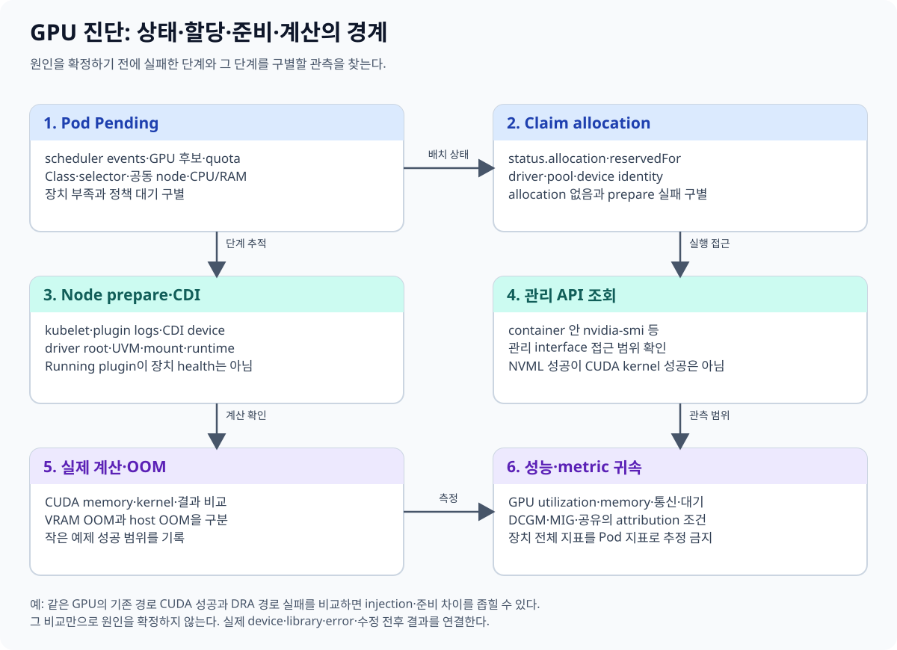
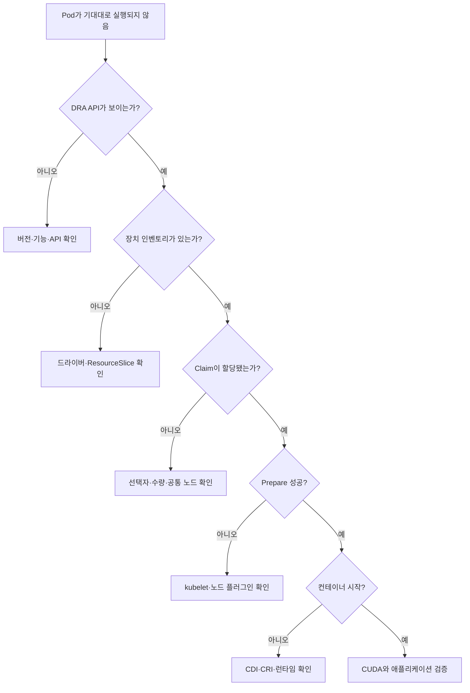
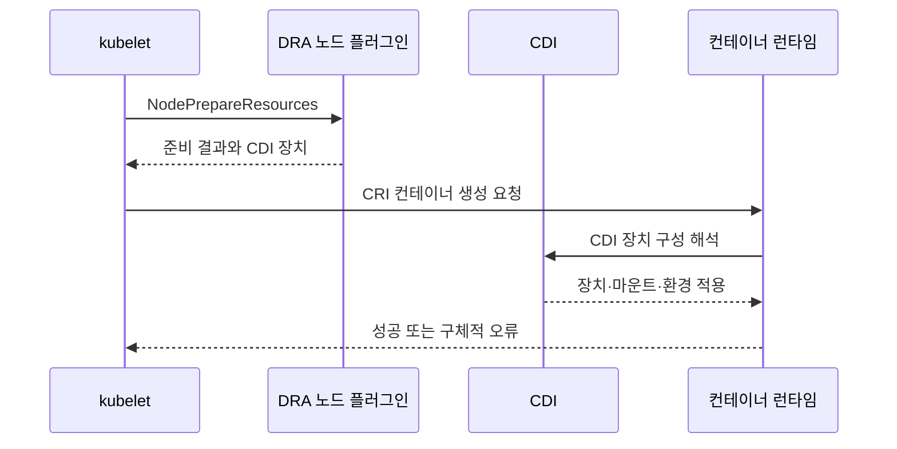
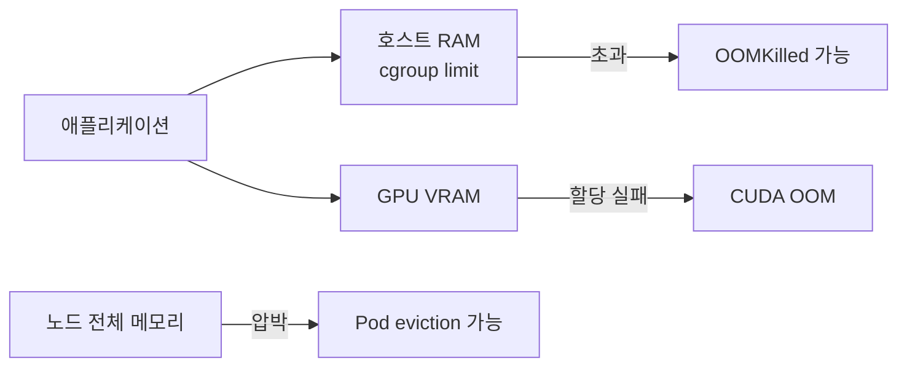

# 11. 관측과 문제 해결: 어느 층에서 실패했는가

[← 이전 장](10-deployment-compatibility-and-gitops.md) · [다음 장 →](12-local-model-labs.md)

> GPU Pod가 안 뜬다는 한 문장을 API, 인벤토리, 할당, 노드 준비, 런타임, CUDA, 메모리 문제로 분해한다. 이 장의 명령은 읽기 전용 예시이며 여기서는 실행하지 않았다.

## 1. 먼저 성공 조건을 층으로 나눈다

GPU 워크로드 경로는 여러 독립된 층을 지난다.

| 층 | 확인 질문 | 대표 증거 |
|---|---|---|
| API | DRA 객체 API를 사용할 수 있는가 | API resources |
| 인벤토리 | 드라이버가 장치를 게시했는가 | DeviceClass, ResourceSlice |
| 할당 | Claim에 장치가 배정됐는가 | ResourceClaim status |
| Prepare | 노드 플러그인이 장치를 준비했는가 | Pod events, kubelet·드라이버 로그 |
| CDI·런타임 | 컨테이너에 장치 구성이 전달됐는가 | 런타임 및 CDI 상태 |
| NVML | 관리 API로 GPU를 볼 수 있는가 | `nvidia-smi` 등 |
| CUDA | 실제 계산이 성공하는가 | 작은 CUDA 연산 결과 |
| 메모리 | GPU와 호스트 메모리가 충분한가 | DCGM, cgroup, 커널 지표 |

한 층의 성공은 다음 층의 성공을 증명하지 않는다.





## 2. 1단계: API 준비 상태

가장 먼저 클러스터가 필요한 객체를 제공하는지 확인한다.

```text
kubectl api-resources | grep -E 'deviceclass|resourceslice|resourceclaim'
kubectl get --raw /readyz
```

`readyz` 성공은 API 서버가 준비됐다는 뜻이다.
DRA 드라이버와 GPU가 정상이라는 뜻은 아니다.

API 객체가 보이지 않으면 다음을 확인한다.

- Kubernetes 버전
- 기능 성숙도와 feature gate 조건
- 클라이언트와 서버 버전 차이
- 요청한 `apiVersion`이 클러스터에서 제공되는지

## 3. 2단계: 장치 클래스와 인벤토리

```text
kubectl get deviceclasses
kubectl get resourceslices
kubectl get resourceslices -o yaml
```

여기서 확인할 질문은 다음과 같다.

- Claim이 참조한 DeviceClass가 실제로 있는가
- NVIDIA 드라이버의 ResourceSlice가 있는가
- 예상 노드의 장치가 게시되어 있는가
- 선택자에서 사용한 속성 또는 capacity가 실제로 존재하는가

ResourceSlice가 없으면 스케줄러는 할당 후보를 만들 수 없다.
ResourceSlice가 있어도 선택자가 모든 후보를 제외할 수 있다.

## 4. 3단계: Claim 할당 상태

```text
kubectl -n <namespace> get resourceclaims
kubectl -n <namespace> describe resourceclaim <claim-name>
kubectl -n <namespace> get resourceclaim <claim-name> -o yaml
```

`spec`에서 사용자의 요청을 보고 `status`에서 시스템의 결과를 본다.

확인할 내용은 다음과 같다.

- allocation이 기록됐는가
- 어떤 장치가 선택됐는가
- 어떤 소비자가 `reservedFor`에 연결됐는가
- 조건과 오류 메시지가 있는가

Claim이 미할당이면 Pod의 일반 스케줄링 조건도 함께 확인한다.
GPU가 있는 노드와 CPU·메모리·affinity·taint 조건의 공통 해가 없을 수 있다.

## 5. 4단계: Pod 이벤트와 스케줄링

```text
kubectl -n <namespace> get pod <pod-name> -o wide
kubectl -n <namespace> describe pod <pod-name>
kubectl -n <namespace> get events --sort-by=.metadata.creationTimestamp
```

이벤트는 최신 결과만 보지 말고 시간 순서로 읽는다.
처음에는 할당을 기다렸고 나중에는 Prepare에서 실패했을 수 있다.

`Pending`이라는 phase만으로 원인을 알 수 없다.
이벤트 메시지와 Claim 상태가 더 구체적인 증거다.

## 6. 5단계: 노드 Prepare

Claim이 할당됐는데 컨테이너가 만들어지지 않으면 노드 측 경계를 본다.

```text
kubectl -n <driver-namespace> get pods -o wide
kubectl -n <driver-namespace> logs <dra-node-pod> --all-containers
```

운영 환경에서는 로그 양과 민감 정보에 주의하고 대상 Pod와 시간을 좁힌다.

찾을 문제의 예는 다음과 같다.

- DRA 노드 플러그인이 해당 노드에서 Ready가 아님
- kubelet과 플러그인의 등록 또는 통신 문제
- Prepare 호출 실패
- 호스트 드라이버 상태 이상
- 장치가 이미 사용할 수 없는 상태

Prepare 오류와 스케줄러 할당 오류를 같은 문제로 묶지 않는다.

## 7. 6단계: CDI와 컨테이너 런타임

Prepare가 장치 구성을 반환했더라도 CDI 또는 CRI 런타임 적용에서 실패할 수 있다.



이 층에서는 다음 증거를 구분한다.

- 플러그인이 반환한 장치 정보
- 노드의 CDI 명세 및 갱신 상태
- containerd 또는 CRI-O 오류
- 컨테이너 생성 이벤트

CDI 파일을 직접 수정하는 것은 이 장의 읽기 전용 진단 범위를 벗어난다.
먼저 드라이버가 관리하는 생성 경로를 확인한다.

## 8. 7단계: NVML과 실제 CUDA

컨테이너가 Running이어도 GPU 계산이 성공한다는 보장은 없다.

`nvidia-smi`는 NVML 계열 관리 인터페이스를 통해 장치 열거와 상태를 확인하는 데 유용하다.
하지만 다음을 모두 검증하지는 않는다.

- CUDA 컨텍스트 생성
- CUDA 커널 실행
- 프레임워크가 올바른 GPU를 사용
- 수치 결과의 정확성
- 장시간 부하 안정성

진단을 단계화한다.

1. 컨테이너에서 장치 열거
2. 작은 CUDA 연산
3. 사용하는 프레임워크의 장치 확인
4. 실제 모델의 축소된 입력 실행
5. 성능과 정확성 측정

## 9. GPU VRAM과 호스트 OOM을 구분한다

`OOM`이라는 단어만으로 GPU 메모리 부족이라고 판단하지 않는다.

| 현상 | 가능한 위치 | 확인 증거 |
|---|---|---|
| CUDA out of memory | GPU VRAM | 프레임워크 오류, GPU 메모리 지표 |
| 컨테이너 OOMKilled | 호스트 RAM/cgroup | Pod status, 종료 코드, cgroup 지표 |
| 노드 메모리 압박 | 호스트 전체 | Node condition, eviction 이벤트 |
| 프로세스 강제 종료 | 애플리케이션 또는 OS | 컨테이너 로그, 커널 로그 |

GPU VRAM 사용량이 낮아도 호스트 RAM 부족으로 Pod가 죽을 수 있다.
반대로 컨테이너 메모리 제한에 여유가 있어도 GPU VRAM 할당은 실패할 수 있다.



## 10. DCGM으로 무엇을 측정하는가

NVIDIA DCGM과 DCGM Exporter는 GPU 활용률, 메모리, 오류 및 상태 지표를 수집하는 데 쓰인다.
Prometheus와 연결하면 시간에 따른 변화를 볼 수 있다.

그러나 지표의 귀속 단위는 구성에 따라 달라진다.

- 물리 GPU 단위 지표
- MIG 인스턴스 단위 지표
- 프로세스 또는 Pod와 연결된 지표
- 노드 수준 집계

MIG를 사용하면 물리 GPU 전체 지표와 MIG 장치 지표를 혼동하지 않는다.
time-slicing이나 MPS 같은 공유 방식에서는 하나의 물리 GPU 사용량을 여러 워크로드에 완벽히 자동 귀속한다고 가정하지 않는다.
라벨, 수집기 구성, 장치 식별자 매핑을 실제 환경에서 검증한다.

## 11. 증거를 시간축으로 맞춘다

스케줄러 이벤트, Claim 상태, 드라이버 로그, DCGM 지표는 서로 다른 시계와 보존 기간을 가질 수 있다.
문제 발생 시 다음 값을 함께 기록한다.

- UTC 기준 시각과 로컬 시각대
- Pod UID와 이름
- ResourceClaim UID와 이름
- 노드 이름
- 할당된 장치 식별 정보
- 이미지 digest 또는 정확한 태그
- Kubernetes, 드라이버, GPU Operator 버전

이 정보가 없으면 재시작 뒤 같은 이름의 새 Pod와 이전 Pod를 혼동하기 쉽다.

## 12. 실제 사례에서 배우기

이 저장소에는 GPU 노드 온보딩 중 발생한 UVM 관련 경쟁 상태와 진단 기록이 있다.

- [TwinX/KISS GPU 노드 온보딩 사례](../../kubernetes/gpu/twinx-kiss-gpu-node-onboarding-2026-08-24.md)

사례 문서는 특정 환경의 관측 기록이다.
모든 `nvidia_uvm` 또는 장치 초기화 오류의 원인이 같다고 일반화하지 않는다.
현재 환경의 버전, 이벤트, 로그를 같은 층별 방법으로 다시 확인한다.

## 13. 최소 진단 순서

문제가 생기면 다음 순서를 반복 가능한 체크리스트로 사용한다.

1. 정확한 클러스터 컨텍스트와 네임스페이스를 확인한다.
2. DRA API와 DeviceClass 존재를 확인한다.
3. ResourceSlice에 예상 장치와 노드가 있는지 확인한다.
4. Claim allocation과 `reservedFor`를 확인한다.
5. Pod 이벤트에서 스케줄링과 Prepare를 나눈다.
6. 노드 DRA 플러그인 로그를 해당 시간으로 좁힌다.
7. CDI와 컨테이너 런타임 오류를 확인한다.
8. 장치 열거 후 실제 CUDA 연산을 별도로 검증한다.
9. GPU VRAM, 컨테이너 RAM, 노드 RAM 지표를 구분한다.

## 14. 흔한 오해

**“ResourceSlice가 있으니 GPU는 건강하다.”**
인벤토리 게시 사실이며 실제 계산 건강성을 보장하지 않는다.

**“Claim이 할당됐으니 컨테이너 런타임 문제는 없다.”**
Prepare, CDI, CRI 단계가 남아 있다.

**“`nvidia-smi`가 되니 PyTorch 학습도 된다.”**
NVML 장치 열거와 CUDA 계산은 다른 검증이다.

**“DCGM의 GPU 100%를 특정 Pod가 모두 사용했다.”**
MIG와 공유 구성에서는 지표의 장치·Pod 귀속 방식을 먼저 검증해야 한다.

## 15. 확인 문제와 해설

### 문제 1

Claim allocation은 존재하지만 Pod 이벤트에 장치 준비 오류가 있다. 스케줄러 선택자를 먼저 고쳐야 하는가?

**해설:** 할당은 완료됐으므로 우선 kubelet과 DRA 노드 플러그인의 Prepare 경계를 조사한다.

### 문제 2

Pod가 `OOMKilled`이고 동시에 GPU를 사용했다. 반드시 VRAM 부족인가?

**해설:** 아니다. `OOMKilled`는 일반적으로 컨테이너의 호스트 메모리 제한과 관련된 증거다. CUDA OOM 로그와 GPU 메모리 지표를 별도로 확인한다.

### 문제 3

공유 GPU의 DCGM 지표를 연구 작업별 비용으로 바로 나눠도 되는가?

**해설:** 먼저 물리 GPU, MIG, 프로세스, Pod 라벨의 귀속 방식을 검증해야 한다. 자동으로 정확히 분리된다고 가정할 수 없다.

## 16. 공식 자료

- [Kubernetes: How DRA works](https://kubernetes.io/docs/concepts/resource-management/dynamic-resource-allocation/how-dra-works/)
- [NVIDIA DCGM documentation](https://docs.nvidia.com/datacenter/dcgm/latest/)
- [NVIDIA DCGM Exporter](https://docs.nvidia.com/datacenter/cloud-native/gpu-telemetry/latest/dcgm-exporter.html)
- [Container Device Interface](https://github.com/cncf-tags/container-device-interface)

[← 이전 장](10-deployment-compatibility-and-gitops.md) · [다음 장 →](12-local-model-labs.md)
