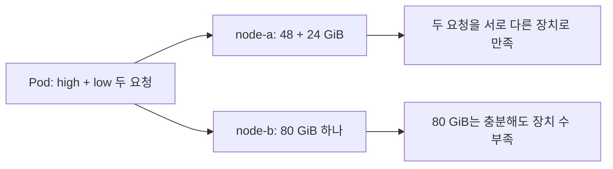
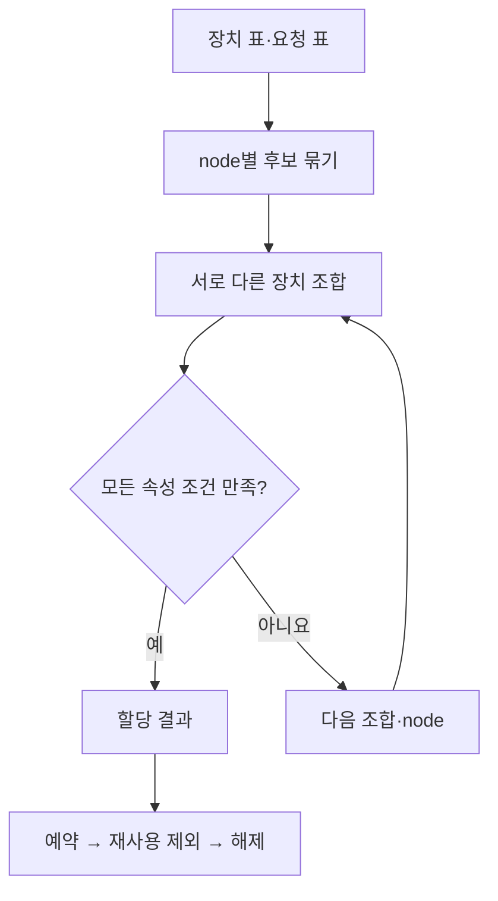

# 12. GPU 없는 로컬 모형 실습

이 장에서는 실제 GPU도 Kubernetes 클러스터도 설치하지 않는다. Python 표준 라이브러리로 **속성 조건과 같은 node 배치 조건을 동시에 만족시키는 작은 할당 문제**를 푼다. DRA 객체의 이름이 왜 필요한지 이해하기 위한 모형이며 실제 scheduler의 알고리즘·성능·동시성 구현을 대신하지 않는다.

## 12.1 입력과 가정부터 고정하기

장치 이름과 용량은 직접 만든 교육용 값이다. 실물 GPU 제품의 사양을 나타내지 않는다. `GiB`는 2의 거듭제곱 기반 단위이고, 표에서는 장치가 광고한 단순 속성 값으로만 사용한다.

| node | 장치 이름 | memory_gib | 사용 가능 |
| --- | --- | --- | --- |
| node-b | demo-80 | 80 | 예 |
| node-a | demo-48 | 48 | 예 |
| node-a | demo-24 | 24 | 예 |

한 Pod에 두 container가 있고 각각 다른 장치 하나를 요청한다고 가정한다. 같은 Pod의 container는 같은 node에 있어야 한다. 전체 클러스터에 장치가 두 개 이상 있다는 사실만으로 충분하지 않다.

| 요청 이름 | 조건 | 개수 |
| --- | --- | --- |
| high | memory_gib >= 40 | 1 |
| low | memory_gib >= 20 | 1 |

이 모형은 장치를 독점 할당한다. 같은 물리 GPU를 두 번 선택하지 않는다. MIG, MPS, time-slicing, consumable capacity, admin access, quota와 queue, topology link는 구현하지 않는다. 그런 조건은 해당 기능을 지원하는 API·driver·정책에서 따로 확인한다.



## 12.2 먼저 손으로 할당하기

high에 node-a의 demo-48을 주고 low에 demo-24를 주면 두 조건을 모두 만족한다. high에 node-b의 demo-80을 먼저 주면 node-b에는 low에 줄 다른 장치가 없다. 이때 low만 node-a로 보내면 같은 Pod의 node 제약을 깨뜨린다.

따라서 “조건을 만족하는 첫 장치를 하나씩 고른다”는 접근과 “Pod 전체의 요청을 같은 node에서 함께 만족한다”는 접근은 결과가 다를 수 있다. 실제 Kubernetes에서 모든 세부 제약을 이 모형과 동일한 순서로 처리한다고 주장하지 않는다.

## 12.3 실행 파일과 예상 출력

[allocation_model.py](examples/allocation_model.py)는 `dataclass`, `itertools` 등 Python 표준 기능만 쓴다. 저장소 최상위에서 실행한다.

```bash
python3 learning/gpu-operator-dra/examples/allocation_model.py
```

기준 입력의 출력은 다음과 같다. **2026-10-10에 Python 3.12.3으로 이 모형을 실행해 아래 값과 일치함을 확인했다.** 이 실행은 표 기반 모형만 확인하며 실제 GPU·Kubernetes·NVIDIA driver를 검증하지 않는다.

```text
case_1: node=node-a high=demo-48 low=demo-24
case_2: unsatisfied
case_3: unsatisfied
after_release: node=node-a high=demo-48 low=demo-24
```

case_1은 위 요청을 처리한다. case_2는 같은 node에서 40 GiB 이상 장치 두 개를 요구해 실패한다. case_3은 case_1의 장치를 예약한 뒤 같은 두 장치를 다시 요구해 실패한다. release 이후에는 다시 성공한다.

모형에서 release는 선택된 이름을 예약 집합에서 제거하는 조작이다. 실제 DRA의 Pod 삭제·claim owner reference·reservedFor·driver unprepare 동작을 이 한 줄로 대체하지 않는다. 실제 생애는 [05장](05-dra-allocation-lifecycle.md)을 따른다.

## 12.4 코드의 네 부분

| 코드의 부분 | 배우는 의미 |
| --- | --- |
| `Device` | 장치 identity·node·속성 값의 구별 |
| `Request` | 업무 요청에 붙는 이름과 선택 조건 |
| `allocate` | 같은 node의 서로 다른 장치 조합을 평가 |
| `reserved` | 이미 쓰는 장치를 다시 할당하지 않는 단순 가정 |

프로그램은 가능한 조합을 전부 검사한다. 장치가 많은 현실 환경의 효율적인 알고리즘이 아니다. 모든 조합을 검사하면 두 요청의 속성과 공동 배치 조건을 설명하기 쉽다는 교육적 선택이다. 탐색 순서도 성능·공정성 정책이라고 해석하지 않는다.



## 12.5 바꿔 보는 문제

1. node-b에 demo-40을 추가한다. 40 GiB 이상 두 장치 요청이 이제 가능한지 계산한다.
2. low의 최소 메모리를 30으로 바꾼다. 기준 node-a는 48과 24이므로 두 요청을 함께 만족하지 못한다.
3. high와 low를 별도 Pod라고 가정한다. 같은 node 조건이 없어지면 어떤 조합이 추가되는지 설명한다.
4. 48 GiB 장치를 time-slicing으로 두 논리 slot처럼 광고했다고 가정한다. 두 slot이 각각 48 GiB의 독립 VRAM이라고 계산하면 왜 틀리는지 말한다. 코드의 장치를 복제하는 것으로 실제 격리 구현을 대체하지 않는다.
5. `memory_gib` 값이 같아도 PCIe·NVLink 연결이 다르면 통신 성능도 같은가? 이 모형에 topology 제약이 없다는 한계를 찾아낸다.
6. 예약 집합을 지우면 실행 중인 실제 GPU process도 종료되는가? 이 프로그램은 실제 장치나 process에 접근하지 않으므로 그런 부작용은 없다.

## 12.6 실제 클러스터 관찰로 연결하기

이후 GPU 환경이 준비됐을 때는 아래와 같은 **조회 명령 예시**로 API 상태를 읽는다. 이번 교재 작성 과정에서 실행한 명령이 아니다. 자신의 context와 namespace를 명시한다.

```text
kubectl --context YOUR_CONTEXT get deviceclasses
kubectl --context YOUR_CONTEXT get resourceslices
kubectl --context YOUR_CONTEXT -n YOUR_NAMESPACE get resourceclaims
kubectl --context YOUR_CONTEXT -n YOUR_NAMESPACE describe pod YOUR_POD
```

DeviceClass는 선택 규칙, ResourceSlice는 광고된 inventory, ResourceClaim status는 allocation·reservation 결과다. 각각을 모형의 요청·장치 표·할당 결과와 대응해 본다. 그리고 **container에서 실제 CUDA 계산이 성공했는가**는 별도로 확인한다.

API 객체 조회만으로 driver 준비, CDI injection, 라이브러리 호환성, 실제 계산을 모두 검증했다고 주장하지 않는다. 이 경계를 구분하는 것이 [11장](11-observability-and-troubleshooting.md)의 목표다.

## 12.7 이해 확인

**문제:** 클러스터에 80 GiB 장치 하나와 48 GiB 장치 하나가 서로 다른 node에 있다. 한 Pod에 장치 두 개를 독점 할당할 수 있는가? **해설:** 다른 조건이 같아도 이 모형의 같은 node 조건을 만족하지 못한다. 여러 node를 쓰려면 여러 Pod 등 별도의 분산 실행 구조가 필요하다.

**문제:** ResourceClaim은 model weights와 실행 process를 자동 복원하는 checkpoint인가? **해설:** 아니다. 장치 요청과 할당 상태의 API 객체다. 모델 상태·학습 checkpoint·process 복구는 다른 구성요소의 책임이다.

[이전: 관측과 진단](11-observability-and-troubleshooting.md) · [다음: 연구 사례](13-research-and-lab-cases.md) · [목차](README.md)
