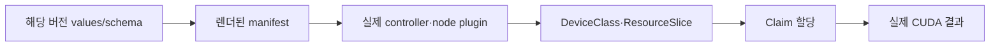
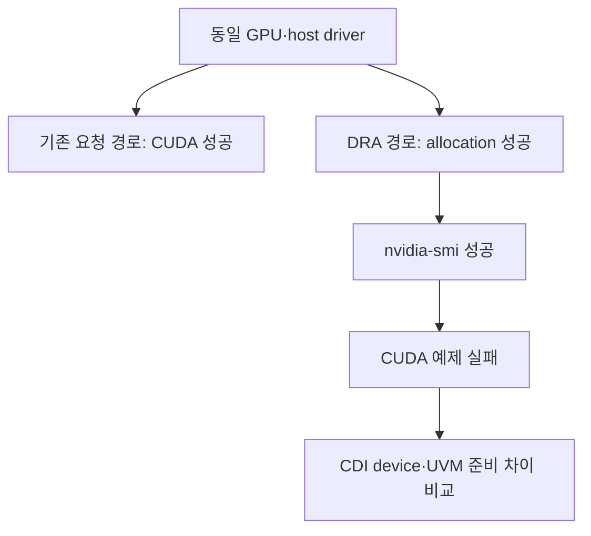
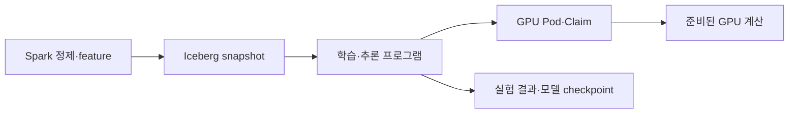

# 13. 연구와 실제 운영 기록을 연결하기

이 저장소에는 실제 GPU 운영 사례가 있다. 그 기록은 일반 개념을 이해하는 좋은 출발점이지만 날짜·클러스터·버전의 범위를 지켜 읽는다. 과거 설치가 성공한 사실과 최신 설치가 지원되는 사실은 다른 근거다.

## 13.1 서로 다른 TwinX 기록을 합치지 않는다

TwinX는 이 연구실에서 사용하는 로컬 클러스터 이름이다. GPU 기술 표준이나 NVIDIA 제품명은 아니다. 저장소의 서로 다른 날짜 기록은 같은 별칭을 써도 context·관리 저장소·버전이 다를 수 있다.

| 기록 | 문서에 기록된 주요 조합 | 배우는 질문 |
| --- | --- | --- |
| [2026-06-28 DRA rollout](../../kubernetes/gpu/twinx-nvidia-dra-driver-rollout-2026-06-28.md) | Operator 25.3.4·DRA chart 25.3.2 | 당시 별도 chart·실제 values·DeviceClass 광고 |
| [2026-08-24 node onboarding](../../kubernetes/gpu/twinx-kiss-gpu-node-onboarding-2026-08-24.md) | Kubernetes 1.34.3·Operator 25.10.1·DRA 25.8.1 | driver root·CDI race·계층별 CUDA 비교 |
| [2026-09-02 장비 전용 해제](../../kubernetes/gpu/twinx-sv4000-2-partridge-release-2026-09-02.md) | 그 문서의 실측 상태와 변경 이력 | GPU 전용 정책·MIG 복구·GitOps·smoke test |

위 버전은 **과거 관찰 표**다. 최신 설치값은 [14장](14-versions-and-feature-status.md)을 따른다. 과거 chart에 DRA 키가 없었다는 기록을 현재 26.7 chart에도 DRA 기능이 없다는 결론으로 옮기지 않는다.

## 13.2 사례 A: chart 키가 없으면 무엇을 검증해야 하나

6월 기록은 당시 GPU Operator values에 DRA 활성화 block이 없어서 별도 DRA chart를 적용했다고 설명한다. 이 사례의 배움은 “values 파일에 적었으니 기능이 활성화됐다”라는 추정을 피하는 것이다.

GitOps의 Synced/Healthy 상태, 객체 생성, 장치 광고, allocation, 실제 계산은 각각 확인하는 계약이다. 최신 `GPUCluster` managed workflow에서는 별도 DRA Helm release를 중복 설치하지 않는다는 조건까지 생겼다. 따라서 과거 운영 values를 최신 chart에 통째로 복사하지 않는다.

## 13.3 사례 B: nvidia-smi는 성공, CUDA는 실패

8월 기록은 일반 GPU 요청 경로의 CUDA 예제는 성공했지만 DRA 경로에서는 CUDA memory allocation이 실패한 비교를 담고 있다. 관찰된 원인은 driver 준비와 CDI 명세 생성의 순서가 겹쳐 UVM device 일부가 누락된 것이었다.

이 비교는 실패 위치를 좁히는 데 도움이 된다. 같은 GPU·driver에서 한 경로가 계산까지 성공하면, 다른 경로의 allocation 이후 runtime injection이나 준비 상태를 우선 비교할 이유가 생긴다. 그러나 그 사실만으로 어떤 library·device가 원인인지 즉시 확정되지는 않는다. 실제 기록은 device 목록과 재생성 전후 결과까지 연결했다.

이 장은 과거 작업을 다시 수행하지 않는다. 재부팅·drain·plugin 재시작·MIG 변경은 실제 workload와 저장 상태를 검토해야 하는 운영 작업이다. 교재 작성은 문서와 로컬 모형에 한정된다.

## 13.4 연구 질문을 한 가지 메커니즘으로 좁히기

“DRA가 빠른가?”보다 다음처럼 질문을 구체화한다.

**예시 1:** 서로 다른 GPU 메모리·모델이 섞인 inventory에서 속성 선택 조건을 쓰면, 개수와 node label만 사용하는 기준군에 비해 적합 장치 배정률과 대기 시간이 어떻게 달라지는가?

**예시 2:** 같은 workload를 동일한 GPU에서 단독·time-slicing·MPS·지원 MIG profile로 실행할 때, 처리량·tail latency·메모리 peak·실패 영향은 어떻게 달라지는가?

**예시 3:** driver 준비 순서와 CDI 명세 재생성 조건을 바꿨을 때, node 편입 후 최초 CUDA workload 성공까지의 시간과 실패 빈도가 어떻게 달라지는가?

이들은 연구 설계 예시다. 이 저장소에서 지금 수행한 실험이나 이미 얻은 성능 결과가 아니다.

## 13.5 공정한 비교를 위한 기록 표

| 범주 | 고정하거나 기록할 조건 |
| --- | --- |
| Hardware | GPU 모델·UUID·VRAM·MIG geometry·PCI/NUMA·링크 |
| Node | OS·kernel·driver·runtime·Toolkit·CPU/RAM |
| Kubernetes | minor/patch·feature gates·scheduler·queue 정책 |
| Allocation | device plugin/DRA backend·Class·Claim·sharing policy |
| Workload | image digest·코드·framework·입력·batch·seed |
| 시간 | 제출·admission·allocation·prepare·container start·첫 계산 |
| 측정 | 반복 수·워밍업·throughput·p95/p99·memory·오류 |
| 판정 | 계산 정확성·할당 적합성·실패 원인·관측 한계 |

새로운 driver와 새 GPU 모델, 새로운 공유 방식까지 한꺼번에 바꾸면 결과 차이의 원인을 분리하기 어렵다. 기준군과 실험군에서 어떤 메커니즘 하나를 바꾸었는지 쓴다.

## 13.6 Spark·Iceberg·GPU는 어떤 경로로 연결되나

Spark는 전처리·집계·feature 생성에 사용할 수 있다. Iceberg는 그 입력·출력 테이블의 snapshot을 고정하는 데 사용할 수 있다. GPU workload는 그 feature를 학습·추론에 사용한다. GPU Operator를 설치했다고 Spark의 모든 SQL이 CUDA 연산이 되는 것은 아니다. Spark의 GPU 가속에는 별도 지원 plugin·연산·호환성 조건이 있다.

각 단계의 재현 identity를 별도로 남긴다. snapshot ID·image digest·GPU UUID·Claim allocation·실험 run ID는 다른 종류의 이름이다. 문서에 그 연결이 있어야 데이터·배치·실행 환경의 차이를 추적할 수 있다.

## 13.7 실패를 지우지 않고 분류하기

교육용으로 실행 100회 중 성공 95회·실패 5회가 있었다고 가정한다. 실패 다섯 회를 지우고 평균 지연을 발표하면 성공 조건과 신뢰성을 숨기게 된다. 실패를 admission 대기·allocation 불가·prepare 오류·CUDA OOM·결과 오류 등으로 나누고, 각 범주를 어떻게 관측했는지 기록한다.

이 숫자는 통계 설명용이다. 실제 연구실의 성공률이 아니다. 표본 수와 실패 범위를 명시해야 다른 사람이 결과를 비교할 수 있다.

**문제:** 8월 smoke test가 통과했으니 10월 최신 `GPUCluster` 설치도 검증됐는가? **해설:** 아니다. 당시 버전과 구성의 실제 관찰이며 최신 managed workflow는 별도 지원 조건이다.

**문제:** DRA allocation 시간이 줄었으면 모델 throughput도 증가한 것인가? **해설:** allocation 대기와 계산 throughput은 다른 측정이다. 둘을 별도로 보고 연결되는 원인을 설명한다.

[이전: 로컬 모형](12-local-model-labs.md) · [다음: 버전·기능 단계](14-versions-and-feature-status.md) · [목차](README.md)
