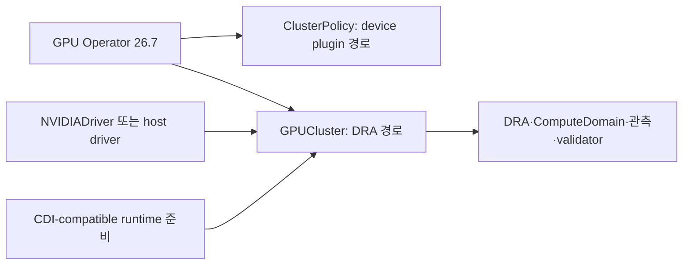
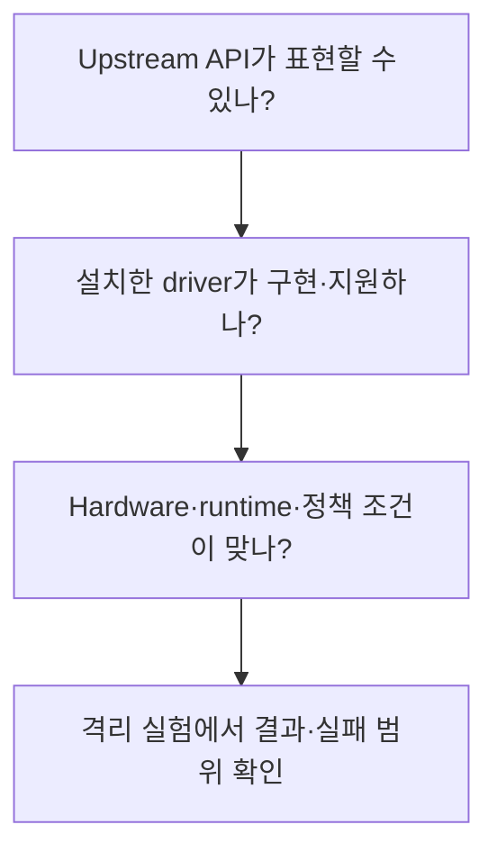

# 14. 버전과 기능 단계: Stable DRA의 범위를 읽기

이 장의 공식 자료 확인 기준일은 **2026-10-10**이다. Kubernetes core API, GPU Operator 관리 방식, NVIDIA DRA driver 구현, GPU hardware 지원은 서로 다른 축이다. 한 축에서 stable이라고 나머지 축의 모든 기능도 stable인 것은 아니다.

## 14.1 숫자가 서로 다른 이유

| 축 | 기준일에 확인한 기준 | 읽는 법 |
| --- | --- | --- |
| Kubernetes | 이 교재의 최신 기능 설명은 1.37 | core API·feature gate·component 지원 |
| GPU Operator | 정식 최신 v26.7.1 | calendar version·관리 CR·operand matrix |
| NVIDIA DRA driver | Operator matrix의 v0.5.0 | driver 기능·gate·node 준비 구현 |
| NVIDIA GPU driver | 권장 기본 595.91.07 및 matrix의 지원 대안 | CUDA·GPU 모델·OS/kernel 조합 |
| Container Toolkit | v26.7.1 matrix의 1.20.1 | container 연결 도구 버전 |
| Device plugin | v26.7.1 matrix의 0.20.1 | 기존 plugin 경로의 구현 버전 |

Operator v26.7.1 matrix에는 GPU driver 615.71.09 등 여러 지원 버전이 있다. **지원 표의 가장 큰 driver 번호와 권장 기본 driver는 같은 항목이 아니다.** 이 표는 모든 component를 동시에 설치하라는 지침이 아니라 각 버전 축을 읽는 자료다. [공식 지원 matrix](https://docs.nvidia.com/datacenter/cloud-native/gpu-operator/latest/platform-support.html)

정식 릴리스는 [GPU Operator releases](https://github.com/NVIDIA/gpu-operator/releases)와 [DRA driver releases](https://github.com/kubernetes-sigs/dra-driver-nvidia-gpu/releases)에서 확인한다. `main` branch의 예제를 정식 release와 같은 지원 근거로 쓰지 않는다.

## 14.2 GPU Operator의 지원 수명

기준일 공식 표는 **26.7.x Supported, 26.3.x Deprecated, 25.10.x 이하 End of Support**로 구분한다. 과거 교재·운영 사례의 25.3.4나 25.10.1은 역사적 기록이다. 과거 실측을 지우지 않되 새 설치의 지원 조합으로 추천하지 않는다.

Deprecated는 최신 지원 버전과 같은 상태가 아니다. 공식 수명 정책과 설치한 distribution의 계약을 함께 본다. 업그레이드도 무제한 버전 건너뛰기가 아니라 지원 경로를 따른다.

## 14.3 최신 Operator 관리 모드의 변화

`GPUCluster` 자체는 GPU kernel driver를 관리하지 않는다. Operator가 별도 `NVIDIADriver` CR로 containerized driver를 관리하거나 사전 설치한 host driver를 사용할 수 있다. CDI-compatible runtime도 준비 조건이다.

최신 managed workflow의 최소 조건은 Kubernetes **1.34.2 이상**, NVIDIA driver **580 이상**, 필요한 API와 runtime 지원이다. 별도 upstream driver 문서의 넓은 최소 버전과 Operator-managed 조합의 최소 버전을 섞지 않는다.

동일 클러스터에 `ClusterPolicy`와 `GPUCluster`를 동시에 두는 구성과, standalone DRA Helm release를 managed DRA와 중복 설치하는 구성은 지원되지 않는다. 기존 구성에서 `GPUCluster`로 **in-place migration도 지원되지 않는다**. 자세한 제한과 설치 경로는 [Operator 26.7 DRA 문서](https://docs.nvidia.com/datacenter/cloud-native/gpu-operator/26.7/dra-intro-install.html)와 [10장](10-deployment-compatibility-and-gitops.md)을 따른다.

## 14.4 Kubernetes 1.37의 DRA 단계

현재 DRA 개념 문서는 core를 **Stable since 1.35, gate locked**로 표기한다. 이전 1.34 GA 발표 등 역사적 설명과 현재 기능·gate의 설명을 구분한다. 이 책의 API 예시는 최신 `resource.k8s.io/v1`을 사용한다. [현재 core 문서](https://kubernetes.io/docs/concepts/resource-management/dynamic-resource-allocation/)

| Kubernetes 기능 | 1.37에서의 단계 | 의미 |
| --- | --- | --- |
| DRA core | Stable·locked | 기본 요청·선택·할당 경로 |
| DRA extended resource | Stable 1.37 | 기존 정수 요청을 DRA backend로 연결 |
| Device taints·DeviceTaintRule | Stable 1.37 | 장치별 새 배치 제한·조건부 eviction |
| Claim device status | Stable 1.37 | driver 제공 device status |
| Consumable capacity | Beta 1.36부터·기본 활성 | 독립 Claim의 광고 용량 소비 회계 |
| Partitionable devices | Beta 1.36부터·기본 활성 | 논리 장치가 공유하는 underlying 자원 회계 |
| Device health reporting | Beta 1.36부터·기본 활성 | 지원 driver의 health를 kubelet/Pod에 전달 |
| Device metadata downward API | Beta 1.37 | 지원 driver의 metadata를 container에 제공 |
| Workload/PodGroup Claim | Beta 1.37·기본 비활성 | 그룹 수준 Claim 참조 지원 |
| Device compatibility groups | Alpha 1.37·기본 비활성 | 같은 hardware의 비호환 모드 조합 제외 |
| Optional node operations | Alpha 1.37·기본 비활성 | 조건부 prepare/unprepare 생략 |
| Node allocatable resource mapping | Alpha·기본 비활성 | DRA 요청과 host 자원 accounting 연결 |

공식 근거: [1.37 변경 발표](https://kubernetes.io/blog/2026/09/03/kubernetes-v1-37-dra-updates/), [고급 기능](https://kubernetes.io/docs/concepts/resource-management/dynamic-resource-allocation/dra-features/), [관측 기능](https://kubernetes.io/docs/concepts/resource-management/dynamic-resource-allocation/dra-observability/), [device taints](https://kubernetes.io/docs/concepts/resource-management/dynamic-resource-allocation/device-taints/).

Device metadata·derived/list attribute·fractional capacity 등 세부 확장도 각각의 gate와 API를 가진다. 이들을 기본 GPU 요청의 전제로 넣지 않는다. 필요할 때 해당 release의 API reference를 읽는다.

## 14.5 NVIDIA DRA v0.5.0의 단계는 별도로 읽는다

| NVIDIA driver capability | 기준일 지원 단계 | 기본 |
| --- | --- | --- |
| Full GPU·기존 MIG 할당 | GA | Enabled |
| ComputeDomain | GA | Enabled; 지원 MNNVL hardware 필요 |
| ConsumableShares | Alpha | Disabled |
| DynamicMIG | Alpha | Disabled |
| MPSSupport | Alpha | Disabled |
| TimeSlicingSettings | Alpha | Disabled |
| NVMLDeviceHealthCheck | Alpha | Disabled |
| PassthroughSupport | Alpha | Disabled |
| DeviceMetadata | Alpha | Disabled |

이 표는 [NVIDIA DRA 기능 정의](https://github.com/kubernetes-sigs/dra-driver-nvidia-gpu/tree/v0.5.0)와 Operator의 driver maturity 표를 따른다. `ComputeDomainCliques`, `CrashOnNVLinkFabricErrors`, `IMEXDaemonsWithDNSNames`는 해당 표에서 GA·기본 활성인 세부 기능이다.

예를 들어 upstream consumable capacity가 Beta·기본 활성이어도 NVIDIA `ConsumableShares`는 Alpha·기본 비활성이다. driver gate와 capacity 설정을 하지 않았는데 자동으로 “40 GiB 장치를 10 GiB씩 네 Claim에 배정”한다고 설명하면 틀린다.

## 14.6 기존 개수 요청의 호환 경로

Kubernetes `DRAExtendedResource`는 1.35 Alpha → 1.36 Beta·기본 활성 → 1.37 GA로 발전했다. 관리되는 NVIDIA class `gpu.nvidia.com`을 사용할 extended-resource 이름은 `deviceclass.resource.kubernetes.io/gpu.nvidia.com`이다.

기존 `nvidia.com/gpu` 이름을 그대로 DRA로 받고 싶다면 그 이름을 `spec.extendedResourceName`으로 연결한 별도 DeviceClass가 필요하다. 기본 NVIDIA class가 그 mapping을 자동 제공한다고 가정하지 않는다. [DeviceClass v1 API](https://kubernetes.io/docs/reference/kubernetes-api/resource/device-class-v1/)

## 14.7 기능 켜기 전 질문 세 개

`DynamicMIG`와 `MPSSupport`처럼 조합 제약이 있는 gate도 있다. gate를 모두 true로 만드는 것이 최대 지원 구성은 아니다. 설치 버전의 제한 표를 읽고 연구에서 필요한 메커니즘만 선정한다.

**문제:** Kubernetes DRA가 stable이면 NVIDIA DynamicMIG도 stable인가? **해설:** API와 vendor 구현의 지원 단계는 다르다. 이 기준일의 DynamicMIG는 Alpha다.

**문제:** `nvidia.com/gpu: 1`이면 DRA를 쓰지 않는다고 확정할 수 있나? **해설:** 아니다. DeviceClass extended-resource mapping과 실제 backend를 확인해야 한다.

[이전: 연구 사례](13-research-and-lab-cases.md) · [다음: 문제·용어](15-exercises-glossary-sources.md) · [목차](README.md)
