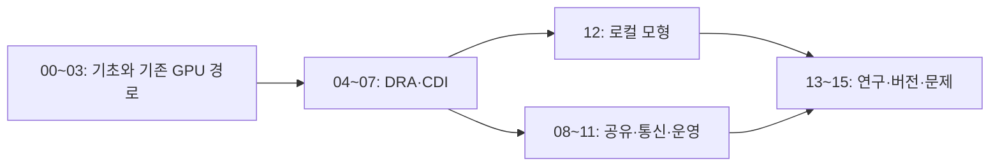

# 처음부터 배우는 GPU Operator와 DRA

**GPU가 서버에 꽂혀 있다는 사실과, Kubernetes의 특정 container가 그 GPU로 계산할 수 있다는 사실 사이에는 무엇이 필요한가?** 이 책은 그 사이의 Linux driver·CUDA·container runtime·장치 광고·스케줄링·할당·준비·관측을 순서대로 설명한다.

GPU Operator는 NVIDIA GPU 소프트웨어 구성요소를 관리하는 operator다. DRA는 **Dynamic Resource Allocation, 동적 자원 할당**이라는 Kubernetes API·할당 경로다. NVIDIA DRA Driver는 그 경로에 NVIDIA 장치를 연결하는 구현이다. 셋의 이름을 같은 제품이나 같은 책임으로 취급하지 않는다.

자료 확인 기준일은 **2026-10-10**이다. 최신 릴리스·API·기능 단계·지원 조합은 [14장](14-versions-and-feature-status.md)에서 명시한다. 공식 자료에서 확인하지 못한 조합을 지원된다고 추정하지 않는다. 개념 그림과 숫자 예시는 직접 만든 교육용 자료다.

## 누구를 위한 책인가

GPU Operator·DRA·MIG·CDI·ResourceClaim을 처음 보는 독자도 용어의 대상과 동작부터 배운다. [Kubernetes 교재](../kubernetes/README.md)의 Pod·ServiceAccount·자원·controller를 알면 도움이 된다. GPU 계산과 VRAM이 처음이라면 [AI 인프라 교재](../../ai/learning/ai-infrastructure/README.md)와 [하드웨어 GPU 장](../../hardware/learning/server-hardware/05-gpu-npu-execution.md)을 함께 읽는다.

서버 한 대에서 CUDA 프로그램을 실행할 수 있는지, Kubernetes가 장치를 광고하는지, claim이 할당됐는지, container 안에서 실제 계산이 되는지를 따로 질문한다. 마지막 질문에 답하려면 상태 표시와 실제 계산 결과를 함께 봐야 한다.

## 한 권의 목차

| 장 | 시작 질문 | 배우는 내용 |
| --- | --- | --- |
| [00. 전체 지도와 선수지식](00-map-and-prerequisites.md) | GPU가 있어도 Pod가 못 쓰는 이유는? | GPU·VRAM·node·Pod·driver·runtime·할당 계층 |
| [01. Linux·CUDA·컨테이너](01-gpu-linux-cuda-container.md) | GPU 파일을 보이면 계산도 되는가? | kernel driver·user library·CUDA·NVML·UVM·container |
| [02. 기존 device plugin 경로](02-device-plugin-path.md) | nvidia.com/gpu: 1은 무엇을 요청하나? | extended resource·advertisement·scheduler·Allocate |
| [03. GPU Operator 구성요소](03-gpu-operator-components.md) | Operator를 설치하면 누가 무엇을 관리하나? | ClusterPolicy·driver·toolkit·plugin·GFD·MIG·DCGM |
| [04. DRA 객체와 의미](04-dra-concepts-and-objects.md) | ResourceClaim은 단순 GPU 개수와 어떻게 다른가? | DeviceClass·ResourceSlice·Claim·Template·attribute·CEL |
| [05. DRA 할당의 생애](05-dra-allocation-lifecycle.md) | 요청에서 container 시작까지 누가 결정하나? | scheduler allocation·reservation·prepare·release |
| [06. DRA YAML 줄별 설명](06-dra-yaml-walkthrough.md) | Class·Claim·Pod는 어떻게 연결되나? | 검증된 API 구조·요청 이름·container 참조·오류 예 |
| [07. CDI와 runtime](07-cdi-and-runtime.md) | 선택한 GPU를 container에 어떻게 넣나? | CDI spec·device node·library·prepare·runtime injection |
| [08. MIG·time-slicing·MPS](08-sharing-mig-timeslicing-mps.md) | GPU 공유는 어떤 자원을 나누는가? | 물리 GPU·논리 장치·VRAM·시간·격리·과다 광고 |
| [09. Topology와 ComputeDomain](09-topology-and-compute-domains.md) | GPU 네 개를 받으면 통신도 빠른가? | NUMA·PCIe·NVLink·NCCL·도메인·할당과 성능 |
| [10. 배포·호환성·GitOps](10-deployment-compatibility-and-gitops.md) | 최신 버전끼리 설치하면 되는가? | 지원 matrix·driver root·관리 주체·선언·전환 |
| [11. 관측과 장애 진단](11-observability-and-troubleshooting.md) | Running·할당 성공·CUDA 성공은 같은가? | inventory·claim·prepare·CDI·CUDA·메모리·metrics |
| [12. GPU 없는 로컬 모형 실습](12-local-model-labs.md) | GPU 없이 할당 문제를 손으로 배울 수 있나? | 표·공동 node 제약·속성 선택·예약·한계 |
| [13. 연구와 저장소 운영 사례](13-research-and-lab-cases.md) | 연구실의 실제 문제와 어떻게 연결되나? | 역사적 기록·CDI race·실험 설계·공정한 비교 |
| [14. 버전과 기능 단계](14-versions-and-feature-status.md) | Stable DRA면 모든 기능도 stable인가? | upstream·NVIDIA 릴리스·feature gate·구현 지원 |
| [15. 문제·용어·공식 자료](15-exercises-glossary-sources.md) | 이름을 외운 것과 경로를 설명하는 것은? | 계산·장애 반례·해설·용어사전·source map |

## 읽는 순서

처음이라면 **00 → 01 → 02 → 03**으로 시작한다. 기존 GPU 경로를 이해한 뒤 **04 → 05 → 06 → 07**로 DRA와 runtime 연결을 배운다. **12장**은 GPU·클러스터가 없어도 실행할 수 있는 표 기반 모형 실습이다. MIG와 분산 학습은 08·09, 배포와 장애는 10·11, 연구와 버전은 13~15로 이어진다.

## 예시와 관측 기록을 구별하기

GPU 메모리 크기·node 이름·claim 이름·속성 선택은 설명용 예시일 수 있다. YAML은 API 연결을 배우는 자료이며 현재 클러스터에 적용한 설정이라고 주장하지 않는다. 12장의 모형은 Kubernetes scheduler나 NVIDIA driver의 구현을 재현하는 simulator가 아니다. 실제 GPU 설치·드라이버 변경·MIG 재구성·운영 클러스터 적용은 이번 교재 작성 과정에서 수행하지 않는다.

연구실의 과거 실행 기록은 [기존 GPU 운영 목차](../../kubernetes/gpu/README.md)에서 연결한다. 그 날짜·클러스터·버전의 관찰을 최신 조합의 성공 근거로 확대하지 않는다. [그림 목록](assets/README.md)에서 한글 SVG를 크게 볼 수 있다.

[통합 learning 목차](../README.md) · [첫 장 시작](00-map-and-prerequisites.md)
