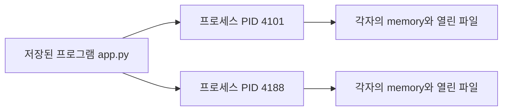
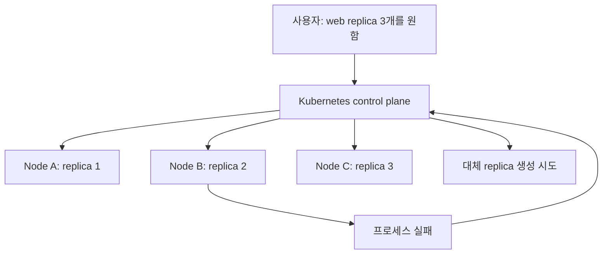
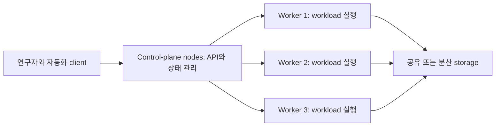

# 00. Kubernetes가 필요한 이유

[이 책 목차](README.md) · [다음: 컨테이너와 이미지](01-containers-and-images.md)

Kubernetes를 처음 만나면 YAML 문법부터 외우기 쉽다. 하지만 먼저 답해야 할 질문은 “왜 프로그램을 그냥 실행하지 않고 이런 시스템을 사용하는가?”이다. 이 장에서는 프로그램 하나가 여러 서버에서 오래 살아남아야 할 때 어떤 문제가 생기는지부터 시작한다.

## 1. 프로그램과 프로세스

**프로그램(program)**은 저장 장치에 놓인 실행 코드와 자원이다. **프로세스(process)**는 운영체제가 그 프로그램을 실제로 실행한 인스턴스다. 같은 Python 파일을 두 번 실행하면 프로그램은 하나여도 프로세스는 둘이다. 각 프로세스에는 PID, memory, 열린 파일, 환경 변수 같은 실행 상태가 있다.



노트북 한 대에서는 terminal에서 프로세스를 시작하고 실패하면 다시 실행해도 된다. 서버가 여러 대이고 프로세스가 수백 개라면 다음 질문이 생긴다.

- 어느 서버에 프로세스를 놓을까?
- 서버가 꺼졌을 때 누가 다시 실행할까?
- 새 버전으로 바꿀 때 요청을 끊지 않으려면 어떻게 할까?
- 각 프로세스가 사용할 CPU와 memory를 어떻게 제한할까?
- 서로를 고정 IP 없이 어떻게 찾을까?

이 반복 작업을 사람의 수동 명령만으로 관리하면 실제 상태와 문서가 쉽게 달라진다.

## 2. VM과 컨테이너

**가상 머신(VM)**은 hypervisor 위에서 guest 운영체제와 kernel을 포함한 machine 환경을 제공한다. **컨테이너(container)**는 보통 host kernel을 공유하면서 프로세스가 보는 filesystem, PID, network, 자원 범위를 격리한다.

| 구분 | VM | 컨테이너 |
| --- | --- | --- |
| 기본 경계 | guest OS 단위 | 격리된 프로세스 단위 |
| kernel | 각 VM의 guest kernel | host kernel 공유가 일반적 |
| 배포 묶음 | disk image | container image |
| 시작 비용 | 상대적으로 큼 | 상대적으로 작음 |
| 대표 용도 | 강한 machine 경계, 다른 OS | 애플리케이션 패키징과 빠른 배치 |

둘은 경쟁 관계로만 볼 필요가 없다. VM 위에서 Kubernetes node를 만들고, 그 안에서 컨테이너를 실행하는 구성이 흔하다. 컨테이너의 자세한 구조는 [다음 장](01-containers-and-images.md)에서 다룬다.

## 3. 오케스트레이터란 무엇인가

**오케스트레이터(orchestrator)**는 여러 machine에 workload를 배치하고 원하는 상태를 유지하도록 조정하는 시스템이다. Kubernetes는 containerized workload와 service를 관리하는 대표적인 오케스트레이터다.



Kubernetes는 한 번 명령하고 끝나는 installer라기보다, 관찰과 조정을 반복하는 control system이다. 공식 [Kubernetes overview](https://kubernetes.io/docs/concepts/overview/)는 containerized workload 관리와 declarative configuration을 핵심으로 설명한다.

## 4. 원하는 상태와 실제 상태

**원하는 상태(desired state)**는 사용자가 시스템에 바라는 상태다. 예를 들어 “이 image의 web server를 3개 유지하라”가 원하는 상태다. **실제 상태(actual state)**는 지금 cluster에서 관찰되는 상태다. 장애로 하나가 사라지면 실제 상태는 2개가 된다.

```text
desired replicas = 3
actual ready replicas = 2
difference = 1
```

Kubernetes controller는 차이를 보고 새 replica 생성을 시도한다. 이 반복 과정을 **reconciliation**, 즉 조정이라고 한다. 즉시 정확히 한 번 실행되는 명령으로 이해하지 않는다. 자세한 control loop는 [02장](02-architecture-and-reconciliation.md)에서 살펴본다.

## 5. 선언형 구성

**명령형(imperative)** 접근은 “지금 container 하나를 시작하라”처럼 수행할 동작을 말한다. **선언형(declarative)** 접근은 “replica가 항상 3개인 상태여야 한다”처럼 결과 상태를 기술한다.

아래 YAML은 Kubernetes object의 모양을 보여 주는 실행 가능한 예시다. 이 장에서는 실행하지 않으며, 격리된 실습 cluster에서 뒤 장의 절차와 함께 사용한다.

```yaml
apiVersion: apps/v1
kind: Deployment
metadata:
  name: research-api
  labels:
    app.kubernetes.io/name: research-api
spec:
  replicas: 3
  selector:
    matchLabels:
      app.kubernetes.io/name: research-api
  template:
    metadata:
      labels:
        app.kubernetes.io/name: research-api
    spec:
      containers:
        - name: api
          image: registry.example/research-api@sha256:0123456789abcdef0123456789abcdef0123456789abcdef0123456789abcdef
```

`metadata`는 이름과 label, `spec`은 사용자가 원하는 상태를 담는다. 이 예시는 image가 실제 registry에 존재한다고 보장하지 않으므로 그대로 배포할 대상은 아니다. object의 공통 구조는 공식 [Kubernetes objects](https://kubernetes.io/docs/concepts/overview/working-with-objects/)에서 확인한다.

## 6. Kubernetes가 해결하는 범위

Kubernetes가 잘하는 일은 다음과 같다.

- workload를 가용 자원이 있는 node에 배치한다.
- 실패한 container와 replica를 다시 만들려고 시도한다.
- Service와 DNS로 바뀌는 Pod를 찾게 한다.
- rolling update와 rollback을 위한 배포 primitive를 제공한다.
- CPU·memory request와 limit을 scheduler·runtime에 전달한다.
- Secret과 ConfigMap을 workload에 제공하는 API를 제공한다.

하지만 Kubernetes를 설치했다고 다음 문제가 자동으로 해결되지는 않는다.

| 문제 | 애플리케이션·데이터 계층에서 필요한 것 |
| --- | --- |
| 주문을 정확히 한 번만 결제 | idempotency key, transaction, 업무 규칙 |
| database consistency | database의 복제·transaction·quorum 설계 |
| backup과 restore | 백업 도구, 보존 정책, 복구 훈련 |
| 잘못된 데이터 삭제 | versioning, snapshot, 승인·복원 절차 |
| 느린 query | query·schema·index·파일 배치 최적화 |
| credential 최소 권한 | IAM, RBAC, key rotation, 감사 정책 |

Pod 재시작은 이미 외부 시스템에 남긴 side effect를 되돌리지 않는다. PersistentVolume도 backup 그 자체가 아니다. Kubernetes는 실행 기반을 제공하며 업무 의미와 데이터 안전 계약은 별도로 설계해야 한다.

## 7. 자원 제한도 애플리케이션 의미는 모른다

CPU·memory **request**는 scheduler가 배치 판단에 사용하는 요청량이고, **limit**은 container가 사용할 수 있는 상한과 관련된다. limit은 무한 자원 사용을 막는 데 도움을 주지만 다음을 판단하지 않는다.

- 어느 사용자 요청이 더 중요한가?
- cache를 버릴지 query를 중단할지?
- memory 부족 뒤 transaction을 다시 실행해도 안전한가?

memory limit을 넘은 container는 종료될 수 있고 controller가 새 container를 시작할 수 있다. 새 프로세스가 이전 in-memory 상태를 자동으로 복구하는 것은 아니다. 자원 동작은 공식 [Resource management](https://kubernetes.io/docs/concepts/configuration/manage-resources-containers/)를 참고한다.

## 8. local 개발과 연구용 다중 서버

| 환경 | 주된 목표 | 적합한 방식 |
| --- | --- | --- |
| local 단일 machine | YAML 학습, 빠른 기능 확인 | kind, minikube 같은 격리 cluster |
| 연구실 다중 서버 | 여러 node 배치, 장애·network·storage 연구 | 별도 control plane과 worker node |
| 운영 서비스 | 가용성, 보안, 감사, 복구 목표 | 조직 표준과 운영 책임을 포함한 설계 |

local cluster에서는 control plane과 worker가 같은 VM 또는 container 안에 있을 수 있다. 이는 개념을 배우는 데 유용하지만, 여러 physical server의 network 단절, disk 장애, rack failure를 그대로 재현하지 않는다.

연구용 다중 서버에서는 역할을 먼저 적는다.



어느 node가 control plane인지, workload도 함께 실행할지, storage가 node 밖에 있는지, API endpoint가 어떻게 보호되는지를 기록한다. “서버 세 대니까 고가용성”이라고 단정하지 않는다.

## 9. 언제 Kubernetes를 쓰지 않아도 되는가

한 사람이 한 machine에서 짧게 실행하는 분석 script라면 systemd, batch scheduler, container command만으로 충분할 수 있다. Kubernetes의 API, 인증, network, storage, upgrade까지 운영할 비용이 이득보다 클 수 있다.

반대로 다음 조건이 겹치면 Kubernetes를 검토할 이유가 커진다.

- 여러 service와 worker를 반복 배포한다.
- replica, rolling update, service discovery가 필요하다.
- 여러 팀이 공유 cluster에서 자원과 권한을 나눠야 한다.
- 실패한 프로세스를 지속적으로 관찰하고 복구해야 한다.
- 환경 차이를 줄이는 표준 배포 API가 필요하다.

도구 선택은 유행보다 workload와 운영 책임에서 시작한다.

## 10. 확인 문제

1. 프로그램과 프로세스의 차이는 무엇인가?
2. 컨테이너와 VM은 kernel을 어떻게 다르게 다루는가?
3. replica 3개가 desired state인데 실제로 2개라면 Kubernetes는 무엇을 시도하는가?
4. Pod가 재시작되면 database transaction도 자동으로 정확히 한 번 보장되는가?

## 11. 해설

1. 프로그램은 저장된 코드이고 프로세스는 그 코드가 실행 중인 인스턴스다. 같은 프로그램에서 여러 프로세스가 생길 수 있다.
2. VM은 보통 guest kernel을 포함하고, container는 host kernel을 공유하며 프로세스가 보는 자원 범위를 격리한다.
3. controller가 차이를 관찰해 대체 replica 생성을 시도한다. 즉시 성공이나 정확한 완료 시각까지 보장한다는 뜻은 아니다.
4. 아니다. Kubernetes는 프로세스 재생성을 돕지만 애플리케이션 transaction과 외부 side effect의 정확히 한 번 처리는 별도 계약이다.

다음 장에서는 container image가 무엇이며 registry, tag, digest, runtime이 어떻게 이어지는지 살펴본다.
