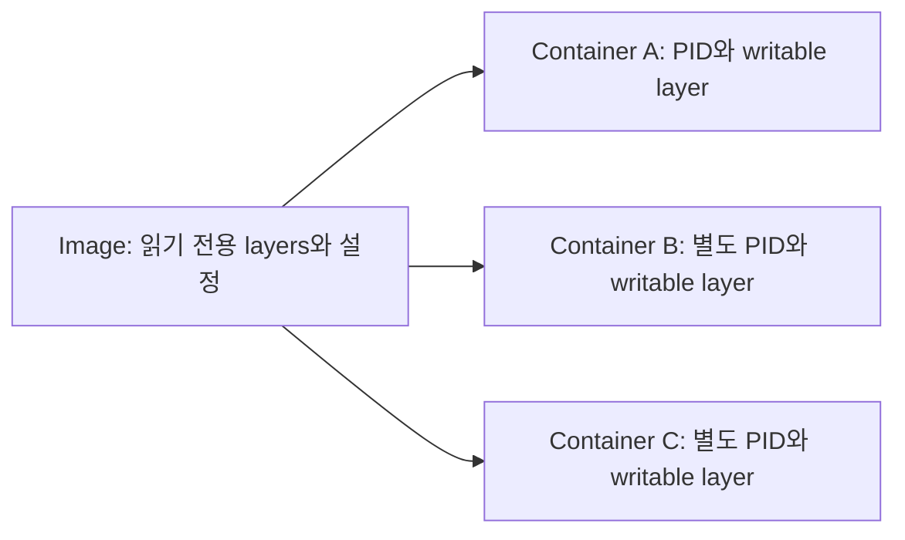
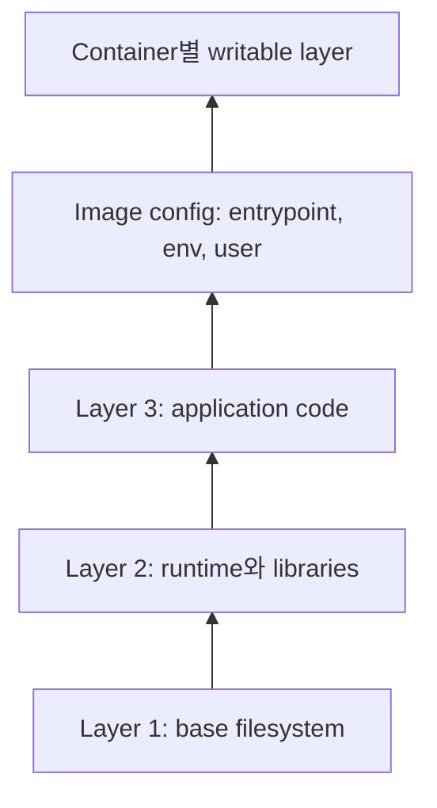
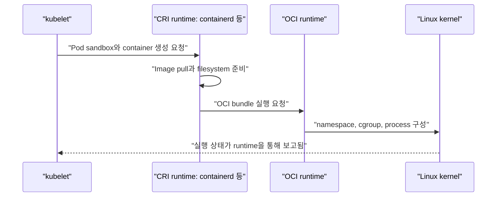
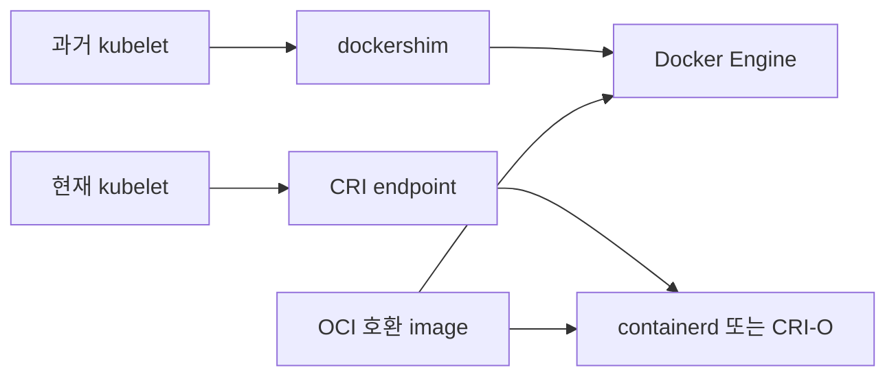
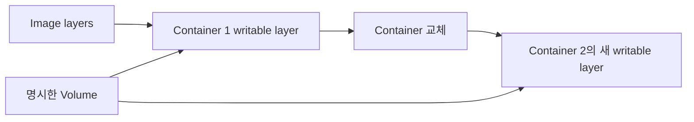

# 01. 컨테이너와 이미지

[이 책 목차](README.md) · [이전: Kubernetes가 필요한 이유](00-why-kubernetes.md) · [다음: 아키텍처와 reconciliation](02-architecture-and-reconciliation.md)

Kubernetes가 직접 관리하는 핵심 대상은 단순한 실행 파일이 아니라 containerized workload다. 이 장에서는 image가 어떻게 container가 되고, runtime·kernel 격리·signal이 어디에서 작동하는지 설명한다.

## 1. Image는 실행 전 묶음이다

**Container image**는 애플리케이션 실행에 필요한 filesystem 내용과 설정을 담은 불변 배포 묶음이다. 보통 executable, library, 기본 환경 변수, 시작 명령 같은 metadata가 들어간다. Image 자체는 실행 중인 프로세스가 아니다.

**Container**는 image를 바탕으로 격리된 프로세스를 실행한 인스턴스다. 같은 image에서 container 여러 개를 시작할 수 있으며 각 container의 writable 상태와 PID는 서로 다르다.



## 2. OCI가 공통 형식을 정의한다

OCI(Open Container Initiative)는 image와 runtime에 관한 공개 specification을 관리한다.

| OCI specification | 정의하는 것 |
| --- | --- |
| Image Specification | manifest, config, filesystem layer 배치 |
| Runtime Specification | filesystem bundle에서 container process 실행 방식 |
| Distribution Specification | registry와 image content를 주고받는 API |

OCI는 특정 Kubernetes 배포 제품이 아니다. Kubernetes, containerd, registry 같은 구현이 공통 형식과 protocol로 연결되게 하는 표준 기반이다. 규범 문서는 OCI의 [Specifications](https://opencontainers.org/about/overview/)에서 찾을 수 있다.

## 3. Layer는 변경분을 쌓는다

Image filesystem은 여러 **layer**로 구성된다. 각 layer는 이전 상태에 대한 추가·변경·삭제 표현을 담는다. 여러 image가 같은 base layer를 공유하면 registry 전송량과 node 저장 공간을 줄일 수 있다.



Layer가 있다고 보안 update가 자동 적용되지는 않는다. Base image가 바뀌면 application image를 다시 build하고 새 digest를 배포해야 한다. 실행 중 container 안에서 package를 고치는 방식은 재현 가능한 image와 실제 상태를 다르게 만든다.

## 4. Registry, repository, tag, digest

**Registry**는 image content를 저장하고 배포하는 service다. 한 registry 안에는 여러 repository가 있고, repository에는 여러 image manifest가 있을 수 있다.

```text
registry.example/research/api:1.4
└──── registry ────┘└ repository ┘└tag┘
```

**Tag**는 사람이 읽기 쉬운 가변 이름이다. `:1.4`나 `:latest`가 나중에 다른 image를 가리킬 수 있다. **Digest**는 content로 계산한 식별자이며 특정 manifest를 고정한다.

```text
registry.example/research/api@sha256:0123456789abcdef0123456789abcdef0123456789abcdef0123456789abcdef
```

| 참조 | 장점 | 주의점 |
| --- | --- | --- |
| tag | 읽고 승격하기 쉬움 | 같은 tag의 대상이 바뀔 수 있음 |
| digest | 동일 content 재현에 유리 | 사람이 의미를 읽기 어려움 |
| tag + 배포 기록 digest | 운영 추적과 가독성 균형 | promotion 절차가 필요 |

Kubernetes의 image name과 pull policy는 공식 [Images](https://kubernetes.io/docs/concepts/containers/images/) 문서에서 확인한다. `:latest`를 사용하면 기본 pull policy 동작도 달라질 수 있으므로 명시적 version과 digest를 선호한다.

## 5. Kubernetes와 runtime 사이의 CRI

각 node의 **kubelet**은 Pod를 실행해야 하지만 image unpack, namespace, cgroup, low-level process 시작을 모두 직접 구현하지 않는다. kubelet은 **CRI(Container Runtime Interface)**를 통해 container runtime과 통신한다.



CRI와 OCI는 같은 것이 아니다. CRI는 kubelet과 high-level container runtime 사이의 Kubernetes interface이고, OCI는 image/runtime/distribution의 일반 specification이다. containerd는 CRI endpoint를 제공하고 내부에서 OCI runtime을 사용할 수 있다. 공식 [Container runtimes](https://kubernetes.io/docs/setup/production-environment/container-runtimes/)가 이 연결을 설명한다.

## 6. dockershim 제거의 의미

과거 kubelet에는 Docker Engine을 CRI처럼 연결하는 `dockershim` 코드가 내장되어 있었다. Kubernetes 1.24에서 dockershim이 제거되었다. 이는 OCI image나 Docker로 build한 image를 Kubernetes에서 못 쓴다는 뜻이 아니다. Image 형식은 계속 호환될 수 있고, node runtime을 containerd나 CRI-O 같은 CRI 구현으로 연결한다.



이 migration의 배경은 Kubernetes 공식 [dockershim removal FAQ](https://kubernetes.io/blog/2022/02/17/dockershim-faq/)에서 확인한다.

## 7. container lifecycle과 PID 1

Container 안의 주 process는 그 PID namespace에서 보통 PID 1이다. Runtime은 configured command를 시작하고, 그 process가 끝나면 container도 종료된 것으로 본다.

PID 1에는 두 가지 실무 책임이 있다.

- 종료 signal을 애플리케이션에 전달하고 처리해야 한다.
- 종료된 child process를 wait하여 zombie가 쌓이지 않게 해야 한다.

Shell wrapper가 signal을 child에 전달하지 않으면 Kubernetes가 `SIGTERM`을 보내도 application이 graceful shutdown을 시작하지 못할 수 있다. Wrapper에서는 필요에 따라 `exec`로 실제 process를 PID 1로 만들거나 검증된 init process를 사용한다.

```text
# 개념 예시
나쁜 경로: PID 1 shell → child application, signal 전달 안 됨
좋은 경로: PID 1 application → SIGTERM 처리 → 요청 종료 → process exit
```

Pod 종료 시 kubelet의 기본 흐름과 grace period는 [Pod lifecycle](https://kubernetes.io/docs/concepts/workloads/pods/pod-lifecycle/#pod-termination)에서 확인한다. Application의 종료 처리 시간이 grace period와 맞아야 한다.

## 8. Linux namespace와 cgroup

Linux **namespace**는 process가 보는 system resource view를 분리한다. 종류에 따라 PID, mount, network, IPC, hostname, user ID view를 나눈다. **cgroup**은 process group의 CPU, memory 등 자원 사용을 계층적으로 관리하고 측정한다.

| kernel 기능 | 주된 질문 |
| --- | --- |
| PID namespace | 어떤 process가 보이는가? |
| mount namespace | 어떤 filesystem mount가 보이는가? |
| network namespace | 어떤 interface, route, port 공간을 보는가? |
| user namespace | container ID가 host ID와 어떻게 연결되는가? |
| cgroup | 얼마의 CPU·memory 자원을 쓰고 제한받는가? |

Namespace와 cgroup은 container 격리의 중요한 재료지만 “container라서 무조건 안전하다”는 결론을 보장하지 않는다. Container는 host kernel을 공유할 수 있으며 privileged mode, 과도한 capability, hostPath, root 실행, kernel 취약점이 경계를 약화할 수 있다.

## 9. root user와 capability

Image가 `USER`를 지정하지 않으면 process가 container 안에서 root로 실행될 수 있다. Container root가 항상 host root와 동일한 권한인 것은 아니지만, 공격 표면과 잘못된 mount 접근 위험을 줄이기 위해 가능한 경우 non-root user를 사용한다.

아래는 뒤의 격리 실습에서 사용할 수 있는 실행 가능한 Pod 일부다. 이 장에서는 실행하지 않는다.

```yaml
apiVersion: v1
kind: Pod
metadata:
  name: nonroot-example
  labels:
    app.kubernetes.io/name: nonroot-example
spec:
  securityContext:
    runAsNonRoot: true
  containers:
    - name: app
      image: registry.example/demo/app@sha256:0123456789abcdef0123456789abcdef0123456789abcdef0123456789abcdef
      securityContext:
        allowPrivilegeEscalation: false
        capabilities:
          drop: ["ALL"]
```

실제 image가 non-root 실행을 지원하는지, writable 경로와 port 권한이 맞는지도 확인해야 한다. 설정 항목은 [Security context](https://kubernetes.io/docs/tasks/configure-pod-container/security-context/)에서 확인한다.

## 10. Container filesystem은 영구 저장소가 아니다

Container writable layer는 해당 container 수명에 묶인다. Container가 교체되면 같은 Pod 안에서도 이전 writable layer가 사라질 수 있다. Image layer는 읽기 전용 배포 content이지 database data를 기록하는 장소가 아니다.



Log, model, checkpoint, database data의 지속성은 Volume·외부 storage·application protocol을 별도로 설계한다. Volume도 backup이나 application consistency를 자동으로 제공하지 않는다.

## 11. 확인 문제

1. Image와 container의 차이는 무엇인가?
2. Tag와 digest 중 content를 고정하는 식별자는 무엇인가?
3. CRI와 OCI는 어떤 경계에 쓰이는가?
4. dockershim 제거 뒤 Dockerfile로 만든 image는 사용할 수 없는가?
5. Container가 namespace와 cgroup을 사용하면 무조건 안전한가?

## 12. 해설

1. Image는 실행 전 content와 설정이고 container는 그 image에서 시작한 격리 process 인스턴스다.
2. Digest다. Tag는 registry에서 다른 manifest로 이동할 수 있다.
3. CRI는 kubelet과 container runtime의 interface이고, OCI는 image·runtime·distribution 공통 specification이다.
4. 아니다. OCI 호환 image는 CRI runtime에서도 사용할 수 있다. 제거된 것은 kubelet 내부 adapter다.
5. 아니다. Kernel 공유, capability, root, mount, runtime·kernel 취약점과 보안 설정을 함께 평가해야 한다.

다음 장에서는 API server, etcd, scheduler, controller, kubelet이 desired state를 실제 Pod로 바꾸는 과정을 따라간다.
