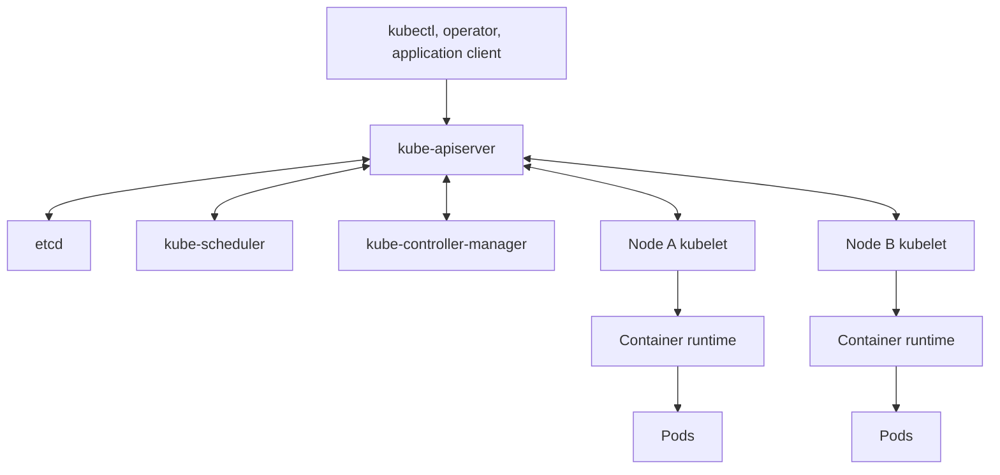
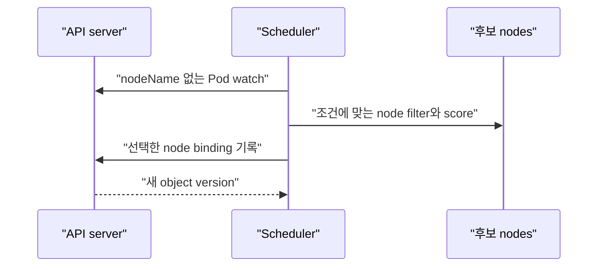
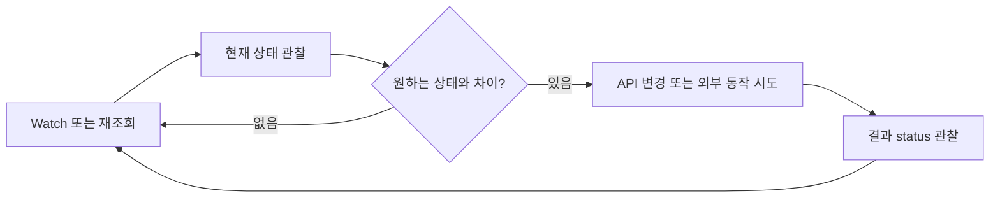
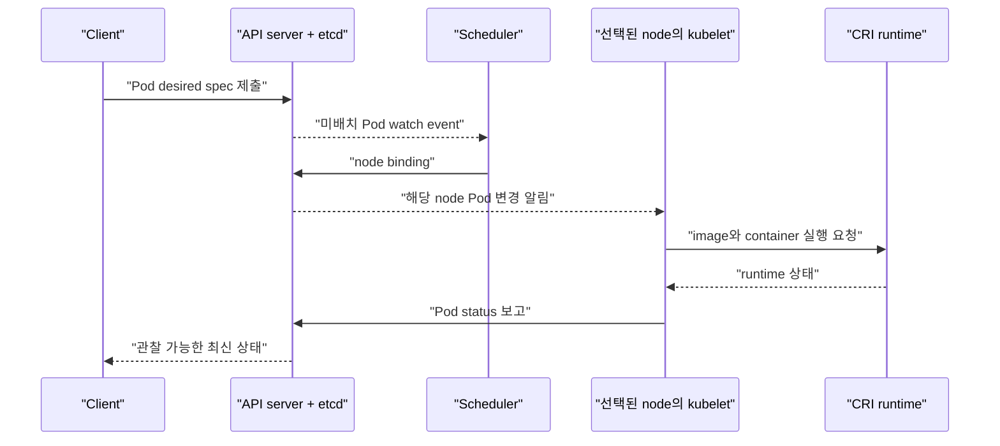
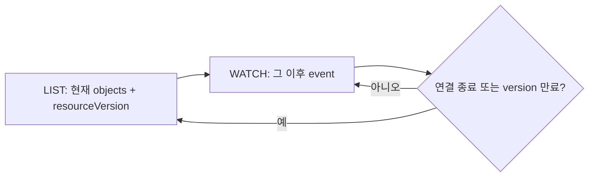

# 02. 아키텍처와 reconciliation

[이 책 목차](README.md) · [이전: 컨테이너와 이미지](01-containers-and-images.md) · [다음: Pod와 namespace](03-pods-and-namespaces.md)

Kubernetes는 중앙 프로그램 하나가 모든 container를 직접 실행하는 구조가 아니다. API를 중심으로 여러 component가 같은 object를 관찰하고 각자의 작은 책임을 반복한다. 이 장에서는 Pod 하나가 요청된 뒤 node에서 실행될 때까지를 따라간다.


## 1. 큰 그림

Kubernetes cluster는 **control plane**과 **worker node**로 나누어 설명할 수 있다. Control plane은 cluster 상태 API와 배치·조정 결정을 관리한다. Worker node는 실제 Pod를 실행한다.



구성 요소의 공식 역할은 [Kubernetes components](https://kubernetes.io/docs/concepts/overview/components/)에서 확인한다.

## 2. kube-apiserver는 API 입구다

**kube-apiserver**는 Kubernetes API를 제공하는 control-plane component다. Client 인증·인가, object validation, admission을 거쳐 cluster state를 읽고 바꾸는 중심 입구가 된다.

일반 component가 etcd를 직접 수정하지 않고 API server를 통하는 이유는 다음과 같다.

- 공통 authentication과 authorization 경계를 둔다.
- API version과 schema validation을 적용한다.
- admission policy를 일관되게 적용한다.
- watch와 optimistic concurrency interface를 제공한다.

API server가 container process를 직접 fork하는 것은 아니다. Object 상태를 공개하고, scheduler·controller·kubelet이 그 상태를 관찰해 각자 동작한다.

## 3. etcd는 cluster state 저장소다

**etcd**는 consistent key-value store이며 Kubernetes API object의 지속 상태를 보관한다. etcd backup은 cluster 복구에서 중요하지만, 다음과 같은 외부 데이터까지 포함하지 않는다.

- PersistentVolume 안의 database 파일
- Object storage의 Iceberg·Parquet 파일
- 외부 load balancer 설정 전체
- Registry의 container image

따라서 etcd snapshot과 application data backup을 별도 복구 계획으로 다룬다. etcd 자체는 API server 뒤의 구현 세부 경계이며 application이 business data store로 직접 사용하지 않는다.

## 4. scheduler는 미배치 Pod의 node를 고른다

**kube-scheduler**는 아직 node가 정해지지 않은 Pod를 보고 실행 가능한 node를 고른다. Resource request, node selector와 affinity, taint와 toleration, topology 등의 조건을 검사하고 점수를 계산한다.



Scheduler는 Pod를 node에 **배정**하지만 container를 시작하지 않는다. Query planner도 아니며 Spark job의 stage나 database join을 최적화하지 않는다.

## 5. controller는 차이를 반복해서 줄인다

**Controller**는 원하는 상태와 실제 상태를 관찰하고 차이를 줄이는 control loop다. Deployment controller는 ReplicaSet을 관리하고, ReplicaSet controller는 필요한 Pod 수를 맞추려 한다.




**Reconciliation**은 이 조정 과정을 뜻한다. 일회성 script처럼 “한 번 실행했으니 끝”이 아니다. 실패와 충돌을 고려해 다시 관찰하고, 안전한 동작을 재시도할 수 있어야 한다.

## 6. kubelet은 node의 Pod 실행을 맞춘다

각 worker node의 **kubelet**은 자신에게 배정된 PodSpec을 관찰한다. CRI runtime에 Pod sandbox와 container 생성을 요청하고 probe·상태를 API server에 보고한다.

Kubelet은 Deployment replica 수를 직접 결정하지 않는다. Scheduler처럼 다른 node를 선택하지도 않는다. 자신에게 배정된 Pod가 spec에 맞게 실행되도록 node-local reconciliation을 수행한다.

## 7. kube-proxy와 network 구현

전통적으로 각 node의 **kube-proxy**는 Service virtual IP와 backend Pod 사이의 packet forwarding rule을 구현한다. 그러나 일부 환경은 eBPF 기반 data plane 등 다른 구현으로 kube-proxy 역할을 대체할 수 있다.

**CNI(Container Network Interface)** plugin은 Pod network interface, IP, route 같은 network 연결을 구성한다. CNI와 kube-proxy는 같은 개념이 아니다.

| 구성 요소 | 주된 책임 |
| --- | --- |
| CNI plugin | Pod를 cluster network에 연결 |
| kube-proxy 또는 대체 data plane | Service traffic을 backend로 전달 |
| CoreDNS | Service와 Pod 관련 DNS 이름 해석 |

구체적인 packet 경로는 선택한 CNI와 service data plane 구현 문서를 확인한다. Kubernetes의 network model은 [Cluster networking](https://kubernetes.io/docs/concepts/cluster-administration/networking/)을 참고한다.

## 8. Pod 하나가 생성되는 전체 순서



Watch event가 유실되거나 component가 재시작될 수 있으므로 구현은 event 하나에만 의존하지 않고 현재 상태를 다시 list하여 맞춘다.

## 9. API object의 version과 watch

Kubernetes object의 `metadata.resourceVersion`은 저장소 안에서 object version을 식별하고 watch·동시성 제어에 사용되는 opaque 값이다. 숫자처럼 보여도 application이 증가량이나 wall-clock 시간을 계산하는 값으로 다루지 않는다.

Client는 list 결과의 resourceVersion 이후 변경을 watch할 수 있다. 너무 오래된 version을 요청하면 server가 해당 history를 제공하지 못할 수 있으며, client는 다시 list하고 watch를 재개해야 한다. 세부 semantics는 [API concepts](https://kubernetes.io/docs/reference/using-api/api-concepts/)에 정의되어 있다.



## 10. generation과 observedGeneration

많은 declarative workload object에는 `metadata.generation`이 있다. Desired spec의 의미 있는 변경이 받아들여질 때 새 generation으로 진행한다. Controller가 제공하는 `status.observedGeneration`은 status가 어느 generation까지 관찰해 처리했는지 나타낸다.

```text
metadata.generation: 7
status.observedGeneration: 6
```

이 상태라면 controller status가 최신 desired spec을 아직 반영하지 않았을 수 있다. 단, 모든 kind와 모든 status가 `observedGeneration`을 제공하는 것은 아니다. 해당 API kind의 schema를 확인한다. 값이 같더라도 모든 replica가 Ready라는 뜻은 아니므로 conditions와 replica count도 함께 본다.

## 11. Lease와 heartbeat

**Lease** object는 시간 제한이 있는 coordination 정보를 작게 갱신하는 데 사용된다. Node heartbeat와 control-plane component leader election 등에 활용된다. Node 전체 object를 매번 크게 쓰는 대신 Lease를 빠르게 갱신할 수 있다.

Lease 갱신이 잠시 늦었다고 즉시 node가 물리적으로 꺼졌다고 단정하지 않는다. Controller가 heartbeat, grace period, condition을 함께 평가한다. 공식 [Leases](https://kubernetes.io/docs/concepts/architecture/leases/) 문서를 참고한다.

## 12. eventual control loop의 보장 범위

Control loop는 실패 뒤 재시도하고 시간이 지나 desired state에 가까워지도록 설계된다. 이를 “eventual”한 조정으로 설명할 수 있지만 정확한 실시간 완료 시간을 보장하는 것은 아니다.

- Scheduler가 node를 찾지 못하면 Pod는 Pending일 수 있다.
- Image pull이 실패하면 kubelet은 backoff하며 재시도할 수 있다.
- API 연결이 끊기면 component의 관찰이 늦을 수 있다.
- Resource가 부족하면 desired replica에 영원히 도달하지 못할 수도 있다.

따라서 “replicas를 3으로 바꾸면 정확히 1초 뒤 3개가 된다”는 계약은 없다. SLO가 있다면 readiness, rollout progress, alert 조건을 별도로 정의한다.

## 13. Controller는 image를 고치지 않는다

Controller가 재시도한다는 말은 Dockerfile이나 image layer를 mutation한다는 뜻이 아니다. PodSpec에 기록된 image를 runtime이 pull하고 container를 새로 만든다. 같은 tag가 다른 digest를 가리키면 pull policy와 cache에 따라 예상하지 못한 content가 실행될 수 있으므로 immutable digest와 명시적 rollout을 사용한다.

## 14. 한 Pod의 desired state matrix

다음 표는 Pod 하나의 단순한 desired state와 component 책임을 연결한다.

| 원하는 상태 | 관찰되는 실제 상태 | 주로 행동하는 component | 가능한 다음 행동 |
| --- | --- | --- | --- |
| Pod 존재, node 미정 | `nodeName` 없음 | scheduler | 적합한 node binding |
| Node A에 실행 | container 없음 | Node A kubelet | runtime에 생성 요청 |
| Image digest 실행 | image 없음 | runtime/kubelet | registry에서 pull |
| container Running | process 종료 | kubelet | restartPolicy에 따라 재시작 |
| Ready endpoint | readiness 실패 | kubelet·EndpointSlice controller | Ready false, Service backend 제외 |
| Pod 삭제 | process 실행 중 | kubelet | grace period와 종료 처리 |

하나의 중앙 component가 표 전체를 순서대로 실행하는 것이 아니다. Component마다 관찰하는 object와 책임이 다르고 API state를 통해 협력한다.

## 15. 확인 문제

1. Scheduler와 kubelet의 책임 차이는 무엇인가?
2. API server를 우회해 etcd를 직접 수정하면 안 되는 이유는 무엇인가?
3. `generation=10`, `observedGeneration=9`는 무엇을 시사하는가?
4. Reconciliation이 exact real-time completion을 보장하는가?

## 16. 해설

1. Scheduler는 실행할 node를 고르고, kubelet은 자신에게 배정된 Pod를 runtime으로 실행하고 상태를 보고한다.
2. 인증·인가, validation, admission, version과 concurrency 계약을 우회해 cluster 상태를 손상할 수 있기 때문이다.
3. Controller status가 최신 desired spec을 아직 관찰·반영하지 않았을 수 있다. 해당 kind의 conditions도 확인한다.
4. 아니다. 실패·resource 부족·network 지연 속에서 반복 조정하며 정확한 완료 시각은 별도 보장이 필요하다.

다음 장에서는 scheduler가 배치하는 최소 단위인 Pod와 API namespace를 직접 읽는다.
