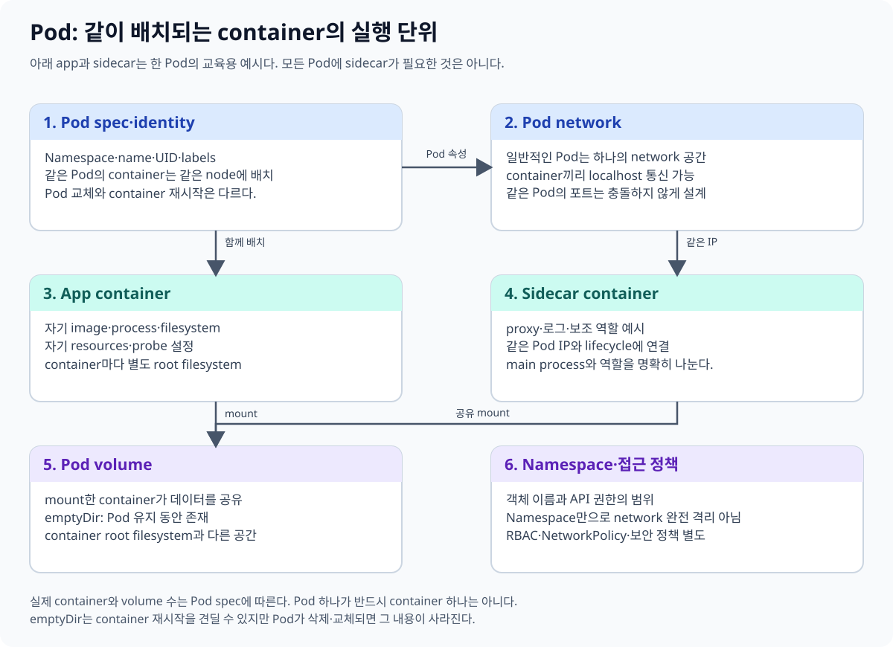
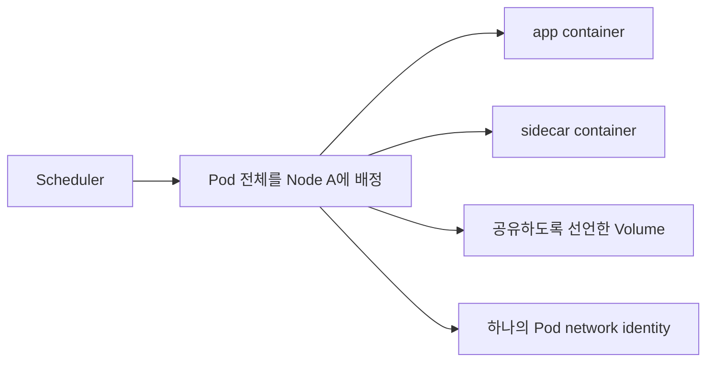
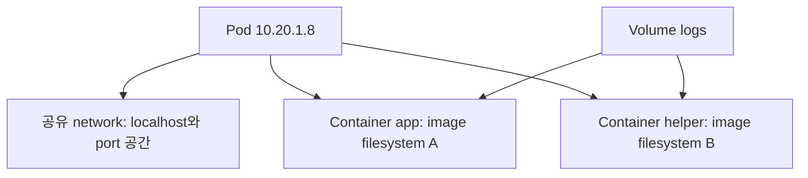
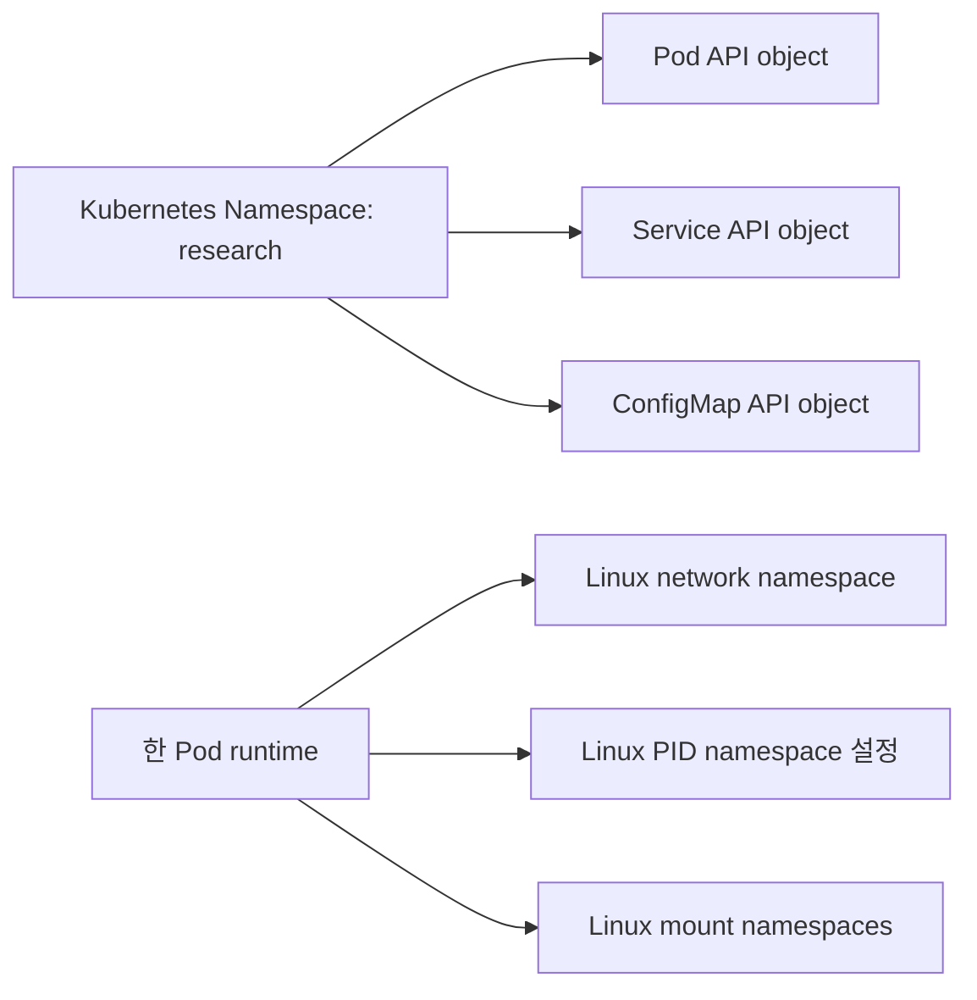
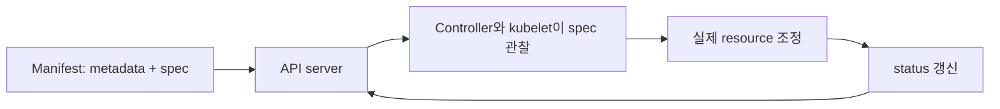
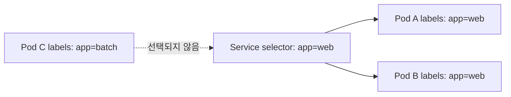
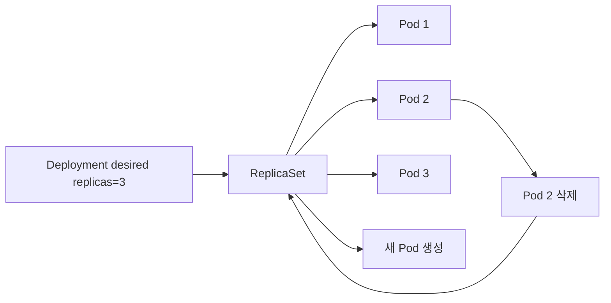

# 03. Pod와 namespace

[이 책 목차](README.md) · [이전: 아키텍처와 reconciliation](02-architecture-and-reconciliation.md) · [다음: Workload controller](04-workloads.md)

Pod는 Kubernetes에서 실행과 배치의 출발점이다. Container 하나만 보더라도 Kubernetes는 그것을 보통 Pod 안에 넣어 관리한다. 이 장에서는 Pod 내부에서 무엇을 공유하는지, Kubernetes namespace가 무엇을 나누는지, object YAML과 읽기 전용 `kubectl` 출력은 어떻게 연결되는지 설명한다.



## 1. Pod는 가장 작은 scheduled unit이다

**Pod**는 Kubernetes scheduler가 node에 배치하는 가장 작은 실행 단위다. Scheduler는 container 각각을 서로 다른 node에 놓지 않고 Pod 전체를 한 node에 배정한다.

Pod는 container 한 개를 담는 경우가 가장 흔하지만, 강하게 결합된 여러 container를 담을 수도 있다. 같은 Pod의 container는 함께 배치되고 함께 수명 주기를 겪는다.



공식 정의는 [Pods](https://kubernetes.io/docs/concepts/workloads/pods/)에서 확인한다.

## 2. Pod와 container의 관계

Pod 안의 container는 다음을 공유한다.

- 같은 Pod IP와 network namespace
- 같은 `localhost`와 port 공간
- Pod에 정의하고 각 container가 mount한 Volume
- Pod의 배치 node와 대체로 같은 수명 경계

하지만 다음은 자동으로 하나가 되지 않는다.

- 각 container의 image filesystem
- 각 container의 root filesystem writable layer
- process 실행 명령과 환경 변수
- container별 CPU·memory request와 limit
- securityContext의 container별 항목



두 container가 같은 `/var/log/app` 경로를 본다고 가정하면 안 된다. 같은 Volume을 각 container의 그 경로에 명시적으로 mount해야 같은 content를 본다.

## 3. Pod IP와 port

Pod는 cluster network에서 하나의 IP를 받는 것이 일반적이다. 같은 Pod의 container는 같은 IP를 사용하고 `localhost`로 서로 통신할 수 있다. 따라서 두 container가 같은 protocol의 같은 port에 동시에 bind하려 하면 충돌한다.

```text
app container:    0.0.0.0:8080 사용
helper container: 127.0.0.1:9090 사용
Pod IP:           10.20.1.8
```

Pod IP는 Pod 교체 때 바뀔 수 있다. Client가 Pod IP를 configuration에 고정하지 않고 Service 같은 안정적인 discovery abstraction을 사용한다. Service는 뒤의 workload·network 장에서 다룬다.

## 4. Multi-container Pod를 쓰는 때

같은 Pod에 넣을 좋은 이유는 두 process가 함께 배치되어야 하고 network나 Volume을 밀접하게 공유하며 함께 scaling되어야 할 때다.

| 패턴 | 예시 |
| --- | --- |
| sidecar | app가 쓴 파일을 전송하는 helper |
| adapter | app output을 공통 형식으로 변환 |
| proxy | local port에서 통신을 중계 |
| init container | main container 전에 설정·준비 작업 수행 |

서로 독립적으로 scale하거나 배포해야 하는 service를 한 Pod에 묶으면 lifecycle이 불필요하게 결합된다. “같은 제품”이라는 이유만으로 같은 Pod를 쓰지 않는다.

## 5. 실행 가능한 Pod 예시

아래 manifest는 schema가 맞는 실행 가능한 예시지만 이 장에서는 cluster에 적용하지 않는다. 실제 image 접근이 가능한 격리 실습에서만 사용한다.

```yaml
apiVersion: v1
kind: Pod
metadata:
  name: web-with-helper
  namespace: research
  labels:
    app.kubernetes.io/name: web
    app.kubernetes.io/component: api
  annotations:
    example.org/owner-note: "training-only"
spec:
  containers:
    - name: web
      image: nginx:1.27.5
      ports:
        - name: http
          containerPort: 80
      volumeMounts:
        - name: shared-logs
          mountPath: /var/log/shared
    - name: helper
      image: busybox:1.37.0
      command: ["sh", "-c", "tail -n+1 -F /var/log/shared/access.log"]
      volumeMounts:
        - name: shared-logs
          mountPath: /var/log/shared
  volumes:
    - name: shared-logs
      emptyDir: {}
```

`emptyDir`는 Pod가 node에 배정될 때 만들어지고 Pod가 제거되면 함께 사라지는 임시 Volume이다. Container 재시작에는 남을 수 있지만 Pod 삭제·교체 뒤 영속성을 제공하지 않는다. 자세한 수명은 [Volumes](https://kubernetes.io/docs/concepts/storage/volumes/#emptydir)를 본다.

## 6. Kubernetes namespace와 Linux namespace

두 용어는 이름이 같지만 역할이 다르다.

| 용어 | 범위 | 목적 |
| --- | --- | --- |
| Kubernetes Namespace | API object의 논리적 grouping | 이름 범위, RBAC, quota, policy 적용 단위 |
| Linux namespace | 한 kernel의 process resource view | PID, network, mount 등의 격리 |

Kubernetes Namespace `research`를 만들었다고 Linux network namespace가 그 이름으로 하나 생기는 것은 아니다. 반대로 container의 PID namespace가 분리되어도 Kubernetes RBAC namespace가 자동 생성되지 않는다.



Kubernetes namespace 개념은 [Namespaces](https://kubernetes.io/docs/concepts/overview/working-with-objects/namespaces/)에 설명되어 있다.

## 7. Namespace는 모든 것을 격리하지 않는다

대부분의 workload object는 namespace에 속하지만 Node, Namespace 자체, PersistentVolume 같은 object는 cluster-scoped다. 같은 namespace라고 network가 자동으로 전부 허용되거나 다른 namespace와 자동 차단되는 것도 아니다.

Namespace별 분리를 강화하려면 다음 정책을 조합한다.

- RBAC Role과 RoleBinding
- ResourceQuota와 LimitRange
- NetworkPolicy와 이를 구현하는 CNI
- Pod Security Admission 설정
- 이름·label·비용 attribution 규칙

Namespace는 VM이나 별도 cluster와 같은 강한 경계를 혼자 제공하지 않는다. 신뢰 수준과 규제 요구가 크게 다르면 별도 cluster까지 검토한다.

## 8. Object의 공통 뼈대

Kubernetes object manifest에는 보통 다음 최상위 field가 있다.

| field | 뜻 | 주 작성자 |
| --- | --- | --- |
| `apiVersion` | 사용할 API group/version | 사용자 또는 도구 |
| `kind` | object 종류 | 사용자 또는 도구 |
| `metadata` | name, namespace, label, annotation, identity | 사용자·API server |
| `spec` | 원하는 상태 | 사용자 또는 controller |
| `status` | 관찰된 현재 상태 | controller·kubelet |



사용자는 일반적으로 `status`를 manifest에 고정해 원하는 결과를 만들지 않는다. Status subresource는 system component가 실제 관찰 결과를 기록한다. Object 구조는 [Kubernetes objects](https://kubernetes.io/docs/concepts/overview/working-with-objects/)를 참고한다.

## 9. Label, selector, annotation

**Label**은 object를 식별하고 그룹화하는 짧은 key/value metadata다. **Selector**는 label 조건으로 object 집합을 선택한다. Service와 Deployment 같은 object는 selector로 대상 Pod를 연결한다.

**Annotation**은 선택 기준이 아닌 부가 정보를 저장한다. Build 정보, tool hint, 사람을 위한 설명처럼 label에 적합하지 않은 값을 담을 수 있다.

```yaml
metadata:
  labels:
    app.kubernetes.io/name: experiment-api
    environment: test
  annotations:
    example.org/source-revision: "3a7c9d1"
```

이 조각은 object 안에 넣으면 실행 가능한 metadata 예시지만 단독 manifest가 아니며, 여기서는 적용하지 않는다. Label syntax와 selector는 [Labels and Selectors](https://kubernetes.io/docs/concepts/overview/working-with-objects/labels/), annotation은 [Annotations](https://kubernetes.io/docs/concepts/overview/working-with-objects/annotations/)을 따른다.

## 10. Selector가 연결을 만든다

다음 관계에서 Service는 이름에 `web`이 들어간 Pod를 찾는 것이 아니라 label 값이 일치하는 Pod를 선택한다.



Label을 바꾸면 Pod process를 재시작하지 않아도 selector membership이 바뀔 수 있다. 그래서 label 변경은 단순 설명 수정이 아니라 traffic과 policy 대상을 바꿀 수 있는 운영 변경이다.

## 11. 읽기 전용 kubectl 관찰

다음 명령은 cluster state를 읽기만 한다. 현재 context가 의도한 격리 실습 cluster인지 먼저 확인해야 하며, 이 문서에서는 실행하지 않았다.

```text
kubectl config current-context
kubectl get namespaces
kubectl get pods -n research -o wide
kubectl get pod web-with-helper -n research -o yaml
kubectl describe pod web-with-helper -n research
```

예상 출력의 핵심 열은 다음과 같다. 실제 IP, node, age, resourceVersion은 실행마다 달라진다.

```text
NAME              READY   STATUS    RESTARTS   AGE   IP          NODE
web-with-helper   2/2     Running   0          1m    10.20.1.8   worker-a
```

`READY 2/2`는 두 container의 readiness가 모두 true라는 뜻이고 `Running`은 Pod phase다. Application이 업무 요청을 완전히 처리할 수 있다는 end-to-end 보장과 같지는 않다.

Label selector로 읽을 수도 있다.

```text
kubectl get pods -n research -l app.kubernetes.io/name=web
kubectl get pods -n research --show-labels
```

`get -o yaml`은 `metadata`, `spec`, `status`를 함께 보여 준다. 원래 manifest와 달리 API default, UID, resourceVersion, status가 추가될 수 있다.

## 12. Pod를 직접 오래 운영하지 않는 이유

직접 만든 Pod가 삭제되면 ReplicaSet 같은 상위 controller가 새 Pod를 보충해 주지 않는다. 운영 workload는 일반적으로 Deployment, StatefulSet, Job 같은 controller를 사용한다.



Pod는 replaceable한 실행 단위다. Hostname, UID, IP, local writable state가 영구적이라고 가정하지 않는다. 상위 controller는 [다음 장](04-workloads.md)에서 다룬다.

## 13. 확인 문제

1. 같은 Pod의 두 container는 무엇을 공유하고 무엇을 자동 공유하지 않는가?
2. Kubernetes Namespace와 Linux namespace의 차이는 무엇인가?
3. Label과 annotation 중 Service 대상 선택에 사용하는 것은 무엇인가?
4. `kubectl get pods`에서 `Running`이면 business transaction도 정상이라고 단정할 수 있는가?

## 14. 해설

1. Pod IP·port 공간과 명시적으로 mount한 Volume을 공유한다. Image filesystem, writable layer, command, 자원 제한은 container별이다.
2. Kubernetes Namespace는 API object grouping과 policy 범위이고 Linux namespace는 kernel resource view를 격리한다.
3. Label과 selector다. Annotation은 일반적으로 선택 membership에 사용하지 않는다.
4. 아니다. Running은 Pod phase이며 readiness, application metric, dependency, end-to-end 결과를 함께 확인해야 한다.

다음 장에서는 Deployment, StatefulSet, DaemonSet, Job이 Pod를 어떤 수명 규칙으로 관리하는지 살펴본다.
