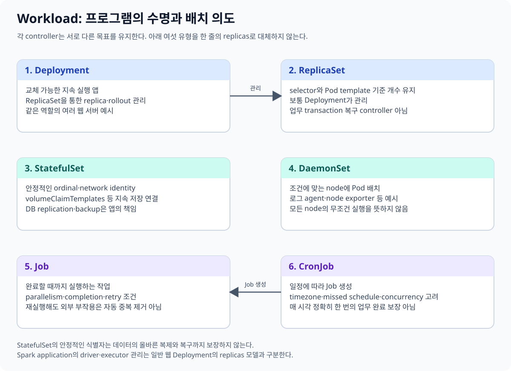
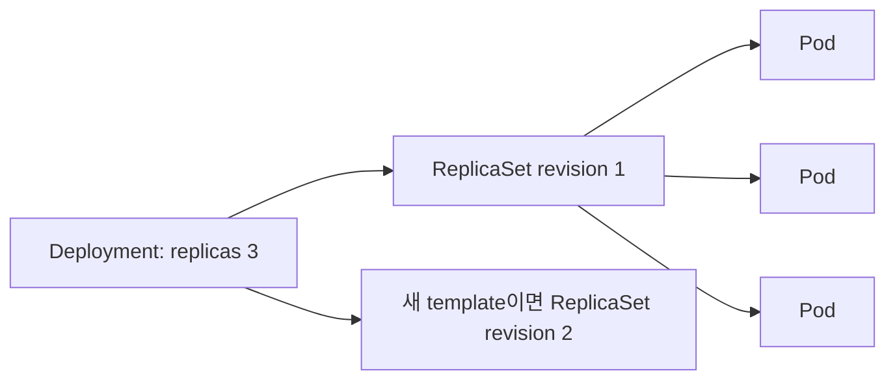
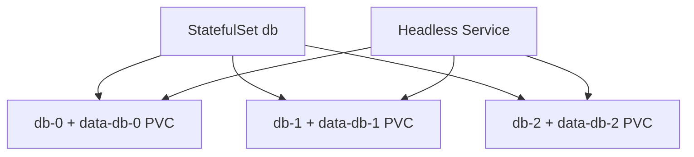
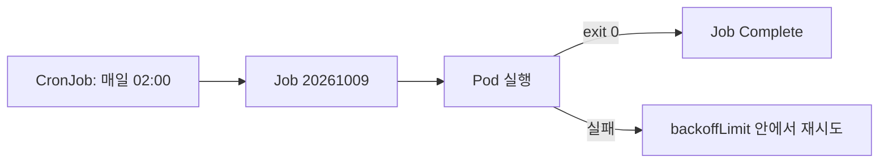
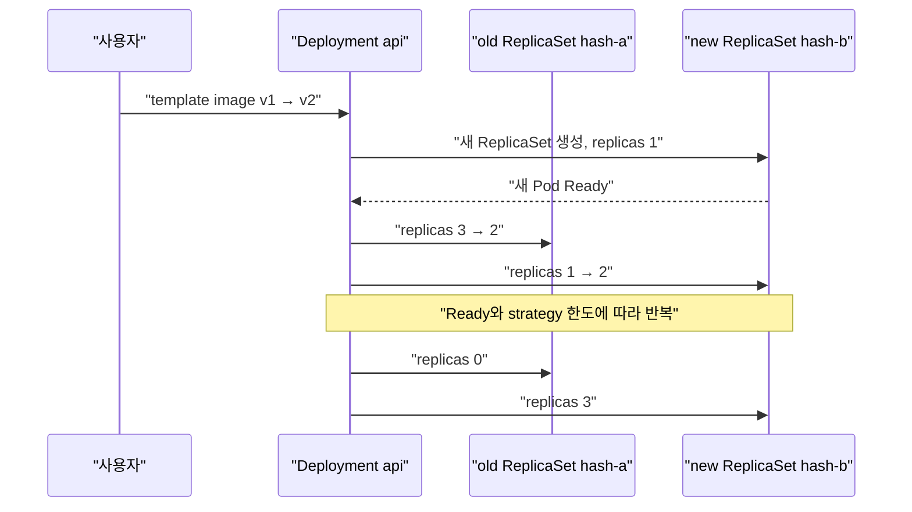
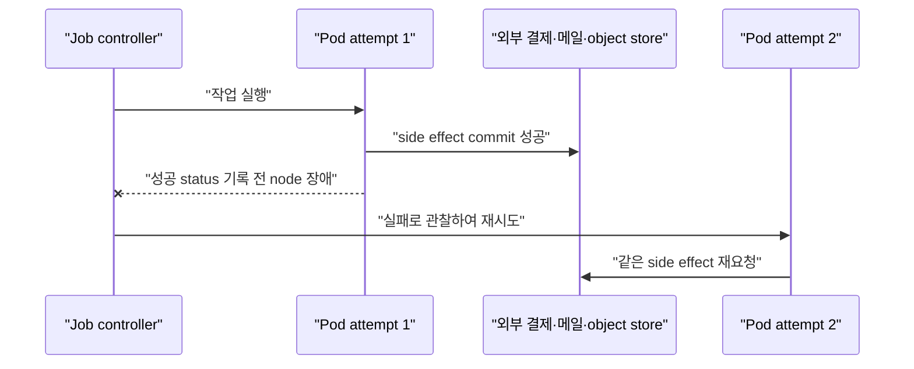

# 04. Workload controller

[이 책 목차](README.md) · [이전: Pod와 namespace](03-pods-and-namespaces.md) · [다음: Service와 network](05-networking-services.md)

Pod를 직접 만들면 그 Pod가 사라졌을 때 대신 만들어 줄 owner가 없다. **Workload controller**는 Pod template과 원하는 수를 보고 Pod를 생성·교체하는 control loop다. 이 장에서는 “어떤 Pod 수명 규칙이 필요한가?”를 기준으로 controller를 고른다.



## 1. Deployment와 ReplicaSet

**Deployment**는 stateless application의 replica와 rolling update를 관리한다. Deployment가 ReplicaSet을 만들고, ReplicaSet이 같은 template의 Pod 수를 맞춘다.



ReplicaSet을 사람이 직접 운영하기보다 Deployment를 사용하면 template revision, rollout, rollback 기능을 얻는다. Pod 이름과 IP는 교체 때 바뀔 수 있으므로 Service로 찾는다. 공식 [Deployments](https://kubernetes.io/docs/concepts/workloads/controllers/deployment/)를 참고한다.

아래 manifest는 `lab13` context의 격리된 `workload-lab` namespace용 실행 예시다. 이 문서에서는 적용하지 않는다.

```yaml
apiVersion: apps/v1
kind: Deployment
metadata:
  name: api
  namespace: workload-lab
spec:
  replicas: 3
  selector:
    matchLabels:
      app: api
  template:
    metadata:
      labels:
        app: api
    spec:
      containers:
        - name: api
          image: nginx:1.27.5
          resources:
            requests: {cpu: 100m, memory: 64Mi}
            limits: {cpu: 500m, memory: 128Mi}
```

Selector는 기존 Deployment에서 사실상 변경하기 어려운 identity 계약이다. Template label과 정확히 맞춘다.

## 2. StatefulSet

**StatefulSet**은 Pod마다 안정적인 ordinal 이름, 순서, 개별 storage claim이 필요한 workload를 관리한다. `db-0`, `db-1` 같은 identity를 제공하지만 database replication과 leader election을 자동 구현하지 않는다.



Pod가 교체되어도 같은 ordinal과 PVC를 다시 연결할 수 있다. Storage가 살아 있다는 사실과 application data가 일관되다는 사실은 별개다. [StatefulSets](https://kubernetes.io/docs/concepts/workloads/controllers/statefulset/)에서 ordering과 limitation을 확인한다.

## 3. DaemonSet

**DaemonSet**은 선택된 각 node에 Pod 하나씩 실행하는 controller다. Log agent, node monitoring, CNI agent처럼 node-local 기능에 적합하다.

```text
worker-a → log-agent Pod 1개
worker-b → log-agent Pod 1개
worker-c → log-agent Pod 1개
```

Replica 수를 직접 3으로 적는 방식이 아니다. Node selector, affinity, taint와 toleration에 따라 대상 node가 달라진다. Node가 추가되면 조건에 맞는 DaemonSet Pod가 생성된다. 공식 [DaemonSet](https://kubernetes.io/docs/concepts/workloads/controllers/daemonset/)을 참고한다.

## 4. Job과 CronJob

**Job**은 Pod가 성공 종료할 때까지 유한 작업을 관리한다. **CronJob**은 cron schedule마다 Job을 생성한다.



아래는 격리 실습용 실행 예시이며 여기서는 적용하지 않는다.

```yaml
apiVersion: batch/v1
kind: CronJob
metadata:
  name: daily-report
  namespace: workload-lab
spec:
  schedule: "0 2 * * *"
  concurrencyPolicy: Forbid
  jobTemplate:
    spec:
      backoffLimit: 2
      template:
        spec:
          restartPolicy: Never
          containers:
            - name: report
              image: busybox:1.37.0
              command: ["sh", "-c", "date; echo training-report"]
```

Cron schedule은 정확히 한 번 업무 실행을 보장하지 않는다. Controller 지연, 중복 가능성, Job retry를 고려해 작업을 idempotent하게 만든다. `concurrencyPolicy: Forbid`도 이전 Job이 끝나지 않았을 때 새 동시 실행을 막는 규칙이지 외부 transaction 보장이 아니다. [Jobs](https://kubernetes.io/docs/concepts/workloads/controllers/job/)와 [CronJobs](https://kubernetes.io/docs/concepts/workloads/controllers/cron-jobs/)를 본다.

## 5. Deployment rollout에서 실제로 바뀌는 object

Deployment의 container image를 바꾸면 기존 Pod를 한꺼번에 직접 수정하지 않는다. Pod template의 hash가 달라지고, Deployment controller가 그 template을 가진 새 ReplicaSet을 만든 뒤 두 ReplicaSet의 replica 수를 조절한다. 이미 실행 중인 Pod의 image field를 제자리에서 고치는 흐름이 아니다.



Replica 3개, `maxSurge: 1`, `maxUnavailable: 0`인 간단한 시간표를 보자. 실제 초 단위 완료 시간은 image pull과 readiness에 따라 달라지며, 아래 숫자는 순서를 설명하기 위한 관찰 예다.

| 시점 | old RS desired/ready | new RS desired/ready | 총 Pod | 해석 |
| --- | --- | --- | --- | --- |
| 10:00:00 | 3/3 | 0/0 | 3 | v1만 서비스 중 |
| 10:00:02 | 3/3 | 1/0 | 4 | surge 한도까지 v2 하나 생성 |
| 10:00:18 | 3/3 | 1/1 | 4 | v2가 Ready가 됨 |
| 10:00:19 | 2/2 | 1/1 | 3 | available 3을 지키며 old 하나 축소 |
| 10:00:40 | 0/0 | 3/3 | 3 | 전환 완료, old RS는 history로 남을 수 있음 |

새 Pod가 계속 Ready가 되지 않으면 `maxUnavailable: 0` 때문에 old ReplicaSet을 더 줄이지 못한다. 이것은 안전을 위한 정지이며 controller 고장이라고 단정하지 않는다. 반대로 replica가 1개인데 `maxUnavailable: 1`이면 순간적으로 available Pod가 0개가 될 수 있다. 무중단 여부는 strategy 숫자, readiness의 정확성, 종료 처리, cluster 여유를 함께 본다.

## 6. StatefulSet의 stable identity가 보장하는 것

StatefulSet은 ordinal, stable network identity, Pod별 PVC 연결을 관리한다. 다음 예시는 headless Service와 세 replica의 identity 관계를 보여 주는 교육용 manifest이며 여기서는 적용하지 않는다.

```yaml
apiVersion: apps/v1
kind: StatefulSet
metadata:
  name: db
  namespace: workload-lab
spec:
  serviceName: db-headless
  replicas: 3
  selector:
    matchLabels:
      app: db
  template:
    metadata:
      labels:
        app: db
    spec:
      containers:
        - name: db
          image: registry.example/training-db:1.0
          volumeMounts:
            - name: data
              mountPath: /var/lib/db
  volumeClaimTemplates:
    - metadata:
        name: data
      spec:
        accessModes: ["ReadWriteOnce"]
        resources:
          requests:
            storage: 10Gi
```

이 object가 만드는 계약은 `db-1`이 교체되어도 다시 `db-1`이라는 이름과 `data-db-1` claim을 사용하도록 조정하는 것이다. 다음은 application이 별도로 구현해야 한다.

- 어느 replica가 leader인지 결정하는 election 또는 quorum
- replica 사이 WAL·log·snapshot 전송과 lag 처리
- split brain 방지와 fencing
- schema migration, backup, point-in-time restore
- 손상된 replica를 어떤 source에서 다시 채울지 결정

따라서 `db-0`의 disk가 최신이라는 보장도, 세 PVC의 내용이 서로 같은 시점이라는 보장도 없다. 안정적인 이름은 복제 protocol이 상대를 찾게 도울 뿐 복제 protocol 자체가 아니다. `podManagementPolicy: Parallel`처럼 순서 규칙을 바꾸거나 강제로 Pod를 삭제하면 application의 bootstrap 가정도 다시 검토해야 한다.

## 7. Job retry는 실행 횟수 계약이 아니다

Job controller는 성공한 Pod 수를 맞추지만 application의 외부 side effect가 commit되었는지 알지 못한다. 가장 위험한 구간은 작업이 외부 시스템에는 성공했지만 Pod가 성공 상태를 보고하기 전에 종료되는 때다.



`backoffLimit: 2`는 실패한 Pod를 최대 정확히 두 번만 실행한다는 단순 문장이 아니다. Pod 내부 container restart와 새 Pod 생성, controller가 관찰한 실패가 함께 작동한다. 업무가 중복되면 안 된다면 Job UID나 입력 record ID를 idempotency key로 사용하고, 외부 저장소의 unique constraint 또는 transaction으로 이미 완료된 작업을 판별한다.

완료 record를 Job Pod의 `emptyDir`에만 쓰는 방식은 재시도 Pod가 볼 수 없으므로 충분하지 않다. 반대로 외부 완료 record를 먼저 쓰고 실제 결과 쓰기가 실패하면 거짓 완료가 될 수 있다. 결과와 완료 표시를 같은 transaction으로 묶거나 application protocol로 복구 순서를 정의한다.

## 8. CronJob concurrencyPolicy 세 가지

| 값 | 이전 schedule의 Job이 아직 실행 중일 때 | 적합한 경우 | 반례·주의 |
| --- | --- | --- | --- |
| `Allow` | 새 Job도 생성 가능 | 서로 독립적이고 동시 실행 안전 | 같은 partition을 동시에 갱신하면 충돌 가능 |
| `Forbid` | 새 실행을 건너뜀 | 겹침보다 누락이 나은 단일 batch | controller 지연 뒤 놓친 업무를 자동 보충한다는 뜻 아님 |
| `Replace` | 이전 Job을 교체하려고 함 | 최신 실행만 의미 있고 중단 안전 | 외부 side effect가 rollback되는 것은 아님 |

예를 들어 5분마다 실행되고 한 번에 8분 걸리는 Job에 `Forbid`를 쓰면 10:05 실행은 진행 중이라 건너뛸 수 있다. `startingDeadlineSeconds`는 늦은 schedule을 언제까지 시작할지 정하지만 정확히 한 번을 만들지 않는다. Controller가 잠시 멈췄다가 복구되거나 시계·API 지연이 있으면 schedule 관찰은 wall-clock 업무 transaction과 다를 수 있다.

CronJob이 만든 개별 Job에는 schedule 시각을 입력으로 넘기고, `2026-10-10T02:00` 같은 논리 실행 구간에 unique key를 두는 편이 안전하다. 그러면 중복 Job이 생겨도 같은 구간을 두 번 commit하지 않게 할 수 있다. `Forbid`만으로 이 보장을 대신하지 않는다.

## 9. 선택표

| 요구 | 우선 검토 |
| --- | --- |
| 교체 가능한 web/API replica | Deployment |
| 안정적인 ordinal과 Pod별 PVC | StatefulSet |
| 조건에 맞는 모든 node에 agent | DaemonSet |
| 완료까지 실행하는 batch | Job |
| 일정에 따라 Job 생성 | CronJob |

Controller는 application 의미를 모른다. StatefulSet을 쓴다고 database가 안전해지거나 Job을 쓴다고 외부 결제가 중복되지 않는 것은 아니다.

## 10. 읽기 전용 관찰

다음은 `lab13/workload-lab`에서만 보는 예시이며 실행하지 않았다.

```text
kubectl get deployments,replicasets,pods -n workload-lab
kubectl get statefulsets -n workload-lab
kubectl get daemonsets -n workload-lab
kubectl get jobs,cronjobs -n workload-lab
kubectl describe deployment api -n workload-lab
```

`ownerReferences`를 보면 Pod→ReplicaSet→Deployment 관계를 확인할 수 있다.

## 11. 문제와 해설

1. API replica 4개와 rolling update가 필요하다. 무엇을 쓰는가? **Deployment**다.
2. 모든 GPU node에 exporter 하나가 필요하다. 무엇을 쓰는가? Node label과 함께 **DaemonSet**을 검토한다.
3. StatefulSet이면 database backup이 필요 없는가? **아니다.** Identity와 PVC 연결을 제공할 뿐 일관된 backup은 별도다.
4. CronJob이 중복 업무를 절대 만들지 않는가? **아니다.** Retry와 controller 동작을 고려해 idempotency를 설계한다.

다음 장에서는 교체되는 Pod를 Service와 DNS로 찾고 network policy로 통신 범위를 제한한다.
