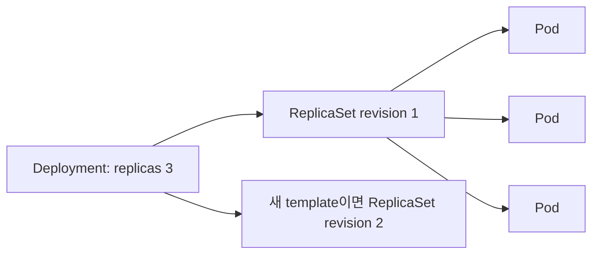
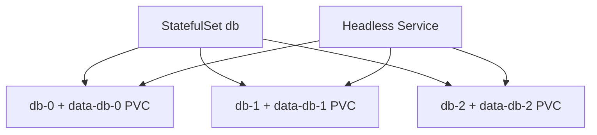
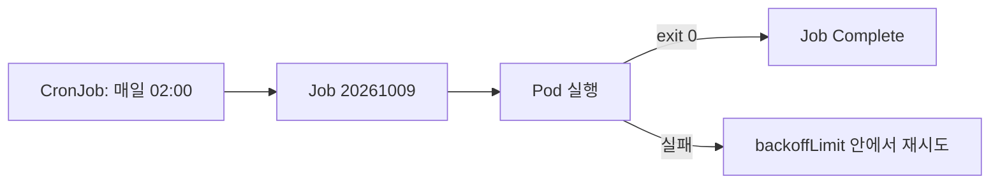

# 04. Workload controller

[이 책 목차](README.md) · [이전: Pod와 namespace](03-pods-and-namespaces.md) · [다음: Service와 network](05-networking-services.md)

Pod를 직접 만들면 그 Pod가 사라졌을 때 대신 만들어 줄 owner가 없다. **Workload controller**는 Pod template과 원하는 수를 보고 Pod를 생성·교체하는 control loop다. 이 장에서는 “어떤 Pod 수명 규칙이 필요한가?”를 기준으로 controller를 고른다.


## 1. Deployment와 ReplicaSet

**Deployment**는 stateless application의 replica와 rolling update를 관리한다. Deployment가 ReplicaSet을 만들고, ReplicaSet이 같은 template의 Pod 수를 맞춘다.



ReplicaSet을 사람이 직접 운영하기보다 Deployment를 사용하면 template revision, rollout, rollback 기능을 얻는다. Pod 이름과 IP는 교체 때 바뀔 수 있으므로 Service로 찾는다. 공식 [Deployments](https://kubernetes.io/docs/concepts/workloads/controllers/deployment/)를 참고한다.

아래 manifest는 `lab13` context의 격리된 `workload-lab` namespace용 실행 예시다. 이 문서에서는 적용하지 않는다.

```yaml
apiVersion: apps/v1
kind: Deployment
metadata:
  name: api
  namespace: workload-lab
spec:
  replicas: 3
  selector:
    matchLabels:
      app: api
  template:
    metadata:
      labels:
        app: api
    spec:
      containers:
        - name: api
          image: nginx:1.27.5
          resources:
            requests: {cpu: 100m, memory: 64Mi}
            limits: {cpu: 500m, memory: 128Mi}
```

Selector는 기존 Deployment에서 사실상 변경하기 어려운 identity 계약이다. Template label과 정확히 맞춘다.

## 2. StatefulSet

**StatefulSet**은 Pod마다 안정적인 ordinal 이름, 순서, 개별 storage claim이 필요한 workload를 관리한다. `db-0`, `db-1` 같은 identity를 제공하지만 database replication과 leader election을 자동 구현하지 않는다.



Pod가 교체되어도 같은 ordinal과 PVC를 다시 연결할 수 있다. Storage가 살아 있다는 사실과 application data가 일관되다는 사실은 별개다. [StatefulSets](https://kubernetes.io/docs/concepts/workloads/controllers/statefulset/)에서 ordering과 limitation을 확인한다.

## 3. DaemonSet

**DaemonSet**은 선택된 각 node에 Pod 하나씩 실행하는 controller다. Log agent, node monitoring, CNI agent처럼 node-local 기능에 적합하다.

```text
worker-a → log-agent Pod 1개
worker-b → log-agent Pod 1개
worker-c → log-agent Pod 1개
```

Replica 수를 직접 3으로 적는 방식이 아니다. Node selector, affinity, taint와 toleration에 따라 대상 node가 달라진다. Node가 추가되면 조건에 맞는 DaemonSet Pod가 생성된다. 공식 [DaemonSet](https://kubernetes.io/docs/concepts/workloads/controllers/daemonset/)을 참고한다.

## 4. Job과 CronJob

**Job**은 Pod가 성공 종료할 때까지 유한 작업을 관리한다. **CronJob**은 cron schedule마다 Job을 생성한다.



아래는 격리 실습용 실행 예시이며 여기서는 적용하지 않는다.

```yaml
apiVersion: batch/v1
kind: CronJob
metadata:
  name: daily-report
  namespace: workload-lab
spec:
  schedule: "0 2 * * *"
  concurrencyPolicy: Forbid
  jobTemplate:
    spec:
      backoffLimit: 2
      template:
        spec:
          restartPolicy: Never
          containers:
            - name: report
              image: busybox:1.37.0
              command: ["sh", "-c", "date; echo training-report"]
```

Cron schedule은 정확히 한 번 업무 실행을 보장하지 않는다. Controller 지연, 중복 가능성, Job retry를 고려해 작업을 idempotent하게 만든다. `concurrencyPolicy: Forbid`도 이전 Job이 끝나지 않았을 때 새 동시 실행을 막는 규칙이지 외부 transaction 보장이 아니다. [Jobs](https://kubernetes.io/docs/concepts/workloads/controllers/job/)와 [CronJobs](https://kubernetes.io/docs/concepts/workloads/controllers/cron-jobs/)를 본다.

## 5. 선택표

| 요구 | 우선 검토 |
| --- | --- |
| 교체 가능한 web/API replica | Deployment |
| 안정적인 ordinal과 Pod별 PVC | StatefulSet |
| 조건에 맞는 모든 node에 agent | DaemonSet |
| 완료까지 실행하는 batch | Job |
| 일정에 따라 Job 생성 | CronJob |

Controller는 application 의미를 모른다. StatefulSet을 쓴다고 database가 안전해지거나 Job을 쓴다고 외부 결제가 중복되지 않는 것은 아니다.

## 6. 읽기 전용 관찰

다음은 `lab13/workload-lab`에서만 보는 예시이며 실행하지 않았다.

```text
kubectl get deployments,replicasets,pods -n workload-lab
kubectl get statefulsets -n workload-lab
kubectl get daemonsets -n workload-lab
kubectl get jobs,cronjobs -n workload-lab
kubectl describe deployment api -n workload-lab
```

`ownerReferences`를 보면 Pod→ReplicaSet→Deployment 관계를 확인할 수 있다.

## 7. 문제와 해설

1. API replica 4개와 rolling update가 필요하다. 무엇을 쓰는가? **Deployment**다.
2. 모든 GPU node에 exporter 하나가 필요하다. 무엇을 쓰는가? Node label과 함께 **DaemonSet**을 검토한다.
3. StatefulSet이면 database backup이 필요 없는가? **아니다.** Identity와 PVC 연결을 제공할 뿐 일관된 backup은 별도다.
4. CronJob이 중복 업무를 절대 만들지 않는가? **아니다.** Retry와 controller 동작을 고려해 idempotency를 설계한다.

다음 장에서는 교체되는 Pod를 Service와 DNS로 찾고 network policy로 통신 범위를 제한한다.
