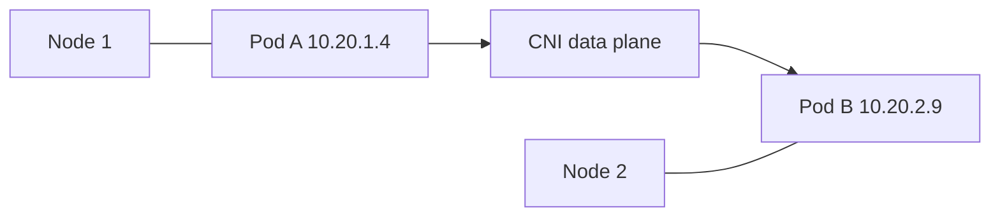
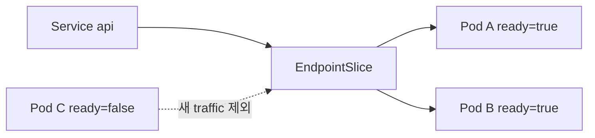
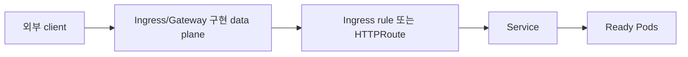

# 05. Service와 network

[이 책 목차](README.md) · [이전: Workload controller](04-workloads.md) · [다음: Storage](06-storage.md)

Pod IP는 교체될 수 있다. Kubernetes network의 핵심은 변하는 Pod를 안정적인 이름과 virtual IP로 찾고, 필요한 통신만 허용하는 것이다.


## 1. CNI와 Pod network

**CNI(Container Network Interface)** plugin은 Pod network interface, IP, route를 구성한다. Kubernetes network model은 Pod끼리 고유 IP로 통신할 수 있는 모델을 정의하지만 실제 packet 전달, encapsulation, routing, policy enforcement는 CNI 구현에 달려 있다.



공식 [Cluster Networking](https://kubernetes.io/docs/concepts/cluster-administration/networking/)은 model과 구현 경계를 설명한다.

## 2. Service와 selector

**Service**는 selector에 맞는 Pod 집합을 하나의 안정적인 network endpoint로 공개한다. Pod 이름을 보는 것이 아니라 label을 선택한다.

```yaml
apiVersion: v1
kind: Service
metadata:
  name: api
  namespace: network-lab
spec:
  selector:
    app: api
  ports:
    - name: http
      port: 80
      targetPort: http
  type: ClusterIP
```

이 manifest는 `lab13/network-lab` 격리 실습용 실행 예시이며 여기서는 적용하지 않는다. `port`는 Service port, `targetPort`는 Pod container의 named port다.

## 3. EndpointSlice와 readiness

EndpointSlice controller는 Service selector와 Pod 상태를 보고 backend endpoint를 관리한다. Readiness 실패 Pod는 보통 `conditions.ready=false`로 나타나 새 traffic 대상에서 빠진다.



Readiness 변경이 기존 connection을 즉시 종료한다는 뜻은 아니다. Proxy, load balancer, keep-alive의 drain 동작을 함께 확인한다. [EndpointSlices](https://kubernetes.io/docs/concepts/services-networking/endpoint-slices/)를 참고한다.

## 4. Service type

| Type | 사용 범위 |
| --- | --- |
| ClusterIP | cluster 내부 virtual IP, 기본값 |
| NodePort | 각 node port로 Service 공개 |
| LoadBalancer | 지원 cloud/controller가 외부 load balancer 제공 |
| ExternalName | DNS CNAME 방식으로 외부 이름 연결 |

`LoadBalancer` object만 만들면 모든 bare-metal 환경에 실제 장비가 자동 생기는 것은 아니다. 이를 구현할 controller나 provider integration이 필요하다. 공식 [Services](https://kubernetes.io/docs/concepts/services-networking/service/)에서 type별 semantics를 확인한다.

## 5. DNS

Cluster DNS는 Service 이름을 IP로 해석한다.

```text
같은 namespace: api
다른 namespace: api.network-lab
전체 이름: api.network-lab.svc.cluster.local
```

기본 cluster domain은 환경에서 바꿀 수 있으므로 application에 무조건 `cluster.local`을 고정하지 않는다. DNS가 성공해도 endpoint가 없거나 policy가 막으면 요청은 실패한다. [DNS for Services and Pods](https://kubernetes.io/docs/concepts/services-networking/dns-pod-service/)를 참고한다.

## 6. Ingress와 Gateway API

**Ingress**는 HTTP(S) route를 선언하는 API다. Ingress object만으로 traffic이 흐르지 않으며 해당 IngressClass를 구현하는 controller가 필요하다. Kubernetes 프로젝트는 Ingress API가 frozen 상태이며 새 기능은 Gateway API 방향임을 문서화한다.

**Gateway API**는 GatewayClass, Gateway, HTTPRoute처럼 infrastructure owner와 application route 책임을 나눈다. 역시 구현 controller가 있어야 한다.



공식 [Ingress](https://kubernetes.io/docs/concepts/services-networking/ingress/)와 [Gateway API](https://kubernetes.io/docs/concepts/services-networking/gateway/)를 확인한다.

## 7. NetworkPolicy

NetworkPolicy는 label selector와 namespace selector로 ingress·egress 허용 규칙을 선언한다. API object를 만들 수 있어도 사용하는 CNI가 policy enforcement를 지원하지 않으면 실제 packet 차단이 일어나지 않을 수 있다.

```yaml
apiVersion: networking.k8s.io/v1
kind: NetworkPolicy
metadata:
  name: api-from-web-only
  namespace: network-lab
spec:
  podSelector:
    matchLabels:
      app: api
  policyTypes: ["Ingress"]
  ingress:
    - from:
        - podSelector:
            matchLabels:
              app: web
      ports:
        - protocol: TCP
          port: 8080
```

이것도 `lab13/network-lab` 전용 실행 예시이며 여기서는 적용하지 않는다. 같은 namespace의 `app=web` Pod만 API 8080 ingress를 허용하는 의미다. DNS egress, monitoring, control-plane callback 같은 실제 의존성을 목록화한 뒤 default deny를 도입한다. 공식 [Network Policies](https://kubernetes.io/docs/concepts/services-networking/network-policies/)를 따른다.

## 8. 읽기 전용 진단

```text
kubectl get services,endpointslices -n network-lab
kubectl describe service api -n network-lab
kubectl get networkpolicies -n network-lab
kubectl get pods -n network-lab -o wide
```

위 명령은 `lab13/network-lab`에서 읽기만 하는 예시이며 실행하지 않았다. Service 장애 때 selector→Pod labels→readiness→EndpointSlice→DNS→policy 순서로 좁힌다.

## 9. 문제와 해설

1. Service가 Pod를 고르는 기준은? **Label selector**다.
2. Ready=false Pod는 보통 어디에 반영되는가? **EndpointSlice의 readiness condition**이다.
3. Ingress YAML만 만들면 외부 traffic이 흐르는가? **아니다.** 구현 controller와 data plane이 필요하다.
4. NetworkPolicy object가 있으면 모든 CNI에서 차단되는가? **아니다.** CNI의 enforcement 지원이 필요하다.

다음 장에서는 Pod보다 오래 살아야 하는 데이터를 PV, PVC, StorageClass와 CSI로 연결한다.
