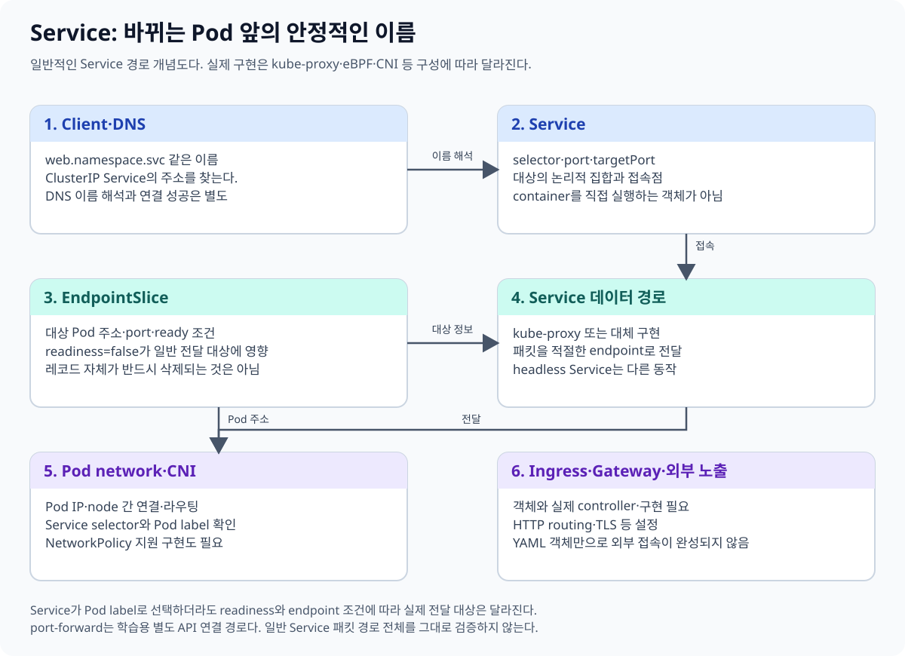
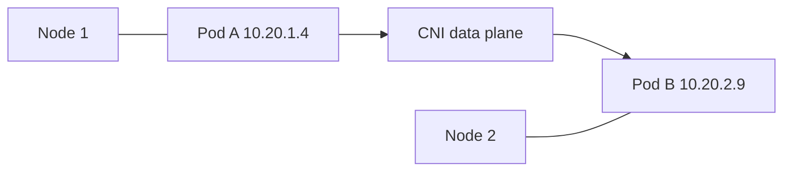
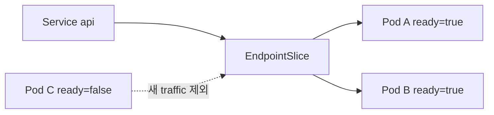
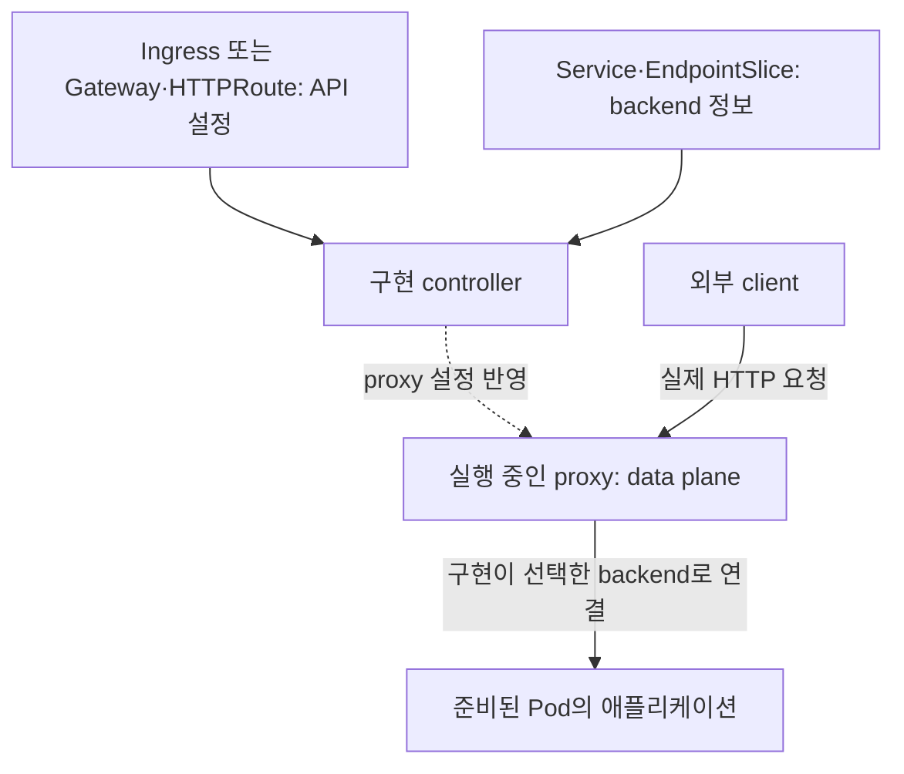

# 05. Service와 network

[이 책 목차](README.md) · [이전: Workload controller](04-workloads.md) · [심화: Gateway API](05a-gateway-api.md) · [다음: Storage](06-storage.md)

Pod IP는 교체될 수 있다. Kubernetes network의 핵심은 변하는 Pod를 안정적인 이름과 virtual IP로 찾고, 필요한 통신만 허용하는 것이다.

먼저 `api`라는 웹 프로그램이 두 Pod에서 실행되는 상황을 놓는다. 아래 IP는 설명용 값이다.

| 대상 | 예시 | 실제 역할 |
| --- | --- | --- |
| 애플리케이션 프로세스 | HTTP 서버, port `8080`에서 대기 | 요청을 해석하고 응답 본문을 만드는 프로그램 |
| Pod | A=`10.20.1.4`, B=`10.20.2.9` | 실행 중인 프로그램에 네트워크 환경을 제공하는 단위 |
| Service | `api`, Service port `80` | 현재 backend들을 안정적인 이름과 접속 지점으로 공개하는 API 객체 |
| EndpointSlice | A·B의 IP, port, readiness | Service의 실제 접속 대상과 상태를 기록하는 API 객체 |
| Cluster DNS | `api.network-lab` 이름을 해석 | 클라이언트가 접속할 주소를 찾게 하는 이름 서비스 |
| 네트워크 구현 | CNI·Service proxy 등 | 패킷을 전달하고 Service backend 선택과 정책을 구현 |

이들은 서로 다른 일을 한다. DNS가 이름을 해석한 뒤 HTTP 본문을 만들지는 않는다. Service 객체도 HTTP 서버 프로세스가 아니다. HTTP 서버가 실제로 실행되고 올바른 port에서 기다려야 최종 응답을 받을 수 있다.



## 1. CNI와 Pod network

**CNI(Container Network Interface)** plugin은 Pod network interface, IP, route를 구성한다. Kubernetes network model은 Pod끼리 고유 IP로 통신할 수 있는 모델을 정의하지만 실제 packet 전달, encapsulation, routing, policy enforcement는 CNI 구현에 달려 있다.



공식 [Cluster Networking](https://kubernetes.io/docs/concepts/cluster-administration/networking/)은 model과 구현 경계를 설명한다.

Pod가 시작할 때의 단순화한 순서는 다음과 같다.

1. kubelet과 container runtime이 Pod의 실행 환경을 준비한다.
2. CNI plugin이 네트워크 interface와 주소·경로를 설정한다.
3. 애플리케이션 프로세스가 시작해 설정을 읽고 HTTP port를 연다.
4. 애플리케이션 초기화와 readiness 검사 조건이 충족된다.

따라서 **Pod IP가 있다는 사실과 요청을 처리할 준비가 되었다는 사실은 다르다.** 네트워크가 먼저 준비되어도 모델 로딩이나 DB 초기화가 아직 끝나지 않았을 수 있다. CNI의 IP 연결과 HTTP의 `/v1` 경로를 고르는 작업도 서로 다른 계층이다.

## 2. Service와 selector

**Service**는 selector에 맞는 Pod 집합을 하나의 안정적인 network endpoint로 공개한다. Pod 이름을 보는 것이 아니라 label을 선택한다.

```yaml
apiVersion: v1
kind: Service
metadata:
  name: api
  namespace: network-lab
spec:
  selector:
    app: api
  ports:
    - name: http
      port: 80
      targetPort: http
  type: ClusterIP
```

이 manifest는 `network-lab`이라는 별도 namespace와 backend Pod를 가정하는 교육용 예시다. 13장의 기본 실습 파일을 그대로 적용하는 예시는 아니다. `port`는 Service port, `targetPort`는 backend Pod에 선언된 named port다.

이 설정에서 클라이언트는 `api:80`에 접속한다. 선택된 Pod에는 다음과 같은 선언과 실제 실행 조건이 필요하다.

```yaml
# Pod spec의 일부: 실행 가능한 완전한 manifest가 아니다.
containers:
  - name: api
    image: example.invalid/api:teaching
    ports:
      - name: http
        containerPort: 8080
```

`targetPort: http`는 Pod의 `name: http` 선언에서 숫자 `8080`을 찾는다. `containerPort: 8080`을 써도 애플리케이션이 자동으로 그 port를 여는 것은 아니다. 프로그램 설정도 `8080`에서 listen하도록 맞춰야 한다.

Pod A를 삭제하고 새 Pod C를 만들면 C의 IP는 바뀔 수 있다. C에도 `app: api` label이 있으면 controller가 backend 목록을 갱신한다. 클라이언트는 A의 이전 IP를 외우지 않고 같은 Service 이름을 사용할 수 있다. selector가 `app: api`인데 Pod label은 `app: backend`라면 이름이 비슷해도 선택되지 않는다.

## 3. EndpointSlice와 readiness

EndpointSlice controller는 Service selector와 Pod 상태를 보고 backend endpoint를 관리한다. Readiness 실패 Pod는 보통 `conditions.ready=false`로 나타나 새 traffic 대상에서 빠진다.



Readiness 변경이 기존 connection을 즉시 종료한다는 뜻은 아니다. Proxy, load balancer, keep-alive의 drain 동작을 함께 확인한다. [EndpointSlices](https://kubernetes.io/docs/concepts/services-networking/endpoint-slices/)를 참고한다.

| 시점 | Pod 상태 | backend 목록에 반영할 의미 |
| --- | --- | --- |
| t0 | A·B 모두 Ready | 둘 다 일반적인 새 요청 대상 |
| t1 | B의 readiness 실패 | B를 일반적인 새 요청 대상에서 제외 |
| t2 | C를 새로 생성, IP는 있지만 초기화 중 | C를 아직 일반적인 새 요청 대상에 넣지 않음 |
| t3 | C의 readiness 성공 | A·C를 대상으로 사용할 수 있음 |

이 표는 상태 변화의 의미를 설명한다. kubelet 상태 보고, EndpointSlice 갱신, proxy 설정 반영이 여러 구성요소를 거치므로 실제 반영 시각이 한 순간으로 고정되지는 않는다. `publishNotReadyAddresses` 같은 예외 설정도 있다. readiness가 어떤 검사이며 liveness와 어떻게 다른지는 [09장의 검사 요청과 실패 후 동작](09-health-and-rollouts.md)에서 이어 읽는다.

## 4. Service type

| Type | 사용 범위 |
| --- | --- |
| ClusterIP | cluster 내부 virtual IP, 기본값 |
| NodePort | 각 node port로 Service 공개 |
| LoadBalancer | 지원 cloud/controller가 외부 load balancer 제공 |
| ExternalName | DNS CNAME 방식으로 외부 이름 연결 |

`LoadBalancer` object만 만들면 모든 bare-metal 환경에 실제 장비가 자동 생기는 것은 아니다. 이를 구현할 controller나 provider integration이 필요하다. 공식 [Services](https://kubernetes.io/docs/concepts/services-networking/service/)에서 type별 semantics를 확인한다.

애플리케이션의 Service가 `ClusterIP`여도 외부 요청을 받을 수 있다. 앞에 있는 Gateway proxy가 외부 요청을 받아 그 backend로 전달하는 구성이 가능하기 때문이다. Service type은 접속 지점을 공개하는 방식을 나타낸다. HTTP hostname·path별 routing 정책은 별도로 읽어야 한다.

## 5. DNS

Cluster DNS는 Service 이름을 IP로 해석한다.

```text
같은 namespace: api
다른 namespace: api.network-lab
전체 이름: api.network-lab.svc.cluster.local
```

기본 cluster domain은 환경에서 바꿀 수 있으므로 application에 무조건 `cluster.local`을 고정하지 않는다. DNS가 성공해도 endpoint가 없거나 policy가 막으면 요청은 실패한다. [DNS for Services and Pods](https://kubernetes.io/docs/concepts/services-networking/dns-pod-service/)를 참고한다.

`http://api.network-lab:80/health` 요청을 손으로 따라가면 다음 질문을 분리할 수 있다.

1. DNS가 `api.network-lab`의 주소를 반환했는가?
2. 그 주소의 TCP port `80`까지 연결되는가?
3. Service 구현이 준비된 backend의 port `8080`으로 연결했는가?
4. 애플리케이션이 `/health`를 처리하고 성공 응답을 반환했는가?

이름을 못 찾는 오류, TCP 연결 오류, HTTP `404`, HTTP `503`은 같은 실패가 아니다. `404`는 어떤 HTTP 서버까지 도착했지만 요청 경로를 찾지 못한 경우일 수 있고, `503`은 proxy나 앱이 응답할 backend·준비 상태를 확보하지 못한 경우일 수 있다. 실제 응답을 만든 주체와 로그를 함께 본다. 구현에 따라 Service IP를 거치거나 backend 주소를 직접 사용할 수 있으므로 모든 proxy의 packet hop을 하나로 고정하지 않는다.

## 6. Ingress와 Gateway API

**Ingress**는 HTTP(S) route를 선언하는 API다. Ingress object만으로 traffic이 흐르지 않으며 해당 IngressClass를 구현하는 controller가 필요하다. Kubernetes 프로젝트는 Ingress API가 frozen 상태이며 새 기능은 Gateway API 방향임을 문서화한다.

**Gateway API**는 GatewayClass, Gateway, HTTPRoute처럼 infrastructure owner와 application route 책임을 나눈다. 역시 구현 controller가 있어야 한다.

| 객체 | 답하는 질문 | 예시 |
| --- | --- | --- |
| GatewayClass | 어떤 controller 구현이 처리할까? | Envoy Gateway 구현 선택 |
| Gateway | 어디서 어떤 프로토콜의 요청을 받을까? | `api.example.test`, HTTP port `80` listener |
| HTTPRoute | 어떤 HTTP 요청을 어느 backend로 보낼까? | `/v1` 요청을 `echo` Service port `80`으로 연결 |
| Service·EndpointSlice | 현재 어느 애플리케이션 주소로 연결할까? | 준비된 Pod의 실제 IP와 port |

YAML 객체들은 controller가 읽는 설정이다. 실제 HTTP 요청은 실행 중인 proxy와 애플리케이션이 처리한다.



공식 [Ingress](https://kubernetes.io/docs/concepts/services-networking/ingress/)와 [Gateway API](https://kubernetes.io/docs/concepts/services-networking/gateway/)를 확인한다.

**[05A. Gateway API 심화](05a-gateway-api.md)**에서는 위 표의 객체를 하나의 완전한 YAML 예제로 연결한다. `parentRefs`, listener, hostname, path, Service port를 한 줄씩 따라가고, 다른 namespace의 연결 권한, TLS, redirect·rewrite, 가중치, `Accepted`·`Programmed`·`ResolvedRefs`와 장애 진단까지 설명한다. 이 장의 전체 그림을 이해한 다음 심화 장에서 요청 한 건을 끝까지 추적해 본다.

## 7. NetworkPolicy

NetworkPolicy는 label selector와 namespace selector로 ingress·egress 허용 규칙을 선언한다. API object를 만들 수 있어도 사용하는 CNI가 policy enforcement를 지원하지 않으면 실제 packet 차단이 일어나지 않을 수 있다.

```yaml
apiVersion: networking.k8s.io/v1
kind: NetworkPolicy
metadata:
  name: api-from-web-only
  namespace: network-lab
spec:
  podSelector:
    matchLabels:
      app: api
  policyTypes: ["Ingress"]
  ingress:
    - from:
        - podSelector:
            matchLabels:
              app: web
      ports:
        - protocol: TCP
          port: 8080
```

이것도 별도 `network-lab` namespace를 가정하는 교육용 예시이며 여기서는 적용하지 않는다. 같은 namespace의 `app=web` Pod가 API의 TCP `8080`에 연결하는 ingress를 허용한다. 다른 허용 정책이 추가되면 허용 범위는 합쳐지므로 이 정책 하나만으로 모든 접근 규칙을 단정하지 않는다.

`spec.podSelector`는 **이 정책으로 보호할 대상**이고, `ingress.from[].podSelector`는 **허용할 출발지**다. 이 예시는 ingress만 선택했으므로 API Pod의 egress를 별도로 막지 않는다. 출발지에도 egress 제한이 있다면 양쪽의 허용 조건을 만족해야 한다. DNS egress, monitoring, control-plane callback 같은 실제 의존성을 목록화한 뒤 default deny를 도입한다. 공식 [Network Policies](https://kubernetes.io/docs/concepts/services-networking/network-policies/)를 따른다.

## 8. 읽기 전용 진단

```text
kubectl get services,endpointslices -n network-lab
kubectl describe service api -n network-lab
kubectl get networkpolicies -n network-lab
kubectl get pods -n network-lab -o wide
```

위 명령은 별도 `network-lab` namespace에서 읽기만 하는 예시이며 실행하지 않았다. Service 장애 때 selector→Pod labels→readiness→EndpointSlice→DNS→policy 순서로 좁힌다. 외부 요청만 실패하면 [Gateway 상태와 요청 경로 진단](05a-gateway-api.md)도 연결한다.

## 9. 문제와 해설

1. Service가 Pod를 고르는 기준은? **Label selector**다.
2. Ready=false Pod는 보통 어디에 반영되는가? **EndpointSlice의 readiness condition**이다.
3. Ingress YAML만 만들면 외부 traffic이 흐르는가? **아니다.** 구현 controller와 data plane이 필요하다.
4. NetworkPolicy object가 있으면 모든 CNI에서 차단되는가? **아니다.** CNI의 enforcement 지원이 필요하다.

다음 장에서는 Pod보다 오래 살아야 하는 데이터를 PV, PVC, StorageClass와 CSI로 연결한다.
