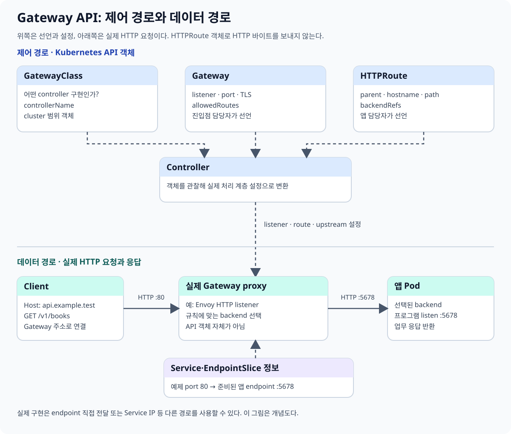
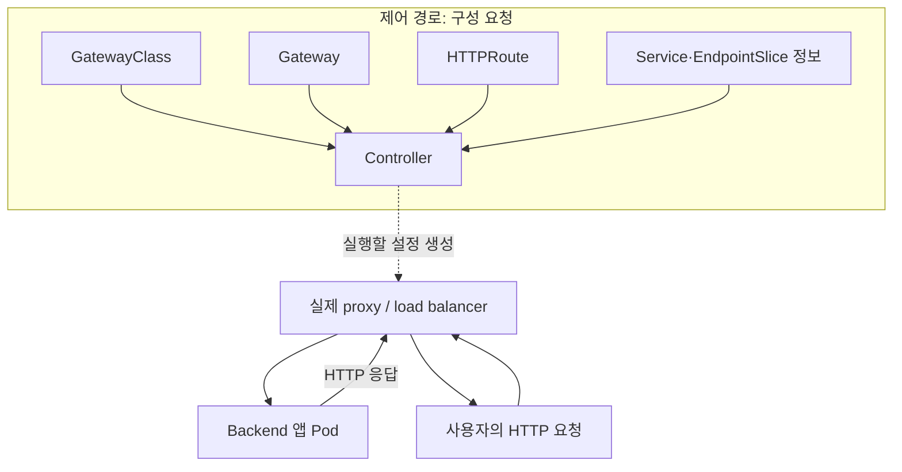
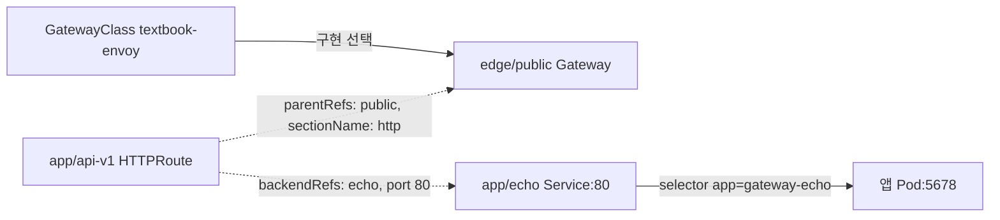
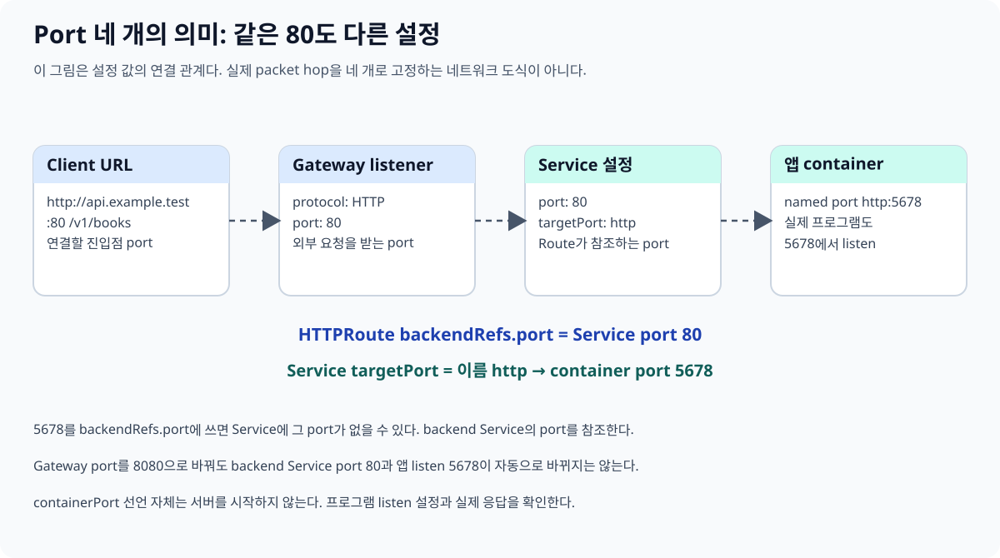
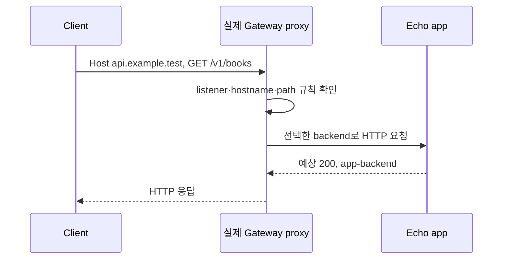
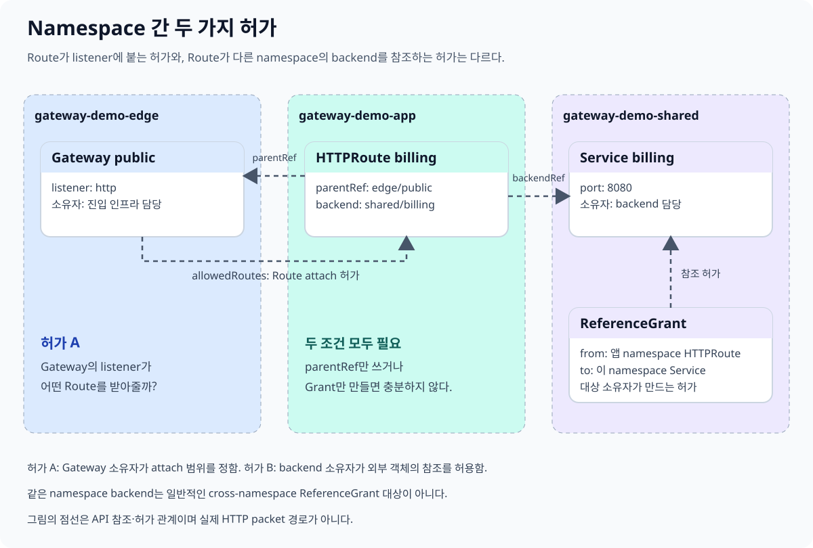
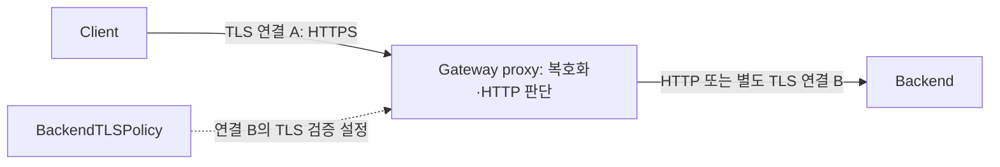
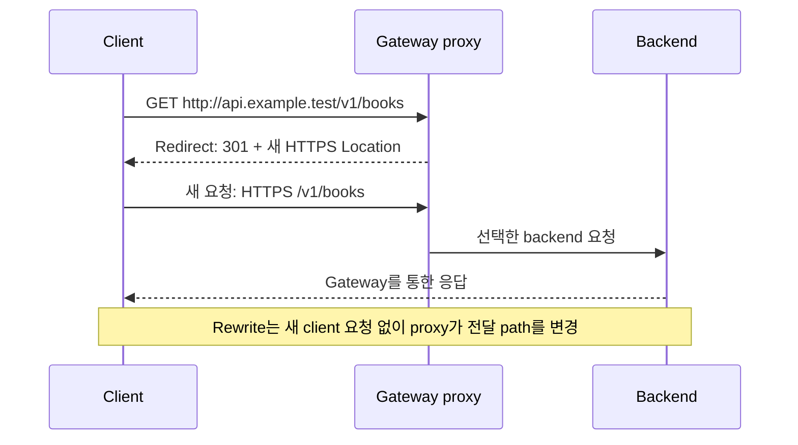
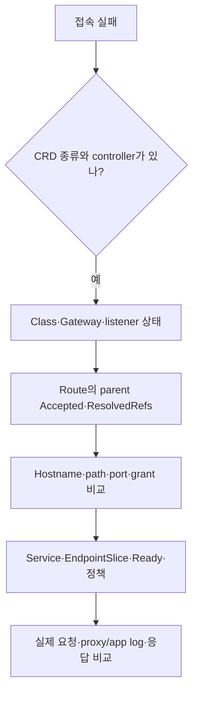

# 05A. Gateway API: 외부 요청에서 backend 응답까지

[Service와 네트워크](05-networking-services.md) · [교재 목차](README.md)

웹 API를 Kubernetes에 올렸다고 가정하자. Pod에는 IP가 있고 Service에도 이름이 있다. 그런데 사용자는 `https://api.example.test/v1/books`라는 주소로 접속하고 싶다. 누가 외부 요청을 받으며, 어떤 서비스로 보내고, 누가 인증서와 경로를 관리해야 할까? Gateway API는 이 **진입점과 라우팅 설정을 여러 담당자가 나누어 선언하는 약속**이다.

이 장은 “GatewayClass·Gateway·HTTPRoute가 있다”에서 멈추지 않고, 하나의 교육용 앱을 끝까지 연결한다. Kubernetes의 Pod·Deployment·Service를 처음 보는 독자는 [03장](03-pods-and-namespaces.md)과 [05장](05-networking-services.md)의 기본 연결을 먼저 읽으면 된다.

자료 확인 기준일은 **2026-10-10**이다. API 예제는 Gateway API **v1.6.2 Standard bundle**의 `gateway.networking.k8s.io/v1`을 기준으로 한다. 구현 예시는 Envoy Gateway의 controller 이름을 사용한다. **이번 문서 작성 때 Gateway controller를 설치하거나 manifest를 실제 클러스터에 적용하지 않았다.** 아래 응답·상태는 입력과 설정을 따라 설명한 예상 관찰이다.

## 1. Gateway는 프로그램인가, YAML인가

말부터 나눈다. 소문자로 말하는 “gateway”는 네트워크의 진입점이나 중계 역할을 뜻할 수 있다. 이 장의 **`Gateway`**는 Kubernetes API에 저장하는 객체다. 실제 HTTP 바이트를 받아 처리하는 프로그램은 해당 구현의 proxy·load balancer 등 **data plane, 데이터 처리 계층**이다.

**Gateway API**는 객체들의 schema와 동작 약속이다. **Controller**는 그 객체를 읽어 실제 처리 계층의 설정을 만드는 프로그램이다. **CRD(CustomResourceDefinition)**는 Kubernetes API server가 그 객체 종류를 이해하도록 정의한다.

| 대상 | 예 | 하는 일 |
| --- | --- | --- |
| API 정의 | Gateway API CRD bundle | 어떤 필드를 받고 어떤 객체를 저장할지 정의 |
| 선언 객체 | Gateway·HTTPRoute YAML | 원하는 listener와 route를 요청 |
| Controller | Envoy Gateway controller | 선언을 읽고 실제 설정과 자원을 조정 |
| 실제 처리 계층 | Envoy proxy 등 | HTTP/TLS 바이트를 받고 backend로 전달 |
| Backend | Service가 선택하는 앱 Pod | 업무 코드를 실행하고 응답 |

CRD만 설치하면 proxy가 자동으로 생기지는 않는다. GatewayClass의 controller 이름을 처리할 controller가 있어야 한다. schema가 존재하는 것과 그 schema의 업무 동작을 구현한 프로그램이 있는 것은 다르다. [공식 API 개요](https://gateway-api.sigs.k8s.io/docs/concepts/api-overview/)





HTTP 요청이 HTTPRoute API 객체나 API server를 통과하는 것은 아니다. HTTPRoute를 읽어 만든 라우팅 설정으로 실제 proxy가 판단한다. Service도 구현에 따라 proxy의 backend 발견에 쓰이거나 Service IP를 통해 접근할 수 있다. **그림의 논리 연결과 실제 packet hop을 구별한다.**

## 2. Service가 있는데 왜 별도 진입점이 필요한가

Service는 교체되는 Pod 앞에 안정적인 접속 대상과 이름을 제공한다. 그러나 “`api.example.test`의 `/v1` 요청은 api 서비스로, `/billing`은 billing 서비스로 보내고, 443에서는 인증서를 사용한다”라는 여러 웹 앱의 진입 정책까지 단순 ClusterIP Service 하나로 표현하지는 않는다.

교육용 요구를 다음처럼 정한다.

1. 외부 진입점 한 개를 여러 앱이 공유한다.
2. 플랫폼 담당자가 진입점의 port·프로토콜·인증서·허용 namespace를 관리한다.
3. 앱 담당자는 자기 앱의 hostname·path·backend를 관리한다.
4. 다른 namespace의 backend를 사용할 때는 대상 소유자의 허가를 받는다.

이 요구를 객체로 분리한 것이 다음 세 기본 종류다. 역할은 실제 조직에서 한 사람이 겸할 수도 있다.

| 객체 | 질문 | 일반적인 담당 |
| --- | --- | --- |
| GatewayClass | 어떤 구현 controller가 이 종류를 처리할까? | 클러스터·플랫폼 관리자 |
| Gateway | 어떤 주소·listener·프로토콜로 받고 누가 붙을 수 있나? | 진입 인프라 담당 |
| HTTPRoute | 어떤 HTTP 요청을 어느 backend로 보낼까? | 앱 담당 |

Ingress도 controller가 필요한 HTTP(S) 라우팅 선언이다. Gateway API는 이런 책임 분리와 typed Route·정책 모델을 더 체계적으로 제공한다. 기존 Ingress가 갑자기 삭제된다는 뜻은 아니다. [Kubernetes Ingress](https://kubernetes.io/docs/concepts/services-networking/ingress/)

## 3. 이 장의 앱을 먼저 그림으로 정한다

실제 연구실이 아닌 교육용 두 namespace를 쓴다.

| Namespace | 소유 객체 |
| --- | --- |
| `gateway-demo-edge` | `Gateway public` |
| `gateway-demo-app` | `Deployment echo`·`Service echo`·`HTTPRoute api-v1` |

GatewayClass는 cluster-scoped 객체여서 namespace가 없다. 나머지 객체는 각 namespace에 속한다. 다음 다섯 숫자·이름을 먼저 고정한다.

- Controller 이름: `gateway.envoyproxy.io/gatewayclass-controller`.
- Gateway listener 이름: `http`.
- 사용자 hostname: `api.example.test`.
- Gateway의 외부 HTTP port: **80**.
- Backend Service port: **80**, 실제 앱 listen port: **5678**.



위 그림은 **설정 참조**를 그린다. 실제 HTTP 요청 흐름은 1절의 데이터 경로 그림처럼 proxy를 지나 앱에 도달한다.

## 4. 전체 YAML: 어느 이름이 어디로 연결되나

같은 manifest를 [gateway-http-demo.yaml](examples/gateway-http-demo.yaml)로 제공한다. **Standard CRD와 호환 controller·runtime·진입 주소 제공 환경이 준비됐다는 전제**의 교육용 API 예제다. kind 클러스터만 만들면 그 전제가 모두 충족되는 것은 아니다.

```yaml
apiVersion: v1
kind: Namespace
metadata:
  name: gateway-demo-edge
---
apiVersion: v1
kind: Namespace
metadata:
  name: gateway-demo-app
  labels:
    gateway-demo-access: allowed
---
apiVersion: gateway.networking.k8s.io/v1
kind: GatewayClass
metadata:
  name: textbook-envoy
spec:
  controllerName: gateway.envoyproxy.io/gatewayclass-controller
---
apiVersion: gateway.networking.k8s.io/v1
kind: Gateway
metadata:
  name: public
  namespace: gateway-demo-edge
spec:
  gatewayClassName: textbook-envoy
  listeners:
    - name: http
      protocol: HTTP
      port: 80
      hostname: api.example.test
      allowedRoutes:
        kinds:
          - kind: HTTPRoute
        namespaces:
          from: Selector
          selector:
            matchLabels:
              gateway-demo-access: allowed
---
apiVersion: apps/v1
kind: Deployment
metadata:
  name: echo
  namespace: gateway-demo-app
spec:
  replicas: 1
  selector:
    matchLabels:
      app: gateway-echo
  template:
    metadata:
      labels:
        app: gateway-echo
    spec:
      containers:
        - name: echo
          image: hashicorp/http-echo:1.0.0
          args: ["-listen=:5678", "-text=app-backend"]
          ports:
            - name: http
              containerPort: 5678
---
apiVersion: v1
kind: Service
metadata:
  name: echo
  namespace: gateway-demo-app
spec:
  selector:
    app: gateway-echo
  ports:
    - name: http
      port: 80
      targetPort: http
---
apiVersion: gateway.networking.k8s.io/v1
kind: HTTPRoute
metadata:
  name: api-v1
  namespace: gateway-demo-app
spec:
  parentRefs:
    - name: public
      namespace: gateway-demo-edge
      sectionName: http
  hostnames:
    - api.example.test
  rules:
    - matches:
        - path:
            type: PathPrefix
            value: /v1
      backendRefs:
        - name: echo
          port: 80
```

image tag는 교육용이며 재현 실험에서는 실제 digest도 기록한다. 이 앱은 요청을 받으면 고정 문구를 돌려주는 echo 프로그램이다. 학습에서 라우팅을 확인하기 위한 역할이며 실제 인증·업무 API를 구현한 것은 아니다.

### 4.1 GatewayClass는 구현을 고른다

`controllerName`은 controller가 자신의 처리 대상으로 식별하는 이름이다. GatewayClass 이름 `textbook-envoy`는 사용자가 정한 객체 이름이고, `controllerName`은 실제 설치 controller의 약속이다. 둘은 같은 문자열일 필요가 없다.

Envoy Gateway를 설치하지 않고 이름만 적으면 그 프로그램이 생기지 않는다. 다른 구현을 쓰면 그 구현 문서의 controller 이름과 지원 조건을 사용한다. 이 장의 객체 이름을 모든 구현에 그대로 적용하는 설치 절차로 읽지 않는다.

### 4.2 Gateway는 받을 조건과 붙을 권한을 정한다

`gatewayClassName`은 앞의 Class를 참조한다. `listeners[].name: http`는 listener의 지역 이름이며 뒤의 HTTPRoute `sectionName`이 참조한다. `port: 80`은 진입 listener port다.

`hostname`은 이 listener의 HTTP hostname 조건이다. `allowedRoutes.namespaces.selector`는 **Namespace 객체의 label**을 고른다. Pod의 `app` label을 고르는 설정이 아니다. 예제의 앱 namespace에 `gateway-demo-access: allowed`를 붙인 이유가 여기에 있다.

### 4.3 HTTPRoute는 붙고 싶은 진입점과 요청 조건을 정한다

`parentRefs`는 Route가 붙고 싶은 Gateway를 지정한다. Gateway가 다른 namespace에 있으므로 그 namespace를 명시한다. `sectionName: http`는 listener 이름과 같아야 한다.

`hostnames`는 HTTP 요청의 Host, HTTP/2에서는 대응하는 authority를 기준으로 매칭한다. listener의 hostname과 Route hostname에 공통으로 허용되는 범위가 있어야 한다. 예제에서는 둘 다 `api.example.test`다.

`PathPrefix: /v1`은 path element 기준 prefix다. `/v1`, `/v1/books`는 맞고 `/v10/books`는 맞지 않는다. 이 설정만으로 `/v1`을 제거하고 backend에 보내지는 않는다. 경로 변경은 별도 rewrite 설정이다. [HTTPRoute 공식 설명](https://gateway-api.sigs.k8s.io/reference/api-types/httproute/)

### 4.4 backendRefs.port는 왜 5678이 아니라 80인가

`backendRefs.name: echo`는 기본적으로 **Route와 같은 namespace의 Service**를 가리킨다. `backendRefs.port: 80`은 그 Service의 `spec.ports[].port`다. container의 listen port나 Service `targetPort`가 아니다.

Service는 `targetPort: http`를 통해 Pod의 named port를 찾고, 그 port는 5678이다. Gateway 진입 80과 Service port 80이 우연히 같은 값이어도 다른 계층의 설정이다.



| 설정 | 예제 값 | 참조 대상 |
| --- | --- | --- |
| Gateway listener port | 80 | 외부 진입점의 HTTP listener |
| HTTPRoute backendRefs.port | 80 | Service의 port |
| Service targetPort | `http` | Pod named port |
| Container named port | `http: 5678` | 프로그램이 listen하는 port |

`containerPort`를 선언한다고 프로그램이 자동으로 그 port에서 listen하지 않는다. 이 예제에서는 프로그램 args의 `-listen=:5678`도 일치시켰다.

## 5. 한 요청을 끝까지 따라가기

다음은 준비가 완료된 환경에서의 교육용 요청이다. `<GATEWAY_IP>`를 실제 관찰한 Gateway 주소로 바꿔 읽는다. DNS 레코드를 만들지 않고 HTTP Host 매칭을 확인하는 방법이다.

```text
curl -i -H 'Host: api.example.test' http://<GATEWAY_IP>/v1/books
```

1. client는 Gateway 주소의 80번 port에 연결한다.
2. 실제 proxy의 HTTP listener가 요청을 읽는다.
3. Host가 `api.example.test`인지, path가 `/v1` prefix에 맞는지 판단한다.
4. controller가 만든 backend 설정에 따라 `echo` Service의 대상 앱으로 보낸다.
5. 앱은 예상 본문 `app-backend`를 돌려준다.
6. proxy가 HTTP 응답을 client에 전달한다.



이 예제에서는 prefix를 rewrite하지 않았으므로 backend도 `/v1/books`를 받는다. 일반 앱이 이 path를 모르면 앱 자체가 404를 돌려줄 수 있다. “Gateway의 Route가 매칭되지 않아 발생한 404”와 “Route는 맞았지만 앱이 돌려준 404”는 로그와 요청 경로로 구별한다.

| 요청 | 이 Route의 판단 | 이유 |
| --- | --- | --- |
| Host api.example.test, `/v1/books` | 매칭 | hostname·path 모두 일치 |
| Host api.example.test, `/v1` | 매칭 | prefix path 자체도 포함 |
| Host api.example.test, `/v10/books` | 불일치 | `/v1` path element 경계가 다름 |
| Host other.example.test, `/v1/books` | 불일치 | hostname 조건이 다름 |
| Host api.example.test, `/billing` | 불일치 | 해당 path 규칙 없음 |

IP로 curl하면 기본 Host도 IP가 된다. 연결 자체가 되더라도 hostname 규칙에 맞지 않을 수 있다. DNS가 주소를 찾는 과정과 HTTP Host가 Route를 고르는 과정을 별도로 설명한다.

## 6. 여러 rule이 겹치면 무엇을 고르나

`Exact /v1/books`와 `PathPrefix /v1`이 모두 있으면 exact path 규칙이 더 구체적이다. prefix끼리는 일반적으로 더 긴 prefix가 우선한다. 같은 path 조건에서는 method·header·query 조건과 Route 생성 시각 등 명세의 tie-break 조건도 적용된다.

| 같은 hostname의 규칙 | 요청 `/v1/books`에서의 의미 |
| --- | --- |
| Exact `/v1/books` | 이 path를 정확히 지정 |
| PathPrefix `/v1` | 더 넓은 path 집합 |
| PathPrefix `/` | 전체 경로 집합 |

정규식 path 우선순위와 지원은 구현체 조건을 확인한다. yaml 파일에 먼저 적었으니 모든 Route 객체보다 무조건 먼저 적용된다고 생각하지 않는다. [정확한 API matching 규칙](https://gateway-api.sigs.k8s.io/reference/api-spec/main/spec/)

## 7. allowedRoutes와 ReferenceGrant는 다른 허가다

기본 예제는 app namespace의 Route가 edge namespace의 Gateway에 붙는다. 이때 필요한 것은 **Gateway listener의 allowedRoutes**다. Route에서 parentRefs를 썼다는 사실만으로 Gateway 소유자의 허가를 대신하지 않는다.

그다음 앱 Route가 `gateway-demo-shared` namespace의 billing Service를 backend로 쓰고 싶다고 하자. 이것은 **다른 namespace의 Service 참조**이므로 대상 namespace의 소유자가 ReferenceGrant를 만든다.



| 질문 | 필요한 설정 | 소유자 |
| --- | --- | --- |
| 이 Route가 이 listener에 붙어도 되는가? | Gateway의 allowedRoutes | Gateway 소유자 |
| 이 Route가 다른 namespace Service를 써도 되는가? | 대상 namespace의 ReferenceGrant | Backend 소유자 |
| Gateway가 다른 namespace TLS Secret을 읽어도 되는가? | Secret namespace의 ReferenceGrant | Secret 소유자 |

예를 들어 대상 Service가 이미 존재한다면 그 namespace에 다음 허가를 둔다. 이것은 기존 기본 예제에 **추가하는 부분 설정**이며 billing Deployment·Service를 생성하는 완성 파일은 아니다.

```yaml
apiVersion: gateway.networking.k8s.io/v1
kind: ReferenceGrant
metadata:
  name: allow-app-to-billing
  namespace: gateway-demo-shared
spec:
  from:
    - group: gateway.networking.k8s.io
      kind: HTTPRoute
      namespace: gateway-demo-app
  to:
    - group: ""
      kind: Service
      name: billing
```

`from`은 누가 참조하는지, `to`는 무엇을 참조해도 되는지 나타낸다. core API의 Service는 `group: ""`다. 이 허가는 billing Service를 만들거나 Pod가 정상인 것을 보장하지 않는다.

앱 쪽 추가 Route는 같은 Gateway listener와 hostname을 사용하고 path만 `/billing`으로 구분할 수 있다.

```yaml
apiVersion: gateway.networking.k8s.io/v1
kind: HTTPRoute
metadata:
  name: billing
  namespace: gateway-demo-app
spec:
  parentRefs:
    - name: public
      namespace: gateway-demo-edge
      sectionName: http
  hostnames: ["api.example.test"]
  rules:
    - matches:
        - path:
            type: PathPrefix
            value: /billing
      backendRefs:
        - name: billing
          namespace: gateway-demo-shared
          port: 8080
```

다른 namespace의 Gateway에 attach하는 관계에는 ReferenceGrant를 대신 쓰지 않는다. allowedRoutes가 제어하는 관계다. 반대로 allowedRoutes를 넓혔다고 모든 namespace의 Service·Secret을 자유롭게 참조할 수 있는 것도 아니다. [ReferenceGrant](https://gateway-api.sigs.k8s.io/reference/api-types/referencegrant/) · [Gateway API 보안 모델](https://gateway-api.sigs.k8s.io/docs/concepts/security/)

## 8. HTTPS는 어느 구간을 암호화하나

**TLS termination, TLS 종료 처리**는 proxy가 client와 TLS 연결을 맺고 복호화해 HTTP를 읽는 것이다. 이 경우 client가 보낸 hostname·path·header를 HTTPRoute로 판단할 수 있다. 인증서와 private key를 담은 Secret은 해당 listener 설정에서 참조한다.

아래는 기존 Gateway에 HTTPS listener를 **추가하는 부분 예시**다. `api-example-tls` Secret이 실제로 준비돼 있어야 한다. 인증서와 key를 이 문서에 넣거나 이번 작업에서 발급하지 않는다. HTTPRoute도 `sectionName: https`로 이 listener에 attach하도록 별도로 구성해야 한다.

```yaml
listeners:
  - name: https
    protocol: HTTPS
    port: 443
    hostname: api.example.test
    tls:
      mode: Terminate
      certificateRefs:
        - group: ""
          kind: Secret
          name: api-example-tls
    allowedRoutes:
      namespaces:
        from: Selector
        selector:
          matchLabels:
            gateway-demo-access: allowed
```

두 연결을 별도로 그린다. **Downstream**은 client→Gateway, **upstream**은 Gateway→backend 구간이다. 여기서 위·아래는 물리 위치가 아니라 proxy를 기준으로 한 방향이다.



외부가 HTTPS라고 내부 연결까지 자동으로 TLS가 되는 것은 아니다. backend TLS를 쓰려면 backend도 TLS로 응답하고, `BackendTLSPolicy` 등 지원 정책으로 신뢰할 CA와 검증 hostname/SNI를 설정한다. SNI는 TLS 연결에서 접속할 서버 이름을 전달하는 정보다. [공식 TLS 가이드](https://gateway-api.sigs.k8s.io/guides/user-guides/tls/)

**TLS passthrough**는 proxy가 TLS를 끝내지 않고 암호화된 연결을 backend로 넘기는 방식이다. `protocol: TLS`, `mode: Passthrough`와 TLSRoute의 hostname/SNI 선택을 사용한다. 이 경우 proxy는 암호화된 HTTP의 `/v1/books`나 header를 읽어 HTTPRoute로 선택할 수 없다.

| 방식 | Gateway가 HTTP path를 읽나? | 인증서의 일반적인 위치 |
| --- | --- | --- |
| HTTPS termination | 읽을 수 있음 | Gateway listener가 참조하는 Secret |
| TLS passthrough | 암호화된 HTTP 내용을 읽지 못함 | Backend가 제시 |
| Termination 후 backend TLS | HTTP 판단 후 새 TLS 연결 가능 | Gateway와 backend의 인증 조건 각각 |

TLS에서 hostname을 시험할 때는 HTTP Host뿐 아니라 SNI·인증서 이름도 맞아야 한다. DNS를 대신할 준비된 환경의 예시는 다음과 같다.

```text
curl --resolve api.example.test:443:<GATEWAY_IP> https://api.example.test/v1/books
```

이 명령은 이름을 지정한 IP로 연결하면서 URL의 hostname을 사용한다. 실제로 신뢰할 수 있는 인증서가 준비돼 있어야 한다. 단지 IP URL에 Host header를 넣는 HTTP 예제와 TLS의 이름 확인 조건을 같게 보지 않는다.

## 9. Redirect와 rewrite는 누가 다시 요청하는가가 다르다

**Redirect, 이동 응답**은 client에게 새 주소로 요청하라고 알려 준다. proxy가 3xx 상태와 `Location`을 돌려주면 browser/client가 그 주소로 새 요청을 보낸다.

**Rewrite, 전달 요청 변경**은 proxy가 backend에 보낼 hostname/path를 바꾸는 것이다. client는 처음 요청한 주소로 응답을 받고, 별도의 이동 응답을 받은 것은 아니다.



HTTP→HTTPS redirect의 rule 부분은 다음처럼 표현할 수 있다. HTTP listener에 붙인 Route의 설정이며, HTTPS listener와 그쪽 backend Route도 별도로 있어야 새 요청이 처리된다.

```yaml
rules:
  - filters:
      - type: RequestRedirect
        requestRedirect:
          scheme: https
          statusCode: 301
```

지원되는 rewrite를 쓴다고 가정하면 `/v1/books`를 backend의 `/internal/books`로 바꿀 수 있다.

```yaml
rules:
  - matches:
      - path:
          type: PathPrefix
          value: /v1
    filters:
      - type: URLRewrite
        urlRewrite:
          path:
            type: ReplacePrefixMatch
            replacePrefixMatch: /internal
    backendRefs:
      - name: echo
        port: 80
```

이것들은 전체 객체가 아니라 앞의 HTTPRoute `rules`를 바꾸어 읽는 부분 예시다. Redirect와 URLRewrite를 같은 rule에 함께 사용하지 않는다. path rewrite나 307/308 redirect 등은 Extended support 조건을 확인한다. API schema에 필드가 있다는 사실만으로 설치 controller가 모든 기능을 구현했다고 가정하지 않는다. [Redirect·rewrite 공식 가이드](https://gateway-api.sigs.k8s.io/guides/user-guides/http-redirect-rewrite/)

## 10. Backend weight는 replica 수와 같은가

새 버전 앱 Service `echo-canary`가 실제 준비됐다고 가정한다. 같은 요청 규칙에서 다음 backendRef를 사용할 수 있다.

```yaml
backendRefs:
  - name: echo
    port: 80
    weight: 9
  - name: echo-canary
    port: 80
    weight: 1
```

의도한 분배 비중은 9/(9+1)=90%, 1/(9+1)=10%다. Service의 Pod replica 수가 반드시 9개와 1개여야 하는 것은 아니다. 또 요청 열 개마다 정확히 아홉 개와 한 개로 분배되는 고정 순서를 뜻하지 않는다. 표본·연결·구현의 분배 조건을 관측한다.

새 Service가 없거나 참조가 유효하지 않으면 단순히 “10% 신버전 테스트 중”이라고 보고하지 않는다. Route의 `ResolvedRefs`와 실제 backend readiness를 먼저 확인한다. weight와 앱 정상 동작은 별도다. [HTTPRoute의 backendRef 설명](https://gateway-api.sigs.k8s.io/reference/api-types/httproute/)

## 11. 객체가 만들어졌는데 연결이 안 되면 어디를 보나

`kubectl apply` 성공은 API가 객체를 받아 저장했다는 확인이다. Class가 해당 controller에 수용됐는지, Route가 listener에 attach했는지, 설정이 실제 처리 계층에 전달됐는지는 status에서 따로 읽는다.

아래는 준비된 학습 환경의 **조회 명령 예시**다. 이번 작업에서 실행한 cluster 결과가 아니다.

```text
kubectl --context YOUR_CONTEXT get gatewayclass textbook-envoy -o yaml
kubectl --context YOUR_CONTEXT -n gateway-demo-edge get gateway public -o yaml
kubectl --context YOUR_CONTEXT -n gateway-demo-app get httproute api-v1 -o yaml
kubectl --context YOUR_CONTEXT -n gateway-demo-app get service echo -o yaml
kubectl --context YOUR_CONTEXT -n gateway-demo-app get endpointslices
```

| 객체·상태 | 묻는 질문 |
| --- | --- |
| GatewayClass Accepted | 그 controller가 이 Class를 처리하는가? |
| Gateway Accepted·Programmed | 설정을 수용하고 처리 계층에 전달했는가? |
| Gateway listener별 conditions | 이 port·프로토콜·인증서·Route 종류가 유효한가? |
| HTTPRoute status.parents의 Accepted | **지정한 parent/listener**에 attach할 수 있는가? |
| HTTPRoute ResolvedRefs | Service 등 참조가 존재하고 허가됐는가? |
| Condition observedGeneration | 현재 spec의 generation을 처리한 결과인가? |
| EndpointSlice·Pod Ready | 전달할 backend 대상이 준비돼 있는가? |

Condition의 `status`는 `True`, `False`, `Unknown`일 수 있다. 한 줄 출력만 보지 말고 해당 조건의 `reason`, `message`, `observedGeneration`을 읽는다. `Programmed=True`는 설정 전달의 상태다. 실제 backend의 업무 응답이 성공했다는 측정과는 다르다.

교육용 Route status 발췌를 읽어 보자. 완성 manifest나 실제 조회 결과가 아니다.

```yaml
metadata:
  generation: 2
status:
  parents:
    - parentRef:
        name: public
        namespace: gateway-demo-edge
        sectionName: http
      controllerName: gateway.envoyproxy.io/gatewayclass-controller
      conditions:
        - type: Accepted
          status: "False"
          reason: NotAllowedByListeners
          observedGeneration: 2
```

이 경우 현재 generation 2에 대한 결과이며, listener attach 허가부터 확인할 이유가 있다. `allowedRoutes`의 namespace selector와 앱 Namespace의 label을 비교한다. Service port를 바꾸는 것이 첫 해결책은 아니다.

반대로 generation이 3인데 observedGeneration이 2라면 과거 설정의 status를 읽는 것이다. controller가 현재 객체를 아직 처리하지 않았거나 자신의 scope로 보지 않는 문제도 조사한다. parentRefs가 존재하지 않는 Gateway를 가리키면 관리할 controller의 scope가 성립하지 않아 Route status가 비어 있을 수도 있다.



| 증상 | 먼저 비교할 조건 |
| --- | --- |
| kind를 찾지 못함 | CRD bundle·API version |
| Class status가 없음 | controllerName·controller 실행·scope |
| Route Accepted=False | parent/listener·allowedRoutes·hostname 교집합 |
| ResolvedRefs=False | 대상 이름·namespace·port·ReferenceGrant |
| Gateway 주소는 있으나 요청이 안 옴 | 진입 인프라·방화벽·DNS·실제 listener |
| HTTP 연결은 되나 Route 불일치 | Host/authority·path·method/header 조건 |
| Route는 맞지만 backend 오류 | Service selector·Ready endpoints·targetPort·앱 로그 |
| HTTPS handshake 오류 | SNI·인증서 이름·만료·trust·TLS listener |

status부터 확인해 가설을 좁힌 뒤 실제 요청과 로그로 결과를 확인한다. 404·502·503 같은 숫자만으로 한 가지 원인을 확정하지 않는다. [공식 status·진단 설명](https://gateway-api.sigs.k8s.io/docs/concepts/troubleshooting/)

## 12. HTTPRoute 밖의 Route와 지원 조건

모든 트래픽이 HTTP는 아니다. Route 종류는 proxy가 어느 계층의 정보를 보고 선택할지와 연결된다.

| API 종류 | 선택하는 정보·역할 | v1.6.2의 채널·버전 |
| --- | --- | --- |
| HTTPRoute | HTTP hostname·path·method·header 등 | Standard, v1 |
| GRPCRoute | gRPC service/method 등 | Standard, v1 |
| TLSRoute | TLS/SNI 기준 전달 | Standard, v1 |
| TCPRoute | listener에 붙인 TCP backend 전달 | Standard, v1 |
| UDPRoute | listener에 붙인 UDP backend 전달 | Standard, v1 |
| BackendTLSPolicy | backend TLS 신뢰·검증 조건 | Standard, v1 |
| ListenerSet | 공유 Gateway의 listener 구성을 확장 | Standard, v1 |
| ReferenceGrant | namespace 간 대상 참조 허가 | Standard, v1 |

이 표는 [v1.6.2 release](https://github.com/kubernetes-sigs/gateway-api/releases/tag/v1.6.2)와 [현재 API 개요](https://gateway-api.sigs.k8s.io/docs/concepts/api-overview/) 기준이다. **Standard는 API 채널이고, Core/Extended는 기능 지원 수준이다.** 둘을 같은 구분으로 외우지 않는다.

예를 들어 Standard 리소스 안에도 Extended 기능이 있다. 설치 controller의 conformance·지원 기능과 GatewayClass의 `supportedFeatures` 등을 함께 확인한다. Experimental bundle에는 호환성 약속이 다른 실험 필드/종류가 더해질 수 있다. 정확한 정의는 [Gateway API versioning](https://gateway-api.sigs.k8s.io/docs/concepts/versioning/)을 따른다.

## 13. 직접 설명해 보는 문제

1. **Gateway API CRD만 설치했는데 요청이 처리되지 않는다. 왜인가?** CRD는 객체의 schema다. 이를 읽는 controller와 실제 데이터 처리 계층·주소·backend가 준비돼야 한다.
2. **HTTP 요청은 HTTPRoute 객체를 통과하는가?** 아니다. controller가 그 선언을 바탕으로 만든 실제 proxy 설정을 따라 흐른다.
3. **backendRefs.port가 80이고 Pod는 5678에서 listen하면 오류인가?** Service port 80과 targetPort가 5678로 연결돼 있으면 맞는 구성이다.
4. **Route를 다른 namespace Gateway에 붙일 때 어떤 허가를 보나?** listener의 allowedRoutes다. 다른 namespace Service/Secret을 참조할 때는 대상 소유자의 ReferenceGrant를 따로 본다.
5. **PathPrefix /v1은 /v10도 고르는가?** path element 경계가 달라 고르지 않는다.
6. **HTTPS termination이면 backend 연결도 반드시 암호화되는가?** 아니다. upstream TLS와 backend 인증 조건은 별도다.
7. **/v1을 backend에서 제거하고 싶으면 redirect를 쓰나?** client 주소를 바꾸려는지 전달 path만 바꾸려는지 먼저 구분한다. 전달만 바꾸려면 지원 rewrite 설정을 사용한다.
8. **Programmed=True인데 backend가 500을 돌려주면 모순인가?** 설정 전달과 앱 업무 응답은 별도 상태라 모순이 아니다.

[05장으로 돌아가기](05-networking-services.md) · [다음: 저장소](06-storage.md) · [교재 목차](README.md)
