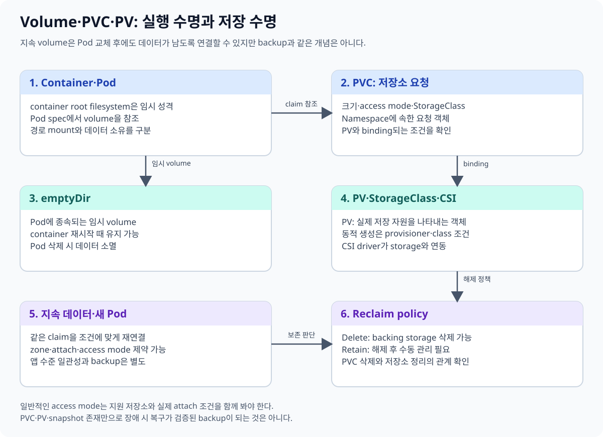
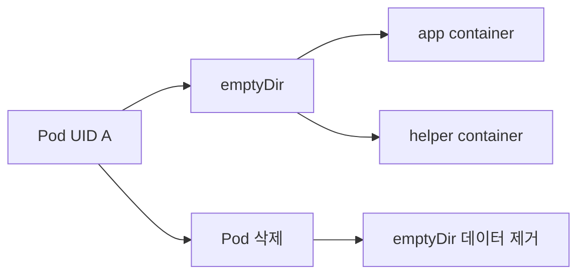
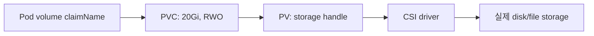
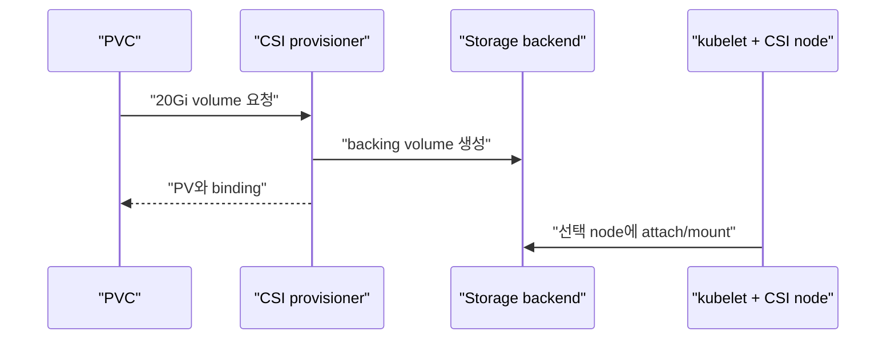

# 06. Volume과 persistent storage

[이 책 목차](README.md) · [이전: Service와 network](05-networking-services.md) · [다음: Config와 Secret](07-config-secrets.md)

Container writable layer는 container 교체와 함께 사라질 수 있다. Kubernetes storage API는 Pod가 필요한 저장 공간을 선언하고 실제 storage를 연결하지만, application consistency와 backup을 자동으로 해결하지 않는다.



## 1. emptyDir 수명

`emptyDir`는 Pod가 node에 배치될 때 만들어지고 같은 Pod의 container가 mount해 공유할 수 있다. Container 하나가 재시작되어도 남지만 Pod가 제거되면 데이터도 사라진다.



Cache, scratch, container 사이 임시 파일에 적합하다. Database 영구 데이터나 Spark streaming checkpoint를 두지 않는다. [Volumes](https://kubernetes.io/docs/concepts/storage/volumes/)를 참고한다.

## 2. PVC와 PV

**PVC(PersistentVolumeClaim)**는 namespace의 사용자가 원하는 storage 크기와 access mode를 요청하는 object다. **PV(PersistentVolume)**는 cluster가 제공하는 storage resource 표현이다.



Pod는 보통 PV 이름을 직접 고르지 않고 PVC를 참조한다. Binder와 provisioner가 조건에 맞는 PV를 연결한다.

## 3. StorageClass와 dynamic provisioning

**StorageClass**는 provisioner, parameter, reclaim policy, volume binding mode 같은 storage class를 정의한다. PVC가 class를 요청하면 external provisioner가 새 backing volume과 PV를 만들 수 있다.

```yaml
apiVersion: v1
kind: PersistentVolumeClaim
metadata:
  name: research-data
  namespace: storage-lab
spec:
  accessModes: ["ReadWriteOnce"]
  storageClassName: fast-block
  resources:
    requests:
      storage: 20Gi
```

이 manifest는 `lab13/storage-lab` 격리 환경용 실행 예시이며 여기서는 적용하지 않는다. `fast-block` class가 실제로 존재해야 binding된다. `ReadWriteOnce`는 한 node에서 read-write mount하는 access mode이며 항상 “Pod 하나만 접근”과 같지는 않다. 공식 [Persistent Volumes](https://kubernetes.io/docs/concepts/storage/persistent-volumes/)를 확인한다.

## 4. CSI

**CSI(Container Storage Interface)**는 Kubernetes와 storage driver 사이의 표준 interface다. CSI controller는 provision·attach 같은 작업을, node plugin은 node mount 같은 작업을 수행할 수 있다.



Kubernetes API가 지원해도 해당 CSI driver와 backend가 snapshot, expansion, access mode를 구현하는지 확인한다. [CSI volume types](https://kubernetes.io/docs/concepts/storage/volumes/#csi)를 참고한다.

## 5. Reclaim policy

PV의 reclaim policy는 PVC가 해제된 뒤 backing storage를 어떻게 다룰지 정한다.

| Policy | 일반 의미 | 위험 |
| --- | --- | --- |
| Delete | PV와 backing volume 삭제 시도 | PVC 삭제가 실제 데이터 삭제로 이어질 수 있음 |
| Retain | backing data를 보존하고 수동 정리 | stale volume과 비용이 남음 |

`Retain`은 backup이 아니다. 같은 disk 하나를 남길 뿐 corruption, 운영자 실수, backend 장애, ransomware에 대비한 독립 복사와 restore 검증을 제공하지 않는다.

## 6. 실행 가능한 Pod mount 예시

```yaml
apiVersion: v1
kind: Pod
metadata:
  name: data-reader
  namespace: storage-lab
spec:
  containers:
    - name: reader
      image: busybox:1.37.0
      command: ["sh", "-c", "sleep 3600"]
      volumeMounts:
        - name: data
          mountPath: /data
  volumes:
    - name: data
      persistentVolumeClaim:
        claimName: research-data
```

이 예시도 `lab13/storage-lab`에서만 실행할 수 있으며 이 문서에서는 적용하지 않는다. PVC가 Pending이면 Pod도 mount를 기다릴 수 있다.

## 7. Data consistency와 backup

Filesystem snapshot을 만들 수 있어도 database buffer가 flush되지 않았다면 application-consistent snapshot이 아닐 수 있다. Stateful workload에는 다음을 함께 설계한다.

- Application quiesce 또는 database-native backup
- Volume snapshot과 consistency group 지원 여부
- 다른 failure domain에 보관하는 backup
- 암호화 key와 credential 복구
- 실제 restore 시간과 데이터 검증

PV는 Kubernetes object이고 backing disk는 storage 시스템 resource다. API object backup과 데이터 backup을 구분한다.

## 8. 읽기 전용 진단

```text
kubectl get storageclasses
kubectl get pvc -n storage-lab
kubectl get pv
kubectl describe pvc research-data -n storage-lab
kubectl get events -n storage-lab --sort-by=.metadata.creationTimestamp
```

위 명령은 `lab13/storage-lab` 관찰 예시이며 실행하지 않았다. Pending PVC에서는 class 존재, access mode, capacity, topology, provisioner event를 확인한다.

## 9. 문제와 해설

1. Container 재시작과 Pod 삭제 중 emptyDir가 사라지는 경계는? **Pod 삭제**다.
2. PVC와 PV의 차이는? **PVC는 namespace의 요청, PV는 제공되는 storage 표현**이다.
3. `Retain`이면 backup이 끝난 것인가? **아니다.** 독립 복사와 restore 검증이 필요하다.
4. CSI driver가 없는데 StorageClass 이름만 만들면 volume이 생기는가? **아니다.** 실제 provisioner와 backend가 필요하다.

다음 장에서는 application 설정과 민감 값을 image 밖에서 주입하는 방법을 살펴본다.
