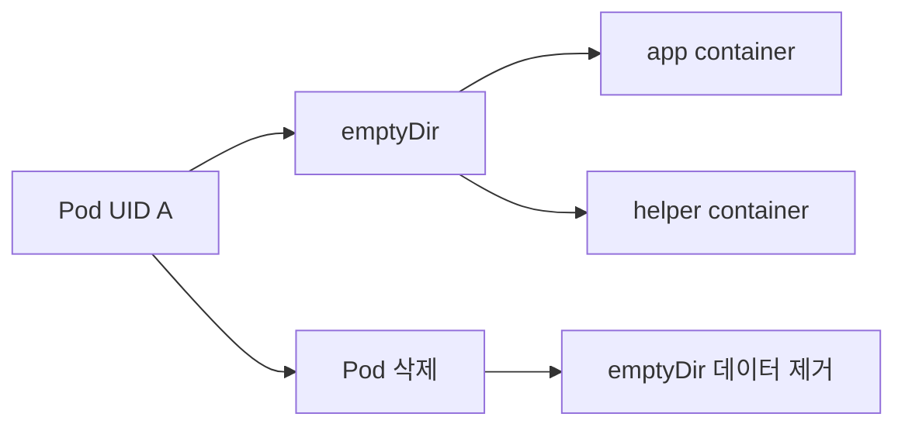
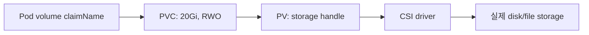
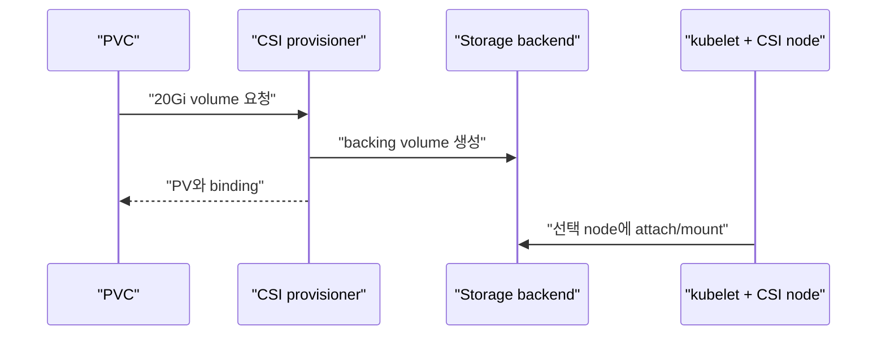
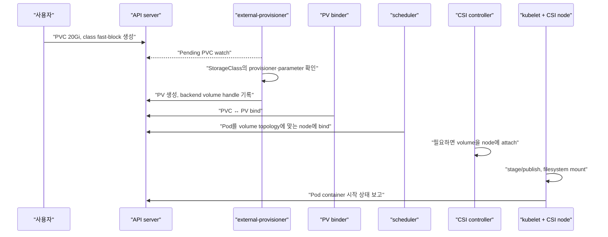

# 06. Volume과 persistent storage

[이 책 목차](README.md) · [이전: Service와 network](05-networking-services.md) · [다음: Config와 Secret](07-config-secrets.md)

Container writable layer는 container 교체와 함께 사라질 수 있다. Kubernetes storage API는 Pod가 필요한 저장 공간을 선언하고 실제 storage를 연결하지만, application consistency와 backup을 자동으로 해결하지 않는다.


## 1. emptyDir 수명

`emptyDir`는 Pod가 node에 배치될 때 만들어지고 같은 Pod의 container가 mount해 공유할 수 있다. Container 하나가 재시작되어도 남지만 Pod가 제거되면 데이터도 사라진다.



Cache, scratch, container 사이 임시 파일에 적합하다. Database 영구 데이터나 Spark streaming checkpoint를 두지 않는다. [Volumes](https://kubernetes.io/docs/concepts/storage/volumes/)를 참고한다.

## 2. PVC와 PV

**PVC(PersistentVolumeClaim)**는 namespace의 사용자가 원하는 storage 크기와 access mode를 요청하는 object다. **PV(PersistentVolume)**는 cluster가 제공하는 storage resource 표현이다.



Pod는 보통 PV 이름을 직접 고르지 않고 PVC를 참조한다. Binder와 provisioner가 조건에 맞는 PV를 연결한다.

## 3. StorageClass와 dynamic provisioning

**StorageClass**는 provisioner, parameter, reclaim policy, volume binding mode 같은 storage class를 정의한다. PVC가 class를 요청하면 external provisioner가 새 backing volume과 PV를 만들 수 있다.

```yaml
apiVersion: v1
kind: PersistentVolumeClaim
metadata:
  name: research-data
  namespace: storage-lab
spec:
  accessModes: ["ReadWriteOnce"]
  storageClassName: fast-block
  resources:
    requests:
      storage: 20Gi
```

이 manifest는 `lab13/storage-lab` 격리 환경용 실행 예시이며 여기서는 적용하지 않는다. `fast-block` class가 실제로 존재해야 binding된다. `ReadWriteOnce`는 한 node에서 read-write mount하는 access mode이며 항상 “Pod 하나만 접근”과 같지는 않다. 공식 [Persistent Volumes](https://kubernetes.io/docs/concepts/storage/persistent-volumes/)를 확인한다.

## 4. CSI

**CSI(Container Storage Interface)**는 Kubernetes와 storage driver 사이의 표준 interface다. CSI controller는 provision·attach 같은 작업을, node plugin은 node mount 같은 작업을 수행할 수 있다.



Kubernetes API가 지원해도 해당 CSI driver와 backend가 snapshot, expansion, access mode를 구현하는지 확인한다. [CSI volume types](https://kubernetes.io/docs/concepts/storage/volumes/#csi)를 참고한다.

## 5. Reclaim policy

PV의 reclaim policy는 PVC가 해제된 뒤 backing storage를 어떻게 다룰지 정한다.

| Policy | 일반 의미 | 위험 |
| --- | --- | --- |
| Delete | PV와 backing volume 삭제 시도 | PVC 삭제가 실제 데이터 삭제로 이어질 수 있음 |
| Retain | backing data를 보존하고 수동 정리 | stale volume과 비용이 남음 |

`Retain`은 backup이 아니다. 같은 disk 하나를 남길 뿐 corruption, 운영자 실수, backend 장애, ransomware에 대비한 독립 복사와 restore 검증을 제공하지 않는다.

## 6. 실행 가능한 Pod mount 예시

```yaml
apiVersion: v1
kind: Pod
metadata:
  name: data-reader
  namespace: storage-lab
spec:
  containers:
    - name: reader
      image: busybox:1.37.0
      command: ["sh", "-c", "sleep 3600"]
      volumeMounts:
        - name: data
          mountPath: /data
  volumes:
    - name: data
      persistentVolumeClaim:
        claimName: research-data
```

이 예시도 `lab13/storage-lab`에서만 실행할 수 있으며 이 문서에서는 적용하지 않는다. PVC가 Pending이면 Pod도 mount를 기다릴 수 있다.

## 7. Data consistency와 backup

Filesystem snapshot을 만들 수 있어도 database buffer가 flush되지 않았다면 application-consistent snapshot이 아닐 수 있다. Stateful workload에는 다음을 함께 설계한다.

- Application quiesce 또는 database-native backup
- Volume snapshot과 consistency group 지원 여부
- 다른 failure domain에 보관하는 backup
- 암호화 key와 credential 복구
- 실제 restore 시간과 데이터 검증

PV는 Kubernetes object이고 backing disk는 storage 시스템 resource다. API object backup과 데이터 backup을 구분한다.

## 8. 읽기 전용 진단

```text
kubectl get storageclasses
kubectl get pvc -n storage-lab
kubectl get pv
kubectl describe pvc research-data -n storage-lab
kubectl get events -n storage-lab --sort-by=.metadata.creationTimestamp
```

위 명령은 `lab13/storage-lab` 관찰 예시이며 실행하지 않았다. Pending PVC에서는 class 존재, access mode, capacity, topology, provisioner event를 확인한다.

## 9. PVC가 Pending에서 Pod mount까지 가는 상태 전이

PVC를 만들었다고 kubelet이 즉시 disk를 mount하는 것은 아니다. 여러 controller와 CSI component가 서로 다른 object와 backend 상태를 바꾼다.



각 화살표가 바꾸는 대상이 다르다.

| 단계 | 주체 | 바뀌는 object·resource | 멈췄을 때 먼저 볼 것 |
| --- | --- | --- | --- |
| Provision | CSI external-provisioner와 backend | backing volume, PV | StorageClass provisioner 이름, provisioner log·event, quota |
| Bind | persistent volume controller | PV `claimRef`, PVC `volumeName`, phase | size, access mode, class, selector |
| Schedule | scheduler | Pod `spec.nodeName` | volume topology, node affinity, request·taint |
| Attach | attach/detach controller와 CSI controller | VolumeAttachment, backend attachment | zone 일치, attach limit, credential |
| Mount | kubelet과 CSI node plugin | node mount와 container mount namespace | device, filesystem, node plugin event |

PVC phase가 `Bound`여도 Pod가 `Running`이라는 뜻은 아니다. PV와 claim의 API binding만 끝났고 attach 또는 mount가 실패할 수 있다. 반대로 Pod가 Pending일 때 scheduler 문제만 찾으면, 실제 원인이 unbound PVC일 수 있다.

## 10. `Immediate`와 `WaitForFirstConsumer`

Zone에 묶인 block volume에서는 PV를 어느 zone에 만들지와 Pod를 어느 zone에 놓을지를 함께 결정해야 한다. StorageClass의 `volumeBindingMode`가 이 순서를 바꾼다.

```text
Immediate
PVC 생성 → volume을 zone-a에 먼저 생성 → Pod는 zone-a 후보만 사용

WaitForFirstConsumer
PVC는 잠시 Pending → scheduler가 Pod 요구와 후보 zone 계산
→ 선택 topology에 volume provision → Pod와 volume을 같은 zone에 배치
```

다음 StorageClass는 구조를 보여 주는 교육용 예시이며 실제 provisioner와 parameter가 없는 상태로 적용하지 않는다.

```yaml
apiVersion: storage.k8s.io/v1
kind: StorageClass
metadata:
  name: zonal-block
provisioner: csi.example.invalid
volumeBindingMode: WaitForFirstConsumer
reclaimPolicy: Delete
allowVolumeExpansion: true
```

`WaitForFirstConsumer`에서 PVC가 Pending인 것은 항상 장애가 아니다. 그 claim을 쓰는 Pod가 생겨 scheduler가 topology를 선택할 때까지 의도적으로 기다릴 수 있다. 다만 Pod가 이미 있는데도 계속 Pending이면 Pod affinity, available zone, storage capacity와 provisioner event를 같이 본다.

예를 들어 Pod가 `zone-b` required affinity를 갖고 StorageClass backend가 `zone-a`만 지원하면 후보 교집합이 없다. Claim size를 줄여도 zone 모순은 해결되지 않는다. 반대로 `Immediate`로 zone-a PV를 먼저 만들고 나중에 Pod를 zone-b에 고정하면 volume node affinity conflict가 생길 수 있다.

## 11. RWO와 RWOP는 같은 뜻이 아니다

Access mode는 storage가 허용하는 mount 방식이며 application 수준 동시 쓰기 안전성을 보장하지 않는다.

| Mode | 의미 | 흔한 오해 |
| --- | --- | --- |
| `ReadWriteOnce` (RWO) | 한 node에서 read-write로 mount 가능 | Pod가 정확히 하나만 쓸 수 있다는 뜻은 아님 |
| `ReadOnlyMany` (ROX) | 여러 node에서 read-only mount 가능 | Application cache가 자동 일관된다는 뜻 아님 |
| `ReadWriteMany` (RWX) | 여러 node에서 read-write mount 가능 | 여러 writer의 file locking·transaction을 자동 보장하지 않음 |
| `ReadWriteOncePod` (RWOP) | cluster에서 단일 Pod의 read-write 사용을 강하게 제한하도록 설계 | 모든 driver·기존 volume에서 자동 지원되는 것은 아님 |

RWO volume을 mount한 node 한 대에 같은 claim을 참조하는 Pod 두 개가 함께 배치되면 둘 다 접근 가능한 storage 구현이 있을 수 있다. “replica 2개지만 RWO니까 writer는 하나”라는 설계는 안전하지 않다. 단일 Pod 접근이 Kubernetes storage 계층의 요구라면 CSI 지원 조건을 확인하고 RWOP를 검토한다. 그래도 process가 두 개이거나 application이 잘못된 lock을 쓰는 문제까지 해결하지 않는다.

다음은 RWOP claim 형태를 보여 주는 교육용 manifest다. 실제 적용 전 cluster의 CSI driver가 이 mode를 지원하는지 확인해야 하며 여기서는 적용하지 않는다.

```yaml
apiVersion: v1
kind: PersistentVolumeClaim
metadata:
  name: single-writer-data
  namespace: storage-lab
spec:
  accessModes:
    - ReadWriteOncePod
  storageClassName: fast-block
  resources:
    requests:
      storage: 20Gi
```

RWOP claim을 쓰는 기존 Pod가 정상 종료되지 않았거나 attachment·mount 정리가 끝나지 않으면 새 Pod가 바로 시작하지 못할 수 있다. 이는 단일 사용 제약이 작동한 결과일 수 있다. 가용성이 더 중요하다고 같은 disk를 강제 detach하기 전에 node가 실제로 죽었는지, 기존 writer가 남아 있는지와 backend fencing을 확인한다.

## 12. 완전한 진단 사례: Pending PVC에서 mount 실패까지

다음은 실제 실행 기록이 아닌 예상 관찰이다.

```text
09:00 PVC research-data 생성 → phase Pending
09:01 Event: storageclass.storage.k8s.io "fast-block" not found
09:05 StorageClass 생성 → provisioner가 PV pv-42와 backend vol-42 생성
09:06 PVC Bound, Pod는 worker-b에 schedule
09:07 Event: FailedAttachVolume, volume은 zone-a이고 worker-b는 zone-b
09:10 node affinity를 zone-a로 수정한 새 Pod가 worker-a에 schedule
09:11 attach 성공, kubelet mount, container 시작
```

첫 번째 원인은 class 부재라서 claim이 없었고, 두 번째 원인은 topology라서 claim은 이미 Bound였다. 같은 `Pending` 또는 `ContainerCreating` 화면이라도 object phase와 event 시각을 연결해야 원인이 달라진다. 최종적으로 Pod가 시작해도 filesystem 권한, fsGroup, application path 오류가 남을 수 있으므로 container log와 mount path도 확인한다.

## 13. 문제와 해설

1. Container 재시작과 Pod 삭제 중 emptyDir가 사라지는 경계는? **Pod 삭제**다.
2. PVC와 PV의 차이는? **PVC는 namespace의 요청, PV는 제공되는 storage 표현**이다.
3. `Retain`이면 backup이 끝난 것인가? **아니다.** 독립 복사와 restore 검증이 필요하다.
4. CSI driver가 없는데 StorageClass 이름만 만들면 volume이 생기는가? **아니다.** 실제 provisioner와 backend가 필요하다.

다음 장에서는 application 설정과 민감 값을 image 밖에서 주입하는 방법을 살펴본다.
