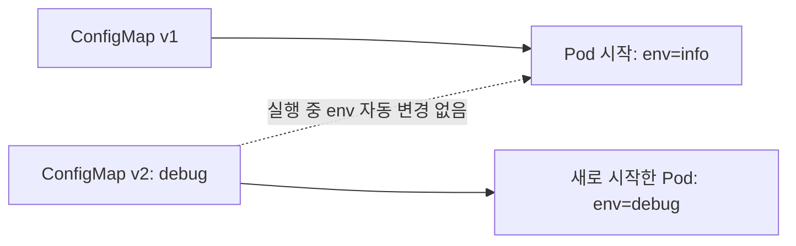
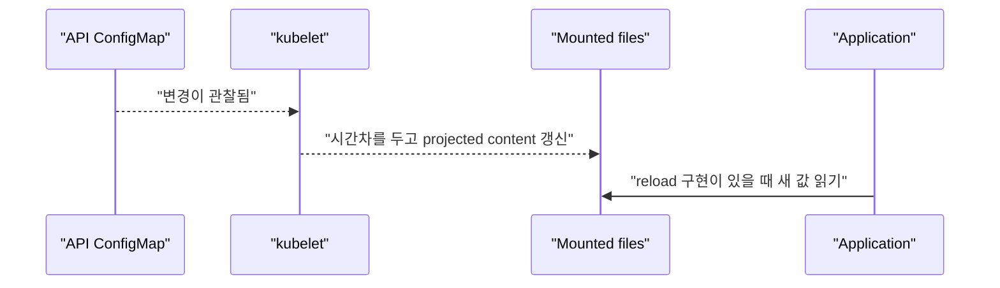
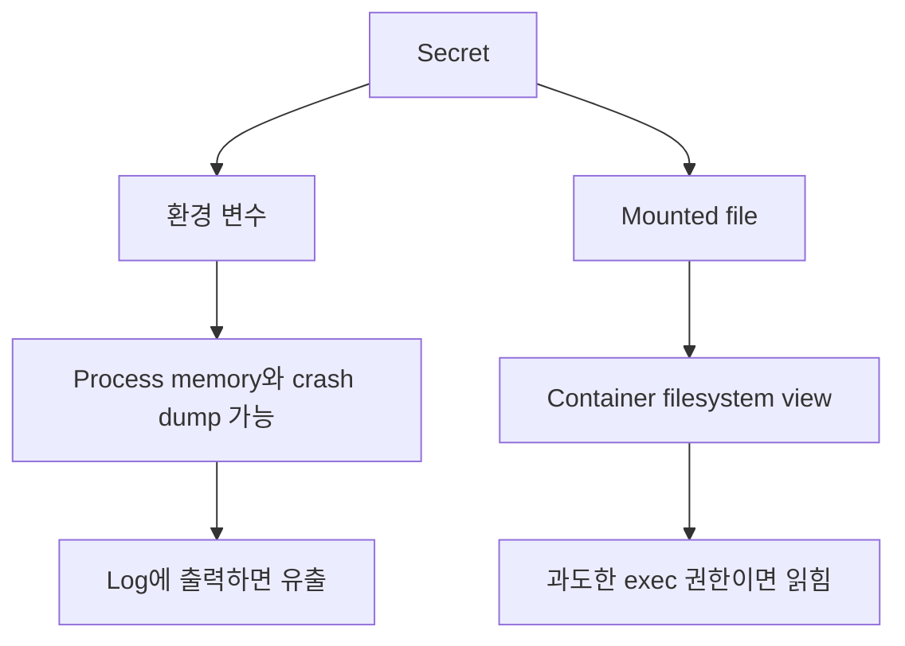
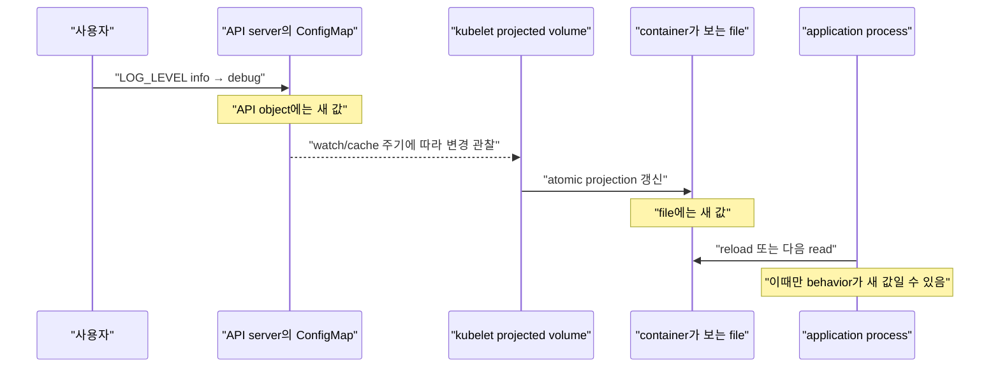

# 07. ConfigMap과 Secret

[이 책 목차](README.md) · [이전: Storage](06-storage.md) · [다음: 자원과 스케줄링](08-resources-scheduling.md)

Image를 환경마다 다시 build하지 않으려면 실행 설정을 image 밖에서 전달해야 한다. Kubernetes는 일반 설정에는 ConfigMap, 민감 값에는 Secret API를 제공한다. 둘 다 application이 변경을 읽고 적용하는 방식까지 자동 결정하지 않는다.

## 1. ConfigMap

**ConfigMap**은 key/value 설정이나 작은 설정 파일을 저장하는 namespace object다. 비밀번호를 넣는 보안 저장소가 아니다.

```yaml
apiVersion: v1
kind: ConfigMap
metadata:
  name: api-config
  namespace: config-lab
data:
  LOG_LEVEL: info
  application.yaml: |
    server:
      port: 8080
    featureX: false
```

이 manifest는 `lab13/config-lab` 격리 환경의 실행 예시이며 여기서는 적용하지 않는다. Object size와 update 빈도를 고려하고 큰 model·dataset은 object storage나 volume을 사용한다. 공식 [ConfigMaps](https://kubernetes.io/docs/concepts/configuration/configmap/)를 참고한다.

## 2. 환경 변수로 주입

```yaml
env:
  - name: LOG_LEVEL
    valueFrom:
      configMapKeyRef:
        name: api-config
        key: LOG_LEVEL
```

이 조각은 container spec 안에 넣는 실행 가능한 예시이며 단독 manifest가 아니다. 환경 변수는 process 시작 때 만들어진다. ConfigMap을 나중에 바꿔도 이미 실행 중인 process 환경 변수가 갱신되지 않으므로 Pod rollout이 필요하다.



## 3. Volume file로 mount

ConfigMap을 projected file로 mount하면 kubelet이 변경을 나중에 반영할 수 있다. 반영은 즉시 실시간이 아니며 application이 파일을 다시 읽어야 한다. `subPath` mount는 자동 update를 받지 않는 제약도 있다.

```yaml
volumeMounts:
  - name: config
    mountPath: /etc/research
    readOnly: true
volumes:
  - name: config
    configMap:
      name: api-config
```



Application이 시작 때 한 번만 읽으면 file이 바뀌어도 behavior는 바뀌지 않는다. Reload signal, file watch, explicit rollout 중 한 방식을 정한다.

## 4. Secret

**Secret**은 password, token, key 같은 민감 값을 API로 전달하기 위한 object다. `data`는 base64 encoding이며 암호화가 아니다. 예시는 가짜 값만 사용한다.

```yaml
apiVersion: v1
kind: Secret
metadata:
  name: fake-db-credential
  namespace: config-lab
type: Opaque
stringData:
  username: fake-user
  password: fake-password-never-use
```

이 실행 예시는 `lab13/config-lab` 교육용이고 적용하지 않는다. 실제 secret을 Git, 문서, shell history에 넣지 않는다. TLS, etcd at-rest encryption, RBAC 최소 권한, 외부 secret manager, rotation을 함께 사용한다. [Secrets](https://kubernetes.io/docs/concepts/configuration/secret/)와 [Secrets good practices](https://kubernetes.io/docs/concepts/security/secrets-good-practices/)를 본다.

## 5. Secret 노출 경로



다음 원칙을 지킨다.

- Secret 값을 command argument에 넣어 process listing에 노출하지 않는다.
- Application 시작 log에 전체 environment를 출력하지 않는다.
- Error message, metric label, trace attribute에 credential을 넣지 않는다.
- Secret read RBAC와 `pods/exec` 권한을 제한한다.
- Rotation 때 새 값과 이전 값이 겹쳐 동작할 기간을 설계한다.

## 6. Immutable과 rollout

ConfigMap과 Secret은 `immutable: true`로 고정할 수 있다. 실수로 내용을 바꾸는 것을 막고 watch 부하를 줄일 수 있지만 변경하려면 새 object 이름을 만들고 Pod reference를 바꿔야 한다.

```text
api-config-v17 → Deployment template 참조
api-config-v18 → 새 설정 배포 시 template 변경 → rollout
```

이름이나 content hash를 Pod template annotation에 반영하면 설정 변경이 rollout revision으로 추적된다. Helm/Kustomize가 자동으로 어떤 hash를 만드는지는 template 구현을 확인한다.

## 7. 읽기 전용 확인

```text
kubectl get configmaps -n config-lab
kubectl describe configmap api-config -n config-lab
kubectl get pods -n config-lab
kubectl auth can-i get secrets -n config-lab
```

위 명령은 `lab13/config-lab` 읽기 전용 예시이며 실행하지 않았다. 실제 Secret 값을 출력하는 `get secret -o yaml`을 일상 점검 명령으로 사용하지 않는다.

## 8. API의 새 값, 파일의 새 값, process의 새 값

“ConfigMap을 변경했다”는 말은 서로 다른 세 상태를 구분해야 한다.



API server에서 `resourceVersion`이 바뀌었다고 Pod 안의 file이 즉시 바뀌었다는 뜻은 아니다. File이 바뀌었다고 application memory의 parsed configuration이 바뀌었다는 뜻도 아니다. Application이 매 요청마다 파일을 읽는지, file watch로 reload하는지, SIGHUP을 받는지, 시작 때 한 번만 읽는지를 문서화한다.

| 주입 방식 | object 변경 뒤 container view | process가 새 값을 쓰는 조건 |
| --- | --- | --- |
| `env`/`envFrom` | 기존 process environment는 그대로 | 새 container process 시작 |
| ConfigMap/Secret volume | 전파 지연 뒤 projected file 갱신 가능 | application이 file을 다시 읽거나 reload |
| `subPath` file mount | 실행 중 자동 갱신되지 않음 | 새 Pod/container와 mount 필요 |
| API를 application이 직접 watch | client가 새 object event를 받을 수 있음 | watch 재연결, validation, application reload 구현 |

환경 변수는 `/proc`이나 crash dump, debug endpoint를 통해 노출될 수 있고 process 전체 수명 동안 남는다. Volume file은 filesystem permission으로 접근을 좁힐 수 있지만 `pods/exec` 권한이 넓으면 여전히 읽힐 수 있다. 보안 요구와 reload 요구를 함께 보고 방식을 고른다.

## 9. `subPath`가 갱신을 받지 않는 이유를 읽는 법

Projected ConfigMap volume은 kubelet이 관리하는 directory tree를 새 content로 전환하는 방식으로 갱신될 수 있다. `subPath`는 그 directory 안의 특정 항목을 container path에 별도로 bind mount한다. 이미 잡힌 mount가 새 projection tree로 따라가지 않으므로 자동 갱신을 기대할 수 없다.

```yaml
volumeMounts:
  - name: config
    mountPath: /etc/research/application.yaml
    subPath: application.yaml
    readOnly: true
volumes:
  - name: config
    configMap:
      name: api-config
```

이 조각은 container와 Pod spec에 넣는 교육용 예시이며 단독 manifest로 적용하지 않는다. 기존 image의 `/etc/research` directory 전체를 덮지 않고 파일 하나만 넣는 장점이 있지만, hot reload가 필요하면 부적합하다.

반례로 directory 전체를 mount했더라도 application이 startup 때 YAML을 한 번 parse해 object로 보관하면 behavior는 바뀌지 않는다. 반대로 application이 매 요청마다 file을 읽으면 새 값은 반영될 수 있지만 잘못된 중간 configuration, 성능 비용, 여러 replica가 서로 다른 시각에 갱신되는 문제를 처리해야 한다.

## 10. 설정 rollout을 명시적 상태 전이로 만들기

많은 application은 설정 object 이름 또는 content hash를 Pod template에 넣어 새 ReplicaSet rollout을 일으킨다.

```yaml
apiVersion: apps/v1
kind: Deployment
metadata:
  name: api
  namespace: config-lab
spec:
  replicas: 2
  selector:
    matchLabels:
      app: api
  template:
    metadata:
      labels:
        app: api
      annotations:
        example.org/config-revision: "api-config-v18"
    spec:
      containers:
        - name: api
          image: registry.example/research-api:1.4.0
          envFrom:
            - configMapRef:
                name: api-config-v18
```

이 manifest는 image와 ConfigMap이 실제 존재하지 않는 교육용 예시이며 적용하지 않는다. Template annotation이나 reference가 바뀌면 새 Pod가 만들어져 env를 다시 구성한다. Rollout history에서 어느 config revision을 사용했는지 찾기도 쉽다.

다만 replica가 두 개면 rollout 동안 v17 process와 v18 process가 잠시 함께 요청을 처리할 수 있다. 새 설정이 protocol이나 database schema와 호환되지 않으면 단순 rollout도 장애를 만든다. 설정을 backward-compatible하게 만들고 readiness에서 필수 dependency를 검증하며, secret rotation은 old/new credential overlap 기간을 둔다.

## 11. 변경 후 확인 시간표

다음은 실제 실행 결과가 아니라 volume projection과 application reload를 구분하기 위한 예상 시간표다.

```text
14:00:00 ConfigMap API update 완료
14:00:03 Pod A의 application은 여전히 info (env 주입)
14:00:20 Pod B의 mounted file은 debug, process cache는 info
14:00:22 Pod C는 subPath file도 여전히 info
14:01:00 Deployment rollout로 새 Pod D 시작, env=debug
14:01:15 Pod B에 reload signal 전달, process behavior=debug
```

이 결과에서 “cluster 설정이 반만 적용됐다”라고만 기록하면 원인을 잃는다. Pod별로 주입 방식, file content, process가 보고한 effective configuration, Pod 시작 시각을 함께 본다. Secret은 값을 log에 출력하지 말고 version 또는 checksum처럼 원문을 드러내지 않는 식별자를 사용한다.

## 12. 문제와 해설

1. ConfigMap 환경 변수는 object 변경 뒤 실행 중 process에 갱신되는가? **아니다.** 새 process가 필요하다.
2. Volume mount ConfigMap 변경은 application behavior를 즉시 바꾸는가? **아니다.** 전파 지연과 application reload가 있다.
3. Secret base64는 암호화인가? **아니다.** encoding이다.
4. Secret rotation은 새 값을 쓰기만 하면 끝인가? **아니다.** consumer reload, overlap, revoke와 검증이 필요하다.

다음 장에서는 CPU·memory request가 scheduler와 runtime에서 어떻게 다르게 쓰이는지 계산한다.
