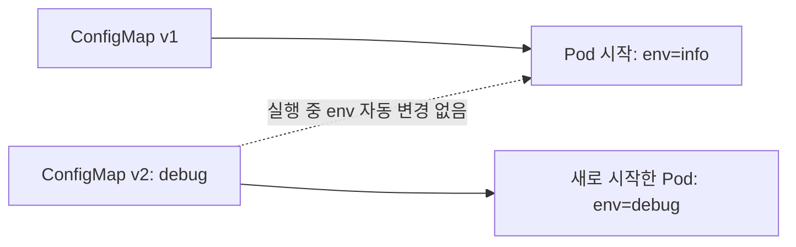
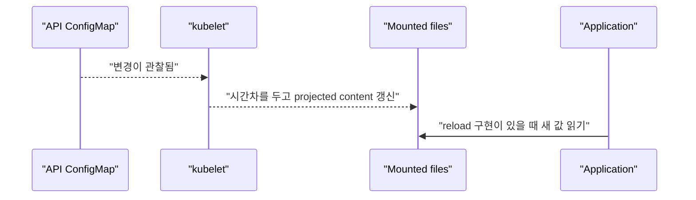
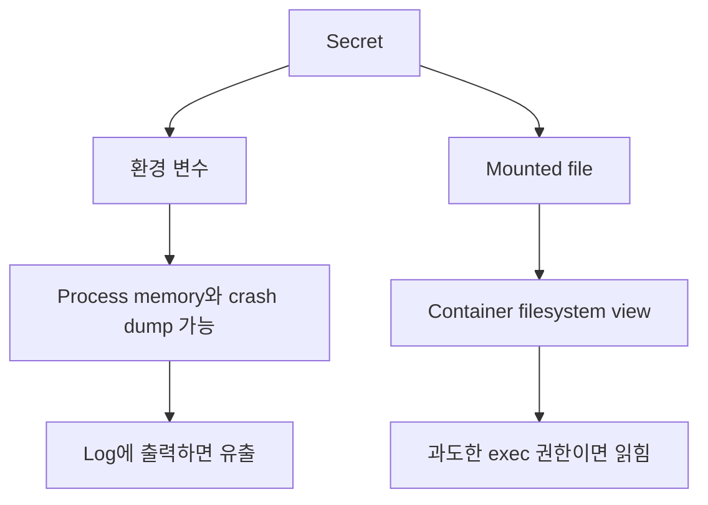

# 07. ConfigMap과 Secret

[이 책 목차](README.md) · [이전: Storage](06-storage.md) · [다음: 자원과 스케줄링](08-resources-scheduling.md)

Image를 환경마다 다시 build하지 않으려면 실행 설정을 image 밖에서 전달해야 한다. Kubernetes는 일반 설정에는 ConfigMap, 민감 값에는 Secret API를 제공한다. 둘 다 application이 변경을 읽고 적용하는 방식까지 자동 결정하지 않는다.

## 1. ConfigMap

**ConfigMap**은 key/value 설정이나 작은 설정 파일을 저장하는 namespace object다. 비밀번호를 넣는 보안 저장소가 아니다.

```yaml
apiVersion: v1
kind: ConfigMap
metadata:
  name: api-config
  namespace: config-lab
data:
  LOG_LEVEL: info
  application.yaml: |
    server:
      port: 8080
    featureX: false
```

이 manifest는 `lab13/config-lab` 격리 환경의 실행 예시이며 여기서는 적용하지 않는다. Object size와 update 빈도를 고려하고 큰 model·dataset은 object storage나 volume을 사용한다. 공식 [ConfigMaps](https://kubernetes.io/docs/concepts/configuration/configmap/)를 참고한다.

## 2. 환경 변수로 주입

```yaml
env:
  - name: LOG_LEVEL
    valueFrom:
      configMapKeyRef:
        name: api-config
        key: LOG_LEVEL
```

이 조각은 container spec 안에 넣는 실행 가능한 예시이며 단독 manifest가 아니다. 환경 변수는 process 시작 때 만들어진다. ConfigMap을 나중에 바꿔도 이미 실행 중인 process 환경 변수가 갱신되지 않으므로 Pod rollout이 필요하다.



## 3. Volume file로 mount

ConfigMap을 projected file로 mount하면 kubelet이 변경을 나중에 반영할 수 있다. 반영은 즉시 실시간이 아니며 application이 파일을 다시 읽어야 한다. `subPath` mount는 자동 update를 받지 않는 제약도 있다.

```yaml
volumeMounts:
  - name: config
    mountPath: /etc/research
    readOnly: true
volumes:
  - name: config
    configMap:
      name: api-config
```



Application이 시작 때 한 번만 읽으면 file이 바뀌어도 behavior는 바뀌지 않는다. Reload signal, file watch, explicit rollout 중 한 방식을 정한다.

## 4. Secret

**Secret**은 password, token, key 같은 민감 값을 API로 전달하기 위한 object다. `data`는 base64 encoding이며 암호화가 아니다. 예시는 가짜 값만 사용한다.

```yaml
apiVersion: v1
kind: Secret
metadata:
  name: fake-db-credential
  namespace: config-lab
type: Opaque
stringData:
  username: fake-user
  password: fake-password-never-use
```

이 실행 예시는 `lab13/config-lab` 교육용이고 적용하지 않는다. 실제 secret을 Git, 문서, shell history에 넣지 않는다. TLS, etcd at-rest encryption, RBAC 최소 권한, 외부 secret manager, rotation을 함께 사용한다. [Secrets](https://kubernetes.io/docs/concepts/configuration/secret/)와 [Secrets good practices](https://kubernetes.io/docs/concepts/security/secrets-good-practices/)를 본다.

## 5. Secret 노출 경로



다음 원칙을 지킨다.

- Secret 값을 command argument에 넣어 process listing에 노출하지 않는다.
- Application 시작 log에 전체 environment를 출력하지 않는다.
- Error message, metric label, trace attribute에 credential을 넣지 않는다.
- Secret read RBAC와 `pods/exec` 권한을 제한한다.
- Rotation 때 새 값과 이전 값이 겹쳐 동작할 기간을 설계한다.

## 6. Immutable과 rollout

ConfigMap과 Secret은 `immutable: true`로 고정할 수 있다. 실수로 내용을 바꾸는 것을 막고 watch 부하를 줄일 수 있지만 변경하려면 새 object 이름을 만들고 Pod reference를 바꿔야 한다.

```text
api-config-v17 → Deployment template 참조
api-config-v18 → 새 설정 배포 시 template 변경 → rollout
```

이름이나 content hash를 Pod template annotation에 반영하면 설정 변경이 rollout revision으로 추적된다. Helm/Kustomize가 자동으로 어떤 hash를 만드는지는 template 구현을 확인한다.

## 7. 읽기 전용 확인

```text
kubectl get configmaps -n config-lab
kubectl describe configmap api-config -n config-lab
kubectl get pods -n config-lab
kubectl auth can-i get secrets -n config-lab
```

위 명령은 `lab13/config-lab` 읽기 전용 예시이며 실행하지 않았다. 실제 Secret 값을 출력하는 `get secret -o yaml`을 일상 점검 명령으로 사용하지 않는다.

## 8. 문제와 해설

1. ConfigMap 환경 변수는 object 변경 뒤 실행 중 process에 갱신되는가? **아니다.** 새 process가 필요하다.
2. Volume mount ConfigMap 변경은 application behavior를 즉시 바꾸는가? **아니다.** 전파 지연과 application reload가 있다.
3. Secret base64는 암호화인가? **아니다.** encoding이다.
4. Secret rotation은 새 값을 쓰기만 하면 끝인가? **아니다.** consumer reload, overlap, revoke와 검증이 필요하다.

다음 장에서는 CPU·memory request가 scheduler와 runtime에서 어떻게 다르게 쓰이는지 계산한다.
