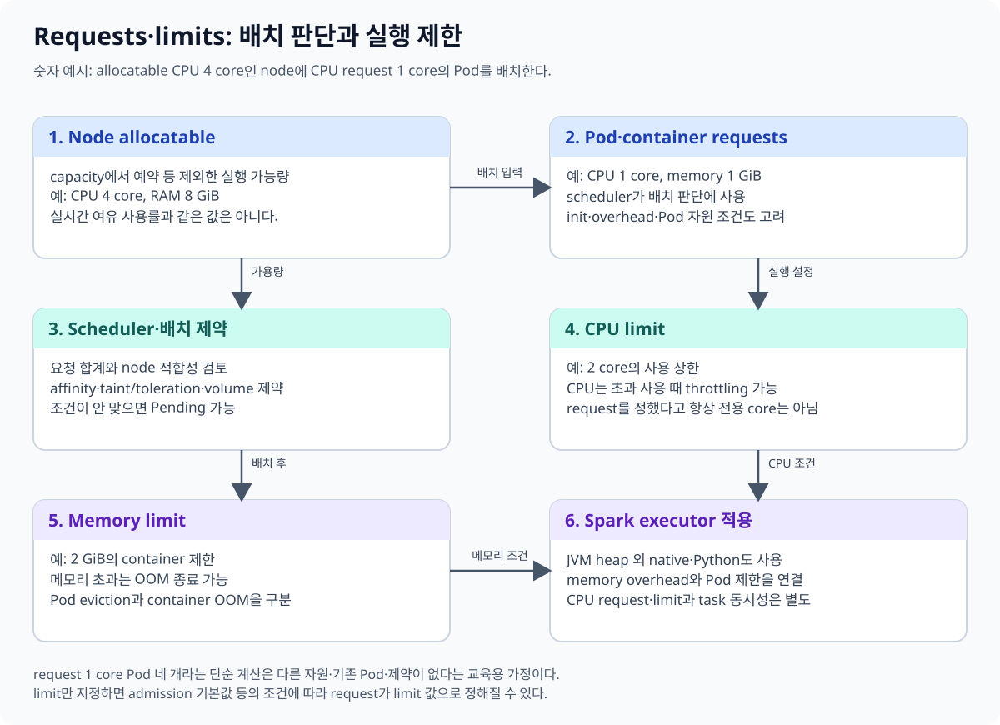
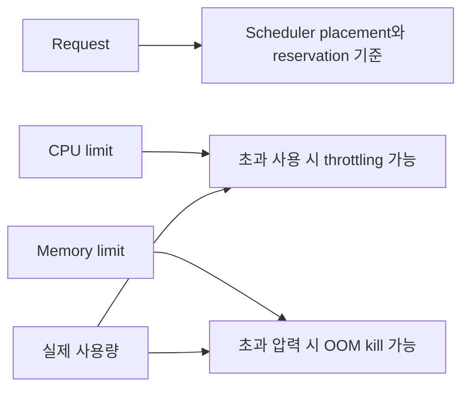
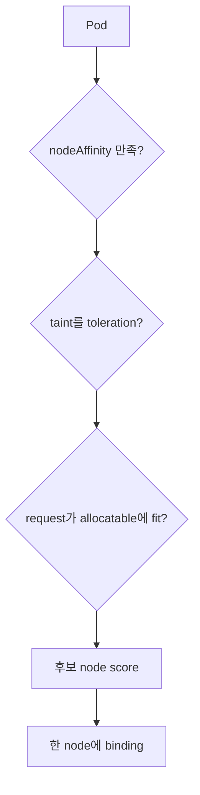
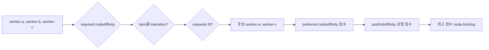

# 08. 자원과 스케줄링

[이 책 목차](README.md) · [이전: Config와 Secret](07-config-secrets.md) · [다음: Health check와 rollout](09-health-and-rollouts.md)

Scheduler는 실제 순간 사용량이 아니라 주로 resource **request**를 보고 Pod를 배치한다. Runtime은 **limit**과 node pressure를 통해 사용을 제한한다. 두 숫자를 같다고 생각하면 Pending, throttling, OOM을 해석하기 어렵다.



## 1. CPU 단위

Kubernetes CPU `1`은 vCPU/core 하나에 해당하는 계산 단위다. `1000m`은 `1`, `250m`은 `0.25` CPU다.

```text
Node allocatable CPU = 8 cores = 8000m
이미 배치된 request 합 = 6200m
새 Pod request = 2000m
6200m + 2000m > 8000m → 이 node에는 fit하지 않음
```

실제 CPU 사용이 지금 1 core뿐이어도 request 합으로 fit을 판단할 수 있다. `capacity`에서 system 예약 등을 뺀 scheduler 사용 가능 값이 **allocatable**이다.

## 2. Memory 단위

`Mi`, `Gi`는 binary 단위다. `400m` memory는 0.4 byte를 뜻하는 실수이므로 CPU milli와 혼동하지 않는다.

```yaml
resources:
  requests:
    cpu: 500m
    memory: 512Mi
  limits:
    cpu: "2"
    memory: 1Gi
```

이 조각은 container spec 안의 실행 가능한 예시이며 단독 manifest가 아니다. `lab13/resource-lab` 격리 실습에서만 사용하고 여기서는 적용하지 않는다. 공식 [Resource Management](https://kubernetes.io/docs/concepts/configuration/manage-resources-containers/)를 참고한다.

## 3. Request와 limit



CPU는 compressible resource라 limit에 닿으면 process가 느려질 수 있다. Memory는 압축해 시간을 나누기 어려워 cgroup limit이나 node pressure에서 process가 OOM kill될 수 있다. Limit을 높였다고 request도 자동으로 같아지는지 여부는 namespace LimitRange와 defaulting을 확인한다.

## 4. 실제 숫자 예시

API Pod 6개가 각각 request `500m`, `512Mi`라면 scheduler 관점 합은 CPU 3 cores, memory 3Gi다. Limit이 각각 2 CPU, 1Gi여도 scheduler가 12 CPU를 예약하는 것은 아니다.

```text
requests: 6 × 500m = 3000m, 6 × 512Mi = 3072Mi
limits:   6 × 2 = 12 CPU, 6 × 1Gi = 6Gi
```

여러 Pod가 limit까지 동시에 burst하면 node에 pressure가 생길 수 있다. Request를 지나치게 낮춰 overcommit하면 scheduler는 fit으로 판단해도 runtime 안정성이 나빠진다.

## 5. QoS class

| QoS | 대표 조건 | Pressure 시 의미 |
| --- | --- | --- |
| Guaranteed | 모든 container CPU·memory request=limit | 상대적으로 강한 보호 |
| Burstable | request/limit 일부 설정, Guaranteed 아님 | 사용량과 request 등을 고려 |
| BestEffort | CPU·memory request/limit 없음 | 먼저 eviction될 가능성이 큼 |

QoS만으로 절대 eviction 순서를 단정하지 않는다. Node pressure 종류, 실제 사용, priority도 관여한다. [Pod Quality of Service](https://kubernetes.io/docs/concepts/workloads/pods/pod-qos/)를 참고한다.

## 6. Affinity와 node 선택

**nodeSelector/node affinity**는 Pod가 어떤 node label에 배치될 수 있는지 표현한다. **Pod affinity/anti-affinity**는 다른 Pod label과 topology 관계를 표현한다.



Preferred affinity는 선호이며 보장이 아니다. Required affinity는 후보를 제거해 Pending을 만들 수 있다. Label이 실제 hardware와 맞게 유지되는지도 별도 관리한다.

## 7. Taint와 toleration

Taint는 node가 특정 Pod를 밀어내는 조건이고 toleration은 Pod가 그 taint를 **견딜 수 있음**을 나타낸다.

```yaml
tolerations:
  - key: dedicated
    operator: Equal
    value: research
    effect: NoSchedule
```

이 조각도 Pod spec 예시이며 적용하지 않는다. Toleration은 해당 node로 반드시 배치한다는 placement 지시가 아니다. 전용 node에 보내려면 node affinity와 함께 사용한다. [Taints and Tolerations](https://kubernetes.io/docs/concepts/scheduling-eviction/taint-and-toleration/)을 본다.

## 8. Priority와 preemption

PriorityClass가 높은 Pending Pod를 배치하기 위해 scheduler가 낮은 priority Pod를 preempt할 수 있다. 이는 application data를 안전하게 이동하거나 PDB를 모든 상황에서 지켜 준다는 뜻이 아니다. Priority를 모든 workload에 과도하게 높이면 우선순위 의미가 사라진다.

## 9. 읽기 전용 진단

```text
kubectl get nodes
kubectl describe node worker-a
kubectl get pods -n resource-lab -o wide
kubectl describe pod api-0 -n resource-lab
kubectl top pods -n resource-lab
```

위 명령은 `lab13/resource-lab` 예시이며 실행하지 않았다. `kubectl top`은 metrics API가 있어야 한다. Pending event에서 `Insufficient cpu`, affinity, taint 이유를 확인하고 limit만 임의로 올리지 않는다.

## 10. 두 node에서 scheduler 후보가 줄어드는 계산

다음 cluster는 두 node가 모두 capacity 4 CPU, 8Gi지만 system 예약 때문에 allocatable이 다르다. Scheduler는 allocatable에서 이미 배치된 Pod의 request 합을 빼고 새 Pod가 fit하는지 본다.

| 값 | worker-a | worker-b |
| --- | ---: | ---: |
| Capacity | 4000m, 8Gi | 4000m, 8Gi |
| Allocatable | 3500m, 7Gi | 3200m, 6.5Gi |
| 기존 request 합 | 2400m, 4Gi | 1600m, 5.5Gi |
| 남은 request 공간 | 1100m, 3Gi | 1600m, 1Gi |

새 Pod가 `requests: {cpu: 1200m, memory: 1536Mi}`라면 worker-a는 CPU가 100m 부족하고 worker-b는 memory가 약 512Mi 부족하다. 각 node에 한 자원씩 남아 있어도 두 자원을 동시에 만족하는 node가 없으므로 Pending이다.

```text
worker-a: 2400m + 1200m = 3600m > 3500m  → CPU 불충족
worker-b: 5.5Gi + 1.5Gi = 7Gi > 6.5Gi    → memory 불충족
결론: cluster 전체 합산 여유가 아니라 node별 교집합을 본다.
```

Pod의 CPU request를 1000m로 낮추면 worker-a에 fit할 수 있지만 실제 사용이 1200m 이상 지속된다면 node overcommit과 latency가 나빠질 수 있다. “schedule되게 만들기”와 “안정적으로 실행하기”는 같은 최적화가 아니다. 더 작은 request를 정당화하려면 사용량 분포와 SLO를 측정한다.

Limit은 위 fit 계산에 기본 예약량으로 더하지 않는다. 새 Pod limit이 CPU 4, memory 4Gi여도 request가 fit하면 배치될 수 있다. 여러 container가 동시에 limit까지 사용하면 node pressure가 생길 수 있으므로 limit 합이 allocatable을 넘는 overcommit 위험을 별도로 본다.

## 11. Hard constraint와 soft preference

Scheduler는 먼저 반드시 지켜야 할 filter 조건으로 후보를 제거하고, 남은 후보에 선호 점수를 매긴다.



| 규칙 | hard/soft | 만족하지 않으면 |
| --- | --- | --- |
| `nodeSelector` | hard | 후보에서 제외 |
| `requiredDuringSchedulingIgnoredDuringExecution` | hard | 후보에서 제외, 없으면 Pending |
| `preferredDuringSchedulingIgnoredDuringExecution` | soft | 다른 node에도 배치 가능 |
| `NoSchedule` taint without toleration | hard filter | 새 Pod가 그 node 후보에서 제외 |
| `PreferNoSchedule` | soft | 가능하면 피하지만 배치될 수 있음 |
| `NoExecute` without toleration | 실행 중에도 영향 | 기존 Pod eviction 가능 |

이름의 `IgnoredDuringExecution`은 node label이 나중에 바뀌었을 때 이미 실행 중인 Pod를 자동 eviction하지 않는다는 뜻이다. Required affinity가 실행 중에도 계속 강제되는 것으로 읽지 않는다.

## 12. 전용 GPU node: toleration만으로 부족한 이유

GPU node에 다음 taint와 label이 있다고 하자.

```text
label: accelerator=nvidia
taint: accelerator=nvidia:NoSchedule
```

다음 Pod spec 일부는 교육용이며 단독 manifest로 적용하지 않는다.

```yaml
affinity:
  nodeAffinity:
    requiredDuringSchedulingIgnoredDuringExecution:
      nodeSelectorTerms:
        - matchExpressions:
            - key: accelerator
              operator: In
              values: ["nvidia"]
tolerations:
  - key: accelerator
    operator: Equal
    value: nvidia
    effect: NoSchedule
```

Toleration만 넣으면 GPU node의 taint를 견디지만 일반 node로도 갈 수 있다. Required node affinity만 넣으면 GPU node를 요구하지만 taint 때문에 배치되지 않는다. 전용 node 정책은 보통 두 조건을 함께 써서 “그 workload만 들어오고, 그 workload는 그곳으로 간다”는 교집합을 만든다.

반례로 모든 Pod에 넓은 `operator: Exists` toleration을 넣으면 전용 taint의 격리 의미가 약해진다. 또 label은 사람이 잘못 붙일 수 있으므로 Node Feature Discovery나 관리 자동화의 label provenance를 확인한다. Affinity는 실제 hardware 검증 장치가 아니다.

## 13. Pod affinity와 topology의 함정

Pod anti-affinity로 같은 application replica를 서로 다른 zone에 퍼뜨릴 수 있다. 하지만 required 규칙이 너무 강하고 zone이 두 개인데 replica를 세 개 두면서 topology domain마다 하나만 허용하면 세 번째 Pod는 영원히 Pending일 수 있다.

Preferred anti-affinity는 가용 node가 부족하면 같은 zone 배치를 허용한다. Required anti-affinity는 failure domain 분리를 강제하지만 용량 부족 때 availability를 낮출 수 있다. Topology spread constraint의 `maxSkew`와 `whenUnsatisfiable`도 같은 hard/soft 결정을 담으므로, 장애 격리 목표와 scale-out 가능성을 함께 계산한다.

## 14. QoS를 얻기 위한 정확한 제약

Guaranteed가 되려면 Pod의 모든 container에 CPU와 memory request·limit이 있어야 하며, 각 resource에서 request와 limit이 같아야 한다. App container만 같고 sidecar에 request가 없으면 Pod 전체는 Guaranteed가 아니다.

```yaml
containers:
  - name: api
    resources:
      requests: {cpu: 500m, memory: 512Mi}
      limits: {cpu: 500m, memory: 512Mi}
  - name: metrics-sidecar
    resources:
      requests: {cpu: 100m, memory: 128Mi}
      limits: {cpu: 100m, memory: 128Mi}
```

이 조각은 Pod spec의 교육용 예시이며 적용하지 않는다. 이렇게 설정하면 Guaranteed 조건을 충족할 수 있지만 CPU burst 여유가 제한되어 throttling이 늘 수 있다. QoS class를 얻는 것 자체가 성능 목표는 아니다.

Burstable Pod도 request 이하로만 사용한다는 뜻이 아니다. 여유가 있으면 CPU·memory를 더 사용할 수 있지만 node pressure 때 request 대비 초과 사용과 priority 등이 eviction 판단에 영향을 준다. Guaranteed도 memory limit을 넘으면 OOM kill될 수 있고 disk pressure나 node failure에서 불사신이 아니다.

## 15. `kubectl top` 수치와 scheduler 수치가 다른 이유

`kubectl top`은 metrics pipeline이 수집한 최근 실제 사용량이고 scheduler가 이미 예약한 request 합이 아니다. 다음 상황은 모순이 아니다.

```text
worker-a CPU actual usage: 18%
worker-a allocated requests: 96%
새 Pod event: Insufficient cpu
```

실제 사용이 낮아도 기존 Pod가 높은 request를 예약했다면 새 Pod는 fit하지 않는다. 반대로 request 합이 낮아 schedule은 되지만 실제 사용이 치솟아 CPU throttling이나 memory pressure가 생길 수 있다. Capacity planning에서는 request, limit, actual percentile, throttled seconds, OOM·eviction을 같은 기간에 본다.

## 16. 문제와 해설

1. `250m` CPU는 몇 core인가? **0.25 core**다.
2. Scheduler는 보통 순간 CPU usage와 request 중 무엇을 fit에 쓰는가? **Request**다.
3. CPU limit 초과와 memory limit 초과의 대표 결과는? **CPU throttling, memory OOM kill**이다.
4. Toleration이 있으면 해당 node에 반드시 배치되는가? **아니다.** 배제 조건 하나를 견딜 뿐이다.

다음 장에서는 배치된 Pod가 실제 요청을 받을 준비가 되었는지 probe와 rollout으로 판단한다.
